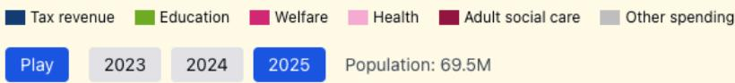
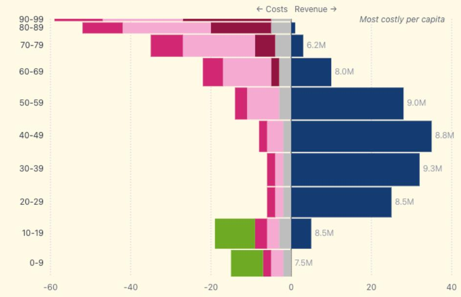
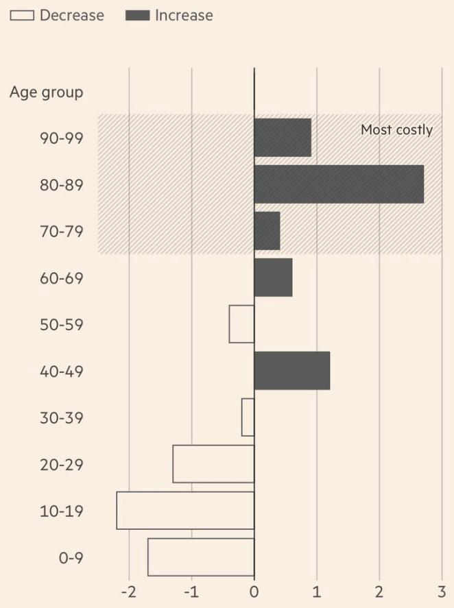

![[Pasted image 20260615200639.png]]
https://theitalianleathersofa.com/ergodicity-economics/

## Multiplicative System/Advantage

This is compounding on steroids. In a linear world, if you have a head start, you stay ahead by that same margin. **But we live in a multiplicative world.** This is “accumulated advantage,” where a tiny initial lead doesn’t just stay a lead; it gets amplified every single time the clock ticks. If the system is multiplicative, the gap between the “haves” and “have-nots” doesn’t just widen, it goes parabolic.

The reality is that Ole Peters pointed this out nearly a decade ago, and **we’re just now waking up to the fact that the “average” return doesn’t mean a damn thing if the system is rigged to multiply the winners and subtract from everyone else.** The math doesn’t care about your feelings, and right now the math is telling a very loud story about why the middle class feels like it’s running up a down escalator.

This post is great at illustrating the theory behind the tweet:

- The basic dynamic of a multiplicative-wealth economy (capitalism)  seems underappreciated to me. 
	- If we "do nothing" (τ = 0), inequality increases indefinitely.
	- If we redistribute fast enough (τ  > 0), inequality will stabilize at some level. 
	- If we actively destabilize (τ  < 0) as we seem to have done in recent decades, the middle class vanishes and we create a division between rich and poor *(a poor person behaving reasonably is as unlikely to become middle class as a rich person behaving reasonably)*

Prof Galloway was onto something a decade ago when he said “**It has never been so hard to become a millionaire and it has never been so easy to become a billionaire**”. But even he missed the most brutal part of the 2025 reality: It’s not just about there; it’s about the sheer gravity of staying there.

The system isn’t just indifferent to you; it’s actively hunting for a reason to push you back down a rung. One bad turn of volatility, one “black swan” in your specific niche, and the floor drops out.

Here is the reality of the “Top 10%” grind today:

## The Millionaire Mirage

We need to stop talking about “millionaires” like it’s a destination. For the modern professional, being a millionaire isn’t a victory lap…it’s closer to a hostage situation. You’re forced to choose between comfort and safety.

Choose Comfort: You’re on the treadmill until you’re 70, grinding like a maniac just to maintain the lifestyle (which is not the lifestyle you are thinking when you read millionaire)  
Choose Safety: You take your wins and opt out of any sort of “personal risk”. There is no middle ground where you just take a break.

## The Zip Code Trap

The “High Earners, Not Rich Yet” (HENRYs) are caught in a geographic arbitrage that works against them. The top-tier jobs, the ones that actually pay the freight, are concentrated in a handful of hyper-expensive zip codes.

The Math: You move to the city for the salary. The city eats your income through rent and “existence costs.” The tax man sees that high top-line number and hits you with the max tax bracket. The MAX one.

In your job, you lose the ability to save.

If you have kids, that’s not just a career pivot: it’s a total life liquidation. You aren’t just out of work; you’re out of that community. That’s the “negatively redistributive” nature of the modern economy at work. It offers you the world, but it keeps the deed to the house.

Moving in the States is a hassle. Moving in Europe is a regime change.

If you get blown out of a job in the U.S., you might have to swap the tri-state area for Austin or Nashville. It’s a headache, but the language is the same and the schools still use the same playbook. In Europe? You cross a border and everything breaks. It’s not just a new zip code; it’s a different language, a different bureaucracy, and a total disruption of your kids’ lives.

This whole conversation goes well with this other post:

**When the returns to effort are socialized downward (rewards to personal effort are redistributed to society), while the costs of opting out are socialized upward (failures are redsistributed in society), it is only rational to adjust your behavior.** All this political hand-wringing about people choosing to work less, retire early, and how to get the "lazy" retirees back to work? That's not a "phenomenon", that's a very predictable and rational erosion of the surplus that the system presumes would always be there, playing out right in front of us.

The system does not protect the super-rich — that's a myth. 

The super-rich need no protection; they can look after themselves pretty well. Instead, the system relies on a broad, productive middle that is expected to carry both the fiscal burden and the moral burden: taxed because it is efficient to do so, and guilt-tripped into accepting it because someone else is always worse off.

We’re told the system is fair because the more you make, the more you give back: the progressive tax system. On paper, it’s a clean, upward-sloping line. In reality? It’s a bell curve that collapses right after you hit the winner’s circle.

Here is how the “Math” is actually playing out in 2025:

## The Inflation Trap

We love progressivity, but the government has conveniently forgotten to update the tax bands for inflation since the VCR was cutting-edge technology. You’re earning more nominal money, so you’re pushed into a higher bracket, but those bills buy 30% less than they did five years ago. You aren’t “getting ahead”, you’re just being liquidated by a system that refuses to acknowledge that 200k in 2025 is the new 100k.

## The 1% Arbitrage

**While the top 10% (the doctors, the engineers, the “HENRYs”) are getting squeezed, the top 1% are playing a completely different game.** Countries, and even specific towns in Switzerland, have entered a “race to the bottom.” They’re offering bespoke, “lump-sum” tax deals to the ultra-wealthy.

**The Irony: If you’re a high-performing professional, you pay the max rate. If you’re a billionaire entrepreneur, you negotiate your own rate.**  

The Result: The “progressivity” of the system breaks exactly where it’s supposed to matter most. As Ole Peters points out, the winners of the entrepreneurship game get advantages, not fewer. The curve doesn’t go up and to the right; it peaks at the top 5% and then dives for the top 0.1%.

## Income vs. Profit: The Great Divide

This is the part that never makes it into the “Move to (...) brochure.

This week the FT published this graph (re-designed by a Twitter user to show each bar proportional to population size):

*Per-capita tax revenue and government spending by age group (£000s, 2028-29 projection)*

*Bar height proportional to population size*

The “Social Contract” looks less like a partnership and more like a term sheet for a predatory loan.

On paper, the graph looks logical. You work, you pay, you eventually benefit. But in 2025, your tax pounds aren’t funding future infrastructure or healthcare. They are an immediate transfer of wealth. You are paying for other people’s pensions and the debt they created to (supposedly) fund their services in the past.

You’re currently being forced to play two games at once:

1. **Game 1: You pay massive taxes to fund the current retirees’ lifestyle.**  
2. **Game 2: You have to fund your retirement entirely in the private market.**

You aren’t just “saving”; you’re being taxed for a service you’ll never receive, while simultaneously being told to “take personal responsibility” for your own future.

Change in projected share of population 2022-2050 (% points)  

bar

| Age group | Decrease | Increase |
| --- | --- | --- |
| 90-99 | 0 | ~0.9 |
| 80-89 | 0 | ~2.7 |
| 70-79 | 0 | ~0.4 |
| 60-69 | 0 | ~0.6 |
| 50-59 | ~-0.3 | 0 |
| 40-49 | 0 | ~1.2 |
| 30-39 | ~-0.2 | 0 |
| 20-29 | ~-1.3 | 0 |
| 10-19 | ~-2.1 | 0 |
| 0-9 | ~-1.7 | 0 |

**The “Retirement Age” debate is the ultimate bait-and-switch.** The people in charge realized the math doesn’t work, so their solution isn’t to fix the plumbing (and risk their job), it’s to tell the productive cohort to stay in the basement and keep pumping for another five years.

**Moving the retirement age isn’t just a policy tweak; it’s theft of time.** You’re being told to work longer to cover the shortfall for a group that decided to leave the game earlier on a dime. **It widens the gap between the “Contributory Class” (you) and the “Beneficiary Class” to a point that’s mathematically insulting.** You’re paying for a party you’re being told you might not even be allowed to attend until you’re too tired to dance.

## The “Market” Delusion

We’ve lost the ability to have a nuanced conversation about capitalism. It’s either “Burn it all down” or “Let the invisible hand perform open-heart surgery.”

Twenty years ago, leaving Italy was a “long” on meritocracy. You were trading a stagnant system for a fair fight. Today? That trade has been crowded out. The “fair” systems are disappearing, and the exits are getting smaller => there are less and less countries feeling attractive.

## The Swiss “Hunger Games”

Switzerland is the last lifeboat left, but don’t confuse a lifeboat with a cruise ship. It’s the Hunger Games out there.

**The Job Market: You aren’t “building a career”; you’re participating in a high-stakes survival reality show.** Every open role has a line of disgruntled, highly-educated refugees from the rest of the EU trying to save themselves.  
**Zero Loyalty: In Switzerland, your job can be outsourced to the East the moment the P&L looks a little soft.** You can’t plan for five years when you aren’t sure you’ll be in the same country in twelve months.

## The Regressive Trap

Even in the “bastion of productivity,” the math is weird. The Swiss mandatory health insurance is basically a flat tax on breathing. It’s wildly regressive, but people are too busy complaining about the monthly bill to realize the entire structure is designed to protect…I am not sure who, but definitely not the poorest.

Which is fine for me because in a healthier (pun intended) fiscal system, I would have to pay more.

## The Binary Political Grift

And then you have the “solutions.” Look at the Young Socialists: they see a 0% inheritance tax and their proposal is to jump straight to 50%.

The Reality: That isn’t a policy; it’s a performance. You don’t go from 0 to 50 unless you want to ensure nothing actually changes. It’s the political version of a “poison pill.”  
The Goal: They don't want to fix the plumbing (starting at a sane 10% to rebalance the system). They want to keep the issue alive so they can keep their roles as the “angry opposition.” It’s better for their “brand” to have a problem to fight than a problem that’s been solved.

**This brings us back to Ole Peters. The system is non-ergodic, meaning the “average” outcome doesn’t exist for the individual. One bad break, one “zero” in your sequence of returns, and you are finished**.

That’s exactly where I am living. Whatever happens, ain’t no average for sure.

## Related notes

- [[The Ergodicity Problem In Economics]] — the foundational theory behind this essay
- [[The Copenhagen Experiment – Ergodicity Economics]] — empirical test of the same framework
- [[Italian Diaspora Nicola Protasoni]] — same author, on inequality and life in Switzerland
- [[Why Not 100% Equity]] — multiplicative returns, diversification and leverage