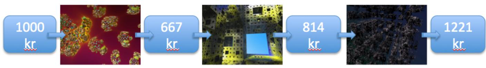

https://ergodicityeconomics.com/2018/05/29/the-copenhagen-experiment-2/
## The Copenhagen experiment

The Copenhagen experiment’s primary focus was neurological, but it may bring an answer to the following provocative question: **who is right, Ergodicity Economics or expected utility theory?** 

The aim of the experiment is to find out whether people change their utility functions in response to a change in dynamics. **If this is the case, expected-utility theory is falsified.** see 
## Some useful terms

**Both the experiment and this blog post are based on the fact that expected utility theory can be mapped mathematically to time-average growth optimization under the assumption of constant dynamics and fixed gamble duration**.

- **Gamble**: a gamble is a mathematical object, namely a random variable whose value $\Delta x$ describes a change in monetary wealth. Example: $\Delta x$ takes the value \$2 with 50% probability and -\$1 with 50% probability.

- **Decision criterion**: a decision criterion is a model of human behavior. It specifies how people evaluate gambles. *
	- Example: people maximize the expectation value of the wealth change* $\Delta x$. Many other examples exist; maximizing the 99th percentile of the distribution of $\Delta x$ is also a decision criterion.

- **Dynamic**: a dynamic specifies how a gamble is repeated. Example: multiplicative repetition means that the random factor $\Delta x / x(t_0)$ is repeatedly applied to wealth, where $x(t_0)$ is the wealth before the first round of the gamble. 
	- In the example gamble above, with initial wealth $x(t_0) = 5$, multiplicative repetition means that wealth increases by 40% or decreases by 20% with 50/50 chance in each round.

- **Gamble duration**: when evaluating gambles, it is usually necessary to know something about how long they take. The duration of one repetition, specified in the dynamic, is the duration of the gamble, $\Delta t$.

## The candidate behavioral models and how they compare

I’ll summarize 350 years of behavioral modeling in three blue sentences, with inevitable omissions (apologies for those).

- **Model 1: people maximize expectation values of changes in wealth.**
	- This model doesn’t work, and that was noticed early in the history of economics.
- **Model 2**, expected utility theory (EUT): people maximize expectation values of changes in utility of wealth.
	- Many tweaks were added to this model, some of them insightful, others less so. I didn’t know much about this when I proposed yet another model (2011).
- **Model 3, Ergodicity Economics (EE):** people maximize time-average growth of wealth.

## Model 1 vs. model 2

Model 2 adds to model 1 an arbitrary non-linear utility function, and consequently generates different behavior. 
- **For example, model 1 cannot generate risk-averse behavior, whereas model 2 can.** 
- **When comparing which model is better at describing an observation, model 2 wins:**
	- this has to be so because it includes model 1 as a special case (utility function $u(x) = x$), so it always does at least as well as model 1. 
- **Model 2 has been criticized for being insufficiently constrained because the utility function can be chosen freely.** Any individual person may have his own utility function, and that function can have any shape.

## Model 1 vs. model 3

**Models 1 and 3 differ because the expectation value of wealth is not the time-average of wealth.** 

$$\lim_{T \to \infty} \frac{1}{T} \int_0^T W(t) dt \neq \mathbb{E}[W_t]$$

In technical words: **wealth is not ergodic.** 
- This is reflected in a difference between the growth rate experienced by wealth over a long time and that experienced by the expectation value of wealth. 
- Model 3 does not allow arbitrary utility functions. It predicts how people will behave, given the dynamic.

## Model 2 vs. model 3

This is where the Copenhagen experiment comes in. 

**For a given dynamic of wealth and fixed gamble durations, optimizing time-average growth rates (EE) can be expressed as optimizing the expectation value of a utility function (EUT)**.

In EE, the objective is to maximize the **time-average growth rate** $g$. For a wealth process $W_t$, the growth rate is defined as:
$$g = \lim_{T \to \infty} \frac{1}{T} \mathbb{E}[\ln(W_T)] \approx \mathbb{E}[\ln(W_t)]$$

In EUT, the objective is to maximize the **expected utility** of wealth:

$$\max \mathbb{E}[u(W)]$$

The mapping occurs when $\mathbb{E}[u(W)]$ represents the growth rate $g$.

- Under multiplicative wealth dynamics, EE maps onto EUT with a logarithmic utility function.
				$$ W_{t+1} = W_t X_t$$$$\text{Maximize } \mathbb{E}[\ln(W_{t+1})] = \mathbb{E}[\ln(W_t)] + \mathbb{E}[\ln(X_t)]$$
					If $u(w) = \ln(w)$: then the two theories coincide.
	
- Under additive dynamics, EE maps onto EUT with a linear utility function. 
$$$W_{t+1} = W_t + X_t$$
$$\text{Maximize } \mathbb{E}[W_{t+1}] = \mathbb{E}[W_t] + \mathbb{E}[X_t]$$
	So the utility function must be linear $u(w) = w$.
	
EE is conceptually different from EUT:
- EE optimizes over time
- EUT optimizes over an ensemble.

But because EE can be mapped onto EUT, it’s not trivial to design an experiment or an observation where one theory is clearly wrong and the other is clearly right.

EUT allows an arbitrary utility function, which adds flexibility, but also means it’s less falsifiable as a scientific model.

**Model 3, EE, is in principle more falsifiable: it predicts functional forms given the wealth dynamics.** 

The trouble here is that we don’t quite know the wealth dynamics. Real wealth dynamics have strong multiplicative elements, and we could expect people to optimize the expectation value of a logarithmic utility function (that would just be a psychological way of saying “optimize growth over time”). 

Stock market investments are a clear example of multiplicative wealth growth, but people also invest in health, housing, education, etc. 

Nor is it usually clear what monetary wealth means — for instance, parts of one’s wealth may be earmarked for future spending and cannot be subjected even to moderate risk. It’s not clear in how far EE would be falsified if, say, observations of real investment decisions turned out to be less than perfectly modeled by optimizing expected logarithmic utility.

## The Copenhagen experiment

An obvious thought is this: why not set up an experiment? If it’s so hard to know the exact dynamics of wealth in real life, why not create a controlled game? Give people some gambling money and expose that to different dynamics **(multiplicative and additive, say)** and see if people’s behavior is described by logarithmic utility in the multiplicative setting and by linear utility in the additive setting?

If test subjects really change utility functions in response to a change in dynamics, then EUT is falsified and EE corroborated. If they don’t, then EE is falsified and EUT corroborated.

## Day 1 (multiplicative)

9 different symbols are chosen to signify the following 9 possible factors of wealth change: 0.45, 0.55, 0.67, 0.82, 1, 1.22, 1.5, 1.83, 2.24.

For example like this (left to right, top to bottom):

The symbols are distinct fractal images, chosen because they are easy to remember and have no obvious connotations that could influence behavior.

## Training phase

1. Initial gambling wealth is 1,000 kr (about US\$110).  
2. A symbol is shown.

3. The new wealth is shown (in this first step 670 kr).

Steps 2 and 3 are repeated for about 50 minutes: a fractal flashes up, then the subject’s new wealth is shown, like below, with time going from left to right.

flowchart

After 50 minutes of training (with a 2-minute break), the subject has a clear sense of the effect each symbol has on his wealth.

## Active phase

1. Initial gambling wealth is the outcome from the passive phase.  
2. Two pairs of symbols are shown, representing two gambles like this:

The subject chooses a gamble, a) or b). According to that gamble, one symbol is randomly selected with 50/50 chance, and — for a subset of rounds (to keep the wealth range under control) — the corresponding factor is applied to the subject’s gambling wealth.

The procedure is repeated approximately 300 times, with one round lasting about 10 seconds. Because all gamble durations are identical, we don’t need to worry about them, and an EUT treatment maps neatly onto time-average growth optimization. The final gambling wealth is paid out in real money to the subject.

## Day 2 (additive)

Everything is identical to Day 1, except that the symbols now represent a fixed amount of money by which gambling wealth changes **(not a fixed factor)**. The fixed amounts are: -428 kr, -321 kr, -241 kr, -107 kr, 0 kr, +107 kr, +241 kr, +321 kr, +428 kr.

The order of the additive and multiplicative settings is controlled for — some subjects first do multiplicative, then additive, whereas others do it the other way around.

## Analysis

Here’s the question: does a given test subject, let’s call her Alice, tend to behave according to logarithmic utility on the multiplicative day (as predicted by EE) and according to linear utility on the additive day (as also predicted by EE)? This would flatly falsify EUT because under EUT utility functions are stable in time.

We can infer the utility function that describes Alice’s behavior from the choices made by Alice. In the example above, Gamble a) is preferable according to logarithmic utility, although Gamble b) is preferable according to linear utility.

Let’s check that: Gamble a) is a 50/50 chance of factors 0.82 and 1.5, and Gamble b) is a 50/50 chance between factors 0.45 and 2.24.

The expected change in logarithmic utility, (time-optimal for multiplicative dynamics) $u(x) = \ln x$ is for Gamble a)

$$
\langle \Delta u \rangle = \frac{1}{2} \ln \left(\frac{0.82 x(t)}{x(t)}\right) + \frac{1}{2} \ln \left(\frac{1.5 x(t)}{x(t)}\right) = \frac{1}{2} \left(\ln 0.82 + \ln 1.5\right) = 0.10
$$

and for Gamble b)

$$
\langle \Delta u \rangle = \frac{1}{2} \left(\ln 0.45 + \ln 2.24\right) = 0.01.
$$

Thus, Gamble a) is preferable.

Under linear utility, (time-optimal for additive dynamics) we find for Gamble a) $u(x) = x$

$$
\langle \Delta u \rangle = \frac{1}{2} (0.82 x + 1.5 x) - x = 0.16 x.
$$

and for Gamble b)

$$
\langle \Delta u \rangle = \frac{1}{2} (0.45 x + 2.24 x) - x = 0.345 x.
$$

Thus, in contrast to logarithmic utility, linear utility implies that Gamble b) is preferable.

## If people switch utility functions…

EE predicts that people on Day 1 (multiplicative) would tend to choose Gamble a), but when faced with the same gamble — the same possible wealth changes — on Day 2 (additive), they would tend to prefer Gamble b). If this behavior is observed, EE is right and EUT is wrong, insofar as such a blunt statement is sensible.

EUT allows Alice any utility function she wants, but whatever that function is, she’s not allowed one on Day 1 and another on Day 2. EUT would allow another test subject, let’s call him Bob, to have a different utility function from that of Alice. But also Bob’s function will have to be the same on Day 1 as on Day 2.

From the point of view of scientific method, this is an interesting point: EUT’s status as a scientific theory rests on utility functions being stable in time. Without this stability EUT would make no statement at all about human behavior — saying that everyone behaves according to his own utility function, and that that function may be different for every decision made, is a non-statement. EUT would make no predictions, therefore would not be falsifiable and wouldn’t qualify as a scientific theory.

If Alice behaves, as predicted by EE, in accordance with a logarithmic utility function under multiplicative dynamics and according to a linear utility function under additive dynamics, then it’s game over for EUT.

## If people don’t switch utility functions…

But what if Alice behaves according to logarithmic utility under both types of dynamics?

My sense used to be (and still is, though to a lesser extent) that this is quite a likely outcome of this or similar experiments. **The reason is that real life, including non-human life, life itself, and evolution, is dominated by multiplicative dynamics.**

I can’t say this too often: life is that which produces more of itself — multiplicative growth. We’ve been conditioned for billions of years to optimize “logarithmic utility,” namely time-average growth in a multiplicative environment. It is quite likely that exposing test subjects to some other dynamic over the time of an experiment — a few hours, perhaps — won’t affect their behavior; they’ll just keep using the heuristics for evaluating risky propositions (gambles) that they’ve developed over their lifetimes, and their ancestors have developed over billions of years of evolution.

**Incidentally, this suggests a prediction: a model of logarithmic utility scored under both multiplicative and additive conditions should do better than a model of linear utility also scored under both conditions.**

So what would one make of a negative finding, i.e. no switching of utility functions? It would look like a falsification of EE, but that’s probably not the right interpretation. It might just mean that risk preferences developed over a long time will not change quickly enough to be visible in the experiment. It could also mean that people just don’t care about the experiment they’re briefly participating in. Their behavior may be dominated by concerns that aren’t controlled for — real wealth, not “gamble wealth” and the risks that subjects are exposed to in the real world. It could also mean that the experiment focuses on the wrong region of parameter space; for instance, in gambles where wealth only changes by small factors (a few percent, say), the difference between additive and multiplicative effects is not important. This would be like the failure of CERN’s Large Electron-Positron Collider in the 1990s to find the Higgs particle below 114 GeV, or like looking for relativistic effects at speeds much slower than the speed of light.

Still, if after an extensive search there’s no evidence of people switching utility functions as predicted by EE, then EE would be a lot less important than I think it is. I would still think that our baseline risk preferences are given by the environment we evolved in and by the dynamics we’re now exposed to. But it would indicate that those preferences are in essence hard-wired and that deviations from the baseline are mostly explained by idiosyncratic (person-specific) preferences, not by differences in circumstances.

## Summary

So here is the statement I’m comfortable making about the Copenhagen experiment and similar experiments.

1. **Evidence of individuals switching from the utility function predicted by EE in one setting to a different utility function predicted by EE in another setting must be seen as a falsification of EUT and a corroboration of EE**. 
	1. This would be direct evidence for the practical significance of the conceptual error in EUT of averaging across parallel worlds. 
	2. Mathematically, EUT would only be valid under constant dynamics, where it can be mapped to EE (that’s like the correspondence principle in quantum mechanics, or the convergence of Einsteinian to Newtonian mechanics for small velocities).  
2. Evidence of individuals failing to switch as predicted by EE is evidence against the importance of EE and in favor of EUT. 
3. Such evidence must be carefully evaluated because it is easier to fail to observe something that actually exists (false negative for EE), due to errors or invalid design, than it is to observe a specifically predicted behavior by chance although it does not actually exist (false positive for EE). Absence of evidence is not conclusive evidence of absence.

## Related notes

- [[The Ergodicity Problem In Economics]] — the theory this experiment tests
- [[Ergodicity Economics   Italian Leather Sofa]] — the same lens applied to personal finance
- [[Legacy Of Daniel Kahneman]] — expected utility theory and decision under risk