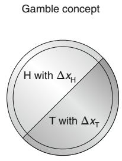
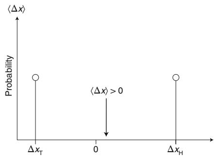
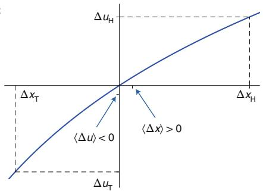
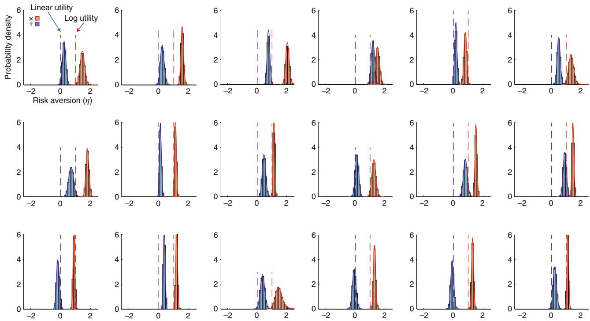

https://www.nature.com/articles/s41567-019-0732-0
# The ergodicity problem in economics

**The ergodic hypothesis is a key analytical device of equilibrium statistical mechanics.** It underlies the assumption that the time average and the expectation value of an observable are the same. 
- Where it is valid, dynamical descriptions can often be replaced with much simpler probabilistic ones: time is essentially eliminated from the models.

The conditions for validity are restrictive, even more so for non-equilibrium systems. Economics typically deals with systems far from equilibrium *(specifically with models of growth)*. It may therefore come as a surprise to learn that the prevailing formulations of economic theory — expected utility theory and its descendants — make an indiscriminate assumption of ergodicity. 

Ergodic theory is a forbiddingly technical branch of mathematics. Luckily, for the purpose of this discussion, we will need virtually none of the technicalities. We will call an observable ergodic if its time average equals its expectation value, that is, if it satisfies Birkhoff’s equation

$$
\lim_{T\to\infty}\frac{1}{T}\int_0^{T} f(\omega(t))\,\mathrm{d}t
=\int_{\Omega} f(\omega)\,P(\omega)\,\mathrm{d}\omega
\quad\text{(1)}
$$

Here, $f$ is determined by the system’s state $\omega$. On the left-hand side, the state in turn depends on time $t$. On the right-hand side, a timeless $P(\omega)$ assigns weights to $\omega$. If equation (1) holds we can avoid integrating over time (up to the divergent averaging time, $T$, on the left), and instead integrate over the space of all states, $\Omega$ (on the right). In our case $P(\omega)$ is given as the distribution of a stochastic process. In systems with transient behaviour, that may require defining $P(\omega)$ as the $t\to\infty$ limit of a time-dependent density function $P(\omega; t)$.

Famously, ergodicity is assumed in equilibrium statistical mechanics, which successfully describes the thermodynamic behaviour of gases. However, in a wider context, many observables don’t satisfy equation (1). And it turns out a surprising reframing of economic theory follows directly from asking the core ergodicity question: **is the time average of an observable equal to its expectation value?**

**At a crucial place in the foundations of economics, it is assumed that the answer is always yes — a pernicious error.** To make economic decisions, I often want to know how fast my personal fortune grows under different scenarios.

This requires determining what happens over time in some model of wealth. But by wrongly assuming ergodicity, wealth is often replaced with its expectation value before growth is computed. **Because wealth is not ergodic, nonsensical predictions arise**. **After all, the expectation value effectively averages over an ensemble of copies of myself that cannot be accessed.**

---
This Perspective is structured as follows. I will first sketch the conceptual basis of mainstream economic theory: discounted expected utility. I will then develop our conceptually different approach, based on addressing the ergodicity problem, and establish its relationship with the mainstream model by pointing out a mapping. Finally, I will report on a recent laboratory experiment that pits the two approaches against one another: where do their predictions differ? And which model fares better empirically?

---
## A simple gamble

In economics, a gamble is a random variable, $\Delta x$, representing possible changes in wealth, $x$. In the discrete case, that’s a set of pairs of possible wealth changes and corresponding probabilities $\{(\Delta x, p)\}$.

For example, a gamble can model the following situation: toss a coin, and for heads you win 50% of your current wealth; for tails you lose 40%. Mathematically, we can represent this as (Fig. 1a):

$$
\Delta x = \begin{cases}
\Delta x_{\mathrm{H}} = +0.5\,x, & p_{\mathrm{H}} = \tfrac{1}{2},\\
\Delta x_{\mathrm{T}} = -0.4\,x, & p_{\mathrm{T}} = \tfrac{1}{2}.
\end{cases}
\quad\text{(2)}
$$

A gamble is a random variable. a, Events (here H and T) are associated with probabilities $p_{\mathrm{H}}$ and $p_{\mathrm{T}}$, and with dollar wealth changes $\Delta x_{\mathrm{H}}$ and $\Delta x_{\mathrm{T}}$

The oldest formal evaluation of a gamble computes the expected wealth change $\langle\Delta x\rangle$
  

Expected utility theory evaluates gambles by the expected change in a (nonlinear) utility function of wealth, $\langle \Delta u \rangle$, here $u(x) = \mathfrak{m} x$ shown for the coin-toss example. 
*Note that all the concepts are formally atemporal. Only magnitudes and probabilities enter into the analysis.*

Their correspondence established the expectation value as a key object in the theory of randomness.

Pascal and Fermat were not looking for gambling advice; they were solving a moral problem: namely how to assess people’s hopes and expectations in a fair way. Nonetheless, a few years later, the following rule of thumb had become a well-established behavioural model: given the choice between two gambles, we pick the greater expected wealth change, $\langle \Delta x \rangle$. This model predicts that people would generally accept the gamble in equation (2), in which case $\langle \Delta x \rangle = +0.05 x$ (Fig. 1b), whereas the alternative (not accepting) would yield $\langle \Delta x \rangle = 0$.

St. Petersburg paradox. But is this model realistic? Would you accept the gamble and risk losing at the toss of a coin 40% of your house, car and life savings?

A similar objection was raised in 1713 by Nicolas Bernoulli3. He proposed a hypothetical gamble whose expectation value was divergent: x was power-law distributed with a non-existent first moment. But this terminology hadn’t been developed yet, and N. Bernoulli said laconically we would find something “curious” if we tried to compute the expectation value $\langle \Delta x \rangle$.

What people eventually deemed indeed curious was the following: if we had to pay a fee, $F$, to play this gamble, what should it be? The expected wealth model tells us that we would pay any finite fee, but that went against intuition. Even though $\Delta x$ had a heavy right tail, the probabilities of very large gains were still vanishing, and no one was willing (hypothetically) to pay much for a negligible chance to win a large amount. The failure of the expected wealth model to describe actual human behaviour is known as the [[Legacy Of Daniel Kahneman|St. Petersburg paradox]], and is treated in many textbooks on economics and probability theory. It is one of the puzzles that go away when we switch to the new formalism4.

Utility theory. By 1713, it was clear that there’s more than expected wealth changes to financial decisions under uncertainty, and in 1738 Daniel Bernoulli updated the prevailing theory5: when people decide whether to take part in a gamble, they don’t consider the expected changes in wealth, x, but the expected changes in the usefulness of wealth, u(x).

Specifically, D. Bernoulli surmised that the usefulness, or utility, of an extra dollar is roughly inversely proportional to how many dollars one already has. This leads to the differential equation $du = \frac{1}{x} dx$ with solution $u(x) = \ln x$ (calculus had just been invented). But he mentioned that the square-root function would also work. In general, a monotonically increasing $u(x)$ reflects a preference for more wealth over less, and concave $u(x)$ reflects a dislike for risk. Thus, the utility function encodes the psychology of a particular individual. We might write $u_{\mathrm{brave}}(x) = x$ and $u_{\mathrm{scared}}(x) = \ln x$.

D. Bernoulli’s model became known as ‘expected utility theory’. It produces different preferences than the expected wealth model if the utility function is nonlinear, as shown in Fig. 1c.

Intriguingly, D. Bernoulli’s paper contains an error (see ref. 4) that continues to haunt the formalism today: in one place his computations actually only work for linear $u(x)$, which would defeat the purpose of introducing $u(x)$ in the first place. But we will not take D. Bernoulli literally and instead interpret his writings as Laplace6 and von Neumann and Morgenstern7 did: each person $i$ has an idiosyncratic utility function $\bar{u_i(\boldsymbol{x})}$ and intuitively computes $\langle \Delta u_i(\boldsymbol{x})\rangle$. If that’s positive we accept the gamble, if it’s negative we reject it (assuming rejection results in no wealth change).

In the coin-toss example described by equation (2), the expected change in D. Bernoulli’s logarithmic utility is $\langle \Delta \ln x\rangle \approx -0.05$. A person whose psychology is well described by $u_{\mathrm{scared}}$ therefore won’t accept the gamble.

Discounting. Utility theory considers a static probability space, without an explicit treatment of time. For instance, D. Bernoulli and his followers did not discuss the rate of change of utilities but only magnitudes of changes.

Time is dealt with quite separately, namely through a process referred to as discounting. Originally, discounting assigned a present value to payments to be received in the future. It is often justified with a no-arbitrage argument: a payment received sooner, at a time $t$, is worth more than the same payment received later, at $t + \Delta t$, if it can be profitably invested for the duration $\Delta t$.

With references to interest in the Bible (for example, Deuteronomy 23:19), the practice of temporal discounting is thus much older than the notion of utility. Today the two concepts coexist but without much clarity regarding their respective domains: based on the no-arbitrage argument one would discount cash, but since 1937 it has been common to discount utility instead — not even utility of cash but of consumption of cash or even more general resources8.

The no-arbitrage argument ties discounting to available investment options. But in an ambitious attempt at generality, discounting nowadays is often phrased in terms of another subjective function, $d(t)$: some of us are impatient and discount strongly with a fast-decaying $d(\Delta t)$; others are more patient. The functional form of $d(\Delta t)$, supposedly, is another part of our psychology — it can be hyperbolic or exponential or whatever else fits the data9.

## A modern treatment asking the ergodicity question

Let’s step back, and take a completely fresh look at the problem.

First, we consider financial decisions without uncertainty, which is very similar to the original idea of discounting. In the second step, we generalize by introducing noise. Placing considerations of time and ergodicity centre stage, we will arrive at a clear interpretation both of discounting and of utility theory, without appealing to subjective psychology or indeed other forms of personalization.

Financial decisions without uncertainty. A gamble without uncertainty is just a payment. A trivial model would be: we accept positive payments and reject negative ones. But what if we have to choose between two payments, or payment streams, at different times?

In this case, one consideration must be some form of a growth rate. For instance, I may choose between a job that offers $\$12,000 per year, and another that offers $\$2,000 per month. Let’s say the jobs are identical in all other respects: I would then choose the one that pays $\$2,000 per month — not because $\$2,000 is the greater payment (it isn’t), but because the payments correspond to a higher (additive) growth rate of my wealth. I would maximize

$$
g_{\mathrm{a}} = \frac{\Delta x}{\Delta t} \quad\text{(3)}
$$

Alternatively, I may have a choice between two savings accounts. One pays 4% per year, the other 1% per month — again, it’s the growth rate I would optimize: in this case the exponential growth rate

$$
g_{\mathrm{e}} = \frac{\Delta \ln x}{\Delta t} \quad\text{(4)}
$$

Since ∆t divides a difference in a generally nonlinear function of wealth, time now enters with a clear meaning but in potentially quite complicated ways — linearly (called hyperbolic in economics) as in equation (3) or exponentially as in equation (4).

Additive earnings and multiplicative returns on investments are the two most common processes that change our wealth, but we could think of other growth processes whose growth rates would have different functional forms. For example, the growth rate for the sigmoidal growth curves, in biology, of body mass versus time, has a different functional form10. For an arbitrary growth process $x(t)$, the general growth rate is

$$
g = \frac{\Delta \nu(x)}{\Delta t} \quad\text{(5)}
$$

where $v(x)$ is a monotonically increasing function chosen such that $g$ does not change in time. Additive and multiplicative growth correspond to $v_{\mathrm{a}}(x) = x$ and $v_{\mathrm{e}}(x) = \ln x$. Generalizing, $v(x)$ is the inverse of the process $x(t)$ at unit rate, denoted

$$
\nu(x) = x_1^{(-1)}(x) \quad\text{(6)}
$$

For financial processes, fitting more general functions often results in an interpolation between linear and logarithmic, maybe in a square-root function, or a similar small tweak.

Ergodic observables. Real-life financial decisions usually come with a degree of uncertainty. We let the model reflect this by introducing noise. But how?

To perturb the process in a consistent way, we remind ourselves that what’s constant about the process in the absence of noise is the growth rate. If we perturb that with a constant-amplitude noise, the scale of the perturbation will be time independent in $v$-space, and in that sense adapted to the dynamics. That’s easily done by writing equation (5) in differential form, replacing the function $g$ by its (constant) value, $\gamma$, say, rearranging and adding the noise (here represented by a Wiener term $dW$ with amplitude $\sigma$)

$$
\mathrm{d}\nu = \gamma\,\mathrm{d}t + \sigma\,\mathrm{d}W \quad\text{(7)}
$$

The process itself is found by integrating equation (7) and solving for $x$. For our two key examples, this produces Brownian motion (with $v_{\mathrm{a}} = x$) and geometric Brownian motion (with $v_{\mathrm{e}} = \ln x$).

The growth rates for these processes are no longer constant because they are noisy. But the lack of constancy is due to nothing other than the noise. Using the nomenclature introduced in equation (1), the relevant growth rates are ergodic observables of their respective processes. By design, their (time or ensemble) averages tell us what tends to happen over time.

This is not the case for wealth itself, and it exposes the expected wealth model as physically naive. The expected wealth change simply does not reflect what happens over time (unless the wealth dynamic is additive; Fig. 2). The initial correction — expected utility theory — overlooked the physical problem and jumped to psychological arguments, which are hard to constrain and often circular.

Growth rate optimization is now sometimes called ‘ergodicity economics’. This doesn’t mean that ergodicity is assumed — quite the opposite: it refers to doing economics by asking explicitly whether something is ergodic, which is often not the case. As we have seen, ergodicity economics is a perspective that arises from constructing ergodic observables for non-ergodic (growth) processes.

Mapping. Both expected utility theory and ergodicity economics introduce nonlinear transformations of wealth, and the equations that appear in the two frameworks can be very similar. More precisely, the mapping is this: the appropriate growth rate for a given process is formally identical to the rate of change of a specific utility function

$$
g = \frac{\Delta \nu(x)}{\Delta t} = \frac{\Delta u(x)}{\Delta t} \quad\text{(8)}
$$

The time average of this growth rate is identical to the rate of change of the specific expected utility function — because of ergodicity.

Despite the mapping, conceptually the two approaches couldn’t be more different, and ergodicity economics stays closer to physical reality.

## A discriminating experiment

This mapping is fascinating: careful thinking leads to almost identical mathematical expressions, whether we use the tools of 1738 or those of today. This is in spite of there being completely different concepts and languages. Does the difference between concepts enable an experiment that has discriminating power between expected utility theory and ergodicity economics?

I was skeptical about this possibility, but a group of neuroscientists from Copenhagen, led by Oliver Hulme, appears to have made very promising progress in this regard.

They followed very closely the discussion put forward in ref. 4, where we had worked out in detail the correspondences between linear utility and additive dynamics; and between logarithmic utility and multiplicative dynamics. These correspondences provide the basis for the experiment: what if the dynamics of wealth could be controlled? With two artificial environments — one additive, the other one multiplicative — do people adjust their behaviour to be growth optimal in each?

A positive result — people changing behaviour in response to the dynamics — would corroborate ergodicity economics and falsify expected utility theory (insofar as experiments falsify models). If people don’t change behaviour, one would conclude that dynamic effects (at least in this experiment) are not important, and personality differences may dominate.

The experiment is described in detail in ref. 11. Here I will only outline the setup. In the additive environment people were given a starting wealth of about \$150 and then each made 312 choices between additive gambles, with fixed dollar amounts at stake, for example between tossing a coin for winning \$40 or losing \$30; and tossing a coin for winning \$30 or losing \$20. In contrast, in the multiplicative environment, the same people were also given about \$150, and then made 312 choices between multiplicative gambles, with fixed proportions of wealth at stake, for example between tossing a coin for a 100% gain in wealth or a 70% loss; and tossing a coin for a 30% gain or a 20% loss.

The choices of the participants were consequential: a single decision could lead to winning or losing several hundred real dollars.

The choices observed in the two environments were used to fit a utility function of the form

$$
u(x;\eta) = \frac{x^{1-\eta}-1}{1-\eta} \quad\text{(9)}
$$

The parameter $\eta$ interpolates between linear, $\eta = 0$, and logarithmic, $\eta = 1$, functions, and it controls the concavity of $u(x; \eta)$ — larger values correspond to stronger concavity.

The Copenhagen group fed the observations into a Bayesian hierarchical model12, the output of which is a posterior distribution for $\eta$. Roughly, for each person in each environment this tells us how likely it is that the subject was optimizing expected changes in equation (9) with different values for $\eta$, a result shown in Fig. 3.

Expected utility theory predicts that people are insensitive to changes in the dynamics. People may have wildly different utility functions, which would be reflected in wildly different best-fit values of $\eta$, but the dynamic setting should make no difference. Utility functions are supposedly psychological or even neurological properties. They indicate personality types — risk seekers and scaredy cats.

Ergodicity economics predicts something quite different. First, it predicts that the dynamic setting significantly changes the best-fit ‘utility function’, which is really the ergodicity mapping in the relevant ergodic growth rate. The effective utility function will be different for one and the same individual under additive dynamics and under multiplicative dynamics.

The direction of the change should go towards greater ‘risk aversion’ for multiplicative dynamics — the ergodicity mapping is more concave there. The magnitude of the change in $\eta$ should be about 1. And finally, if we take seriously the absolute null models of additive and multiplicative dynamics, the distributions should be centred near 0 for the additive setting and near 1 for the multiplicative setting.

Subject-specific risk aversion  
  
Fig. 3 | Posterior probability density functions for the parameter $\eta$ in the Copenhagen experiment. Each set of axes represents one individual, blue for the additive environment, red for multiplicative. Dashed lines are the null-model predictions of 0 and 1. All tested individuals changed behaviour noticeably in response to the wealth dynamic, in all cases the multiplicative environment led to the shift to the right predicted by ergodicity economics. Not all individuals are the same, but an overall pattern is clearly seen. Data reproduced from ref. 11.

Given the limitations of the experiment — for instance, people only had a one-hour training phase to get used to a given environment — these predictions don’t look so bad. Of course, the 11,232 individual choices summarized in Fig. 3 may be happenstance, or the experiment may be flawed in a way we don’t yet understand. So we might put it this way: the strong focus on psychology and lack of consideration for dynamics, prevalent in expected utility theory, corresponds to the belief that the difference between the red and blue curves is spurious.

This may be a good place to acknowledge further heroes of the story. That the geometric mean $\exp\langle\ln x\rangle$ is less than the arithmetic mean $\langle x\rangle$ was known to Euclid (Elements, Book V, Proposition 25), and it is a special case of Jensen’s inequality13 of 1906. Its connection to gambling and investment problems was noted by Whitworth14 in 1870, is implied by Itô’s work15 of 1944, and is well known among gamblers as Kelly’s criterion16 of 1956. Our modest contribution is to frame these observations as a question of ergodicity, which we have found to be a fruitful perspective. It enforces physical realism by precluding interactions among members of a statistical ensemble, it enables us to consider dynamics other than additive and multiplicative (corresponding to linear and logarithmic utility functions), and it naturally leads to treatments of problems whose solutions are less readily visible in previous framings of the issue.

## Outlook

The present situation is both dispiriting and uplifting. It is dispiriting because economics is firmly stuck in the wrong conceptual space. Because the core mistake is 350 years old, the corresponding mindset is now firmly institutionalized.

However, it is also uplifting and scientifically exciting because of the many opportunities that have just opened up. The situation is similar to pre-standard model particle physics (except, with a copy of ref. 17 in the back pocket): each behavioural pattern that follows from growth rate maximization has its own narrative and vocabulary. Take discounting as an example: thousands of studies investigate subjective perceptions of the value of a dollar in the future. When expressed mathematically, the heart of this narrative becomes a story about growth rates. One has to relabel and rearrange some terms in the relevant equation, but eventually the ergodic growth rate is recovered as the fundamental concept that explains the phenomenon18. The same is true for expected utility theory19.

Similarly, we’ve learned a lot about market stability and have found a natural resolution of the equity premium puzzle20 or — as Ken Arrow used to call it — the volatility puzzle. Growth rate optimization predicts a relationship between how fast something grows and how volatile it is. This relationship holds not only for the stock market indexes we have checked but even for bitcoin. It can be used for fraud detection: the relationship doesn’t hold for Bernie Madoff’s fraudulent fund, for example. It also suggests a protocol for setting central-bank interest rates21.

Perhaps the most significant change lies in the nature of the model human that arises from our conceptual reframing. Homo economicus has been criticized, perhaps most succinctly for being short-termist. Given that time is so poorly represented in mainstream economics, this should come as no surprise. Our Homo economicus, or Homo ergodicus? — the new guy — is really rather nice. He cares about others, understands that cooperation leads to better results, and is patient and kind22. Nor do we have to assume huge individual differences in psychology or skill to explain the huge observed differences in wealth: a trivial null model — though one that doesn’t blindly assume ergodicity — predicts the robust features of the wealth distribution23–25. A well-known measure of inequality26 turned out to be the time-integrated difference between ensemble and time-average growth rates in geometric Brownian motion27.

The model I have presented here — optimizing time-average growth rates — is a null model, and it has all the shortcomings that null models have. The improvement is clear when we compare ours to the prevailing null model of optimizing expected time-integrated discounted utility. Rather than adding correcting components to that conceptually flawed null model, we remove the conceptual flaw. The use of a null model of any kind, in my view, is a form of caution: of this complex system I only know a few simple aspects with the degree of certainty that makes it promising to incorporate them in a formal model. Adding further details would require careful checks against overfitting.

We have reason to hope for a future economic science that is more parsimonious, conceptually clearer and less subjective. It will resemble reality more closely and be better aligned with our moral intuitions.

## Related notes

- [[The Copenhagen Experiment – Ergodicity Economics]] — empirical test of this theory
- [[Ergodicity Economics   Italian Leather Sofa]] — real-world application
- [[Legacy Of Daniel Kahneman]] — expected utility, Bernoulli, and the St. Petersburg paradox
