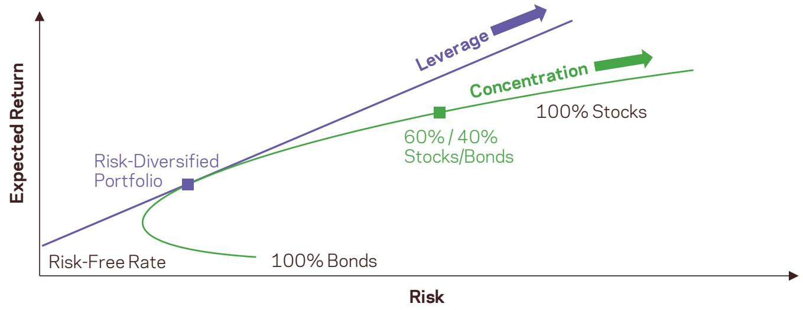
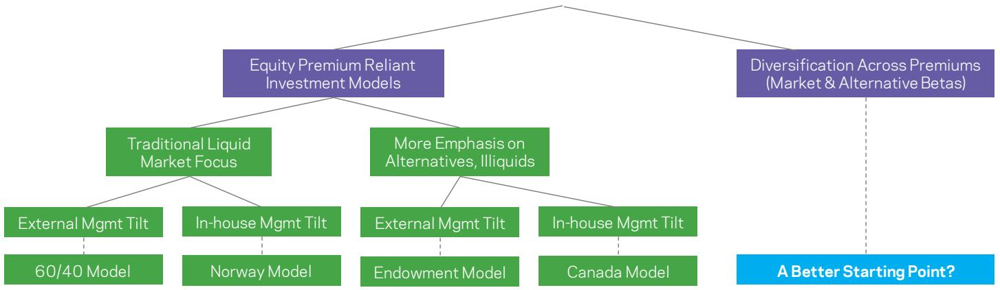
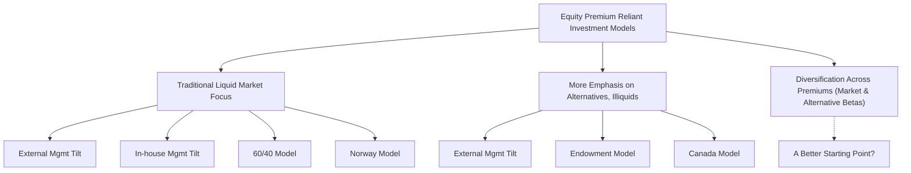
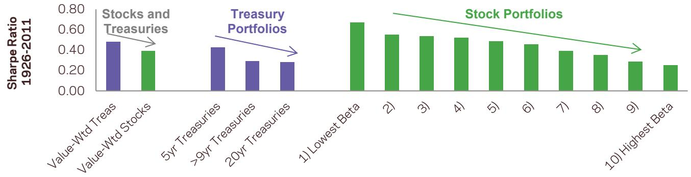

## Alternative Thinking

Why Do Most Investors Choose Concentration Over Leverage?

Academics working within the mean-variance framework showed over 50 years ago that the latter approach leads to higher expected returns.

Why would investors concentrate in one dominant risk when it has not offered a similarly dominant reward? We have to seek answers from outside the mean-variance framework.

## Why Do Most Investors Choose Concentration Over Leverage?

## Executive Summary

In recent decades, institutional investors have migrated toward a 60/40 stock/bond allocation, which is diversified by capital, but concentrated in equity risk.  
- Even the major competitors to the by-now traditional 60/40 portfolio (including the “Yale Model” and the “Canada Model”) share this risk concentration.  
- Theoretically and empirically, we find leverage risk has been better compensated than concentration risk. Moreover, we believe that leverage risk can be more manageable than concentration risk.  
- Exchanging some concentration risk for leverage risk is not for everyone, which is one reason we expect a return premium for investors who pursue it.

## Two Paths

Investors seeking higher returns have two broad options: they can concentrate their portfolio in assets or asset classes with the highest expected returns, or they can diversify (ideally holding the portfolio of risky assets with the highest Sharpe ratio (SR)) and then apply leverage to reach their desired level of portfolio volatility.

Academics working within the mean-variance framework showed over 50 years ago that the latter approach leads to higher expected returns – see Exhibit 1, which uses the simplified example of two risky assets, stocks and bonds.1 Portfolios moving along the blue line sell bonds to buy more stocks, and portfolios along the green line sell cash to buy both stocks and bonds. Each approach makes the portfolio riskier, but the green approach is more rewarding over the long-term.

## Which One Do Investors Choose?

In recent decades, institutional investors have migrated toward a 60/40 stock/bond allocation2 (as evidenced by typical institutional holdings and perhaps market-cap weights) while diversifying increasingly globally and making small allocations to other asset classes. A 60/40 portfolio may appear diversified, but its risk emanates almost exclusively from the more volatile asset class, stocks. The correlation between the monthly returns of a global 60/40 portfolio and a global equity index is 0.99 (1990-2011).

Exhibit 1 | Expected Returns vs Risk (Volatility) – The Classical Picture  

| Risk | Expected Return |
| --- | --- |
| Risk-Free Rate | ~0.5 |
| 100% Bonds | ~0.5 |
| 60% / 40% Stocks/Bonds | ~0.7 |
| 100% Stocks | ~0.9 |

Source: AQR

Exhibit 2 shows some of the major competitors to the by-now traditional 60/40 investment model, the “Yale Model” (or “Endowment Model”) and the “Canada Model,” both of which invest heavily in alternative asset classes (hedge funds, private equity, real estate/infrastructure, natural resources/commodities, etc.) and expect to reap illiquidity premiums and better perceived alpha opportunities from private assets.3 However, these alternative assets contain such high equity market betas that these portfolios are still highly exposed to directional equity market moves. Over the past decade, the correlation between the quarterly returns of a composite alternative asset portfolio and a global equity index is 0.75 (per asset class: 0.86 for hedge funds, 0.80 for private equity, 0.45 for commodities and 0.21 for real estate).4

All three major investment models thus choose concentration and avoid direct leverage, even while embracing embedded leverage.5 Investors that actively exploit and lever the superior Sharpe ratios (SR) of low-risk investments are a distinct minority. They include many LBO managers, quantitative investors, and also Warren Buffett. The Sage of Omaha does not profess to be a fan of diversification, but he has favored low-beta stocks as much as value stocks and uses leverage through insurance company float (the difference between insurance premium payments and much later compensation payments).6

Exhibit 2 | Summary of Major Approaches to Building Portfolios  

flowchart

Source: AQR. Data description: The 60/40 portfolio consists of 60% MSCI World (developed equity markets) index, 20% Barclays U.S. Aggregate fixed-income index, 20% Citigroup World Government Bond Index ex-U.S., currency-hedged. The Alternatives-4 is a composite of direct real estate (NCREIF transaction-based index), commodity futures (SP GSCI index), hedge funds (DJ CS index), and private equity (Cambridge Associates private equity index). To give the four constituents roughly equal long-run volatilities, the nominal weight of real estate is 28%, hedge funds 38%, commodities 14%, and private equity 20%. The last-quarter observations for real estate and private equity are not yet available; beta-based proxies are used instead.

## What Explains Investor Preference for Concentrated Equity Risk?

In a mean-variance framework, the only reason investors would concentrate in equities is if equities offered a uniquely high long-run SR, to offset their disproportionately high risk compared to other asset classes.7

However, empirically, major asset classes have delivered broadly similar long-run SRs. For example, between 1971 and 2010, global equities, U.S. Treasuries, and commodities all had SRs between 0.24 and 0.29.8 And there is widespread evidence of low-risk investments offering relatively high SRs as well as evidence of attractive long-run SRs from long-short strategies focused on low-risk investing.

Why would investors concentrate in one dominant risk when it has not offered a similarly dominant reward? (Note that higher long-run return is not enough; a higher long-run SR is needed to explain this puzzle within the CAPM.) We have to seek answers from outside the mean-variance framework. It turns out the equity premium has several “advantages” over other ways of raising long-run returns (including value investing, levered diversification, illiquid assets, market timing, and insurance selling):

- Confidence: due to standard financial theories (CAPM and multi-factor models, or participating in economic growth) and the most extensive empirical evidence, including a positive equity premium in all 19 countries with history since 1900.9

- Familiarity: due to minimal peer risk or maverick risk. Recall the Keynes quote of failing conventionally; relatively few money managers lost their jobs when their portfolios lost fortunes in the tech bust and recent financial crisis. But, failing when others are all succeeding, even if on the path to long-term better success, is not always a recipe for career advancement.

- Ancillary benefits: including deep capacity (the bottleneck for many other approaches), relatively low costs, high liquidity, and embedded leverage.

- Leverage aversion: avoided because it has the “feel” of speculation, while concentration is anchored in conventionality. This bias is based on mistaken beliefs but no doubt contributes to the preference for concentration. A better reason for investors’ leverage aversion is the real risk of being forced to delever in bad times, discussed below.

This list consists mainly of real-world descriptive facts and/or excuses for suboptimal investment behavior.10 They do not make concentrated equity market exposure a better long-run investment, except perhaps for one reason: they may enable better time consistency. Investors are more likely to succumb to doubts and "throw in the towel" after 2-3 bad years when they rely on other return sources. In contrast, when relying on the equity premium, investors may forgive even a bad decade. The arguments above may give investors the patience to maintain their supposedly long-run positions through a bad patch.

## Leverage Risk Is Well-Rewarded But Needs To Be Managed

The benefits of diversification are well-known. A better balanced portfolio will have lower volatility and likely a higher SR than a concentrated portfolio, unless the high-risk investments offer a commensurately high SR. Investors can then use leverage (or invest in the riskless asset) to achieve the acceptable risk level for their well-diversified portfolio.

A growing empirical literature suggests analogous patterns in many different contexts: lower-risk investments offer higher long-run SRs than their speculative peers. The empirical reward for risktaking is not what most investors expect. Within every asset class, bearing small amount of risk appears amply rewarded, while further risk-taking and especially moving to become concentrated in the most speculative investments within an asset class is poorly rewarded or even punished (see Exhibit 3).11

Thus, leverage risk has been better compensated than concentration risk. Moreover, we believe that leverage risk can be more manageable than concentration risk. If investors let equity market direction dominate their portfolio performance, they are doomed to follow the rollercoaster ride of market gyrations with little recourse.

Leverage is a risk that must – and can – be managed. The ultimate risk is being forced to delever with the crowd at firesale prices. Still, managing leverage risk (which includes keeping large cash balances, limiting illiquidity, establishing caps on exposures, and monitoring counterparties) is arguably easier than managing concentration risk (effectively, market-timing). Investors should also be nuanced about different types of leverage (e.g., levering up liquid investments with low standalone volatility, such as 2-year Treasury futures, is less risky than levering up illiquid, high-volatility ventures).

This approach is not for everyone, which is one reason we expect a return premium for investors who pursue it. Like many other active approaches, low-risk investing relies on someone else being “on the other side.”12 We do not expect the majority of investors to become more pro-leverage so soon after 2008, both due to regulatory changes and investors’ own preferences, which leaves better reward for risk for the minority who can exploit these opportunities.

Exhibit 3 | Within Asset Classes, Lower Risk Securities Are More Efficient, 1926‒2011  

bar

| Category | Sharpe Ratio (1926-2011) |
| --- | --- |
| Value-Wtd Treas | ~0.48 |
| Value-Wtd Stocks | ~0.39 |
| 5yr Treasuries | ~0.43 |
| >9yr Treasuries | ~0.29 |
| 20yr Treasuries | ~0.28 |
| 1) Lowest Beta | ~0.67 |
| 2) | ~0.55 |
| 3) | ~0.53 |
| 4) | ~0.52 |
| 5) | ~0.49 |
| 6) | ~0.46 |
| 7) | ~0.39 |
| 8) | ~0.35 |
| 9) | ~0.29 |
| 10) Highest Beta | ~0.25 |

Sharpe ratios on U.S. assets between 1926 and 2011. Value Weighted Treasuries and Stocks are CRSP data. The 5-year and the 20-year Treasury are Ibbotson Associates SBBI Intermediate Term and Long Term Government Bond Indices from Morningstar; they chain single bonds with roughly 5-year and 20-year maturities. The >9-year index is a valueweighted portfolio of all Treasuries with maturities greater than 9 years, from CRSP. The CRSP value-weighted Treasury index (the first column) includes also money market assets and thus has a shorter average maturity than the other Treasury portfolios. The beta-sorted stock portfolios are based on CRSP data with betas calculated using daily data over the past year. Broad-based securities indices are unmanaged and are not subject to fees and expenses typically associated with managed accounts or investment funds. Past performance is not a guarantee of future performance.

## An Alternative to Equities as Sole Drivers of Returns

We maintain that aggressive risk-balanced diversification among well-chosen return sources is the most reliable way to achieve long-run investment success. We believe investors are more likely to achieve CPI+5% if they embrace a modest amount of innovation, particularly in diversification. Leverage is one tool that helps (some) investors diversify and avoid the trap of equity concentration.

In a long-only context, investors should consider [[Leverage Aversion And Risk Parity|risk parity investing]] across asset classes, and scaling up low-volatility securities (and reducing exposure to high volatility securities) within asset classes. Long-short strategies should be explicitly managed to provide uncorrelated returns. Hedge fund risk premiums represent a liquid approach, and reinsurance ‒ a strategy investors are increasingly considering ‒ represents an illiquid return source. Finally, the combination counts: a portfolio of return sources should be balanced so that each can meaningfully contribute to risk and return.

## Related notes

- [[Leverage Aversion And Risk Parity]] — leverage aversion and the case for risk parity
- [[Why Not 100% Equity]] — Asness on levered, diversified portfolios
- [[Return Stacking  Strategies For Overcoming A Low Return Environment]] — applying leverage to a diversified core
- [[Alternative Thinking Why Do Most Investors Choose Concentration Over Leverage (1)]] — duplicate copy of this note

