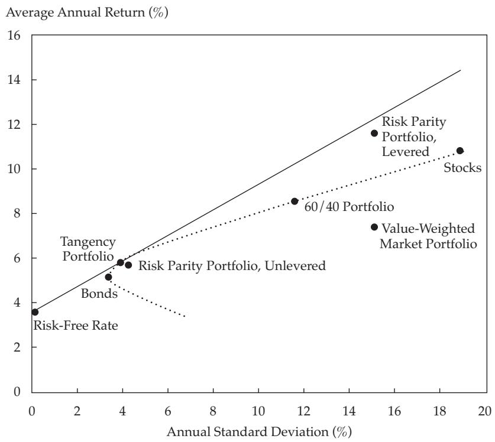
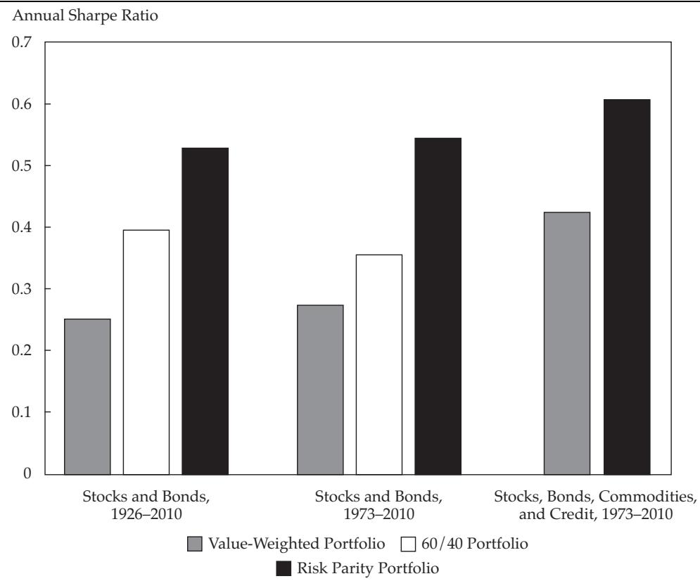
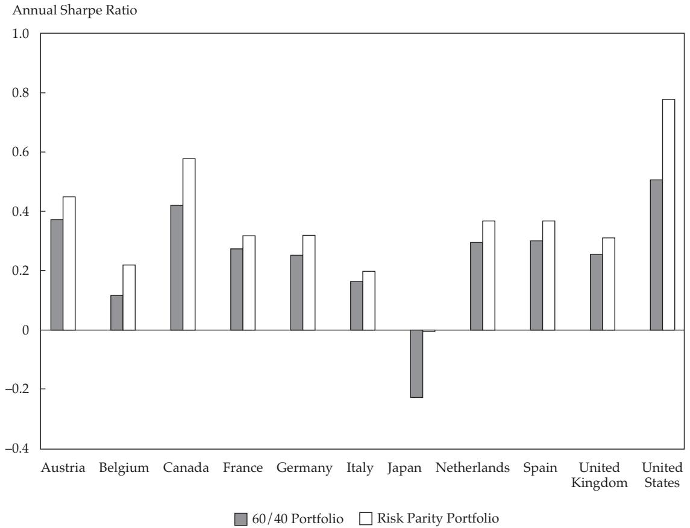
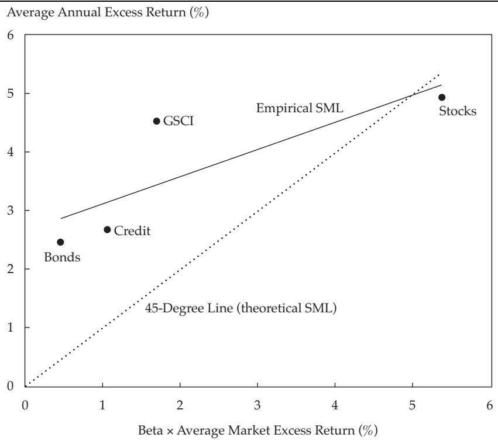

# Leverage Aversion And Risk Parity

The authors show that leverage aversion changes the predictions of modern portfolio theory: Safer assets must offer higher risk-adjusted returns than riskier assets. Consuming the high risk-adjusted returns of safer assets requires leverage, creating an opportunity for investors with the ability to apply leverage. Risk parity portfolios exploit this opportunity by equalizing the risk allocation across asset classes, thus overweighting safer assets relative to their weight in the market portfolio.

How should investors allocate their assets? The standard advice provided by the capital asset pricing model (CAPM) is that all investors should hold the market portfolio, levered according to each investor’s risk preference. In recent years, however, a new approach to asset allocation called Risk Parity (RP) has been gaining in popularity among practitioners (see Asness 2010; Sullivan 2010). In our study, we attempted to fill what we believe is a hole in the current arguments in favor of RP investing by adding a theoretical justification based on investors’ aversion to leverage and by providing broad empirical evidence across and within countries and asset classes.

RP investing starts with the observation that traditional asset allocations, such as the market portfolio or the 60/40 portfolio of stocks/bonds, are not well diversified when viewed from the perspective of how each asset class contributes to the overall risk of the portfolio. Because stocks are so much more volatile than bonds, movement in the stock market dominates the risk in the market portfolio. Thus, when viewed from a risk perspective, the market portfolio is mainly an equity portfolio because nearly all the variation in performance is explained by the variation in equity markets. In that sense, the market portfolio and the 60/40 portfolio offer little diversification even though they look well balanced when viewed from the perspective of dollars invested in each asset class.

RP advocates suggest a simple cure: Diversify, but diversify by risk, not by dollars—that is, take a similar amount of risk in equities and in bonds. To diversify by risk, we generally need to invest more money in low-risk assets than in high-risk assets. As a result, even if return per unit of risk is higher, the total aggressiveness and expected return are lower than those of a traditional 60/40 portfolio. RP investors address this problem by applying leverage to the risk-balanced portfolio to increase both its expected return and its risk to desired levels.1 Although applying leverage introduces its own risks and practical concerns, we now have the best of both worlds: We are truly risk (not dollar) balanced across the asset classes, and importantly, we are taking enough risk to generate sufficient returns. The details can vary tremendously (e.g., real-life RP is about much more than U.S. stocks and bonds), but the idea of diversifying by risk is the essence of RP investing.

To further bolster the case for RP investing—beyond the mere notion that more diversification must be better—advocates point to the evidence showing that RP portfolios have historically done better than traditional portfolios. Figure 1 depicts the growth of \$1 since 1926 in the 60/40 portfolio, the market portfolio (that weights each asset class by its market capitalization), and a simple version of an RP portfolio. Although Figure 1 shows only one scenario, the historical outperformance of RP is quite robust. In sum, the popular case for RP investing rests on (1) the intuitive superiority of balancing risk rather than dollars invested and (2) the historical evidence for this approach over traditional approaches.

Although these arguments are alluring, they are insufficient. The intuition that a risk-balanced portfolio is always better than the market portfolio relies on an implicit assumption about expected returns. If the expected return of stocks versus bonds were high enough (i.e., given a sufficiently high equity risk premium), we would gladly invest in a portfolio whose risk is equity dominated. The intuition that investors who weight each asset class by its market capitalization take too much risk in equities is accurate only if the equity risk premium versus bonds is not high enough to support such a large risk allocation. The more specific intuition of equal risk is accurate only if all assets are expected to provide equal risk-adjusted returns. In other words, we cannot simply assert that equal risk is optimal because it is better diversified; to believe that, we must also believe we are not getting paid enough in equities to be so concentrated in them. We cannot think of RP as merely a statement about divvying up risks because it is inherently also a statement about our views on expected returns. Instead of saying that equal risk is always the best policy regardless of expected returns, an RP investor should say, “We do not believe expected returns on equities are high enough to give them a disproportionate part of our risk budget.” This important distinction is missing from the discussion of RP in the literature. According to the CAPM, the risk premiums are such that the market portfolio is optimal; thus, RP investors need to explain how the CAPM fails in a way that justifies a larger allocation to low-risk assets than their allocation in the market portfolio.

As for the empirical evidence showing that RP portfolios have outperformed traditional portfolios over the long term, it is indeed useful and relevant but it is also only one draw from history (though admittedly a fairly long one). We must ask ourselves whether this evidence is enough to be conclusive. Does the insufficiently large equity risk premium versus bonds over the past 80 years mean that it would not be large enough in the future? Ideally, we would all prefer some out-of-sample evidence, but waiting another 80 years is an unappealing strategy.

Therefore, we propose another route to increase our confidence. The missing links are (1) a theoretical justification for RP investing and (2) broad tests across and within the major asset classes and countries. Frazzini and Pedersen (2010) found these links. Following Black (1972), they showed that if some investors are averse to leverage, low-beta assets will offer higher risk-adjusted returns and high-beta assets will offer lower risk-adjusted returns. Hence, leverage aversion breaks the standard CAPM, and according to this theory, the highest risk-adjusted return is achieved not by the market but, rather, by a portfolio that overweights safer assets. Thus, an investor who is less leverage averse (or less leverage constrained) than the average investor can benefit by overweighting low-beta assets, underweighting high-beta assets, and applying some leverage to the resulting portfolio.

Frazzini and Pedersen (2010) found consistent empirical evidence of this theory of leverage aversion within each major asset class. They found that low-beta stocks have higher risk-adjusted returns than high-beta stocks in the United States (echoing Black, Jensen, and Scholes 1972) and in global stock markets, safer corporate bonds have higher risk-adjusted returns than do riskier bonds, safer short-maturity U.S. Treasuries offer higher risk-adjusted returns than do riskier long-maturity ones, and so on within several other asset classes.2

With respect to RP, bonds are the low-beta asset and stocks the high-beta asset, and the benefit of overweighting bonds that we documented is another empirical success of the theory. The theory of leverage aversion not only constitutes a theoretical underpinning for RP but also highlights how additional out-of-sample empirical evidence can be found by comparing the risk-adjusted returns of safer versus riskier securities within each of the major asset classes. Leverage and margin constraints can also explain deviations from the Law of One Price (Garleanu and Pedersen 2011), the effects of central banks’ lending facilities (Ashcraft, Garleanu, and Pedersen 2010), and general liquidity dynamics (Brunnermeier and Pedersen 2009). That the theory holds up in other applications (without notable exception) that are completely separate from the asset allocation decision that we studied bolsters our confidence that the empirical superiority of RP is not a statistical fluke but, rather, one more empirical confirmation of the leverage aversion theory to add to the many in Frazzini and Pedersen (2010).3

## A Theory of Leverage Aversion

Before delving further into leverage aversion, let us revisit the standard predictions of the [[Complex Modern Portfolio Theory|modern portfolio theory (MPT)]] of Markowitz (1952) and the CAPM of Sharpe (1964), Lintner (1965), and Mossin (1966). MPT considers how an investor should choose a portfolio with a good trade-off between risk and expected return. This concept is often illustrated by using a mean–volatility diagram, as in Figure 2. To estimate risk and expected returns, we used data on realized returns for U.S. stocks and Treasuries over 1926–2010. Figure 2 shows that the overall stock market had an average annual return of 10.8 percent, with a volatility of 18.9 percent, whereas the overall bond market provided a lower average annual return of 5.2 percent, with a lower volatility of 3.4 percent. The hyperbola connecting these two points represents all possible portfolios of stocks and bonds. For example, the 60/40 portfolio represents an investment of 60 percent of capital in stocks and 40 percent of capital in bonds; this portfolio is rebalanced every month to these weights.

Figure 2 also shows that the risk-free T-bill rate averaged 3.6 percent a year over the period, represented by the point on the y-axis. Combining investments in the risk-free asset with investments in risky assets produces lines that connect the risk-free point with the hyperbola. The best such line for an investor who prefers higher returns and lower risk is the line from the risk-free point to the so-called tangency portfolio—namely, the portfolio with the highest possible realized Sharpe ratio. In our data, the ex post tangency portfolio invests 88 percent in bonds and 12 percent in stocks. MPT says that an optimal portfolio is somewhere on this line: Risk-averse investors’ portfolios should be between the tangency portfolio and the risk-free asset, investing some money in cash and the rest in the tangency portfolio; risk-tolerant investors should be on the segment that extends beyond the tangency portfolio, which means that they should use leverage (i.e., borrow at the risk-free rate rather than invest at the risk-free rate) to invest more than 100 percent of their capital in the tangency portfolio.

The CAPM goes beyond MPT by assuming that all investors invest in this way and concludes that the tangency portfolio must be equal to the market portfolio—that is, the value-weighted portfolio of all assets. Figure 2 illustrates the historical risk and return of the market portfolio. We can see that the historical performance of the market portfolio is quite different from that of the tangency portfolio. The market portfolio has realized a significantly lower Sharpe ratio than the tangency portfolio for two reasons: (1) The market weights of stocks relative to bonds have varied over time in such a way that the risk–return characteristics of the market are inside the hyperbola, and (2) the market portfolio allocates a much larger fraction of its capital to stocks than what has been optimal historically. The average market weight over this sample (1926–2010) was 68 percent in stocks and 32 percent in Treasury bonds, but we note that this long sample does not include other types of bonds, such as corporate bonds and mortgage bonds.

Figure 2. Efficient Frontier, 1926–2010  

scatter

| Category | Annual Standard Deviation (%) | Average Annual Return (%) |
| --- | --- | --- |
| Risk-Free Rate | ~0.2 | ~3.6 |
| Tangency Portfolio | ~3.3 | ~5.2 |
| Risk Parity Portfolio, Unlevered | ~3.8 | ~5.8 |
| Risk Parity Portfolio, Levered | ~4.2 | ~5.7 |
| 60/40 Portfolio | ~11.6 | ~8.5 |
| Value-Weighted Market Portfolio | ~15.2 | ~7.4 |
| Stocks | ~19.0 | ~10.8 |

Notes: See notes to Figure 1. This figure shows the efficient frontier of portfolios of U.S. stocks and bonds in our long sample. The levered RP portfolio weights are multiplied by a constant to match the ex post realized volatility of the value-weighted benchmark. The unlevered RP portfolio weights are rescaled to sum to 1 at each rebalancing.

As discussed later in the article, we found consistent evidence in a broader sample (with data starting in 1973) that includes all bonds as well as commodities. When all types of bonds are included, the current market portfolio consists of 42 percent stocks, 48 percent bonds (including credit), and 10 percent in commodities. Importantly, the empirical underperformance of the market portfolio relative to the tangency portfolio is robust and does not depend on the specific market weights. To see why, note that because stocks are so much riskier than bonds, stocks need to realize a much larger Sharpe ratio than bonds for the market portfolio to be optimal. But stocks have realized a lower Sharpe ratio than bonds, which makes any approximation of the market portfolio or the 60/40 portfolio underperform the tangency portfolio. That bonds have realized a higher Sharpe ratio and lower risk than stocks also explains why the tangency portfolio has such a large weight in bonds.

Although these results are puzzling in light of the CAPM, we believe that they can be understood under a theory of leverage aversion. Consider an investor who would like a higher expected return than that of the tangency portfolio and is willing to accept the extra risk but is not willing (or allowed) to use any leverage. What portfolio will she choose? Preferring an unlevered portfolio with more stocks than the tangency portfolio, she may invest all her money in stocks. The presence of such investors changes the CAPM conclusions because they assume that everyone will invest on the line in the mean–volatility diagram. Thus, the tangency portfolio is not equal to the market portfolio given the existence of leverage-averse investors.

So, what exactly is the tangency portfolio? Although knowing what it is with certainty, at least ahead of time, is impossible (e.g., no one knew ex ante what the tangency portfolio in Figure 2 would turn out to be), a theory of equilibrium with leverage aversion can provide some guidance. Frazzini and Pedersen (2010) showed that the tangency portfolio overweights safer assets, as is the case empirically. This result is intuitive: Because some investors choose to overweight riskier assets in order to avoid leverage, the price of riskier assets is elevated or, equivalently, the expected return on riskier assets is reduced. In contrast, the safer assets are underweighted by these investors and thus trade at low prices (i.e., offer high expected returns). Hence, investors who are able and willing to apply leverage can earn higher risk-adjusted returns by effecting the opposite portfolio tilts—namely, overweighting safer assets. In other words, leverage risk is rewarded in equilibrium through the relative pricing of securities, which is why the tangency portfolio includes a disproportionate amount of safer assets.

The composition of the tangency portfolio depends on the number of leverage-constrained investors, which can change over time. Therefore, in practice, we cannot know for sure what the tangency portfolio will be ex ante. Risk Parity investing, however, offers a simple suggestion, which is in the direction suggested by the leverage aversion theory: RP investments allocate the same amount of risk to stocks and bonds.

We can construct a simple Risk Parity portfolio as follows: At the end of each calendar month, we set the portfolio weight in each asset class equal to the inverse of its volatility (estimated by using three-year monthly excess returns up to month t – 1) and then multiply these weights by a constant to match the ex post realized volatility of the value-weighted benchmark. Note that this simple construction does not rely on covariance estimates. Over the full sample, our simple RP portfolio would invest, on average, 15 percent in stocks and 85 percent in bonds on an unlevered basis. The most recent RP allocations (as of June 2010) are 86 percent in bonds and 14 percent in stocks.

Figure 2 shows that the historical performance of the RP portfolio is more similar to that of the tangency portfolio than to that of either the market portfolio or the 60/40 portfolio. Although not exactly ex post optimal, the RP portfolio has been a good approximation because overweighting safer assets has paid off. And even though we should not take too seriously the precise prescription to have exactly equal risk in stocks and bonds (parity), it is certainly a strong and accurate move in the right direction ex post.

Frazzini and Pedersen (2010) laid out the leverage aversion theory more formally than we have done here, and they also presented several additional testable predictions. According to this theory, no one holds the market portfolio, but equilibrium is nevertheless achieved because some investors overweight safer assets whereas others overweight riskier assets. Both groups of investors are satisfied: Some accept low Sharpe ratios but earn high expected returns without leverage; others earn high expected returns with a better risk–return trade-off by using leverage.

## Risk and Return across Asset Classes: Risk Parity vs. the Market vs. 60/40

To test our predicted implications of leverage aversion, we compared the historical performance of the value-weighted market portfolio, the Risk Parity portfolio, and the 60/40 stock/bond portfolio for three different data samples: Our “long sample” comprised U.S. stocks and bonds over 1926–2010; our “broad sample” included global stocks, U.S. bonds, credit, and commodities over 1973–2010; and our “global sample” consisted of stocks and bonds in the 11 countries covered by the J.P. Morgan Global Government Bond Index over 1986–2010. Table 1 reports summary statistics, and Appendix A contains additional details on both the data and the portfolio construction.

Table 2 shows the performance statistics for the long sample (Panel A) and the broad sample (Panel B). For each asset class, we used value-weighted return indices and then computed the overall market portfolio as the value-weighted average across asset classes.4 In both samples, we can see that stocks have not only delivered higher average returns than bonds but also realized much higher volatility than bonds. As a result, the value-weighted market portfolio and the 60/40 portfolio have earned higher average returns than the unlevered Risk Parity portfolio. Therefore, an investor who cannot or will not use leverage may rationally prefer to hold the market portfolio, the 60/40 portfolio, or even all stocks despite all these portfolios having lower Sharpe ratios than RP. Again, such behavior can cause riskier assets to be overpriced relative to the standard CAPM.

An investor who can use leverage, however, will prefer the historical performance of the Risk Parity portfolio because of its higher Sharpe ratio (risk-adjusted return). Indeed, the levered RP portfolio has the same volatility as the market portfolio but a considerably higher average return. Figure 3 illustrates the significant improvement in the Sharpe ratio of the Risk Parity portfolio over that of the market and 60/40 portfolios.

Note that the simulated performance of the levered Risk Parity portfolio does not reflect any adjustment of the returns for the costs of leverage, such as financing spreads and costs associated with deleveraging. At modest levels of leverage, any additional costs should be quite low; at high levels of leverage, the potential cost of forced deleveraging could be much more meaningful, especially for an investor with a large overall portfolio. Appendix B shows the robustness of our results with respect to various financing rates.

Table 1. Summary Statistics

| Asset Class | Weight in Market Portfolio | Index | Start Year | End Year |
| --- | --- | --- | --- | --- |
|  | Mean | Most Recent |  |  |
| Stocks | 0.68 | 0.67 | CRSP Value-Weighted Index | 1926 | 2010 |
| Bonds | 0.32 | 0.32 | CRSP Value-Weighted Index | 1926 | 2010 |
|  |  |  |  |  |
| A. Long sample |
| Stocks | 0.58 | 0.42 | CRSP Value-Weighted Index | 1973 | 2010 |
| Bonds | 0.15 | 0.19 | Barclays Capital U.S. Treasury Index | 1973 | 2010 |
|  |  |  | Barclays Capital Other Government Bond Index | 1973 | 2010 |
| Credit | 0.18 | 0.29 | Barclays Capital U.S. Corporate Index | 1973 | 2010 |
|  |  |  | Barclays Capital U.S. Securitized Index | 1976 | 2010 |
|  |  |  | Barclays Capital U.S. Corporate High-Yield Index | 1983 | 2010 |
|  |  |  | Barclays Capital Eurodollar Index | 1995 | 2010 |
|  |  |  | Barclays Capital EM Index | 1998 | 2010 |
|  |  |  | Barclays Capital 144A Index | 1998 | 2010 |
|  |  |  | Barclays Capital CMBS Index | 2006 | 2010 |
|  |  |  | Barclays Capital Emerged Bonds Index | 2000 | 2010 |
| Commodities | 0.09 | 0.10 | S&P GSCI | 1973 | 2010 |
|  |  |  |  |  |
| C. Global sample |
| Stocks |  |  | MSCI Index | 1986 | 2010 |
| Bonds |  |  | J.P. Morgan Global Government Bond Index | 1986 | 2010 |

Notes: This table reports the list of instruments included in our three samples—long, broad, and global—and the corresponding date ranges. It also reports the average weight and the most recent (i.e., September 2010) weight in the market portfolio for each asset class.

When we apply leverage by using futures, the return series is clearly implementable and no assumption of the financing cost is needed because futures returns, \( F_t / F_{t - 1} - 1 \), are already excess returns.5 Our results with futures returns are similar to those with cash securities, providing further evidence of their robustness.

The strong historical performance of Risk Parity is evident in the cumulative return plot in Figure 1, as discussed earlier. To test the significance of this outperformance, we calculated the t-statistics of the Risk Parity portfolio’s realized alpha, which is the intercept in a time-series regression of monthly excess returns on the value-weighted benchmark (see Table 2). The t-statistics are much greater than 2, which implies strong statistical significance. To test further, we constructed long–short portfolios that go long the Risk Parity portfolio and go short the market portfolio (or go short the 60/40 portfolio) for each sample. These long–short portfolios have statistically significant excess returns and alphas for both our long sample and our broad sample.

Although one might worry that the superiority of Risk Parity is an artifact of the bond bull market over the past 25–30 years, a look at the longer 1926–2010 period reveals a near-perfect round trip in bond yields and a near doubling of the equity market’s valuation (using the 10-year P/Es of Robert Shiller).6 Thus, if anything, 1926–2010 was a period biased in favor of equities over bonds, and yet we see that Risk Parity has been a superior strategy.

Complementing the evidence from both our long and our broad U.S. samples, Table 3 reports evidence from 10 other countries. For each country, we can see that the Risk Parity portfolio has provided higher risk-adjusted returns than the 60/40 portfolio. The outperformance of the Risk Parity portfolio is statistically significant when all countries are pooled into a (value-weighted) global portfolio, with or without the United States. Figure 4 shows the relative performance of the Risk Parity portfolio vis-à-vis that of the 60/40 portfolio in each country.

A classic illustration of the empirical failure of the standard CAPM is the notion that the security market line is too flat, as first pointed out by Black, Jensen, and Scholes (1972) for U.S. stocks. The security market line is the connection between the actual excess return across securities and the CAPM-predicted excess return, given by beta times the market excess return. Rather than looking at the security market line across stocks, we are interested in the security market line across asset classes. Figure 5 shows the security market line for the asset classes in our broad sample, in which betas are the slopes of a time-series regression of monthly excess returns on the value-weighted benchmark.

Table 2. Historical Performance of the Risk Parity, Market, and 60/40 Portfolios

|  | t-Stat. of |  |  |  |  |  |  |
| --- | --- | --- | --- | --- | --- | --- | --- |
|  | Excess Return | Excess Return | Alpha | t-Stat. of Alpha | Volatility | Sharpe Ratio | Skewness | Excess Kurtosis |
| --- | --- | --- | --- | --- | --- | --- | --- | --- |
| A. Long sample (U.S. stocks and bonds, 1926–2010) |
| CRSP stocks | 6.71%* | 3.18 |  |  | 19.05% | 0.35 | 0.18 | 7.51 |
| CRSP bonds | 1.56* | 4.28 |  |  | 3.28 | 0.47 | -0.01 | 4.37 |
| Value-weighted portfolio | 3.84* | 2.30 |  |  | 15.08 | 0.25 | 0.37 | 13.09 |
| 60/40 portfolio | 4.65* | 3.59 |  |  | 11.68 | 0.40 | 0.20 | 7.46 |
| Risk Parity, unlevered | 2.20* | 4.67 | 1.39%* | 4.44 | 4.25 | 0.52 | 0.05 | 4.58 |
| Risk Parity | 7.99* | 4.78 | 5.50* | 4.30 | 15.08 | 0.53 | -0.36 | 1.92 |
| Risk Parity minus value-weighted | 4.15* | 2.95 | 5.50* | 4.30 | 12.69 | 0.33 | -0.79 | 8.30 |
| Risk Parity minus 60/40 | 3.34* | 2.93 | 3.76* | 3.33 | 10.31 | 0.32 | -0.61 | 5.04 |
| B. Broad sample (global stocks, U.S. bonds, credit, and commodities, 1973–2010) |
| Stocks | 5.96%* | 2.22 |  |  | 15.71% | 0.38 | -0.80 | 2.41 |
| Bonds | 2.72* | 2.97 |  |  | 5.36 | 0.51 | 0.23 | 2.43 |
| Credit | 3.03* | 2.68 |  |  | 6.63 | 0.46 | 0.29 | 7.68 |
| S&P GSCI | 3.10 | 0.94 |  |  | 19.24 | 0.16 | -0.18 | 2.37 |
| Value-weighted portfolio | 4.31* | 2.50 |  |  | 10.10 | 0.43 | -0.89 | 2.65 |
| Risk Parity, unlevered | 3.39* | 3.65 | 1.68%* | 2.65 | 5.44 | 0.62 | -0.24 | 3.03 |
| Risk Parity | 6.15* | 3.57 | 3.03* | 2.52 | 10.10 | 0.61 | -0.94 | 4.93 |
| Risk Parity minus value-weighted | 1.84 | 1.43 | 3.03* | 2.52 | 7.52 | 0.24 | 0.31 | 2.51 |

Notes: This table shows calendar-time portfolio returns. Value-weighted portfolio is a market portfolio weighted by total market capitalization and rebalanced monthly to maintain value weights. Risk Parity and Risk Parity, unlevered are portfolios that target equal risk allocation across the available instruments and are constructed as follows: At the end of each calendar month, we set the portfolio weight in each asset class equal to the inverse of its volatility, estimated by using three-year monthly excess returns up to month t – 1. For the Risk Parity portfolio, these weights are multiplied by a constant to match the ex post realized volatility of the value-weighted benchmark. For the unlevered Risk Parity portfolio, the weights are rescaled to sum to 1 at each rebalancing. 60/40 portfolio allocates 60 percent to stocks and 40 percent to bonds and is rebalanced monthly to maintain constant weights. Panel A reports returns of stocks and bonds only. Panel B includes all the available asset classes. In computing the aggregate value-weighted portfolio, instruments are weighted by total market capitalization each month. Returns are in U.S. dollars, and excess returns are above the U.S. T-bill rate. Alpha is the intercept in a regression of monthly excess returns. The explanatory variables are the monthly returns of the value-weighted benchmark. Excess kurtosis is equal to the kurtosis of monthly excess returns minus 3. Returns, alphas, and volatilities are annual percentages. Sharpe ratios are annualized.  
\*Significant at the 5 percent level.

The CAPM predicts that securities will line up on the 45-degree line—that is, securities’ expected returns will line up with their systematic risk. Figure 5, however, shows that the empirical security market line is flatter because safer asset classes (bonds, credit, and commodities) provide returns that are too high relative to the CAPM, whereas riskier asset classes (domestic and international stocks) provide returns that are too low relative to their risk. Note that although commodities (as captured by the S&P GSCI) have high volatility, their systematic beta risk is significantly lower than that of the stock market owing to commodities’ low correlation with stocks. The flatness of the security market line underlies the power of buying safer assets; the security market line is also flat in other countries and over our long sample (Figures 1 and 4).

## Risk and Return within Asset Classes: High Beta Is Low Alpha

Our finding that the security market line is too flat holds not only across asset classes but also within asset classes. In other words, with respect to different securities within the same asset class and across asset classes, safer assets have higher risk-adjusted returns than riskier assets. Indeed, Black, Jensen, and Scholes (1972) famously found that the security market line is too flat across U.S. stocks. Adding 40 years of out-of-sample evidence, Frazzini and Pedersen (2010) confirmed this finding: The security market line has remained remarkably flat since the study by Black, Jensen, and Scholes. Moreover, Frazzini and Pedersen found that the security market line is also too flat in all the other major asset classes. It is too flat in global stock markets, in 18 of 19 developed equity markets, across U.S. Treasuries, across corporate bonds, and even across futures.

Figure 3. The Risk Parity, Market, and 60/40 Portfolios: Sharpe Ratios  

bar

| Category | Value-Weighted Portfolio | 60/40 Portfolio | Risk Parity Portfolio |
| --- | --- | --- | --- |
| Stocks and Bonds, 1926–2010 | ~0.25 | ~0.40 | ~0.53 |
| Stocks and Bonds, 1973–2010 | ~0.27 | ~0.36 | ~0.55 |
| Stocks, Bonds, Commodities, and Credit, 1973–2010 | ~0.43 | — | ~0.61 |

Notes: See notes to Figure 1. This figure shows annualized Sharpe ratios for portfolios of stocks, bonds, credit, and commodities in both our long and our broad samples. The figure plots Sharpe ratios of a value-weighted portfolio, a 60/40 portfolio, and a Risk Parity portfolio.

Table 3. Risk Parity vs. 60/40: Global Evidence

|  | Average Excess Return | | | Sharpe Ratio |  |
| --- | --- | --- | --- | --- | --- | --- | --- |
|  | 60/40 | Risk Parity | Risk Parity - 60/40 (pps) | t-Stat. | 60/40 | Risk Parity | Risk Parity - 60/40 |
| --- | --- | --- | --- | --- | --- | --- | --- |
| A. Levered Risk Parity vs. 60/40 benchmark by country, 1986–2010 |
| Austria | 3.63% | 4.40% | 0.77 | 1.00 | 0.37 | 0.45 | 0.22 |
| Belgium | 1.52 | 2.80 | 1.27 | 1.26 | 0.12 | 0.22 | 0.27 |
| Canada | 4.38 | 6.03 | 1.65 | 1.71 | 0.42 | 0.58 | 0.37 |
| France | 3.42 | 3.93 | 0.51 | 0.43 | 0.28 | 0.32 | 0.09 |
| Germany | 3.47 | 4.35 | 0.89 | 0.62 | 0.25 | 0.32 | 0.13 |
| Italy | 2.30 | 2.82 | 0.53 | 0.34 | 0.16 | 0.20 | 0.07 |
| Japan | -2.94 | -0.09 | 2.85* | 2.27 | -0.23 | -0.01 | 0.49 |
| Netherlands | 3.51 | 4.38 | 0.88 | 0.83 | 0.30 | 0.37 | 0.18 |
| Spain | 4.29 | 5.28 | 1.00 | 0.74 | 0.30 | 0.37 | 0.16 |
| United Kingdom | 2.62 | 3.14 | 0.52 | 0.58 | 0.26 | 0.31 | 0.13 |
| United States | 4.79 | 7.43 | 2.64* | 2.13 | 0.51 | 0.78 | 0.46 |
|  |  |  |  |  |  |  |  |
| B. Global portfolio, 1986–2010 |
| Global | 2.26% | 4.62% | 2.35* | 2.42 | 0.24 | 0.52 | 0.52 |
| Global ex U.S. | 0.28 | 2.11 | 1.84* | 2.04 | 0.03 | 0.21 | 0.44 |

pps = percentage points.

Notes: See notes to Table 2. This table shows calendar-time returns of portfolios of stocks and bonds within countries. The equity index is the MSCI country index, and the country bond index is the corresponding J.P. Morgan Global Government Bond Index. The global portfolio weights each country by its equity market capitalization.

\*Significant at the 5 percent level.

Figure 4. Risk Parity vs. 60/40 in Global Sample: Sharpe Ratios, 1986–2010  

bar

| Country | 60/40 Portfolio | Risk Parity Portfolio |
| :--- | :--- | :--- |
| Austria | ~0.37 | ~0.45 |
| Belgium | ~0.12 | ~0.22 |
| Canada | ~0.42 | ~0.58 |
| France | ~0.27 | ~0.32 |
| Germany | ~0.25 | ~0.32 |
| Italy | ~0.16 | ~0.20 |
| Japan | ~-0.23 | ~0.00 |
| Netherlands | ~0.29 | ~0.37 |
| Spain | ~0.30 | ~0.37 |
| United Kingdom | ~0.25 | ~0.31 |
| United States | ~0.50 | ~0.78 |

Notes: This figure shows annualized Sharpe ratios for Risk Parity and 60/40 portfolios of stocks and bonds in 11 countries. For each country in this global sample, the equity index is the MSCI country index, and the country bond index is the corresponding J.P. Morgan Global Government Bond Index.

The within-asset-class results are important to the inherently across-asset-class results of Risk Parity because they represent strong out-of-sample confirmation that what is going on for asset classes is ubiquitous and thus less likely to be an artifact of data mining.

## Conclusion: You Can Eat Risk-Adjusted Returns

Risk Parity investing has become a popular alternative to traditional methods of strategic asset allocation. Existing justifications, however, are insufficient and fail to provide a consistent equilibrium theory. Simply to desire diversification by risk, not dollars—however intuitive—is not enough. If you were paid enough in expected returns to be dominated in risk space by a single asset class, you would gladly do so. To show that you have not historically been paid enough to be so dominated (the equivalent of a backtest showing that Risk Parity is historically superior to traditional allocations) is also not enough. Although historical evidence is always welcome, even long histories of asset class returns can be dominated by a few large data points or arise from data mining. But Risk Parity investors need not despair. Even though there are no certainties in finance, perhaps the closest we can ever come is a realistic theory that holds up consistently in out-of-sample tests across and within different asset classes and countries. Pioneered by Black (1972, 1993) and extended by Frazzini and Pedersen (2010), leverage aversion is such a theory.

Assuming that some market participants are unable or unwilling to use leverage is not unrealistic. Leverage simply presents a risk that investors want to be compensated for bearing. Further, to obtain and manage leverage requires the acquisition of a certain “technology.” Indeed, obtaining leverage requires getting financing, using derivatives, and establishing counterparty relations. Managing leverage requires, among other things, adjusting margin accounts and trading the portfolio dynamically over time. Our capital markets offer plenty of examples of investors that are not allowed (or choose not) to use leverage to increase their returns. For example, the majority of mutual funds and many pension funds are not allowed to borrow or are limited in the amount of leverage they can take. In addition, mutual fund families typically provide suggested asset allocations for low- to high-risk-tolerant investors. The high-risk recommendations rarely use leverage but, rather, suggest a very high concentration in equities. Similarly, the rise of embedded leverage in exchange-traded funds shows that some investors choose not to use leverage directly but prefer instruments with embedded leverage.

Figure 5. Security Market Line across Asset Classes, 1973–2010  

scatter

| Category | Beta \(\times\) Average Market Excess Return (%) | Average Annual Excess Return (%) |
| --- | --- | --- |
| Bonds | ~0.5 | ~2.5 |
| Credit | ~1.1 | ~2.7 |
| GSCI | ~1.7 | ~4.5 |
| Stocks | ~5.4 | ~4.9 |

Notes: This figure shows the theoretical and empirical security market lines (SMLs) of portfolios of stocks, bonds, credit, and commodities in our broad sample. Average market excess return is the excess return of a market portfolio weighted by total capitalization and rebalanced monthly to maintain value weights. Beta is the slope of a regression of monthly excess returns on the market excess return. The empirical SML is the fitted value of a cross-sectional regression of average excess returns on realized betas.

To put the magnitude of investors’ model-implied leverage aversion in perspective, we can estimate the opportunity cost of investing in the value-weighted market portfolio instead of in the Risk Parity portfolio. Over 1926–2010, the Risk Parity portfolio realized a Sharpe ratio that was 0.27 higher than that of the market portfolio, meaning that an investor with an average volatility of 10 percent invested in the value-weighted market portfolio underperformed the Risk Parity portfolio by 2.7 percent a year. Although this number may not make investors with high leverage costs or a strong aversion to leverage switch to Risk Parity, other investors can benefit from using leverage.

The findings of Black, Jensen, and Scholes (1972) and of Frazzini and Pedersen (2010) show that the predictions of a theory of leverage aversion hold up in a wide variety of tests across and within many asset classes. Our finding that Risk Parity investing is yet another instance of this theory working out of sample greatly enhances our confidence that Risk Parity’s superiority to traditional methods of strategic asset allocation is real and important and not a figment of the data.

## Appendix A. Data and Portfolio Construction

We tested our theory in several complementary ways. We used three samples: Our long sample consisted of U.S. stocks and government bonds over January 1926–June 2010; our broad sample comprised global stocks, bonds, corporate bonds, and commodities over January 1973–June 2010; and our global sample included stocks and bonds in the 11 countries covered by the J.P. Morgan Global Government Bond Index series over January 1986–June 2010.

We obtained the return and market-capitalization data for the long sample from the CRSP database. We used the CRSP Value-Weighted Index return (including dividends) as the aggregate stock return. Similarly, our aggregate bond return was the value-weighted average of the unadjusted holding period return for each bond in the CRSP Monthly US Treasury Database. We weighted bonds by their outstanding face value.

To include data on various types of government bonds, credit-risky bonds, and commodities in our broad sample, we needed to focus on the more recent period of January 1973–June 2010. In our broad sample, bonds were the sum of the Barclays Capital U.S. Treasury Index and Other Government Bond Index series from Barclays Capital’s Bond Hub database. For credit, we used the sum of all credit-related and securitized series in the Barclays Capital Universal Index. The individual series are listed in Table 1. Finally, we used the S&P GSCI7 as a benchmark for investment in commodity markets, which we obtained from Bloomberg. As a proxy for commodities’ total market capitalization, we used the annual total dollar value of commodity production, which we obtained from Merrill Lynch.8 Because our commodity production data start in 1989, we used the 1989 weight over 1973–1988.9 All returns and market-capitalization series are in U.S. dollars, and excess returns are above the U.S. Treasury bill rate.

Our global sample consisted of stocks and bonds. Our global stock market proxy was the MSCI World indices provided by MSCI.10 For bonds, we used the J.P. Morgan Global Government Bond Index series from Thomson Reuters Datastream. The global sample covered January 1986–June 2010.

## Constructing Risk Parity Portfolios

We constructed simple Risk Parity portfolios that are rebalanced monthly so as to target an equal risk allocation across the available asset classes. To construct a Risk Parity portfolio, at the end of each calendar month, we estimated volatilities \(\hat{\sigma}_{i}\) of all the available asset classes (using data up to month t – 1) and set the portfolio weight in asset class i to

$$
w_{t, i} = k_{t} \hat{\sigma}_{t, i}^{-1},
$$

where \(i = 1 , \ldots , n\). We estimated \(\hat{\sigma}_{t, i}\) as the three-year rolling volatility of monthly excess returns, but we obtained similar results for other volatility estimates. The variable \(k_{t}\) is the same for all assets and controls the amount of leverage (or the target volatility) of the Risk Parity portfolio. We considered two very simple Risk Parity portfolios (i.e., two choices for \(k_{t}\)):

The first portfolio is an unlevered Risk Parity portfolio, obtained by setting

$$
k_{t} = \frac{1}{\sum_{i} \hat{\sigma}_{t , i}^{-1}},
$$

which corresponds to a simple value-weighted portfolio that overweights less volatile assets and underweights more volatile assets.

The second portfolio is a levered Risk Parity portfolio obtained by keeping \(k_{t}\) constant over time:

$$
k_{t} = k
$$

for all periods. Of course, because k is constant across periods, the exact level of k does not affect statistical inference. For comparison purposes, we set k such that the annualized volatility of this portfolio matches the ex post realized volatility of the benchmark (the value-weighted market portfolio or the 60/40 portfolio). This portfolio corresponds to a portfolio that targets a constant volatility in each asset class, levered up to match the volatility of the benchmark. (We obtained similar results by choosing \(k_{t}\) to match the conditional volatility of the benchmark at the time of portfolio formation.)

The portfolios are rebalanced every calendar month, and the monthly excess return over T-bills is given by

$$
r_{t}^{RP} = \sum_{i} w_{t - 1, i} (r_{t, i} - r_{f,t}),
$$

where r is the U.S.-dollar gross return in month t and \(r_{f}\) is the one-month Treasury bill rate. Table 1 reports the list of instruments.

## Appendix B. Robustness and Financing Costs

Our results on Risk Parity investment are robust. We calculated performance by using a long, a broad, and a global dataset, and we checked that our main conclusions are robust to slight modifications to our portfolio construction methodology (not reported here).

As a further robustness check, this appendix reports performance on the basis of which interest rate is used as the risk-free rate. Whereas our main analysis follows the literature by using the T-bill rate, Table B1 also considers the repo, OIS, and federal funds rates, as well as LIBOR. Given that the Risk Parity portfolio is levered, its performance is reduced when the risk-free rate is higher. Nevertheless, the Risk Parity portfolio outperforms the market portfolio even with the most conservative LIBOR, as seen in the table. Note that leverage can be achieved by using futures contracts at an implicit cost that is lower than LIBOR.

Financing costs and the ability to manage leverage over time may differ among investors. Indeed, some investors may display greater leverage “aversion” because they face greater financing costs and/or have less ability to manage leverage over time.

Table B1. Robustness Check: Risk Parity Portfolio minus Value-Weighted Market Portfolio (Alternative Risk-Free Rates)

|  | Spread over T-Bills (bps) | Excess Return | t-Stat. of Excess Return | Alpha | t-Stat. of Alpha | Volatility | Sharpe Ratio | Skewness | Excess Kurtosis |
| --- | --- | --- | --- | --- | --- | --- | --- | --- | --- |
| A. Long sample, 1926–2010 (Risk Parity – value-weighted) |
| T-bills | 0.0 | 4.15%* | 2.95 | 5.50%* | 4.30 | 12.69% | 0.33 | -0.79 | 8.30 |
| Repo | 20.0 | 3.38* | 2.40 | 4.66* | 3.65 | 12.69 | 0.27 | -0.79 | 8.28 |
| OIS | 24.6 | 3.21* | 2.28 | 4.48* | 3.51 | 12.69 | 0.25 | -0.79 | 8.27 |
| Fed funds | 40.4 | 2.64 | 1.88 | 3.86* | 3.02 | 12.70 | 0.21 | -0.79 | 8.25 |
| LIBOR | 62.3 | 1.81 | 1.29 | 2.95* | 2.31 | 12.70 | 0.14 | -0.79 | 8.22 |
|  |  |  |  |  |  |  |  |  |  |
| B. Broad sample, 1973–2010 (Risk Parity – value-weighted) |
| T-bills | 0.0 | 1.84% | 1.43 | 3.03%* | 2.52 | 7.52% | 0.24 | 0.31 | 2.51 |
| Repo | 20.0 | 1.63 | 1.27 | 2.77* | 2.31 | 7.52 | 0.22 | 0.31 | 2.51 |
| OIS | 24.6 | 1.59 | 1.24 | 2.72* | 2.27 | 7.51 | 0.21 | 0.31 | 2.52 |
| Fed funds | 40.4 | 1.49 | 1.16 | 2.57* | 2.14 | 7.51 | 0.20 | 0.32 | 2.52 |
| LIBOR | 62.3 | 1.25 | 0.97 | 2.27 | 1.89 | 7.51 | 0.17 | 0.31 | 2.48 |

Notes: See notes to Table 2. This table shows calendar-time portfolio returns of a Risk Parity portfolio minus the returns of a value-weighted portfolio. We report returns using different risk-free rates sorted by their average spread over one-month Treasury bills. Repo is the overnight repo rate. OIS is the overnight indexed swap rate. Fed funds is the effective federal funds rate. LIBOR is the one-month London Interbank Offered Rate. If the interest rate was unavailable over a date range, we used the one-month T-bill rate plus the average spread over the entire sample period.  
\*Significant at the 5 percent level.

## Notes

1. Asness (1996) explored the role of leverage in the simpler case of levering the 60/40 portfolio versus the 100 percent equity portfolio.
2. This evidence complements the extensive literature that has empirically documented violations of the CAPM (see Fama and French 1992; Gibbons 1982; Kandel 1984; Karceski 2002; Shanken 1985). Given the strong assumptions that underlie the CAPM, perhaps we should not be surprised that it is rejected empirically. Indeed, the CAPM assumes that markets are without any frictions and that all investors can use any amount of leverage. According to the CAPM, everyone holds the market portfolio (possibly levered), which is clearly not the case in the real world. That these violations tend to go the same way, however—returns on low-beta assets that are higher than forecasted—is very interesting.
3. Naturally, other hypotheses can explain the higher risk-adjusted returns of safer versus riskier assets. The alternatives include models of delegated portfolio management with benchmarked institutional investors (Brennan 1993; Baker, Bradley, and Wurgler 2011), mutual fund managers' incentive to overweight high-beta stocks owing to the option-like payoffs generated by the convexity of the flow–performance relation (Falkenstein 1994; Karceski 2002), and money illusion (Cohen, Polk, and Vuolteenaho 2005). Our findings are also related to the low return to stocks with high idiosyncratic volatility (Ang, Hodrick, Xing, and Zhang 2006), although their finding applies only to the recent volatility of illiquid securities (Li and Sullivan 2010) whereas the beta effect is more robust (Frazzini and Pedersen 2010). Each of these alternatives delivers predictions that apply to a specific setting (e.g., the universe of active equity mutual fund managers) and can thus explain some, but not all, of the evidence within and across each of the major asset classes. Of course, they can also complement our unified leverage aversion theory.

4. We note that the average duration of the value-weighted U.S. Treasury bond index over our long sample is 5.6 years. Consistent with the theory of leverage aversion, longer-term Treasuries have realized lower Sharpe ratios than have shorter-term ones, and so our results would be stronger with shorter-term bonds and weaker with longer-term bonds. The value-weighted average of Treasury bonds is the natural benchmark, just as we use the value-weighted average of stocks (e.g., rather than using only high-beta stocks).
5. The difference between computing the return of a leveraged cash instrument and that of a futures instrument is as follows: The return of an x-times leveraged cash instrument is \( x r - ( x -1 ) r_{f}^{PB} \), where r is the cash return and \( r_{f}^{PB} \) is the rate at which you borrow from your prime broker (PB). Hence, the excess return over the risk-free rate, \( r_{f} \), is given by \( x r - ( x - 1 ) r_{f}^{PB} - r_{f} = x ( r - r_{f} ) - ( x - 1 ) ( r_{f}^{PB} - r_{f}) \), where the last term is the financing spread—the difference between the PB rate and the risk-free money market rate. The excess return of an x-times leveraged futures instrument is computed as \( x ( F_{t} / F_{t - 1} - 1 ) \), where F is the futures price. The point is that this return is already an excess return—that is, a return on a self-financing position. In other words, the futures price embeds the financing rate, which allows a simple calculation of an implementable leveraged excess return. (A possible margin with the Futures Commission Merchant can be posted as T-bills earning the risk-free rate, which does not change the calculation.)
6. The data can be downloaded at www.econ.yale.edu/~shiller/data.htm.
7. Formerly, the Goldman Sachs Commodity Index.
8. We thank Merrill Lynch Commodities for making these data available to us.
9. Our results are robust to dropping commodities over 1973–1988, a period for which we did not have total dollar production data.
10. The data can be downloaded at www.msci.com.

## References

Ang, Andrew, Robert J. Hodrick, Yuhang Xing, and Xiaoyan Zhang. 2006. “The Cross-Section of Volatility and Expected Returns.” Journal of Finance, vol. 61, no. 1 (February):259–299.  
Ashcraft, Adam, Nicolae Garleanu, and Lasse Heje Pedersen. 2010. “Two Monetary Tools: Interest Rates and Haircuts.” NBER Macroeconomics Annual, vol. 25, no. 1 (May):143–180.  
Asness, Clifford S. 1996. “Why Not 100 Percent Equities.” Journal of Portfolio Management, vol. 22, no. 2 (Winter):29–34.  
——. 2010. “‘Speculative Leverage: A False Cure for Pension Woes’: A Comment.” Financial Analysts Journal, vol. 66, no. 5 (September/October):14–15.  
Baker, Malcolm, Brendan Bradley, and Jeffrey Wurgler. 2011. “Benchmarks as Limits to Arbitrage: Understanding the Low-Volatility Anomaly.” Financial Analysts Journal, vol. 67, no. 1 (January/February):40–54.  
Black, Fischer. 1972. “Capital Market Equilibrium with Restricted Borrowing.” Journal of Business, vol. 45, no. 3 (July):444–455.  
——. 1993. “Beta and Return.” Journal of Portfolio Management, vol. 20, no. 1 (Fall):8–18.  
Black, Fischer, Michael C. Jensen, and Myron S. Scholes. 1972. “The Capital Asset Pricing Model: Some Empirical Tests.” In Studies in the Theory of Capital Markets. Edited by Michael C. Jensen. New York: Praeger.  
Brennan, Michael J. 1993. “Agency and Asset Pricing.” Working paper, University of California, Los Angeles.  
Brunnermeier, Markus K., and Lasse Heje Pedersen. 2009. “Market Liquidity and Funding Liquidity.” Review of Financial Studies, vol. 22, no. 6 (June):2201–2238.  
Cohen, Randolph B., Christopher Polk, and Tuomo Vuolteenaho. 2005. “Money Illusion in the Stock Market: The Modigliani-Cohn Hypothesis.” Quarterly Journal of Economics, vol. 120, no. 2 (May):639–668.  
Falkenstein, Eric G. 1994. “Mutual Funds, Idiosyncratic Variance, and Asset Returns.” Dissertation, Northwestern University.  
Fama, Eugene F., and Kenneth R. French. 1992. “The Cross-Section of Expected Stock Returns.” Journal of Finance, vol. 47, no. 2 (June):427–465.  
Frazzini, Andrea, and Lasse Heje Pedersen. 2010. “Betting Against Beta.” NBER Working Paper 16601 (December).  
Garleanu, Nicolae, and Lasse Heje Pedersen. 2011. “Margin-Based Asset Pricing and Deviations from the Law of One Price.” Review of Financial Studies, vol. 24, no. 6:1980–2022.  
Gibbons, Michael R. 1982. “Multivariate Tests of Financial Models: A New Approach.” Journal of Financial Economics, vol. 10, no. 1 (March):3–27.  
Kandel, Shmuel. 1984. “The Likelihood Ratio Test Statistic of Mean–Variance Efficiency without a Riskless Asset.” Journal of Financial Economics, vol. 13, no. 4 (December):575–592.  
Karceski, Jason J. 2002. “Returns-Chasing Behavior, Mutual Funds, and Beta’s Death.” Journal of Financial and Quantitative Analysis, vol. 37, no. 4 (December):559–594.  
Li, Xi, and Rodney N. Sullivan. 2010. “The Limits to Arbitrage Revisited: The Low-Risk Anomaly.” Working paper, Boston College.  
Lintner, John. 1965. “The Valuation of Risk Assets and the Selection of Risky Investments in Stock Portfolios and Capital Budgets.” Review of Economics and Statistics, vol. 47, no. 1 (February):13–37.  
Markowitz, Harry. 1952. “Portfolio Selection.” Journal of Finance, vol. 7, no. 1 (March):77–91.  
Mossin, Jan. 1966. “Equilibrium in a Capital Asset Market.” Econometrica, vol. 34, no. 4 (October):768–783.  
Shanken, Jay. 1985. “Multivariate Tests of the Zero-Beta CAPM.” Journal of Financial Economics, vol. 14, no. 3 (September):327–348.  
Sharpe, William F. 1964. “Capital Asset Prices: A Theory of Market Equilibrium under Conditions of Risk.” Journal of Finance, vol. 19, no. 3 (September):425–442.  
Sullivan, Rodney N. 2010. “Speculative Leverage: A False Cure for Pension Woes.” Financial Analysts Journal, vol. 66, no. 3 (May/June):6–8.

## Related notes

- [[Alternative Thinking Why Do Most Investors Choose Concentration Over Leverage]] — AQR companion piece on leverage aversion
- [[Why Not 100% Equity]] — Asness on leverage and diversification
- [[Return Stacking  Strategies For Overcoming A Low Return Environment]] — risk parity put into practice
- [[Complex Modern Portfolio Theory]] — mean-variance optimisation and the Sharpe ratio
- [[Portable Alpha  A Primer Itqalian Leather Sofa]] — capital-efficient leverage