# Leveraged ETF Investing

## Abstract

It is common knowledge that leverage can increase the potential returns of an investment, at the expense of increased risk. For a passive investor in the stock market, leverage can be achieved using margin debt or Leveraged ETF Investing. We perform bootstrapped Monte-Carlo simulations of leveraged (and unleveraged) mixed portfolios of stocks and bonds, based on past stock market data, and show that leverage can amplify the potential returns, without significantly increasing the risk for long-term investors.

## 1 Introduction

Leverage (borrowing to invest) is a way to increase potential returns for an investment, at the expense of increased risk. For a passive investor in the stock market, this can be achieved by taking a margin loan from the brokerage, or buying leveraged exchange-traded funds (LETFs) $[1]$. LETFs (that amplify the daily returns of their underlying index) are usually not recommended as long-term investments due to their [[Leveraged Etfs  A Risky Double That Doesn’T Multiply|decay during fluctuations]] (even when the index “fluctuates” around a constant value the LETF loses) $[2, 3, 4]$. Margin leverage is less sensitive to daily fluctuations which makes it interesting to compare both methods. An additional leverage strategy that can be employed is using stock options (e.g. constantly buying call options), but the author does not currently understand them enough to model.

The stock market is chaotic and the price swings are almost uncorrelated day to day. Predicting the future is impossible, but over the long term the market goes up, and this has been consistent for hundreds of years. The daily price change (in percents) $\Delta P$ can be considered a random variable whose probability distribution is skewed upwards slightly. Given that we have no better knowledge about the future except the past, the best we can do is to assume that $\Delta P$ in the future is distributed the same as in the past. Generating synthetic realizations of the future by drawing from this distribution is called a Monte-Carlo (MC) simulation, which is classically done by assuming some analytic probability distribution for the price changes. The result is a probability distribution for the yield of a portfolio after some investment period (say, 10 years), for which we can calculate risk and reward metrics. Note that for the simulation to be realistic, it needs to capture the statistical correlations between different asset classes. One can also draw from the $\Delta P$ distribution by picking price changes from random days in the actual past data, this is as realistic as possible and captures the correlations between different asset classes. We shall call this bootstrapped Monte-Carlo (BMC) and use it in this work $[5]$.

A mixed stocks/bonds portfolio is beneficial in reducing the fluctuations over time, due to the fact that stocks and bonds are different asset classes that are somewhat anti-correlated $[6, 7, 8]$. Using backtesting and the Monte-Carlo method it was shown that leveraged stocks/bonds portfolios (risk parity) can boost the risk-adjusted returns $[9, 10, 11, 12]$. It is important to note that the future is not the same as the past and Monte-Carlo is limited that way $[13]$, but if we want to make the least amount of assumptions about the future, this is the best method we have for quantifying future risk/reward and comparing between different strategies.

In this work we perform BMC simulations ourselves and quantify the performance of leveraged portfolios, using both LETFs and margin. In addition, we do the calculation for both tax-free (IRA account in Israel) and taxable accounts. We show how applying leverage on a mixed stocks/bonds portfolio can greatly amplify the yield without significantly increasing the risk.

Many thanks to Roman Kositsky and Itay Katzir for significant contributions.

## 2 Data

In this chapter we present the raw data we use in this work.

### 2.1 Stocks

For stocks we use the SP500 and NDX100 indices. The author is mostly interested in the NDX100 (due to its technology bias) which began in 1985, so we will not look at earlier years for both indices for simplicity. The indices data is from Yahoo $[14]$, but SP500-TR (total return, including dividends) data is only from mid-1988, so we confine all the simulation to use data beginning at 1.1.1989. The maximal date of the data is 30.9.20, when the extraction was performed.

The SP500 and SP500-TR data:

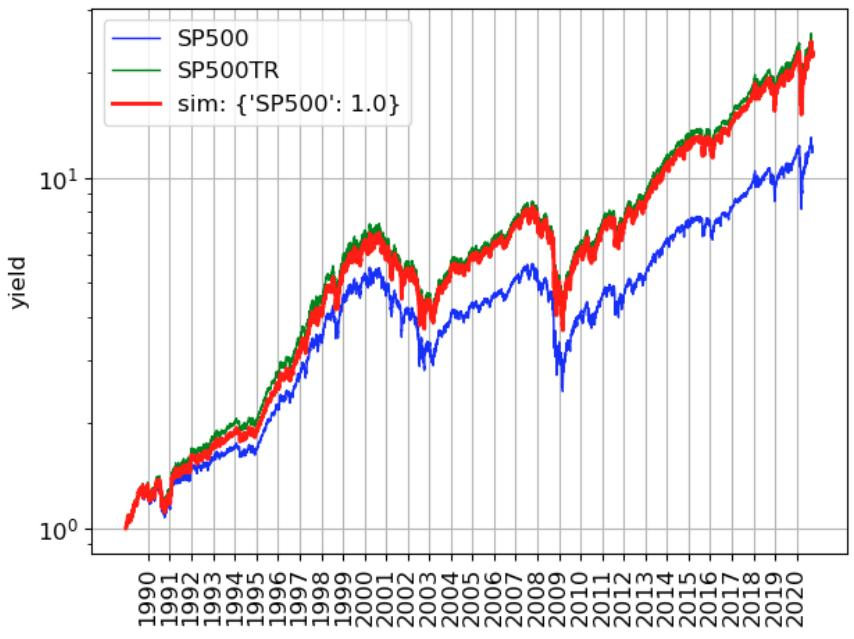

line

| Year | SP500 | SP500TR | sim: {'SP500': 1.0} |
| --- | --- | --- | --- |
| 1990 | ~1.0 | ~1.0 | ~1.0 |
| 1991 | ~1.2 | ~1.3 | ~1.3 |
| 1992 | ~1.3 | ~1.4 | ~1.4 |
| 1993 | ~1.4 | ~1.5 | ~1.5 |
| 1994 | ~1.5 | ~1.6 | ~1.6 |
| 1995 | ~1.6 | ~1.7 | ~1.7 |
| 1996 | ~1.8 | ~1.9 | ~1.9 |
| 1997 | ~2.2 | ~2.3 | ~2.3 |
| 1998 | ~2.8 | ~3.0 | ~3.0 |
| 1999 | ~3.5 | ~3.8 | ~3.8 |
| 2000 | ~4.2 | ~4.5 | ~4.5 |
| 2001 | ~4.5 | ~4.8 | ~4.8 |
| 2002 | ~3.5 | ~3.8 | ~3.8 |
| 2003 | ~3.0 | ~3.2 | ~3.2 |
| 2004 | ~3.5 | ~3.8 | ~3.8 |
| 2005 | ~3.8 | ~4.0 | ~4.0 |
| 2006 | ~4.2 | ~4.5 | ~4.5 |
| 2007 | ~4.5 | ~4.8 | ~4.8 |
| 2008 | ~4.0 | ~4.2 | ~4.2 |
| 2009 | ~2.5 | ~2.8 | ~2.8 |
| 2010 | ~3.5 | ~3.8 | ~3.8 |
| 2011 | ~4.0 | ~4.2 | ~4.2 |
| 2012 | ~4.5 | ~4.8 | ~4.8 |
| 2013 | ~5.0 | ~5.2 | ~5.2 |
| 2014 | ~5.5 | ~5.8 | ~5.8 |
| 2015 | ~6.0 | ~6.2 | ~6.2 |
| 2016 | ~6.5 | ~6.8 | ~6.8 |
| 2017 | ~7.0 | ~7.2 | ~7.2 |
| 2018 | ~8.0 | ~8.2 | ~8.2 |
| 2019 | ~9.0 | ~9.2 | ~9.2 |
| 2020 | ~10.0 | ~10.5 | ~10.5 |

Figure 1: Data for the SP500 index (price and total return) for the 1989-2020 period. A tax-free simulation is plotted in red.

We also show a simulation in red (discussed in chapter 3) which follows the SP500 price data and adds (yearly) dividends of 2% (for simplicity we calibrated a constant number for the whole tested period, and it fits pretty good for our purpose).

The NDX100 data is from Yahoo $[14]$, but there is no corresponding NDX100-TR data. The best we found was $[15]$, which begins in 1999, so prior to that we artificially created NDX100-TR as NDX100 + assumed 0.7% dividends:

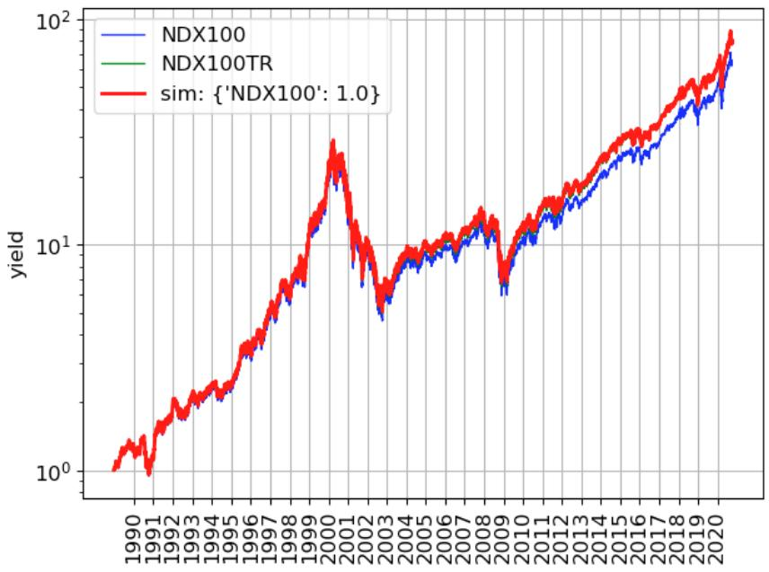

line

| Year | NDX100 (yield) | NDX100TR (yield) | sim: {'NDX100': 1.0} (yield) |
| --- | --- | --- | --- |
| 1990 | ~1.0 | ~1.0 | ~1.0 |
| 1991 | ~1.2 | ~1.2 | ~1.2 |
| 1992 | ~1.5 | ~1.5 | ~1.5 |
| 1993 | ~1.8 | ~1.8 | ~1.8 |
| 1994 | ~2.0 | ~2.0 | ~2.0 |
| 1995 | ~2.2 | ~2.2 | ~2.2 |
| 1996 | ~3.0 | ~3.0 | ~3.0 |
| 1997 | ~4.0 | ~4.0 | ~4.0 |
| 1998 | ~5.0 | ~5.0 | ~5.0 |
| 1999 | ~7.0 | ~7.0 | ~7.0 |
| 2000 | ~15.0 | ~15.0 | ~15.0 |
| 2001 | ~20.0 | ~20.0 | ~20.0 |
| 2002 | ~10.0 | ~10.0 | ~10.0 |
| 2003 | ~6.0 | ~6.0 | ~6.0 |
| 2004 | ~8.0 | ~8.0 | ~8.0 |
| 2005 | ~9.0 | ~9.0 | ~9.0 |
| 2006 | ~10.0 | ~10.0 | ~10.0 |
| 2007 | ~11.0 | ~11.0 | ~11.0 |
| 2008 | ~12.0 | ~12.0 | ~12.0 |
| 2009 | ~7.0 | ~7.0 | ~7.0 |
| 2010 | ~10.0 | ~10.0 | ~10.0 |
| 2011 | ~12.0 | ~12.0 | ~12.0 |
| 2012 | ~14.0 | ~14.0 | ~14.0 |
| 2013 | ~16.0 | ~16.0 | ~16.0 |
| 2014 | ~18.0 | ~18.0 | ~18.0 |
| 2015 | ~20.0 | ~20.0 | ~20.0 |
| 2016 | ~22.0 | ~22.0 | ~22.0 |
| 2017 | ~25.0 | ~25.0 | ~25.0 |
| 2018 | ~30.0 | ~30.0 | ~30.0 |
| 2019 | ~35.0 | ~35.0 | ~35.0 |
| 2020 | ~60.0 | ~60.0 | ~60.0 |

Figure 2: Data for the NDX100 index (price and total return) for the 1989-2020 period. A tax-free simulation is plotted in red.

### 2.2 Bonds

For bonds we use the long-term treasury ETF VUSTX since its inception is in 1986, prior to 1989. The data is again from Yahoo $[14]$, where the price is the “Close” column and the total return is the “Adj Close” column:

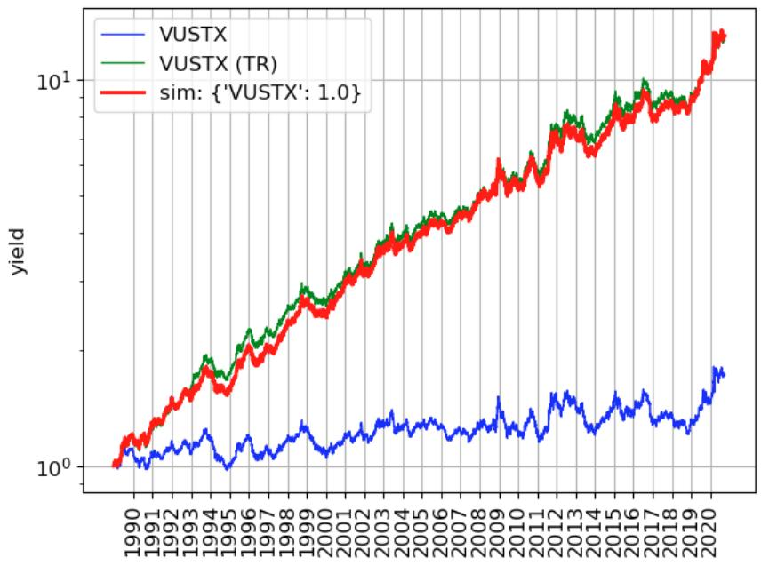

line

| Year | VUSTX | VUSTX (TR) | sim: {'VUSTX': 1.0} |
| --- | --- | --- | --- |
| 1990 | ~1.0 | ~1.0 | ~1.0 |
| 1991 | ~1.1 | ~1.2 | ~1.2 |
| 1992 | ~1.1 | ~1.3 | ~1.3 |
| 1993 | ~1.2 | ~1.5 | ~1.5 |
| 1994 | ~1.3 | ~1.7 | ~1.7 |
| 1995 | ~1.0 | ~1.5 | ~1.5 |
| 1996 | ~1.2 | ~1.8 | ~1.8 |
| 1997 | ~1.1 | ~1.9 | ~1.9 |
| 1998 | ~1.2 | ~2.1 | ~2.1 |
| 1999 | ~1.3 | ~2.3 | ~2.3 |
| 2000 | ~1.1 | ~2.2 | ~2.2 |
| 2001 | ~1.2 | ~2.4 | ~2.4 |
| 2002 | ~1.3 | ~2.6 | ~2.6 |
| 2003 | ~1.4 | ~2.8 | ~2.8 |
| 2004 | ~1.3 | ~3.0 | ~3.0 |
| 2005 | ~1.4 | ~3.2 | ~3.2 |
| 2006 | ~1.3 | ~3.3 | ~3.3 |
| 2007 | ~1.3 | ~3.5 | ~3.5 |
| 2008 | ~1.4 | ~3.8 | ~3.8 |
| 2009 | ~1.3 | ~4.0 | ~4.0 |
| 2010 | ~1.4 | ~4.2 | ~4.2 |
| 2011 | ~1.3 | ~4.5 | ~4.5 |
| 2012 | ~1.5 | ~5.0 | ~5.0 |
| 2013 | ~1.4 | ~5.5 | ~5.5 |
| 2014 | ~1.3 | ~5.8 | ~5.8 |
| 2015 | ~1.4 | ~6.5 | ~6.5 |
| 2016 | ~1.5 | ~7.0 | ~7.0 |
| 2017 | ~1.4 | ~7.5 | ~7.5 |
| 2018 | ~1.3 | ~7.8 | ~7.8 |
| 2019 | ~1.4 | ~8.5 | ~8.5 |
| 2020 | ~1.6 | ~11.0 | ~11.0 |

Figure 3: Data for the long-term treasury bond ETF VUSTX (price and total return) for the 1989-2020 period. A tax-free simulation is plotted in red.

First, we can see the significant contribution of the dividends to the total return of holding bonds. The simulation is in red, but the dividend model used is slightly more complicated than a constant percentage we used before. What we use is actually $5% + 0.5 \times [1 \text{ month LIBOR rate}]$, where the LIBOR rate is time-dependent and taken from $[16]$:

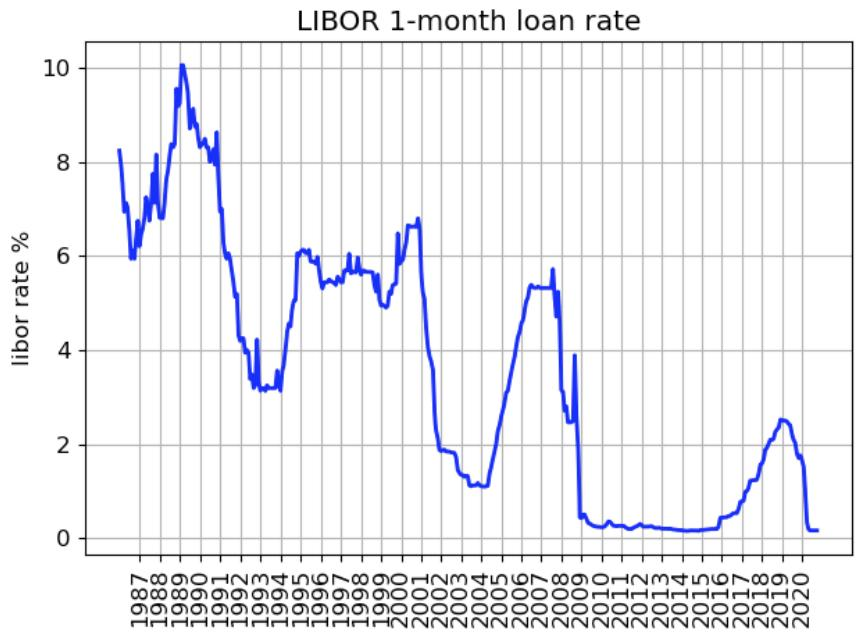

line

| Year | LIBOR 1-month loan rate (%) |
| --- | --- |
| 1987 | ~8.2 |
| 1988 | ~6.0 |
| 1989 | ~10.0 |
| 1990 | ~8.5 |
| 1991 | ~8.0 |
| 1992 | ~4.0 |
| 1993 | ~3.2 |
| 1994 | ~3.5 |
| 1995 | ~6.0 |
| 1996 | ~5.5 |
| 1997 | ~5.5 |
| 1998 | ~5.5 |
| 1999 | ~5.0 |
| 2000 | ~6.5 |
| 2001 | ~6.8 |
| 2002 | ~2.0 |
| 2003 | ~1.5 |
| 2004 | ~1.2 |
| 2005 | ~2.5 |
| 2006 | ~4.5 |
| 2007 | ~5.3 |
| 2008 | ~2.5 |
| 2009 | ~0.5 |
| 2010 | ~0.3 |
| 2011 | ~0.3 |
| 2012 | ~0.3 |
| 2013 | ~0.2 |
| 2014 | ~0.2 |
| 2015 | ~0.2 |
| 2016 | ~0.5 |
| 2017 | ~1.0 |
| 2018 | ~2.0 |
| 2019 | ~2.5 |
| 2020 | ~0.2 |

Figure 4: Data for the 1-month LIBOR rate for the 1986-2020 period.

We can see it changed significantly over the years, which is why a constant percentage fit does not work well.

## 3 Portfolio Evolution Algorithms

In this chapter we describe the algorithms we use in the portfolio evolution simulations, as implemented in $[17]$. To validate the simulation, we test it against real data.

### 3.1 Buying papers

We model the purchases of shares as “papers” (for lack of a better name) of a specific stock type (the name of the ETF) which can have an arbitrary value, and not an integer number. This should not matter when the portfolio value is much larger than the cost of a single share. Each paper’s value at purchase is logged since it matters for capital gains tax.

Buying and selling stocks costs a transaction fee from the brokerage. We take this into account by applying a constant 0.1% fee of the value of each transaction, even though in real brokerages such as Interactive Brokers the fee scheme is not given in a percentage but in a more complicated form. We do not deal with this here and resort to a more simplistic approach, which in fact does not affect the main conclusions in a meaningful way.

The portfolio will be defined by the relative amounts of stocks and bonds. The ideal (or target) portfolio fractions are defined by $f_{i}^{ideal}$, so they satisfy $\sum_{i} f_{i}^{ideal} = 1$. We start off the portfolio by splitting the initial investment and buying $f_{i}^{ideal}$ from each stock type.

### 3.2 Price evolution

We simulate how each paper's value evolves from day to day using closing prices data.

#### 3.2.1 ETF evolution

ETFs follow some index that changes in value (in percents) by $dp_{index}$. ETFs also have expenses, called expense ratio (ER), which is some percentage per year. The fee is charged daily, and since there are 252 trading days a year, the paper value decreases daily by ER/252 percents. Overall, the daily price change of the ETF is:

$$
dp = dp_{index} - \frac{ER}{252} \tag{1}
$$

For the SP500 index we use the VOO ETF that has $ER = 0.03\%$ and for NDX100 we use QQQ ETF that has $ER = 0.2\%$, significantly higher compared to VOO. We do not have an “index” for bonds so we are using the VUSTX price itself as the index, which is an ETF with $ER = 0.05\%$.

#### 3.2.2 Dividends

The dividend rate we use for the stocks and bonds is defined in chapter 2. For simplicity we add them to the cash balance of the account on a daily basis. So if the paper value is V and yearly dividend rate (in percents) is d, the cash added daily due to this paper is $Vd/(100 \cdot 252)$.

Examples for how well the simulation of expense ratio and dividends compare to data were shown in chapter 2.

#### 3.2.3 Cash reinvestment

Once a month we reinvest any available cash to buy additional papers; this cash can come either from dividends or from additional periodic investments. We do not simulate the latter in this work, but the option exists in the code $[17]$.

As the portfolio evolves the portfolio fractions change dynamically from $f_{i}^{ideal}$ to $f_{i}$. As we reinvest we can try and rebalance by buying papers in different quantities. However, it is most likely that the available cash is not enough to properly rebalance (when the portfolio becomes large enough significant selling will be required to rebalance). We leave the rebalancing step to section 3.4, and simply split the cash by $f_{i}^{ideal}$ for each stock type.

#### 3.2.4 Leveraged-ETF evolution

The leveraged ETFs (LETFs) we discuss in this work amplify the daily returns of their underlying index. This comes at a price; the expense ratio is around $\sim 1\%$ (around 30 times higher than that of VOO, and 5 times higher than that of QQQ), and in addition, the loans they take cost as well. In $[9]$ it was estimated that we should use the LIBOR rate as an additional expense for every 100% of leverage. Meaning, if we define the (1-month) LIBOR rate (in percents, yearly) by LR, and the ETF leverage factor by $L_{ETF}$, then the additional expense rate is $LR(L_{ETF}-1)$.

Another important note is that the LETFs are synthetic products that for the most part do not own the actual stocks and track the total return (TR) of the underlying index, meaning the dividends contribution is already priced in. In practice, they do own some stocks and so pay a small amount of dividends, but we will neglect this in the simulation and assume no dividends are given.

Overall, the daily price change of the LETF is:

$$
dp = dp_{index, TR} L_{ETF} - \frac{ER}{252} - \frac{LR(L_{ETF}-1)}{252} \tag{2}
$$

The leveraged ETFs we simulate are:

- For the SP500 index the 2X LETF is SSO, and the 3X LETF is UPRO (the underlying index of these LETFs is SP500-TR).
- For the NDX100 index the 2X LETF is QLD, and the 3X LETF is TQQQ (the underlying index of these LETFs is NDX100-TR).
- For the bonds, an existing alternative to VUSTX that has LETFs that leverage it is TLT, whose 2X LETF is UBT, and 3X LETF is TMF. We use the VUSTX ETF since it has the longest historic data and call its fictitious LETFs by VUSTX2 and VUSTX3 (whose underlying index is VUSTX-TR).

The reason we need to simulate the LETFs rather than simply using existing data is because they are relatively new, and we want to “extend” them backward to 1989. Also, when we perform Monte-Carlo simulations in chapter 4 we are going to generate synthetic realizations of stock histories for which we have to simulate how the LETF would evolve.

Examples We now validate our simulation against real LETF data to show it works well.

Simulation of TMF (assuming TLT-TR as the underlying index) against data, starting at 2011 (approximately when TMF started):

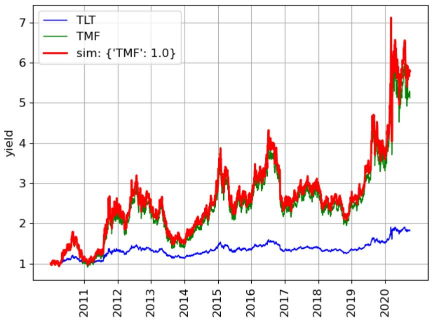

line

| Year | TLT | TMF | sim: {'TMF': 1.0} |
| --- | --- | --- | --- |
| 2011 | ~1.1 | ~1.1 | ~1.1 |
| 2012 | ~1.3 | ~2.1 | ~2.2 |
| 2013 | ~1.3 | ~2.2 | ~2.3 |
| 2014 | ~1.2 | ~1.6 | ~1.7 |
| 2015 | ~1.4 | ~2.5 | ~2.6 |
| 2016 | ~1.4 | ~2.6 | ~2.7 |
| 2017 | ~1.4 | ~2.6 | ~2.7 |
| 2018 | ~1.4 | ~2.6 | ~2.7 |
| 2019 | ~1.4 | ~2.6 | ~2.7 |
| 2020 | ~1.8 | ~5.5 | ~5.8 |

Figure 5: Data for the TLT and TMF ETFs for the 2010-2020 period. A tax-free simulation of TMF (based on total return of TLT) is plotted in red.

Simulation of UPRO against data, starting at 2010 (approximately when UPRO started):

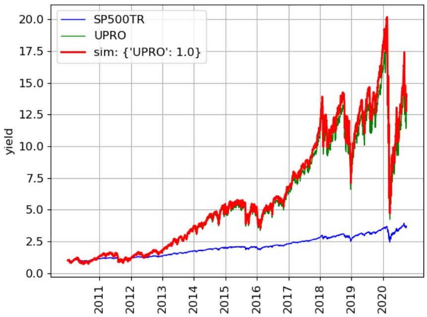

line

| Year | SP500TR (yield) | UPRO (yield) | sim: {'UPRO': 1.0} (yield) |
| --- | --- | --- | --- |
| 2011 | ~1.0 | ~1.0 | ~1.0 |
| 2012 | ~1.2 | ~1.2 | ~1.2 |
| 2013 | ~1.5 | ~1.5 | ~1.5 |
| 2014 | ~1.8 | ~3.5 | ~3.5 |
| 2015 | ~2.0 | ~5.0 | ~5.0 |
| 2016 | ~2.0 | ~5.0 | ~5.0 |
| 2017 | ~2.5 | ~7.5 | ~7.5 |
| 2018 | ~3.0 | ~10.0 | ~10.0 |
| 2019 | ~3.0 | ~12.5 | ~12.5 |
| 2020 | ~3.5 | ~12.5 | ~12.5 |

Figure 6: Data for the SP500-TR index and UPRO ETF for the 2010-2020 period. A tax-free simulation of UPRO (based on SP500-TR) is plotted in red.

Simulation of TQQQ against data, starting at 2011 (approximately when TQQQ started):

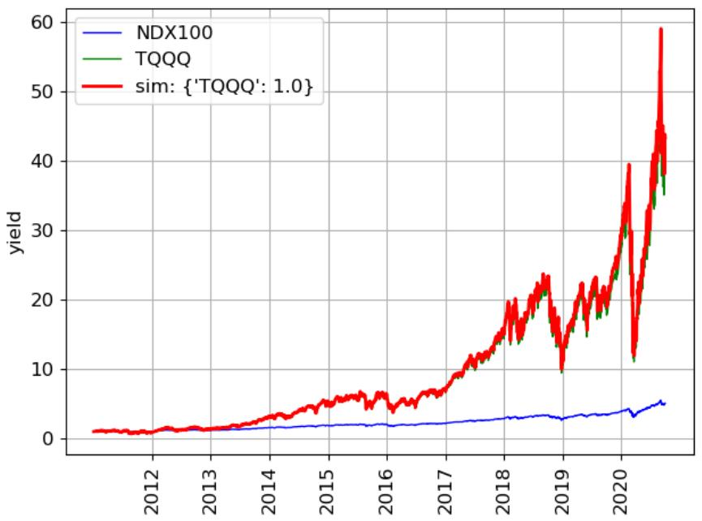

line

| Year | NDX100 (yield) | TQQQ (yield) | sim: {'TQQQ': 1.0} (yield) |
| --- | --- | --- | --- |
| 2012 | ~1 | ~1 | ~1 |
| 2013 | ~1.5 | ~1.5 | ~1.5 |
| 2014 | ~2 | ~2 | ~3 |
| 2015 | ~2 | ~2 | ~5 |
| 2016 | ~2 | ~2 | ~5 |
| 2017 | ~2.5 | ~2.5 | ~7 |
| 2018 | ~3 | ~3 | ~15 |
| 2019 | ~3 | ~3 | ~15 |
| 2020 | ~5 | ~5 | ~40 |

Figure 7: Data for the NDX100 index and TQQQ ETF for the 2011-2020 period. A tax-free simulation of TQQQ (based on NDX100-TR) is plotted in red.

### 3.3 Margin

The more traditional way to leverage (compared to LETFs) is borrowing money to invest. This method is in principle better than a daily LETF, because it does not suffer as much from fluctuations of the underlying index.

Interactive Brokers brokerage allows for a 2X leverage on margin (called Reg T margin), meaning you can borrow against 100% of your portfolio. However, during the trading day itself the leverage can change dynamically. If the portfolio value drops, the loan fraction of the total portfolio increases which means higher leverage. IBKR allows for 4X leverage (called maintenance margin) during the trading day, but at the end of the day the original 2X is a maximum. Meaning, any deviation beyond that limit will trigger a “margin call” which means the broker will sell some of the portfolio to bring it back to the 2X leverage limit $[18]$.

Our simulations only deal with end-of-day data, so we do not care about the higher leverage allowed mid-day. Due to the fact that the leverage changes dynamically, we will target 1.8X leverage, to leave a $\sim 10\%$ buffer to the maximum allowed leverage. If the margin leverage deviates by 10% from the target, it will trigger a rebalance, which is effectively “margin calling” yourself. The algorithm for this is described in the next section.

The current cost of the loan in Interactive Brokers is 1.59% (yearly). So if the margin debt is M, each day the debt is increased by $M \cdot 1.59/252$ percents.

We now compare the performance of the two methods of 2X leverage on a backtest for the NDX100 index. For margin leverage, as the portfolio value changes the margin leverage L will change dynamically, so we define the target to be L = 2 with 10% allowed buffer prior to rebalance (in practice 2X leaves no buffer, but we simulate this here for fair comparison to the 2X LETF QLD). We also assume the margin simulation is tax-free even though it is not possible to use this method in a tax-free account (at least in Israel), again, for fair comparison.

The two simulations side by side (the yield is defined as the total portfolio size, minus the margin debt, which is roughly 100% in the case of 2X target leverage):

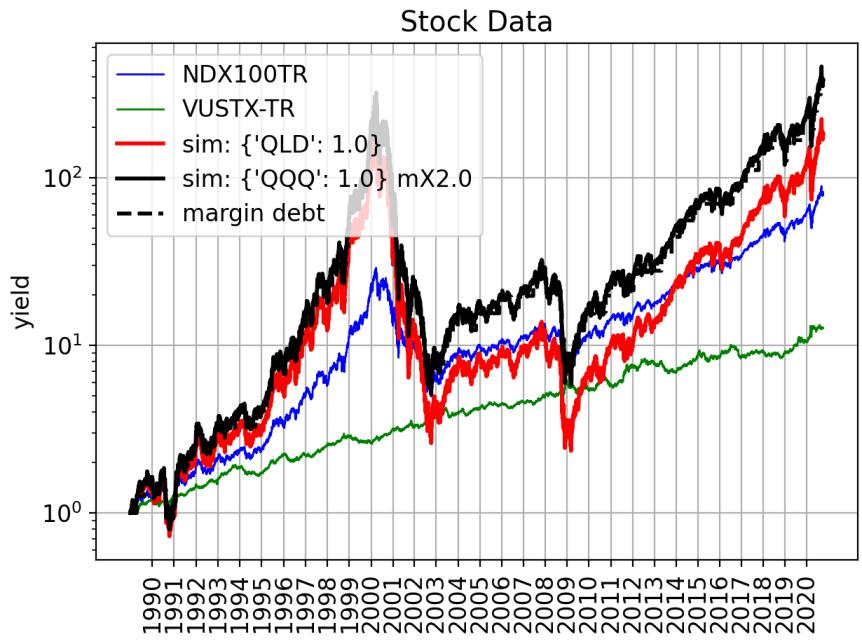

line

| Year | NDX100TR | VUSTX-TR | sim: {'QLD': 1.0} | sim: {'QQQ': 1.0} mX2.0 | margin debt |
| --- | --- | --- | --- | --- | --- |
| 1990 | ~1.0 | ~1.0 | ~1.0 | ~1.0 | ~1.0 |
| 1991 | ~1.5 | ~1.2 | ~1.5 | ~1.5 | ~1.5 |
| 1992 | ~2.0 | ~1.5 | ~2.0 | ~2.0 | ~2.0 |
| 1993 | ~2.5 | ~1.8 | ~2.5 | ~2.5 | ~2.5 |
| 1994 | ~3.0 | ~2.0 | ~3.0 | ~3.0 | ~3.0 |
| 1995 | ~4.0 | ~2.2 | ~4.0 | ~4.0 | ~4.0 |
| 1996 | ~6.0 | ~2.5 | ~6.0 | ~6.0 | ~6.0 |
| 1997 | ~8.0 | ~2.8 | ~8.0 | ~8.0 | ~8.0 |
| 1998 | ~12.0 | ~3.0 | ~12.0 | ~12.0 | ~12.0 |
| 1999 | ~18.0 | ~3.2 | ~18.0 | ~18.0 | ~18.0 |
| 2000 | ~25.0 | ~3.5 | ~25.0 | ~25.0 | ~25.0 |
| 2001 | ~15.0 | ~3.8 | ~15.0 | ~15.0 | ~15.0 |
| 2002 | ~8.0 | ~4.0 | ~8.0 | ~8.0 | ~8.0 |
| 2003 | ~10.0 | ~4.2 | ~10.0 | ~10.0 | ~10.0 |
| 2004 | ~12.0 | ~4.5 | ~12.0 | ~12.0 | ~12.0 |
| 2005 | ~15.0 | ~4.8 | ~15.0 | ~15.0 | ~15.0 |
| 2006 | ~18.0 | ~5.0 | ~18.0 | ~18.0 | ~18.0 |
| 2007 | ~20.0 | ~5.2 | ~20.0 | ~20.0 | ~20.0 |
| 2008 | ~25.0 | ~5.5 | ~25.0 | ~25.0 | ~25.0 |
| 2009 | ~10.0 | ~5.8 | ~10.0 | ~10.0 | ~10.0 |
| 2010 | ~15.0 | ~6.0 | ~15.0 | ~15.0 | ~15.0 |
| 2011 | ~20.0 | ~6.5 | ~20.0 | ~20.0 | ~20.0 |
| 2012 | ~25.0 | ~7.0 | ~25.0 | ~25.0 | ~25.0 |
| 2013 | ~30.0 | ~7.5 | ~30.0 | ~30.0 | ~30.0 |
| 2014 | ~40.0 | ~8.0 | ~40.0 | ~40.0 | ~40.0 |
| 2015 | ~50.0 | ~8.5 | ~50.0 | ~50.0 | ~50.0 |
| 2016 | ~60.0 | ~9.0 | ~60.0 | ~60.0 | ~60.0 |
| 2017 | ~70.0 | ~9.5 | ~70.0 | ~70.0 | ~70.0 |
| 2018 | ~80.0 | ~10.0 | ~80.0 | ~80.0 | ~80.0 |
| 2019 | ~90.0 | ~10.5 | ~90.0 | ~90.0 | ~90.0 |
| 2020 | ~100.0 | ~11.0 | ~100.0 | ~100.0 | ~100.0 |

Figure 8: Tax-free simulations for 2X leverage on the NDX100 index for the period 1989-2020, using LETF (red) and margin (black). Margin debt is plotted in dashed black.

The margin leverage as a function of time:

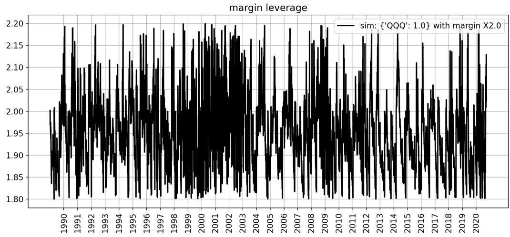

line

| Year | Margin Leverage |
| --- | --- |
| 1990 | ~1.90 |
| 1991 | ~1.95 |
| 1992 | ~1.98 |
| 1993 | ~1.92 |
| 1994 | ~1.95 |
| 1995 | ~1.98 |
| 1996 | ~1.95 |
| 1997 | ~1.92 |
| 1998 | ~1.95 |
| 1999 | ~1.98 |
| 2000 | ~1.95 |
| 2001 | ~1.98 |
| 2002 | ~1.95 |
| 2003 | ~1.98 |
| 2004 | ~1.95 |
| 2005 | ~1.98 |
| 2006 | ~1.95 |
| 2007 | ~1.98 |
| 2008 | ~1.95 |
| 2009 | ~1.98 |
| 2010 | ~1.95 |
| 2011 | ~1.98 |
| 2012 | ~1.95 |
| 2013 | ~1.98 |
| 2014 | ~1.95 |
| 2015 | ~1.98 |
| 2016 | ~1.95 |
| 2017 | ~1.98 |
| 2018 | ~1.95 |
| 2019 | ~1.98 |
| 2020 | ~1.95 |

Figure 9: Evolution of the margin leverage in the 2X margin leveraged NDX100 simulation.

We can see the margin leverage $L$ changes dynamically but does not exceed $10\%$ from the target due to active rebalancing, to be discussed in section 3.4.

Same for SP500 index:

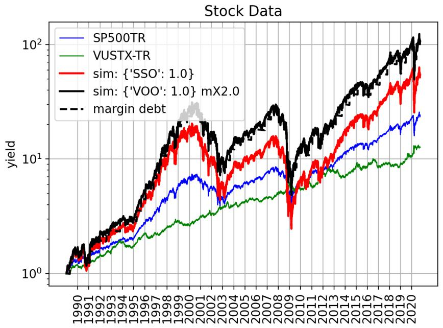

line

| Year | SP500TR | VUSTX-TR | sim: {'SSO': 1.0} | sim: {'VOO': 1.0} mX2.0 | margin debt |
| --- | --- | --- | --- | --- | --- |
| 1990 | ~1.0 | ~1.0 | ~1.0 | ~1.0 | ~1.0 |
| 1991 | ~1.2 | ~1.1 | ~1.2 | ~1.3 | ~1.3 |
| 1992 | ~1.5 | ~1.3 | ~1.6 | ~1.8 | ~1.8 |
| 1993 | ~1.8 | ~1.5 | ~2.0 | ~2.2 | ~2.2 |
| 1994 | ~2.0 | ~1.7 | ~2.5 | ~2.8 | ~2.8 |
| 1995 | ~2.2 | ~1.8 | ~2.8 | ~3.0 | ~3.0 |
| 1996 | ~2.5 | ~2.0 | ~3.5 | ~4.0 | ~4.0 |
| 1997 | ~3.5 | ~2.2 | ~5.0 | ~6.0 | ~6.0 |
| 1998 | ~4.5 | ~2.5 | ~8.0 | ~10.0 | ~10.0 |
| 1999 | ~5.5 | ~2.8 | ~12.0 | ~15.0 | ~15.0 |
| 2000 | ~6.0 | ~3.0 | ~15.0 | ~18.0 | ~18.0 |
| 2001 | ~6.5 | ~3.2 | ~18.0 | ~20.0 | ~20.0 |
| 2002 | ~5.5 | ~3.5 | ~12.0 | ~15.0 | ~15.0 |
| 2003 | ~4.5 | ~3.8 | ~8.0 | ~10.0 | ~10.0 |
| 2004 | ~5.5 | ~4.0 | ~10.0 | ~12.0 | ~12.0 |
| 2005 | ~6.0 | ~4.2 | ~12.0 | ~15.0 | ~15.0 |
| 2006 | ~6.5 | ~4.5 | ~14.0 | ~18.0 | ~18.0 |
| 2007 | ~7.0 | ~4.8 | ~16.0 | ~20.0 | ~20.0 |
| 2008 | ~8.0 | ~5.0 | ~18.0 | ~25.0 | ~25.0 |
| 2009 | ~5.0 | ~4.5 | ~5.0 | ~8.0 | ~8.0 |
| 2010 | ~6.0 | ~5.0 | ~7.0 | ~12.0 | ~12.0 |
| 2011 | ~7.0 | ~5.5 | ~8.0 | ~15.0 | ~15.0 |
| 2012 | ~8.0 | ~6.0 | ~10.0 | ~18.0 | ~18.0 |
| 2013 | ~9.0 | ~6.5 | ~12.0 | ~22.0 | ~22.0 |
| 2014 | ~10.0 | ~7.0 | ~15.0 | ~28.0 | ~28.0 |
| 2015 | ~11.0 | ~7.5 | ~18.0 | ~35.0 | ~35.0 |
| 2016 | ~12.0 | ~8.0 | ~20.0 | ~40.0 | ~40.0 |
| 2017 | ~13.0 | ~8.5 | ~25.0 | ~45.0 | ~45.0 |
| 2018 | ~15.0 | ~9.0 | ~30.0 | ~55.0 | ~55.0 |
| 2019 | ~18.0 | ~10.0 | ~40.0 | ~70.0 | ~70.0 |
| 2020 | ~20.0 | ~12.0 | ~50.0 | ~100.0 | ~100.0 |

Figure 10: Tax-free simulations for 2X leverage on the SP500 index for the period 1989-2020, using LETF (red) and margin (black). Margin debt is plotted in dashed black.

### 3.4 Rebalancing

So far we discussed the simulation of a single stock type. However, a mixed portfolio of stocks and bonds can be beneficial since the two assets rise over the long term, yet somewhat anti-correlated, so can cover over each other during large price swings. We define a portfolio with some ideal (or target) fractions $f_{i}^{ideal}$, and as it evolves to $f_{i}$ that deviates too much from the target, we trigger a rebalance that will restore order. In our simulations we picked the deviation trigger as 20% for any stock (e.g. if we pick $f = 10\%$, it will trigger only at 30%, and if $f = 50\%$ it will trigger at 30% or 70%).

Define the total portfolio values as T, and each fraction value $T_{i}$ so therefore $f_{i} = T_{i}/T$. We want to transfer money around $T_{i}^{\prime} = T_{i} + \Delta T_{i}$ to rebalance the portfolio to the ideal fractions:

$$
f_{i}^{\prime} = \frac{T_{i}^{\prime}}{T} = f_{i}^{ideal} \tag {3}
$$

Therefore:

$$
\Delta T_{i} = T \left(f_{i}^{ideal} - f_{i}\right) \tag {4}
$$

If $\Delta T_{i} > 0$ we need to buy the stock, and if $\Delta T_{i} < 0$ we sell. For a portfolio with two stock types (stocks and bonds) naturally $\Delta T_{stocks} = -\Delta T_{bonds}$.

In the margin leverage scenario, we have margin debt M, so the margin leverage is $L = \frac{T}{T - M}$. As we mentioned in section 3.3, the margin leverage can change dynamically as well, and if it deviates too much (we picked 10% from $L^{ideal}$) we also trigger a rebalance. If the ideal (or target) leverage is $L^{ideal}$, then the loan might need to change to $M' = M + \Delta M$, which also changes the total portfolio value $T' = T + \Delta M$:

$$
L^{\prime} = \frac{T^{\prime}}{T^{\prime} - M^{\prime}} = \frac{T + \Delta M}{T - M} = L^{ideal} \tag {5}
$$

Therefore:

$$
\Delta M = L^{ideal} (T - M) - T = T\left(\frac{L^{ideal}}{L} - 1\right) \tag {6}
$$

If no margin debt is allowed then M = 0 and of course $\Delta M = 0$ always.

During the rebalancing we can change both the component fractions to the ideal fractions and fix the margin leverage simultaneously:

$$
f_{i}^{\prime} = \frac{T_{i}^{\prime}}{T^{\prime}} = \frac{T_{i} + \Delta T_{i}}{T + \Delta M} = f_{i}^{ideal} \tag {7}
$$

Therefore:

$$
\Delta T_{i} = T \left(f_{i}^{ideal} - f_{i}\right) + f_{i}^{ideal} \Delta M \tag {8}
$$

#### 3.4.1 Examples

Backtest simulation of a 50%/50% non-leveraged VOO/VUSTX portfolio:

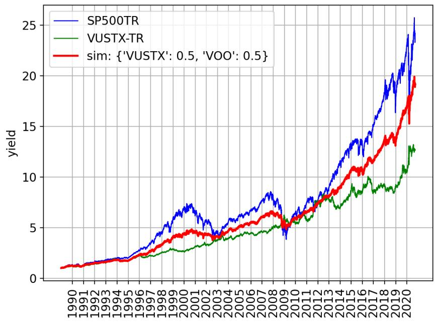

line

| Year | SP500TR | VUSTX-TR | sim: {'VUSTX': 0.5, 'VOO': 0.5} |
| --- | --- | --- | --- |
| 1990 | ~1.1 | ~1.1 | ~1.1 |
| 1991 | ~1.3 | ~1.3 | ~1.3 |
| 1992 | ~1.5 | ~1.5 | ~1.5 |
| 1993 | ~1.7 | ~1.7 | ~1.7 |
| 1994 | ~1.9 | ~1.9 | ~1.9 |
| 1995 | ~2.1 | ~2.1 | ~2.1 |
| 1996 | ~2.8 | ~2.3 | ~2.5 |
| 1997 | ~3.8 | ~2.5 | ~3.0 |
| 1998 | ~4.8 | ~2.8 | ~3.5 |
| 1999 | ~6.0 | ~3.0 | ~4.0 |
| 2000 | ~6.8 | ~3.2 | ~4.5 |
| 2001 | ~6.5 | ~3.3 | ~4.8 |
| 2002 | ~5.5 | ~3.5 | ~4.5 |
| 2003 | ~4.5 | ~3.8 | ~4.2 |
| 2004 | ~5.5 | ~4.0 | ~4.8 |
| 2005 | ~6.0 | ~4.2 | ~5.2 |
| 2006 | ~6.5 | ~4.5 | ~5.5 |
| 2007 | ~7.5 | ~4.8 | ~6.0 |
| 2008 | ~8.0 | ~5.0 | ~6.5 |
| 2009 | ~4.5 | ~5.5 | ~5.0 |
| 2010 | ~6.5 | ~6.0 | ~6.0 |
| 2011 | ~7.5 | ~6.5 | ~6.8 |
| 2012 | ~8.5 | ~7.0 | ~7.5 |
| 2013 | ~10.0 | ~7.5 | ~8.5 |
| 2014 | ~11.5 | ~8.0 | ~9.5 |
| 2015 | ~13.0 | ~8.5 | ~10.5 |
| 2016 | ~13.5 | ~9.0 | ~11.0 |
| 2017 | ~15.0 | ~9.0 | ~12.0 |
| 2018 | ~17.0 | ~9.0 | ~13.5 |
| 2019 | ~20.0 | ~10.0 | ~16.0 |
| 2020 | ~24.0 | ~12.5 | ~19.0 |

Figure 11: Tax-free simulation for a 50%/50% VOO/VUSTX portfolio in the period 1989-2020.

We can see intuitively that the stock component of the portfolio pulls it upwards, and the bond component reduces drawdown.

The evolution of the fractions:

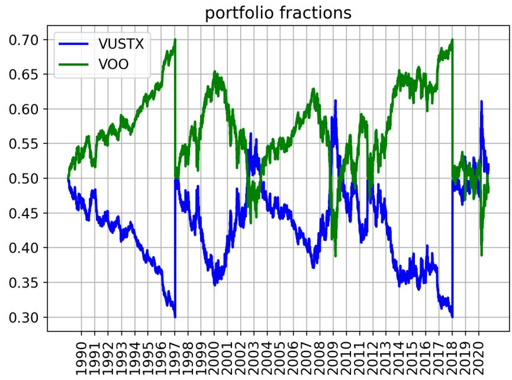

line

| Year | VUSTX | VOO |
| --- | --- | --- |
| 1990 | ~0.50 | ~0.50 |
| 1991 | ~0.46 | ~0.54 |
| 1992 | ~0.44 | ~0.56 |
| 1993 | ~0.43 | ~0.57 |
| 1994 | ~0.42 | ~0.58 |
| 1995 | ~0.39 | ~0.61 |
| 1996 | ~0.36 | ~0.64 |
| 1997 | ~0.30 | ~0.70 |
| 1998 | ~0.48 | ~0.52 |
| 1999 | ~0.43 | ~0.57 |
| 2000 | ~0.37 | ~0.63 |
| 2001 | ~0.36 | ~0.65 |
| 2002 | ~0.40 | ~0.58 |
| 2003 | ~0.45 | ~0.52 |
| 2004 | ~0.48 | ~0.48 |
| 2005 | ~0.46 | ~0.54 |
| 2006 | ~0.44 | ~0.56 |
| 2007 | ~0.41 | ~0.59 |
| 2008 | ~0.38 | ~0.62 |
| 2009 | ~0.45 | ~0.55 |
| 2010 | ~0.58 | ~0.45 |
| 2011 | ~0.48 | ~0.55 |
| 2012 | ~0.42 | ~0.58 |
| 2013 | ~0.48 | ~0.52 |
| 2014 | ~0.37 | ~0.62 |
| 2015 | ~0.36 | ~0.65 |
| 2016 | ~0.37 | ~0.63 |
| 2017 | ~0.33 | ~0.68 |
| 2018 | ~0.30 | ~0.70 |
| 2019 | ~0.49 | ~0.51 |
| 2020 | ~0.52 | ~0.48 |

Figure 12: Evolution of the portfolio fractions of VOO and VUSTX in the 50%/50% VOO/VUSTX simulation.

We can see it indeed changes and triggers rebalance at the correct times.

Now move on to 2X leveraged mixed portfolios, with both leverage methods. For SP500 index:

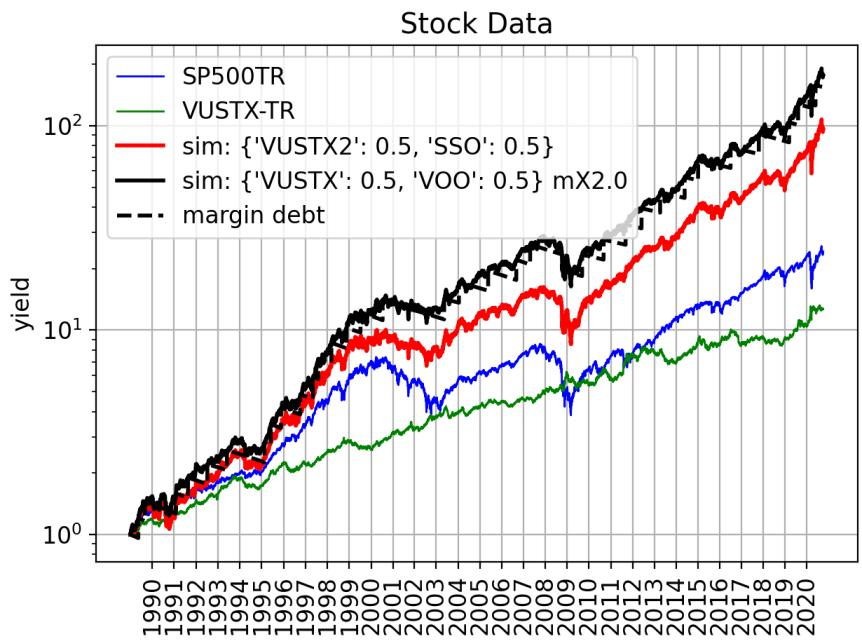

line

| Year | SP500TR | VUSTX-TR | sim: {'VUSTX2': 0.5, 'SSO': 0.5} | sim: {'VUSTX': 0.5, 'VOO': 0.5} mX2.0 | margin debt |
| --- | --- | --- | --- | --- | --- |
| 1990 | ~1.0 | ~1.0 | ~1.0 | ~1.0 | ~1.0 |
| 1991 | ~1.2 | ~1.1 | ~1.1 | ~1.3 | ~1.3 |
| 1992 | ~1.5 | ~1.3 | ~1.4 | ~1.6 | ~1.6 |
| 1993 | ~1.8 | ~1.5 | ~1.7 | ~1.9 | ~1.9 |
| 1994 | ~2.0 | ~1.7 | ~1.9 | ~2.2 | ~2.2 |
| 1995 | ~2.2 | ~1.8 | ~2.1 | ~2.4 | ~2.4 |
| 1996 | ~2.5 | ~2.0 | ~2.4 | ~2.8 | ~2.8 |
| 1997 | ~3.0 | ~2.2 | ~2.8 | ~3.5 | ~3.5 |
| 1998 | ~4.0 | ~2.5 | ~3.8 | ~4.5 | ~4.5 |
| 1999 | ~5.0 | ~2.8 | ~5.0 | ~6.0 | ~6.0 |
| 2000 | ~6.0 | ~3.0 | ~6.0 | ~8.0 | ~8.0 |
| 2001 | ~6.5 | ~3.2 | ~7.0 | ~9.0 | ~9.0 |
| 2002 | ~5.0 | ~3.5 | ~6.0 | ~8.0 | ~8.0 |
| 2003 | ~4.0 | ~3.8 | ~5.0 | ~7.0 | ~7.0 |
| 2004 | ~5.0 | ~4.0 | ~6.0 | ~8.0 | ~8.0 |
| 2005 | ~6.0 | ~4.2 | ~7.0 | ~9.0 | ~9.0 |
| 2006 | ~6.5 | ~4.5 | ~8.0 | ~10.0 | ~10.0 |
| 2007 | ~7.0 | ~4.8 | ~9.0 | ~11.0 | ~11.0 |
| 2008 | ~8.0 | ~5.0 | ~10.0 | ~12.0 | ~12.0 |
| 2009 | ~4.0 | ~5.5 | ~8.0 | ~10.0 | ~10.0 |
| 2010 | ~6.0 | ~6.0 | ~10.0 | ~12.0 | ~12.0 |
| 2011 | ~7.0 | ~6.5 | ~12.0 | ~14.0 | ~14.0 |
| 2012 | ~8.0 | ~7.0 | ~14.0 | ~16.0 | ~16.0 |
| 2013 | ~9.0 | ~7.5 | ~16.0 | ~18.0 | ~18.0 |
| 2014 | ~10.0 | ~8.0 | ~18.0 | ~20.0 | ~20.0 |
| 2015 | ~11.0 | ~8.5 | ~20.0 | ~22.0 | ~22.0 |
| 2016 | ~12.0 | ~9.0 | ~22.0 | ~24.0 | ~24.0 |
| 2017 | ~13.0 | ~9.5 | ~24.0 | ~26.0 | ~26.0 |
| 2018 | ~14.0 | ~10.0 | ~26.0 | ~28.0 | ~28.0 |
| 2019 | ~15.0 | ~10.5 | ~28.0 | ~30.0 | ~30.0 |
| 2020 | ~16.0 | ~11.0 | ~30.0 | ~32.0 | ~32.0 |

Figure 13: Tax-free simulation for a 50%/50% 2X leveraged SP500/VUSTX portfolios in the period 1989-2020, using LETFs (red) and margin (black).

For NDX100 index:

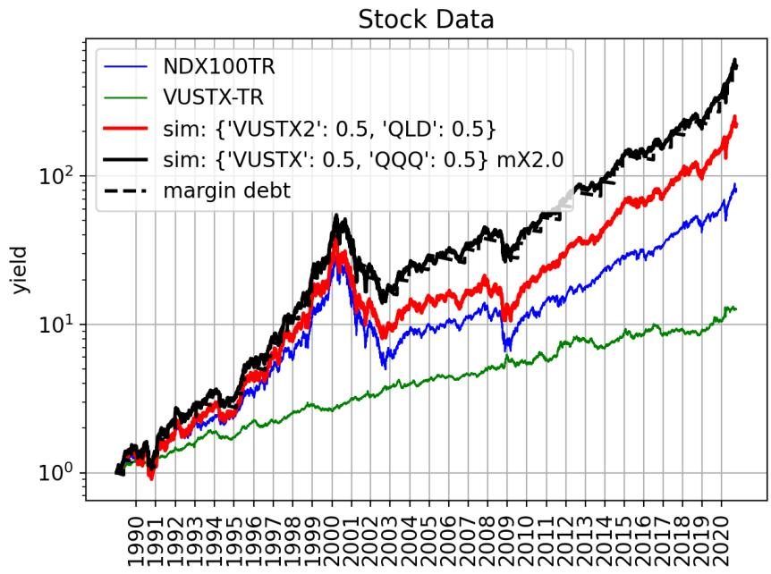

line

| Year | NDX100TR | VUSTX-TR | sim: {'VUSTX2': 0.5, 'QLD': 0.5} | sim: {'VUSTX': 0.5, 'QQQ': 0.5} mX2.0 | margin debt |
| --- | --- | --- | --- | --- | --- |
| 1990 | ~1.0 | ~1.0 | ~1.0 | ~1.0 | ~1.0 |
| 1991 | ~1.2 | ~1.1 | ~1.1 | ~1.2 | ~1.2 |
| 1992 | ~1.5 | ~1.3 | ~1.5 | ~1.6 | ~1.6 |
| 1993 | ~1.8 | ~1.4 | ~1.8 | ~2.0 | ~2.0 |
| 1994 | ~2.0 | ~1.5 | ~2.0 | ~2.5 | ~2.5 |
| 1995 | ~2.2 | ~1.6 | ~2.2 | ~2.8 | ~2.8 |
| 1996 | ~2.5 | ~1.8 | ~2.5 | ~3.5 | ~3.5 |
| 1997 | ~3.0 | ~2.0 | ~3.0 | ~4.5 | ~4.5 |
| 1998 | ~4.0 | ~2.2 | ~4.0 | ~6.0 | ~6.0 |
| 1999 | ~6.0 | ~2.5 | ~6.0 | ~9.0 | ~9.0 |
| 2000 | ~10.0 | ~2.8 | ~10.0 | ~15.0 | ~15.0 |
| 2001 | ~20.0 | ~3.0 | ~20.0 | ~30.0 | ~30.0 |
| 2002 | ~10.0 | ~3.2 | ~15.0 | ~20.0 | ~20.0 |
| 2003 | ~8.0 | ~3.5 | ~12.0 | ~18.0 | ~18.0 |
| 2004 | ~10.0 | ~3.8 | ~15.0 | ~25.0 | ~25.0 |
| 2005 | ~10.0 | ~4.0 | ~15.0 | ~28.0 | ~28.0 |
| 2006 | ~10.0 | ~4.2 | ~15.0 | ~30.0 | ~30.0 |
| 2007 | ~12.0 | ~4.5 | ~18.0 | ~35.0 | ~35.0 |
| 2008 | ~12.0 | ~4.8 | ~18.0 | ~35.0 | ~35.0 |
| 2009 | ~8.0 | ~5.0 | ~12.0 | ~25.0 | ~25.0 |
| 2010 | ~12.0 | ~5.5 | ~18.0 | ~35.0 | ~35.0 |
| 2011 | ~15.0 | ~6.0 | ~22.0 | ~45.0 | ~45.0 |
| 2012 | ~18.0 | ~6.5 | ~28.0 | ~55.0 | ~55.0 |
| 2013 | ~20.0 | ~7.0 | ~35.0 | ~70.0 | ~70.0 |
| 2014 | ~25.0 | ~7.5 | ~45.0 | ~85.0 | ~85.0 |
| 2015 | ~30.0 | ~8.0 | ~55.0 | ~100.0 | ~100.0 |
| 2016 | ~35.0 | ~8.5 | ~65.0 | ~120.0 | ~120.0 |
| 2017 | ~40.0 | ~9.0 | ~75.0 | ~140.0 | ~140.0 |
| 2018 | ~45.0 | ~9.5 | ~90.0 | ~160.0 | ~160.0 |
| 2019 | ~50.0 | ~10.0 | ~110.0 | ~190.0 | ~190.0 |
| 2020 | ~80.0 | ~12.0 | ~200.0 | ~300.0 | ~300.0 |

Figure 14: Tax-free simulation for a 50%/50% 2X leveraged NDX100/VUSTX portfolios in the period 1989-2020, using LETFs (red) and margin (black).

We can see in this backtest the leveraged portfolio gave higher yields than the non-leveraged portfolio, and also that the margin leverage (at the given margin rate) is more effective than the LETFs, because it is not vulnerable to daily fluctuations as much as LETFs.

### 3.5 Capital Gains Tax

In the previous section we saw margin leverage can be better than LETF leverage. However, the simulations made assumed no taxes exist. In reality (specific to Israel, at least) an investor with a tax-free IRA account can use LETFs but cannot use margin leverage, so it is only a theoretical exercise. In a normal taxable account, both leverage strategies can be used. But for a taxable account, gains must be tracked because capital gains tax needs to be paid for them.

The tax needs to be paid only at the end of the year a paper is sold, so the tax can be deferred for many years which is very beneficial. In case the portfolio is composed of a single stock type, the investment is simply buy-and-hold and there is no need to worry about taxes during the simulation, except at the very end when we sell the entire portfolio. But for a rebalanced portfolio with several stock types, we have to sell papers from time to time, which is a negative effect that we aim to quantify.

#### 3.5.1 Contributions to gains

The gains G need to be counted, and paid for at the end of the year. Then we reset $G = 0$ for the next year. However, if papers are sold at a loss at the end of the year, the losses $G < 0$ do not reset but can be carried over to the following years to cancel out future gains.

Gains come from two sources: dividends and paper sales. All dividends count as gains so have to be tracked on a daily basis $\Delta G_{div} = D$.

Rebalancing requires selling papers. Consider a paper with value V that has profit P (can be negative in which case it is a loss), the contribution to the gains depends on how much we need to sell $\Delta T$. If $\Delta T > V$, then the paper is sold out completely; the yearly gains increase by $\Delta G = P$, and we move on to the next paper to complete the necessary sell amount. If $\Delta T \leq V$ then only part of the paper is sold, but the amount sold will count as yearly gains. If the amount sold is larger than the profits then the gains will max out by the profits $\Delta G = \text{sign}(P) \min(\Delta T, P)$.

To sum up:

$$
\Delta G_{reb} = \left\{ 
\begin{array}{ll} 
\operatorname{sign}(P) \min(\Delta T, P) & \Delta T \leq V \\ 
P & \Delta T > V 
\end{array} 
\right. \tag{9}
$$

#### 3.5.2 Treating end-of-year taxes

At the end of the year part of the portfolio needs to be sold to generate the cash needed for the tax. If the gains are negative (loss) $G \leq 0$, nothing needs to be done, and the loss carries over to the following year.

For positive gains $G > 0$, the capital gains tax fraction is $cgt = 0.25$ (Israeli value), so the tax to pay is $t = G \cdot cgt$. At the end of the year the portfolio is reduced to $T' = T - t$.

However, as we sell some of the papers, they generate additional profit or loss, which increases or decreases the total tax that is needed to be paid. Define the profit for the portfolio to be P, so by definition $P < T$. If we sell a portion $\Delta T$ the updated tax is therefore:

$$
t' = (G + \Delta T) cgt \tag{10}
$$

$\Delta T$ itself is the total amount to be sold so $\Delta T = t'$. The solution to the equation is:

$$
\Delta T = t' = \frac{cgt}{1 - cgt} G = \frac{G}{3} \equiv t^* \tag{11}
$$

So we can see the necessity to pay tax amplifies itself if we have positive yearly gains $G > 0$. However, as we said, this enlarged tax is maxed out by the profitable part P of the portfolio. If $t^{*} \leq P$ the solution above is valid, but after we sell off all the profit, the remainder does not incur further tax. So for $t^{*} > P$ the tax is paid for $G + P$:

$$
\Delta T = t' = (G + P) cgt = \frac{G + P}{4} \tag{12}
$$

To sum up the different cases, as a function of gains G:

$$
\Delta T = \left\{ 
\begin{array}{ll} 
G \frac{cgt}{1 - cgt} & G \leq \frac{1 - cgt}{cgt} P \\ 
(G + P) cgt & G > \frac{1 - cgt}{cgt} P 
\end{array} 
\right. \tag{13}
$$

For a given portfolio profit P, the amount to sell $\Delta T$ increases linearly with the yearly gains G, but once the sell amount surpasses the profit $\Delta T = P$ it continues to increase linearly with G but with a reduced slope, which makes sense as we discussed.

In the generalized case, the portfolio is composed of many individual papers and this needs to be done iteratively over all of them because they will all be profitable or lossy to different extents. This brings additional complications.

In the equations above, we assumed we have positive profit $P > 0$, but let us say we have total positive gains $G > 0$ but the paper we are currently selling is lossy $P < 0$. We did not treat this case before. In this case, as we sell more it actually magnifies the loss, the opposite of what we had before, which is beneficial. Meaning

$$
\Delta T = t' = (G - \Delta T) cgt
$$

The solution is

$$
\Delta T = t' = \frac{cgt}{1 + cgt} G = \frac{G}{5} \equiv t^{**} \tag{14}
$$

And again, the lossy sell is maxed out at $t^{**} = |P|$, and for higher gains we have again:

$$
\Delta T = t' = (G + P) cgt = \frac{G + P}{4} \tag{15}
$$

Again, summing up the solution but for $P < 0$:

$$
\Delta T = \left\{ 
\begin{array}{ll} 
G \frac{cgt}{1 + cgt} & G \leq \frac{1 + cgt}{cgt} | P | \\ 
(G + P) cgt & G > \frac{1 + cgt}{cgt} | P | 
\end{array} 
\right. \tag{16}
$$

The solution for both profitability cases:

$$
G^* = \frac{1 - \text{sign}(P) cgt}{cgt} | P | \tag{17}
$$

$$
\Delta T = \left\{ 
\begin{array}{ll} 
G \frac{cgt}{1 - \text{sign}(P) cgt} & G \leq G^* \\ 
(G + P) cgt & G > G^* 
\end{array} 
\right. \tag{18}
$$

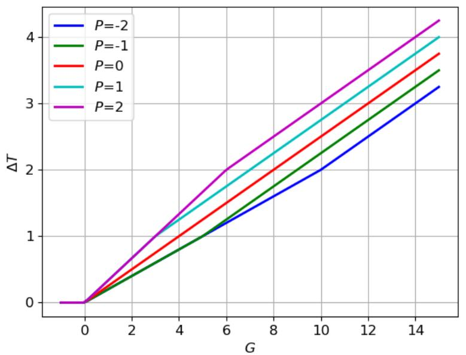

line

| G | P=-2 | P=-1 | P=0 | P=1 | P=2 |
|---|---|---|---|---|---|
| 0 | 0 | 0 | 0 | 0 | 0 |
| 6 | ~1.2 | ~1.3 | ~1.5 | ~1.7 | ~2.0 |
| 10 | 2.0 | ~2.2 | ~2.5 | ~2.7 | ~3.0 |
| 15 | ~3.3 | ~3.5 | ~3.8 | ~4.0 | ~4.3 |

Figure 15: The amount $\Delta T$ that needs to be sold from a portfolio paper with profit P, to pay for overall portfolio capital gains G, as derived in Eq. (18).

If a specific paper we are looking at has value V that is larger than the total amount required to sell according to our equations $V \geq \Delta T$, then all the tax necessary will be sold from that paper alone and we are done. Otherwise, we sell all of it and continue to the next paper.

When we sell a paper completely, the difference $\Delta T - V > 0$ is the tax that remains to be paid. So we continue to the next paper with the gains updated to $G = (\Delta T - V) / cgt$.

The order we choose to sell the papers is what we call the tax scheme. If we are free to choose which papers to sell, then the optimized scheme will sort the papers by least profitable to most profitable and start selling the least profitable paper to minimize total paid tax. If we are not free to choose the order of papers, such as in Israeli brokers, we have to use the FIFO scheme, which sells the papers by the order they were bought.

In the simulation engine, we keep track of all the papers of a specific stock separately. So when it is time to pay taxes for overall gains G, we actually assign each stock type a separate gain $fG$ (remember $\sum f = 1$) and let each stock type handle a separate chunk of gains to pay taxes for. This is a simplifying choice that is made due to our implementation of the simulation.

Summary of the algorithm:

1. We reach the end of the year with gains $G$. If $G < 0$ do nothing and continue to work on the next year, but if $G > 0$, we recognize that we need to generate the required amount for the tax and proceed using the tax scheme described above.

## Related notes

- [[Leveraged Etfs  A Risky Double That Doesn’T Multiply]] — the volatility-decay problem of daily-reset LETFs
- [[Leverage Aversion And Risk Parity]] — why leveraging a diversified portfolio can pay
- [[Portable Alpha  A Primer Itqalian Leather Sofa]] — leverage via futures as an alternative
- [[Return Stacking  Strategies For Overcoming A Low Return Environment]] — capital-efficient leverage in practice