# RETURN STACKING® :

# STRATEGIES FOR OVERCOMING

# A LOW RETURN ENVIRONMENT

## IN THIS REPORT

Stretched valuations in equities and fixed income imply depressed returns and higher potential volatility for traditional portfolios.  
Reaching for yield or increasing exposure to pro-cyclical assets may help compensate for low expected returns, but can increase portfolio risk.  
Reducing exposure to equities and bonds to accommodate non-correlated assets or alternative strategies may reduce risk, but at the expense of lower potential returns and painful tracking error.  
We introduce a novel investment concept, accessible to all investors, which is designed to seek higher returns with less risk and low tracking error by using new products which, in combination, can provide more than \$1 of exposure for every dollar invested.  
The proposed solution harnesses the full potential of traditional portfolios plus the opportunity for higher returns and risk reduction from non-correlated investments.  
This capital efficiency allows for the introduction of non-correlated return streams that stack on top of core portfolio exposures.  
We show how to maximize “Return Stacking®” opportunities by choosing alternative fund managers already engaging in capital efficient strategies.

## REACHING FOR YIELD  
## DIVERSIFIED RETURN STACKING  

natural_image

Illustration of coins being poured into a stack, showing a transformation from a large stack to a smaller stack (no text or symbols present)

## GRASPING FOR RETURNS

Stretched valuations in many stock and bond markets are challenging investors to look farther afield to meet investor return targets. Many investors find themselves recommending portfolios that are uncomfortably far out along the risk curve, stretching for higher yields and increasing pro-cyclical asset exposure.

Many thoughtful investors have eschewed this approach in favor of replacing stock and/or bond exposure with uncorrelated asset classes and alternative strategies. In practice, this approach often comes with the headwind fear of missing out (FOMO) as the returns from these portfolios are likely to deviate meaningfully from traditional portfolios. Despite an expectation that alternative exposures will introduce diversification benefits, many investors abandon diversifiers before they experience the expected pay-off. This behavior is especially common in periods when traditional portfolios have dominated for several years in a row.

Figure 1 - Illustrative life cycle of the Hiring and Firing of Alt managers  
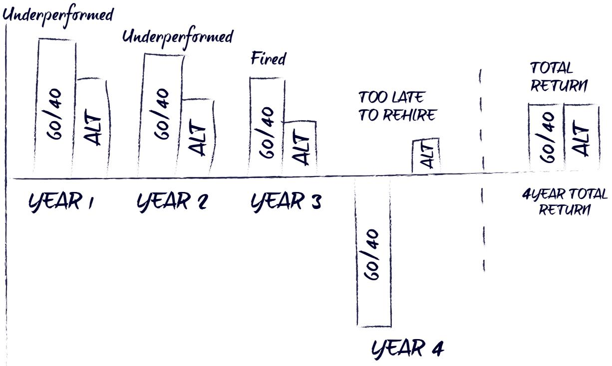

bar

| Category | 60/40 | ALT |
| --- | --- | --- |
| YEAR 1 | ~High | ~Medium |
| YEAR 2 | ~High | ~Medium |
| YEAR 3 | ~Medium | ~Low |
| YEAR 4 | ~Very Low | ~Low |
| 4 YEAR TOTAL RETURN | ~Medium | ~Medium |

Source: ReSolve Asset Management SEZC

## BENEFITS AND PITFALLS OF DIVERSIFICATION

Let’s first consider a typical contemporary portfolio consisting of a 70 percent allocation to a traditional 60/40 “balanced” portfolio, complemented by a 30 percent allocation to common alternative strategies. We will assume that both the original 60/40 portfolio and the alternative sleeve have Sharpe ratios of 0.5, but that the balanced sleeve is twice as volatile due to its large equity allocation. We will also assume that the correlation between the two is zero.

Figure 2 – Illustrative Example of Risk and Return Changes from Non-Correlated Strategies

<table><tr><td>Strategies</td><td>Expected Excess Return</td><td>Expected Volatility</td></tr><tr><td>Hypothetical Balanced Portfolio</td><td>6.0%</td><td>12.0%</td></tr><tr><td>Hypothetical Alternative Fund</td><td>3.0%</td><td>6.0%</td></tr><tr><td>Hypothetical 70% Balanced/30% Alternative</td><td>5.1%</td><td>8.6%</td></tr></table>

Return and Risk Changes to Alternative Addition  
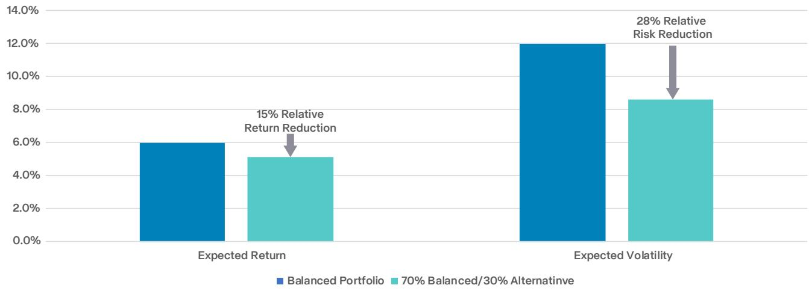

bar

| Category | Balanced Portfolio (%) | 70% Balanced/30% Alternative (%) | Relative Risk Reduction (%) |
| --- | --- | --- | --- |
| Expected Return | ~6.0 | ~5.1 | 15 |
| Expected Volatility | ~12.0 | ~8.6 | 28 |

Source: Analysis by ReSolve Asset Management SEZC. The results are hypothetical and for illustrative purposes only.

As expected, the addition of uncorrelated alternatives provides an attractive 28% relative risk reduction (3.4 percentage points reduction) in portfolio volatility. However, the portfolio suffers a 15% relative return reduction (0.9 percentage points reduction). This may be an unattractive tradeoff for many investors. Notwithstanding the issue of tracking error, it is clear why some investors are reluctant to reduce equity exposure to accommodate alternatives.

## HOW TO HAVE YOUR CAKE AND EAT IT TOO

The very core of Modern Portfolio Theory (MPT) states that investors should allocate to the portfolio that maximizes expected excess return per unit of risk. If this portfolio will not meet target returns (as may have been the case in our example in Figure 1), an investor should access geared exposure to this most efficient portfolio. For example, an investor who borrows 50% against the value of their investments and uses the proceeds to allocate 150 percent to the 60/40 portfolio would expect to earn materially higher returns than an investor in the 100 percent equity portfolio, with a similar amount of risk. In fact, a [[Why Not 100% Equity|150 percent allocation to the 60/40 portfolio]] substantially outperformed a 100 percent equity portfolio on both absolute and risk-adjusted terms, in backtested (1923 to 19961 ) and out-of-sample (1996 to 20212 ) time periods.

Figure 3 - Benefits of Diversification and Portfolio Scaling to Risk and Returns  
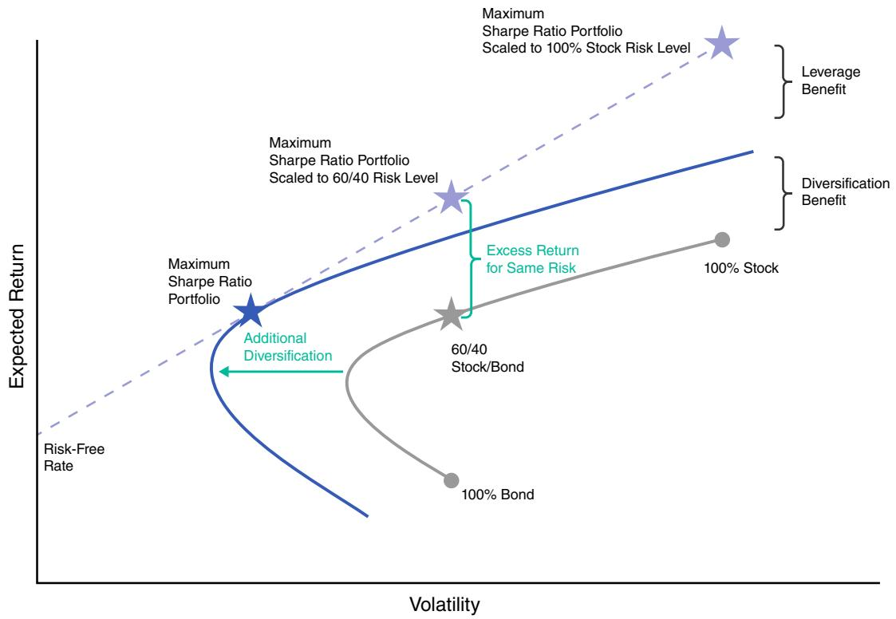

scatter

| Strategy | Volatility | Expected Return |
| --- | --- | --- |
| Maximum Sharpe Ratio Portfolio | Low | High |
| Maximum Sharpe Ratio Portfolio | Medium | High |
| Maximum Sharpe Ratio Portfolio | High | Very High |
| 60/40 Stock/Bond | Medium | Medium |
| 100% Bond | Medium | Low |

Source: Newfound Research

Investors looking for further validation of this approach may be surprised to find an advocate in none other than Warren Buffett. Buffett’s investment vehicle, Berkshire Hathaway, effectively borrows 60 cents for every dollar of invested capital to maintain an average 160 percent exposure to the diversified quality tilted investments in his portfolio.3

In the last decade or so, innovative global investment firms have accelerated their adoption of this technique to help investors meet required returns with acceptable risk. The products have a very successful history of using highly liquid, exchange traded financial derivatives to access bond or equity index exposure while investing the residual cash in slightly higher-yielding or longer-dated investments. The use of derivatives to provide core beta exposures and free up capital is called “capital efficiency.” The allocation of the residual capital to excess return sources we call Return Stacking.

## A PRACTICAL EXAMPLE AVAILABLE TODAY

Let us assume, for a moment, that we currently hold a 60/40 portfolio and want to implement a Return Stacking solution.

Enter the WisdomTree US Efficient Core ETF (“NTSX”), which provides 1.5x leverage to a 60% S&P 500 / 40% U.S. Treasury ladder portfolio. By allocating two-thirds of our assets to this fund, we achieve the same 60/40 exposure (2/3×1.5=1), but free up one-third of valuable portfolio real estate for deployment to other diversifying investments. In other words, just 67 cents invested in NTSX is effectively equivalent to \$1 invested in the Vanguard Balanced Fund (“VBINX”).4

Figure 4 – Comparison of VBINX vs NTSX Plus Cash  
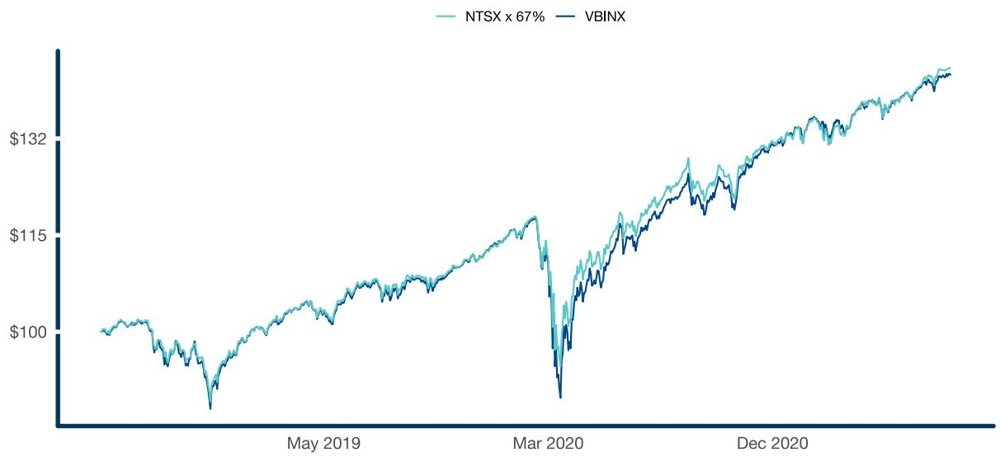

line

| Date | NTSX x 67% ($) | VBINX ($) |
| --- | --- | --- |
| May 2019 | ~100 | ~100 |
| Mar 2020 | ~100 | ~95 |
| Dec 2020 | ~138 | ~138 |

Source: Data from Tiingo, analysis by ReSolve Asset Management SEZC. Results are back-tested and hypothetical. Returns assume the reinvestment of all distributions and are gross of all fees, taxes, and trading costs. PAST PERFORMANCE IS NOT INDICATIVE OF FUTURE RESULTS. Portfolio construction: 66% WisdomTree US Efficient Core ETF (NTSX) and 33% left in zero-yielding cash rebalanced monthly.

Let us explore what else might be done to make efficient use of our excess capital. A very conservative investor might choose to take the remaining 1/3 of our capital and invest it in a short-term, high-quality corporate bond fund.

Figure 5 - Return Stacking 101  
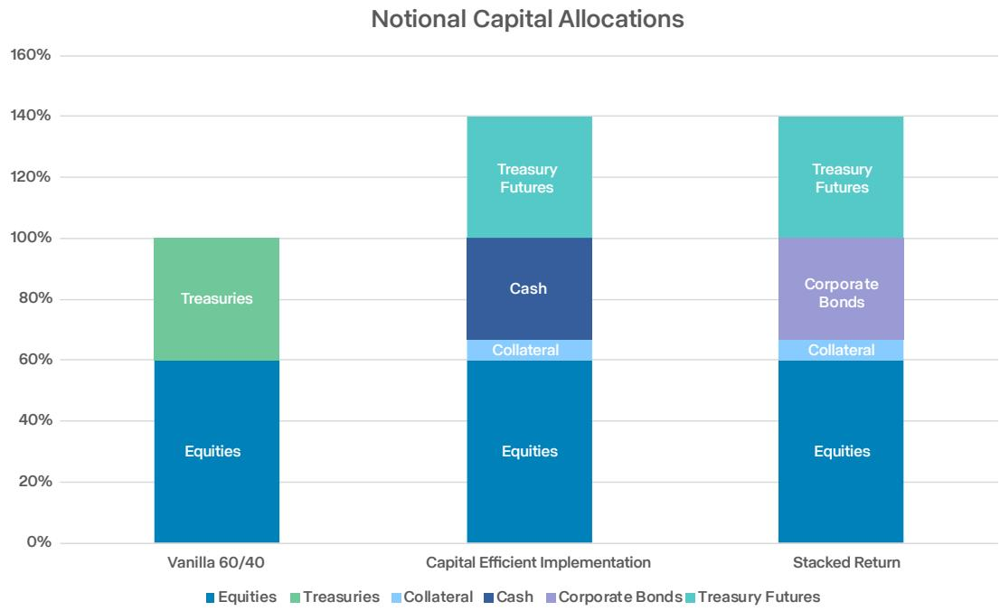

bar_stacked

| Category | Equities (%) | Treasuries (%) | Collateral (%) | Cash (%) | Corporate Bonds (%) | Treasury Futures (%) |
| --- | --- | --- | --- | --- | --- | --- |
| Vanilla 60/40 | 60 | 40 | 0 | 0 | 0 | 0 |
| Capital Efficient Implementation | 60 | 0 | ~5 | 30 | 0 | 40 |
| Stacked Return | 60 | 0 | ~5 | 0 | 30 | 40 |

Source: Newfound Research

We analyzed the performance of a “Vanilla” 60/40 portfolio against a Return Stacking portfolio with two-thirds of capital in NTSX and one-third in investment-grade corporate bonds, over the 20-year period ending June 2021.5 The Vanilla portfolio returned 6.9 percent annualized with an 8.6 percent annual volatility. The Return Stacking portfolio returned 7.7 percent annualized with 8.9 percent annual volatility. In other words, the latter approach increased annualized returns by 80 basis points, with just 30 basis points in extra volatility.

Figure 6 - Return Stacking 101 Results  
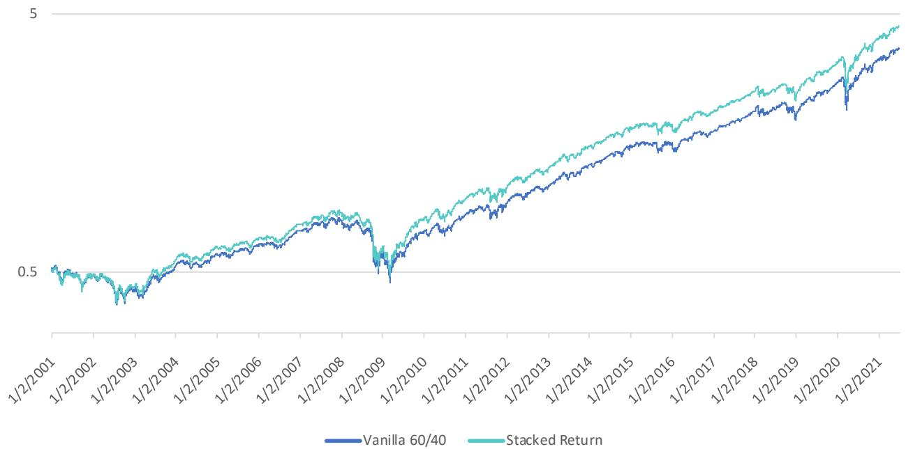

line

| Date | Vanilla 60/40 | Stacked Return |
| --- | --- | --- |
| 1/2/2001 | ~0.5 | ~0.5 |
| 1/2/2002 | ~0.45 | ~0.45 |
| 1/2/2003 | ~0.45 | ~0.45 |
| 1/2/2004 | ~0.55 | ~0.55 |
| 1/2/2005 | ~0.6 | ~0.6 |
| 1/2/2006 | ~0.65 | ~0.65 |
| 1/2/2007 | ~0.7 | ~0.7 |
| 1/2/2008 | ~0.75 | ~0.75 |
| 1/2/2009 | ~0.5 | ~0.55 |
| 1/2/2010 | ~0.65 | ~0.7 |
| 1/2/2011 | ~0.75 | ~0.8 |
| 1/2/2012 | ~0.85 | ~0.9 |
| 1/2/2013 | ~0.95 | ~1.0 |
| 1/2/2014 | ~1.05 | ~1.1 |
| 1/2/2015 | ~1.15 | ~1.2 |
| 1/2/2016 | ~1.25 | ~1.3 |
| 1/2/2017 | ~1.35 | ~1.4 |
| 1/2/2018 | ~1.45 | ~1.5 |
| 1/2/2019 | ~1.55 | ~1.6 |
| 1/2/2020 | ~1.65 | ~1.7 |
| 1/2/2021 | ~1.8 | ~1.9 |

Source: Tiingo and Stevens Futures. Calculations by Newfound Research. Results are back-tested and hypothetical. Returns assume the reinvestment of all distributions and are gross of all fees, taxes, and trading costs. PAST PERFORMANCE IS NOT INDICATIVE OF FUTURE RESULTS. The Vanilla Approach portfolio is 60% SPY, 13.33% VFISX, 13.33% VFITX, and 13.33% VUSTX rebalanced on a monthly basis. The Return Stacking portfolio is 66.66% an NTSX replication portfolio (90% SPY, 12.5% 2-year U.S. Treasury Futures, 12.5% 5-year U.S. Treasury futures, 12.5% 10-year U.S. Treasury futures, 12.5% 30-year U.S. Treasury futures, and 10.00% VFISX rebalanced monthly), and 33.33% VFSTX.

By taking advantage of the inexpensive and liquid capital efficiency embedded in NTSX, we can stack the returns of investment-grade credit on top of our 60/40 portfolio at the cost of the attractive financing rate embedded in the U.S. Treasury futures.

## MORE PRACTICAL EXAMPLES AND USES

Few investors will hold two-thirds of their portfolio in a single fund like NTSX. Fortunately, a growing number of capital efficient products have come to market in the last few years, including both isolated and mixed exposures. By using a combination of capital efficient funds, investors can optimize portfolio diversification and capital efficiency without resorting to imprudent levels of product concentration.

Figure 7 describes the fundamental exposures underlying nine such products. Note that total exposures for all funds are greater than 100 percent since they employ professionally managed leverage. (For full disclosure, the authors of this paper advise or sub-advise Products #1 and #2. Furthermore, due to regulatory requirements, the authors are unable to disclose the specific product names used in this paper.)

Figure 7 – Notional Allocations for Available Return Stacked Products  
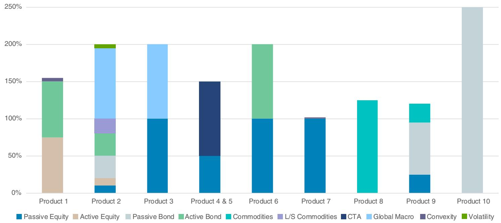

bar_stacked

| Category | Passive Equity (%) | Active Equity (%) | Passive Bond (%) | Active Bond (%) | Commodities (%) | L/S Commodities (%) | CTA (%) | Global Macro (%) | Convexity (%) | Volatility (%) |
| --- | --- | --- | --- | --- | --- | --- | --- | --- | --- | --- |
| Product 1 | 0 | ~75 | 0 | ~70 | 0 | 0 | 0 | 0 | ~5 | 0 |
| Product 2 | ~10 | ~10 | ~30 | ~30 | 0 | ~20 | 0 | ~90 | 0 | ~5 |
| Product 3 | 100 | 0 | 0 | 0 | 0 | 0 | 0 | ~90 | 0 | 0 |
| Product 4 & 5 | 50 | 0 | 0 | 0 | 0 | 0 | ~90 | 0 | 0 | 0 |
| Product 6 | 100 | 0 | 0 | ~90 | 0 | 0 | 0 | 0 | 0 | 0 |
| Product 7 | 100 | 0 | 0 | 0 | 0 | 0 | 0 | 0 | 0 | 0 |
| Product 8 | 0 | 0 | 125 | 0 | 0 | 0 | 0 | 0 | 0 | 0 |
| Product 9 | ~25 | 0 | ~65 | 0 | 0 | 0 | 0 | 0 | 0 | 0 |
| Product 10 | 0 | 0 | 250 | 0 | 0 | 0 | 0 | 0 | 0 | 0 |

Source: Newfound Research LLC. Notional allocations represent approximate averages estimated based on fund holdings and strategy descriptions. Actual exposure may substantially deviate from the estimates displayed here.

There are many ways these products can be mixed and matched to introduce Return Stacking. Investors may even use these vehicles to increase portfolio liquidity and flexibility by simply freeing up cash. This cash can be deployed opportunistically, used to meet distribution requirements, or be retained in expectation of future capital calls from private investments.

## SIMPLE PORTFOLIO EXAMPLE

Using the products above, we created a simple portfolio that provides exposure to a 60/40 portfolio while stacking alternative strategy returns on top. A key element in our product selection was to source funds whose alternative overlays have an expected, structurally driven low correlation to the 60/40 portfolio (see Figure 8 and 9). We then employed a simple heuristic approach, seeking to maintain the original 60/40 allocation while introducing diversifying exposures that may help bolster portfolio resilience to changes in inflation expectations and negative growth shocks. By maintaining the original 60/40 exposure, we can think of these diversifying allocations as an overlay.

With this design in mind, we optimized an allocation to the above products to produce a “look-through” exposure approximating 60 percent equity, 40 percent bonds, 30 percent CTA Managed Futures, and 30 percent Global Macro (Table 1). Finally, with target weights to each underlying strategy, we produced a hypothetical back-test to evaluate the potential character of the proposed solution (Table 2).

These two alternative categories were selected due to their embedded global diversification across traditional and nontraditional asset classes as well as their ability to go long and short. These levers can create structurally uncorrelated return streams to traditionally allocated portfolios. Moreover, decades of established research provide strong economic reasoning for their continued efficacy in providing both absolute return and structural diversification. Finally, while there are many alternative strategies one could consider, CTA Managed Futures and Systematic Global Macro are readily available in capital efficient fund structures.

Table 1: Product Weightings with Look Through to Their Notional Exposures

<table><tr><td>Capital Efficient Funds</td><td>Dollar Allocation</td><td>Equity</td><td>Bond</td><td>Managed Futures</td><td>Global Macro</td><td>Convexity</td><td>Volatility</td></tr><tr><td>Product 1</td><td>15.0%</td><td>11.3%</td><td>11.3%</td><td></td><td></td><td>0.8%</td><td></td></tr><tr><td>Product 2</td><td>15.0%</td><td>3.0%</td><td>9.0%</td><td>3.0%</td><td>14.3%</td><td></td><td>0.8%</td></tr><tr><td>Product 3</td><td>15.0%</td><td>15.0%</td><td></td><td></td><td>15.0%</td><td></td><td></td></tr><tr><td>Product 4</td><td>12.5%</td><td>6.3%</td><td></td><td>12.5%</td><td></td><td></td><td></td></tr><tr><td>Product 5</td><td>12.5%</td><td>6.3%</td><td></td><td>12.5%</td><td></td><td></td><td></td></tr><tr><td>Product 6</td><td>10.0%</td><td>10.0%</td><td>10.0%</td><td></td><td></td><td></td><td></td></tr><tr><td>Product 7</td><td>10.0%</td><td>10.0%</td><td></td><td></td><td></td><td>0.2%</td><td></td></tr><tr><td>Product 8</td><td>0.0%</td><td></td><td></td><td></td><td></td><td></td><td></td></tr><tr><td>Product 9</td><td>0.0%</td><td></td><td></td><td></td><td></td><td></td><td></td></tr><tr><td>Product 10</td><td>4.0%</td><td></td><td>10.0%</td><td></td><td></td><td></td><td></td></tr></table>

<table><tr><td colspan="7"></td><td>Total Notional Exposure</td></tr><tr><td>100.0%</td><td>61.9%</td><td>40.3%</td><td>28.0%</td><td>29.3%</td><td>1.0%</td><td>0.8%</td><td>161.3%</td></tr></table>

Figure 8: Daily Correlation Between All Portfolio Sleeves (January 2000- July 2021)  
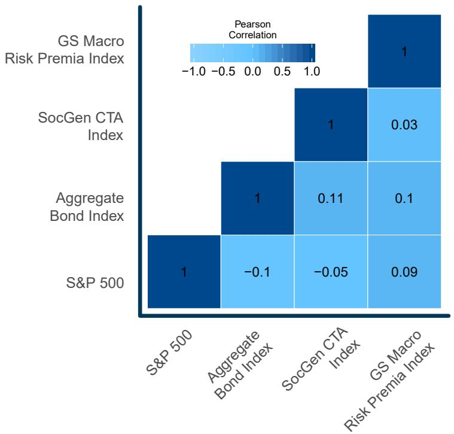

heatmap

|  | S&P 500 | Aggregate Bond Index | SocGen CTA Index | GS Macro Risk Premia Index |
| --- | --- | --- | --- | --- |
| S&P 500 | 1 | -0.1 | -0.05 | 0.09 |
| Aggregate Bond Index | 1 | 0.11 | 0.1 | — |
| SocGen CTA Index | 1 | 0.03 | — | — |
| GS Macro Risk Premia Index | 1 | — | — | 1 |

Source: Tiingo, SocGen, Goldman Sachs. Calculations by ReSolve Asset Management SEZC. S&P 500 is SPY, Aggregate Bond Index is VBMFX up to Sept 22, 2003 and AGG thereafter. PAST PERFORMANCE IS NOT INDICATIVE OF FUTURE RESULTS.

Figure 9: Daily Correlation Between Beta Portfolio and Overlay Portfolio – (Jan 2000-July 2021) - Simulated Performance  
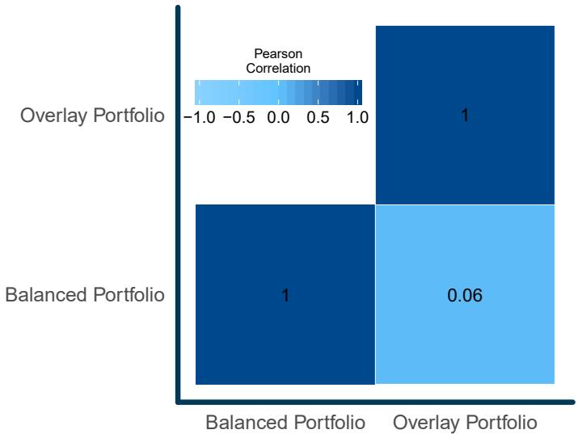

heatmap

|  | Balanced Portfolio | Overlay Portfolio |
| --- | --- | --- |
| Overlay Portfolio | — | 1 |
| Balanced Portfolio | 1 | 0.06 |

Source: Tiingo, SocGen, Goldman Sachs. Calculations by ReSolve Asset Management SEZC. Results are back-tested and hypothetical. Returns assume the reinvestment of all distributions and while each index used is net of their respective management fees and trading costs no taxes were deducted. PAST PERFORMANCE IS NOT INDICATIVE OF FUTURE RESULTS. The Balanced Portfolio is 60% SPY, 40% VBMFX up to Sept 22, 2003 and AGG ETF thereafter. The Overlay Portfolio is 30% SocGen CTA Index, 30% GS Macro Risk Premia Index (scaled to 10% volatility net of an additional 3% fee deduction), less -60% CBOE 13 Week Treasury Bill Yield Index. PAST PERFORMANCE IS NOT INDICATIVE OF FUTURE RESULTS.

Over the evaluation period, the Return Stacking and diversification benefits compounded into an annualized rate of return that is almost 4 percentage points per year higher than the original 60/40 portfolio.6

Table 2: Statistics of Balanced Portfolio vs Return Stacking Portfolio (Jan 2000-July 2021) - Simulated Performance

<table><tr><td>Statistics</td><td>Balanced Portfolio</td><td>Return Stacked Portfolio</td></tr><tr><td>Start Date</td><td>January 4, 2000</td><td>January 4, 2000</td></tr><tr><td>Annualized Return</td><td>6.47%</td><td>10.24%</td></tr><tr><td>Sharpe Ratio</td><td>0.47</td><td>0.72</td></tr><tr><td>Annualized Volatility</td><td>11.60%</td><td>12.40%</td></tr><tr><td>Max Drawdown</td><td>-34.70%</td><td>-29.40%</td></tr><tr><td>Positive Rolling Yrs</td><td>81.50%</td><td>87.60%</td></tr><tr><td>MAR</td><td>0.20</td><td>0.36</td></tr><tr><td>Return/Ulcer Ratio</td><td>0.81</td><td>1.86</td></tr><tr><td>Best Month</td><td>8.30%</td><td>8.30%</td></tr><tr><td>Worst Month</td><td>-10.40%</td><td>-8.60%</td></tr><tr><td>Best Year</td><td>21.90%</td><td>39.40%</td></tr><tr><td>Worst Year</td><td>-20.00%</td><td>-12.60%</td></tr></table>

Source: Tiingo, SocGen, Goldman Sachs. Calculations by ReSolve Asset Management SEZC. Results are back-tested and hypothetical. Returns assume the reinvestment of all distributions and while each index used is net of their respective management fees and trading costs no taxes were deducted. PAST PERFORMANCE IS NOT INDICATIVE OF FUTURE RESULTS. The Balanced Portfolio is 60% SPY, 40% VBMFX up to Sept 22, 2003 and AGG ETF thereafter. The Return Stacked Portfolio is 60% SPY, 40% AGG, 30% SocGen CTA Index, 30% GS Macro Risk Premia Index (scaled to 10% volatility net of an additional 3% fee deduction), less -60% CBOE 13 Week Treasury Bill Yield Index.

Furthermore, the Return Stacking portfolio outperformed the balanced portfolio in 18 out of 21 years, significantly reducing the FOMO that investors face when deploying diversifying exposures in a traditional way.

Figure 10: Calendar Year Bar Chart  
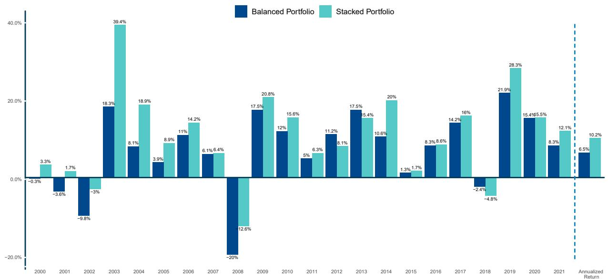

bar

| Year | Balanced Portfolio (%) | Stacked Portfolio (%) |
| --- | --- | --- |
| 2000 | -0.3 | 3.3 |
| 2001 | -3.6 | 1.7 |
| 2002 | -9.8 | -3 |
| 2003 | 18.3 | 39.4 |
| 2004 | 8.1 | 18.9 |
| 2005 | 3.9 | 8.9 |
| 2006 | 11 | 14.2 |
| 2007 | 6.1 | 6.4 |
| 2008 | -20 | -12.6 |
| 2009 | 17.5 | 20.8 |
| 2010 | 12 | 15.6 |
| 2011 | 5 | 6.3 |
| 2012 | 11.2 | 8.1 |
| 2013 | 17.5 | 15.4 |
| 2014 | 10.6 | 20 |
| 2015 | 1.3 | 1.7 |
| 2016 | 8.3 | 8.6 |
| 2017 | 14.2 | 16 |
| 2018 | -2.4 | -4.8 |
| 2019 | 21.9 | 28.3 |
| 2020 | 15.4 | 15.5 |
| 2021 | 8.3 | 12.1 |
| Annualized Return | 6.5 | 10.2 |

Source: Tiingo, SocGen, Goldman Sachs. Calculations by ReSolve Asset Management SEZC. Results are back-tested and hypothetical. Returns assume the reinvestment of all distributions and while each index used is net of their respective management fees and trading costs no taxes were deducted. PAST PERFORMANCE IS NOT INDICATIVE OF FUTURE RESULTS. The Balanced Portfolio is 60% SPY, 40% VBMFX up to Sept 22, 2003 and AGG ETF thereafter. The Return Stacked Portfolio is 60% SPY, 40% AGG, 30% SocGen CTA Index, 30% GS Macro Risk Premia Index (scaled to 10% volatility net of an additional 3% fee deduction), less -60% CBOE 13 Week Treasury Bill Yield Index.

## RETURN STACKING OR RISK STACKING?

There is no denying that the proposed Return Stacking solution described above requires the use of leverage, and that leverage is often thought of by many as “inviting disaster.”7 Indeed, excessive, concentrated leverage may do just that. However, prudent, professionally managed leverage introduced to accommodate economically diversifying exposures may have precisely the opposite effect!

We can see this from Table 2 that despite employing leverage, the portfolio maintained a similar maximum drawdown profile and achieved a Return/Ulcer Ratio8 double that of the 60/40 portfolio. This holds true throughout the 21 year period during which the Return Stacked portfolio exhibited a drawdown and recovery profile similar to the balanced portfolio despite being levered by an additional 60%.

## Figure 11: 12 Month Rolling Drawdown and Time-to-Recovery

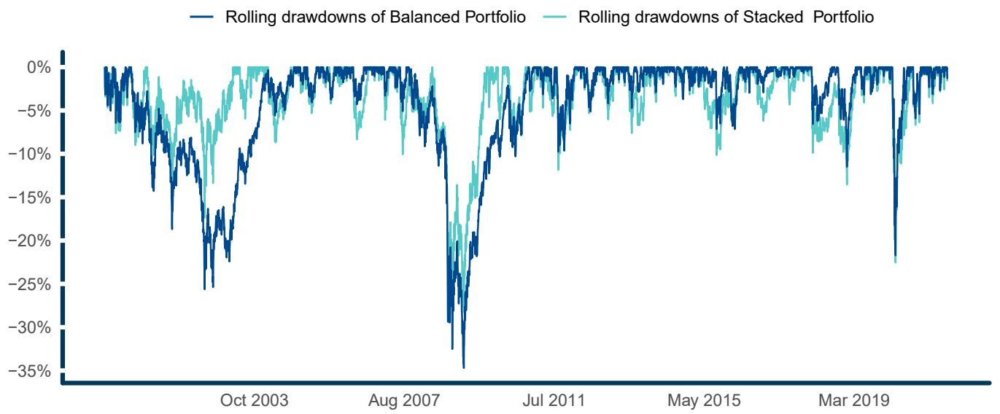

line

| Date | Rolling drawdowns of Balanced Portfolio (%) | Rolling drawdowns of Stacked Portfolio (%) |
| --- | --- | --- |
| Oct 2003 | ~-5 | ~-5 |
| Aug 2007 | ~-5 | ~-5 |
| Jul 2011 | ~-5 | ~-5 |
| May 2015 | ~-5 | ~-5 |
| Mar 2019 | ~-5 | ~-5 |

Source: Tiingo, SocGen, Goldman Sachs. Calculations by ReSolve Asset Management SEZC. Results are back-tested and hypothetical. Returns assume the reinvestment of all distributions and while each index used is net of their respective management fees and trading costs no taxes were deducted. PAST PERFORMANCE IS NOT INDICATIVE OF FUTURE RESULTS. The Balanced Portfolio is 60% SPY, 40% VBMFX up to Sept 22, 2003 and AGG ETF thereafter. The Return Stacked Portfolio is 60% SPY, 40% AGG, 30% SocGen CTA Index, 30% GS Macro Risk Premia Index (scaled to 10% volatility net of an additional 3% fee deduction), less -60% CBOE 13 Week Treasury Bill Yield Index.

While some of the products above include embedded convexity and volatility overlays, due to complexities in replicating these positions, we have elected to ignore them. However, as the failure of diversification can be a common feature during acute market crashes, these overlays may help further mitigate maximum drawdown metrics. Hence, the inclusion of tail hedge stacking may be an important consideration for levered portfolios.

Finally, this portfolio is not meant to be prescriptive. Rather, it offers a simple example of what is possible with a little imagination. Investors are no longer compelled to seek returns by climbing the equity risk curve, since they are liberated to experiment with increasing portfolio real estate and return stacking opportunities at a level of risk that they are comfortable with.

## RETURN STACKING OR FEE STACKING?

In a low return regime, fees are a powerful arbiter of long-term returns. While the Vanguard Balanced Fund (“VBIAX”) has an expense ratio of 0.07 percent, the Return Stacking example portfolio above implies a blended expense ratio of 1.29 percent. It is reasonable to ask: is the Return Stacking solution worth the excess fees? We are confident that the advantages conferred via thoughtful application of capital efficient Return Stacking vastly outweigh the marginal costs:

- Managed access to leverage. The Return Stacking portfolio provides cost-efficient leverage without requiring the end investor to directly manage any derivative positions within their account.  
- Increased exposure. By providing \$1.60 of exposure for each dollar invested, the fee per dollar of exposure declines to 0.81 percent (1.29 / 1.6).  
- Increased diversification. Diversifying exposures are designed to provide steady and offsetting returns during growth and inflation shocks hostile to traditional stock and bond portfolios.  
- Rebalancing benefits. Rebalancing across diversified portfolio components may bolster compound growth rates through an added rebalancing premium.

## SUMMARY

In any environment, capital efficiency taps into best practices for portfolio construction used by many of the world’s leading institutional investors. The concept combines diversification with the prudent application of professionally managed leverage to pursue superior risk-adjusted returns.

In a low return environment, it may be a highly effective tool to allow investors to free up portfolio real estate. This newly found real estate can be used to increase portfolio liquidity and flexibility, or for allocating to diversifying exposures and Return Stacking.

In this paper, we proposed a model portfolio that sought to implement return stacking with diversifying, alternative exposures. This model is by no means prescriptive: it was designed with an absolute return objective and to use only the open-end funds that offer capital efficiency available at the time of writing. The flexibility of return stacking, however, allows investors to express their own particular views and objectives. For example, if tracking error is not an issue for the investor, freed-up capital can be allocated to other liquid asset classes (e.g. commodities, REITs, and cryptocurrencies) or other alternatives (e.g. long/short equity, event-driven strategies, and private credit).

The greatest concern to adopting Return Stacking is a rapid collapse in diversification during extreme market events. Investors should therefore maintain prudent leverage limits and focus on introducing economically diversifying assets and mechanically uncorrelated strategies. Severe market crises, however, can lead to unexpected and rapid deleveraging cycles, so we believe it prudent to consider how tail hedging strategies, such as those embedded in some of the products presented, can be incorporated into the asset allocation mix.

While such an approach has historically been out of reach for most investors, new fund strategies have come to market that provide investors with a mosaic of capital efficient exposures. With thoughtful application, forward-thinking advisors and investors now have the power to meet required returns with greater confidence in any market environment.

## APPENDIX ADDITIONAL RISK AND RETURN METRICS AND EXTENDED DATA

Figure 12: Growth of \$100 – Balanced vs Return Stacked Portfolio – SIMULATED PERFORMANCE.  
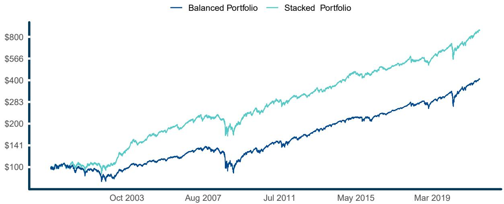

line

| Date | Balanced Portfolio ($) | Stacked Portfolio ($) |
| --- | --- | --- |
| Oct 2003 | ~100 | ~100 |
| Aug 2007 | ~130 | ~220 |
| Jul 2011 | ~140 | ~280 |
| May 2015 | ~220 | ~450 |
| Mar 2019 | ~350 | ~700 |

Source: Tiingo, SocGen, Goldman Sachs. Calculations by ReSolve Asset Management SEZC. Results are back-tested and hypothetical. Returns assume the reinvestment of all distributions and while each index used is net of their respective management fees and trading costs no taxes were deducted. PAST PERFORMANCE IS NOT INDICATIVE OF FUTURE RESULTS. The Balanced Portfolio is 60% SPY, 40% VBMFX up to Sept 22, 2003 and AGG ETF thereafter. The Return Stacked Portfolio is 60% SPY, 40% AGG, 30% SocGen CTA Index, 30% GS Macro Risk Premia Index (scaled to 10% volatility net of an additional 3% fee deduction), less -60% CBOE 13 Week Treasury Bill Yield Index.

Table 3: Monthly Return Table - SIMULATED PERFORMANCE

<table><tr><td>Date</td><td></td><td>Jan</td><td>Feb</td><td>Mar</td><td>Apr</td><td>May</td><td>Jun</td><td>Jul</td><td>Aug</td><td>Sep</td><td>Oct</td><td>Nov</td><td>Dec</td><td>Year</td><td>Difference</td></tr><tr><td rowspan="2">2021</td><td>Stacked</td><td>-1.27%</td><td>1.91%</td><td>2.74%</td><td>4.80%</td><td>1.85%</td><td>1.86%</td><td>-0.28%</td><td></td><td></td><td></td><td></td><td></td><td>12.08%</td><td rowspan="2">3.76%</td></tr><tr><td>Balanced</td><td>-0.88%</td><td>1.06%</td><td>2.25%</td><td>3.46%</td><td>0.49%</td><td>1.68%</td><td>0.04%</td><td></td><td></td><td></td><td></td><td></td><td>8.32%</td></tr><tr><td rowspan="2">2020</td><td>Stacked</td><td>1.44%</td><td>-5.03%</td><td>-5.18%</td><td>6.11%</td><td>2.39%</td><td>0.71%</td><td>4.60%</td><td>3.09%</td><td>-3.11%</td><td>-1.98%</td><td>8.29%</td><td>4.18%</td><td>15.48%</td><td rowspan="2">0.08%</td></tr><tr><td>Balanced</td><td>0.80%</td><td>-4.16%</td><td>-7.14%</td><td>8.33%</td><td>3.16%</td><td>1.41%</td><td>4.06%</td><td>3.80%</td><td>-2.25%</td><td>-1.68%</td><td>6.94%</td><td>2.25%</td><td>15.40%</td></tr><tr><td rowspan="2">2019</td><td>Stacked</td><td>4.54%</td><td>2.40%</td><td>3.86%</td><td>3.64%</td><td>-3.98%</td><td>6.13%</td><td>2.38%</td><td>2.09%</td><td>-0.49%</td><td>0.48%</td><td>2.77%</td><td>1.70%</td><td>28.26%</td><td rowspan="2">6.39%</td></tr><tr><td>Balanced</td><td>5.15%</td><td>1.89%</td><td>1.95%</td><td>2.36%</td><td>-3.12%</td><td>4.59%</td><td>0.98%</td><td>0.15%</td><td>0.93%</td><td>1.43%</td><td>2.15%</td><td>1.72%</td><td>21.87%</td></tr><tr><td rowspan="2">2018</td><td>Stacked</td><td>4.25%</td><td>-5.36%</td><td>-0.48%</td><td>-0.83%</td><td>0.53%</td><td>0.84%</td><td>1.40%</td><td>3.53%</td><td>-0.62%</td><td>-5.35%</td><td>0.30%</td><td>-2.60%</td><td>-4.77%</td><td rowspan="2">-2.39%</td></tr><tr><td>Balanced</td><td>2.89%</td><td>-2.52%</td><td>-1.35%</td><td>-0.04%</td><td>1.73%</td><td>0.39%</td><td>2.20%</td><td>2.14%</td><td>0.11%</td><td>-4.40%</td><td>1.35%</td><td>-4.55%</td><td>-2.38%</td></tr><tr><td rowspan="2">2017</td><td>Stacked</td><td>1.52%</td><td>2.94%</td><td>0.78%</td><td>1.27%</td><td>1.57%</td><td>-2.41%</td><td>1.66%</td><td>1.04%</td><td>0.03%</td><td>3.45%</td><td>2.33%</td><td>0.88%</td><td>16.00%</td><td rowspan="2">1.82%</td></tr><tr><td>Balanced</td><td>1.16%</td><td>2.61%</td><td>0.06%</td><td>0.97%</td><td>1.13%</td><td>0.38%</td><td>1.37%</td><td>0.56%</td><td>0.98%</td><td>1.45%</td><td>1.77%</td><td>0.92%</td><td>14.18%</td></tr><tr><td rowspan="2">2016</td><td>Stacked</td><td>-0.14%</td><td>3%</td><td>2.93%</td><td>-0.40%</td><td>0%</td><td>4.39%</td><td>2.90%</td><td>-1.52%</td><td>-0.93%</td><td>-2.51%</td><td>0.35%</td><td>0.98%</td><td>8.55%</td><td rowspan="2">0.24%</td></tr><tr><td>Balanced</td><td>-2.49%</td><td>0.34%</td><td>4.36%</td><td>0.35%</td><td>1.04%</td><td>1.02%</td><td>2.41%</td><td>-0.01%</td><td>0.04%</td><td>-1.36%</td><td>1.15%</td><td>1.32%</td><td>8.31%</td></tr><tr><td rowspan="2">2015</td><td>Stacked</td><td>1.53%</td><td>2.29%</td><td>0.61%</td><td>-2.21%</td><td>0.54%</td><td>-3.89%</td><td>3.38%</td><td>-4.23%</td><td>-0.54%</td><td>4.95%</td><td>1.47%</td><td>-1.72%</td><td>1.76%</td><td rowspan="2">0.48%</td></tr><tr><td>Balanced</td><td>-0.95%</td><td>2.98%</td><td>-0.78%</td><td>0.47%</td><td>0.60%</td><td>-1.63%</td><td>1.72%</td><td>-3.76%</td><td>-1.16%</td><td>5.07%</td><td>0.08%</td><td>-1.08%</td><td>1.28%</td></tr><tr><td rowspan="2">2014</td><td>Stacked</td><td>-1.78%</td><td>2.72%</td><td>0.10%</td><td>1.68%</td><td>3.42%</td><td>1.59%</td><td>-0.96%</td><td>4.55%</td><td>-0.34%</td><td>2.06%</td><td>3.99%</td><td>2%</td><td>19.97%</td><td rowspan="2">9.34%</td></tr><tr><td>Balanced</td><td>-1.51%</td><td>2.88%</td><td>0.45%</td><td>0.77%</td><td>1.87%</td><td>1.21%</td><td>-0.90%</td><td>2.83%</td><td>-1.06%</td><td>1.88%</td><td>1.91%</td><td>-0.06%</td><td>10.63%</td></tr><tr><td rowspan="2">2013</td><td>Stacked</td><td>3.36%</td><td>1.05%</td><td>2.87%</td><td>2.74%</td><td>-0.78%</td><td>-2.35%</td><td>2.34%</td><td>-3.06%</td><td>1.60%</td><td>3.40%</td><td>2.11%</td><td>1.37%</td><td>15.38%</td><td rowspan="2">-2.17%</td></tr><tr><td>Balanced</td><td>2.80%</td><td>1.02%</td><td>2.31%</td><td>1.56%</td><td>0.61%</td><td>-1.41%</td><td>3.19%</td><td>-2.12%</td><td>2.35%</td><td>3.11%</td><td>1.68%</td><td>1.33%</td><td>17.55%</td></tr><tr><td rowspan="2">2012</td><td>Stacked</td><td>3.13%</td><td>2.89%</td><td>1.41%</td><td>-0.10%</td><td>-1.95%</td><td>0.21%</td><td>1.94%</td><td>1.25%</td><td>0.97%</td><td>-2.13%</td><td>0.02%</td><td>0.37%</td><td>8.15%</td><td rowspan="2">-3.06%</td></tr><tr><td>Balanced</td><td>3.07%</td><td>2.59%</td><td>1.70%</td><td>-0.02%</td><td>-3.21%</td><td>2.46%</td><td>1.28%</td><td>1.51%</td><td>1.64%</td><td>-1.10%</td><td>0.47%</td><td>0.45%</td><td>11.21%</td></tr><tr><td rowspan="2">2011</td><td>Stacked</td><td>1.97%</td><td>3.03%</td><td>-0.39%</td><td>4.22%</td><td>-1.82%</td><td>-1.78%</td><td>0.16%</td><td>-3.16%</td><td>-2.27%</td><td>4.68%</td><td>0.13%</td><td>1.76%</td><td>6.34%</td><td rowspan="2">1.38%</td></tr><tr><td>Balanced</td><td>1.37%</td><td>2.20%</td><td>-0.05%</td><td>2.37%</td><td>-0.17%</td><td>-1.16%</td><td>-0.52%</td><td>-2.49%</td><td>-3.83%</td><td>6.58%</td><td>-0.28%</td><td>1.21%</td><td>4.96%</td></tr><tr><td rowspan="2">2010</td><td>Stacked</td><td>-2.63%</td><td>2.33%</td><td>5.54%</td><td>2.53%</td><td>-4.33%</td><td>-3.88%</td><td>4.00%</td><td>-1.37%</td><td>6.11%</td><td>4.52%</td><td>-1.81%</td><td>4.37%</td><td>15.59%</td><td rowspan="2">3.60%</td></tr><tr><td>Balanced</td><td>-1.62%</td><td>1.97%</td><td>3.61%</td><td>1.35%</td><td>-4.34%</td><td>-2.38%</td><td>4.45%</td><td>-2.18%</td><td>5.32%</td><td>2.35%</td><td>-0.31%</td><td>3.69%</td><td>11.99%</td></tr><tr><td rowspan="2">2009</td><td>Stacked</td><td>-5.95%</td><td>-5.32%</td><td>6.03%</td><td>5.80%</td><td>4.08%</td><td>-0.41%</td><td>5.77%</td><td>3.63%</td><td>3.65%</td><td>-2.43%</td><td>5.80%</td><td>-0.51%</td><td>20.81%</td><td rowspan="2">3.29%</td></tr><tr><td>Balanced</td><td>-5.64%</td><td>-6.87%</td><td>5.62%</td><td>6.18%</td><td>3.83%</td><td>0.19%</td><td>5%</td><td>2.74%</td><td>2.62%</td><td>-1.02%</td><td>4.21%</td><td>0.39%</td><td>17.52%</td></tr><tr><td rowspan="2">2008</td><td>Stacked</td><td>-1.35%</td><td>0.29%</td><td>-1.45%</td><td>3.23%</td><td>1.82%</td><td>-4.77%</td><td>-1.90%</td><td>0.86%</td><td>-5.86%</td><td>-8.63%</td><td>-0.32%</td><td>5.58%</td><td>-12.59%</td><td rowspan="2">7.37%</td></tr><tr><td>Balanced</td><td>-2.72%</td><td>-1.58%</td><td>-0.39%</td><td>3.02%</td><td>0.42%</td><td>-5.12%</td><td>-0.32%</td><td>1.27%</td><td>-6.21%</td><td>-10.38%</td><td>-2.64%</td><td>3.50%</td><td>-19.96%</td></tr><tr><td rowspan="2">2007</td><td>Stacked</td><td>0.60%</td><td>-1.48%</td><td>0.58%</td><td>4.24%</td><td>3.60%</td><td>-0.79%</td><td>-2.94%</td><td>-1.05%</td><td>4.20%</td><td>2.42%</td><td>-2.08%</td><td>-0.77%</td><td>6.37%</td><td rowspan="2">0.25%</td></tr><tr><td>Balanced</td><td>0.88%</td><td>-0.51%</td><td>0.63%</td><td>2.88%</td><td>1.66%</td><td>-1.01%</td><td>-1.44%</td><td>1.35%</td><td>2.59%</td><td>1.25%</td><td>-1.56%</td><td>-0.64%</td><td>6.12%</td></tr><tr><td rowspan="2">2006</td><td>Stacked</td><td>2.70%</td><td>0.69%</td><td>1.12%</td><td>1.35%</td><td>-3.58%</td><td>-0.94%</td><td>0.30%</td><td>3.14%</td><td>2.46%</td><td>2.45%</td><td>1.87%</td><td>2.02%</td><td>14.24%</td><td rowspan="2">3.21%</td></tr><tr><td>Balanced</td><td>1.42%</td><td>0.42%</td><td>0.64%</td><td>0.70%</td><td>-1.88%</td><td>0.09%</td><td>0.86%</td><td>1.95%</td><td>2.03%</td><td>2.16%</td><td>1.63%</td><td>0.56%</td><td>11.03%</td></tr><tr><td rowspan="2">2005</td><td>Stacked</td><td>-1.49%</td><td>1.19%</td><td>-0.98%</td><td>-0.86%</td><td>3.39%</td><td>2.12%</td><td>1.62%</td><td>-0.19%</td><td>2.07%</td><td>-2.35%</td><td>4.99%</td><td>-0.66%</td><td>8.94%</td><td rowspan="2">5.00%</td></tr><tr><td>Balanced</td><td>-1.15%</td><td>1.11%</td><td>-1.48%</td><td>-0.42%</td><td>2.27%</td><td>0.45%</td><td>1.86%</td><td>-0.08%</td><td>0.11%</td><td>-1.79%</td><td>2.77%</td><td>0.34%</td><td>3.94%</td></tr><tr><td rowspan="2">2004</td><td>Stacked</td><td>3.03%</td><td>5.86%</td><td>-1.77%</td><td>-4.56%</td><td>0.53%</td><td>2.65%</td><td>-0.18%</td><td>0.32%</td><td>1.99%</td><td>2.21%</td><td>4.86%</td><td>2.91%</td><td>18.86%</td><td rowspan="2">10.79%</td></tr><tr><td>Balanced</td><td>1.38%</td><td>1.28%</td><td>-0.50%</td><td>-2.24%</td><td>0.88%</td><td>1.41%</td><td>-1.57%</td><td>0.81%</td><td>0.82%</td><td>1.14%</td><td>2.35%</td><td>2.13%</td><td>8.07%</td></tr><tr><td rowspan="2">2003</td><td>Stacked</td><td>1.94%</td><td>2.55%</td><td>-1.45%</td><td>8.22%</td><td>6%</td><td>1.83%</td><td>-0.49%</td><td>2.58%</td><td>-0.14%</td><td>5.70%</td><td>1.76%</td><td>5.29%</td><td>39.44%</td><td rowspan="2">21.14%</td></tr><tr><td>Balanced</td><td>-1.36%</td><td>-0.26%</td><td>0.16%</td><td>5.40%</td><td>4.05%</td><td>0.61%</td><td>-0.28%</td><td>1.48%</td><td>0.33%</td><td>2.81%</td><td>0.81%</td><td>3.40%</td><td>18.30%</td></tr><tr><td rowspan="2">2002</td><td>Stacked</td><td>1.10%</td><td>-1.29%</td><td>1.57%</td><td>-3.03%</td><td>2.77%</td><td>-3.54%</td><td>-4.11%</td><td>3.69%</td><td>-4.76%</td><td>3.15%</td><td>3.90%</td><td>-1.92%</td><td>-3.01%</td><td rowspan="2">6.83%</td></tr><tr><td>Balanced</td><td>-0.24%</td><td>-0.67%</td><td>1.37%</td><td>-2.83%</td><td>0.02%</td><td>-4.32%</td><td>-4.42%</td><td>1.21%</td><td>-5.78%</td><td>4.79%</td><td>3.67%</td><td>-2.52%</td><td>-9.84%</td></tr><tr><td rowspan="2">2001</td><td>Stacked</td><td>4.95%</td><td>-5.43%</td><td>-0.60%</td><td>2.24%</td><td>0.42%</td><td>-0.68%</td><td>-0.82%</td><td>-1.48%</td><td>-4.32%</td><td>3.78%</td><td>2.39%</td><td>1.76%</td><td>1.70%</td><td rowspan="2">5.30%</td></tr><tr><td>Balanced</td><td>3.43%</td><td>-5.48%</td><td>-3.10%</td><td>4.12%</td><td>0.80%</td><td>-1.22%</td><td>0.34%</td><td>-3.13%</td><td>-4.58%</td><td>1.59%</td><td>4.05%</td><td>0.12%</td><td>-3.60%</td></tr><tr><td rowspan="2">2000</td><td>Stacked</td><td>1.62%</td><td>0.85%</td><td>4.78%</td><td>-2.69%</td><td>-1.10%</td><td>1.92%</td><td>-1.15%</td><td>5.33%</td><td>-4.85%</td><td>0.08%</td><td>-0.93%</td><td>3.18%</td><td>5.05%</td><td rowspan="2">5.36%</td></tr><tr><td>Balanced</td><td>-2.27%</td><td>-0.41%</td><td>6.42%</td><td>-2.20%</td><td>-0.96%</td><td>2.11%</td><td>-0.63%</td><td>4.49%</td><td>-3.02%</td><td>0.01%</td><td>-3.89%</td><td>0.54%</td><td>-0.31%</td></tr></table>

Source: Tiingo, SocGen, Goldman Sachs. Calculations by ReSolve Asset Management SEZC. Results are back-tested and hypothetical. Returns assume the reinvestment of all distributions and while each index used is net of their respective management fees and trading costs no taxes were deducted. PAST PERFORMANCE IS NOT INDICATIVE OF FUTURE RESULTS. The Balanced Portfolio is 60% SPY, 40% VBMFX up to Sept 22, 2003 and AGG ETF thereafter. The Return Stacked Portfolio is 60% SPY, 40% AGG, 30% SocGen CTA Index, 30% GS Macro Risk Premia Index (scaled to 10% volatility net of an additional 3% fee deduction), less -60% CBOE 13 Week Treasury Bill Yield Index.

## Related notes

- [[Portable Alpha  A Primer Itqalian Leather Sofa]] — the same idea, at primer level
- [[Leverage Aversion And Risk Parity]] — risk parity and leverage
- [[Why Not 100% Equity]] — the levered 60/40 case
- [[Alternative Thinking Why Do Most Investors Choose Concentration Over Leverage]] — concentration vs. leverage