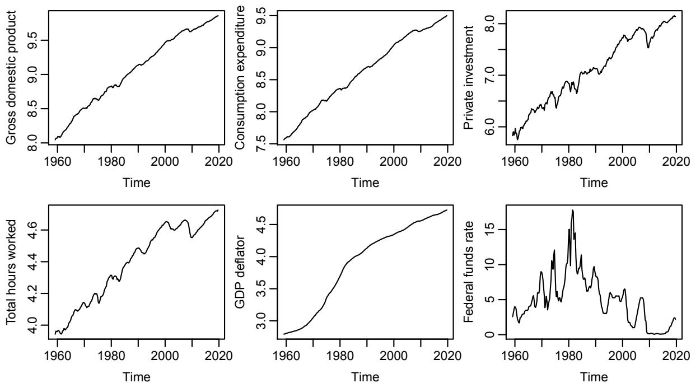
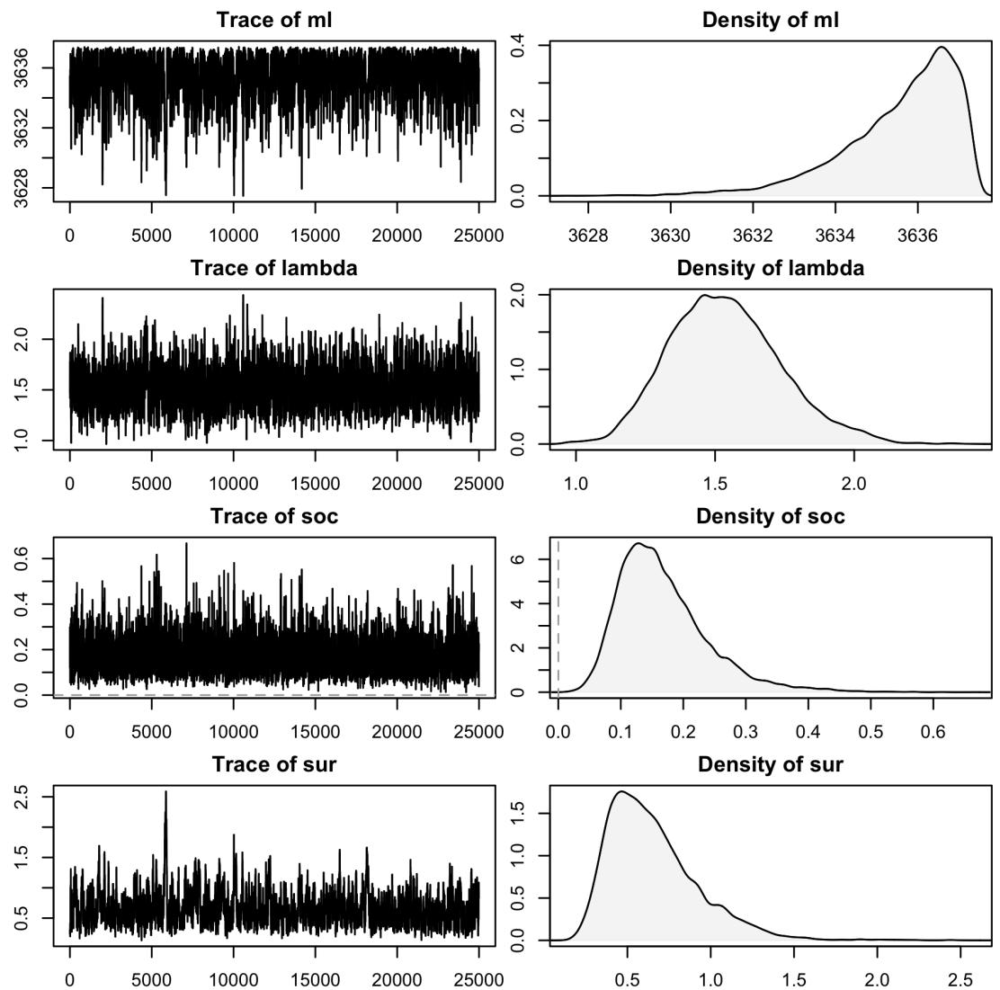
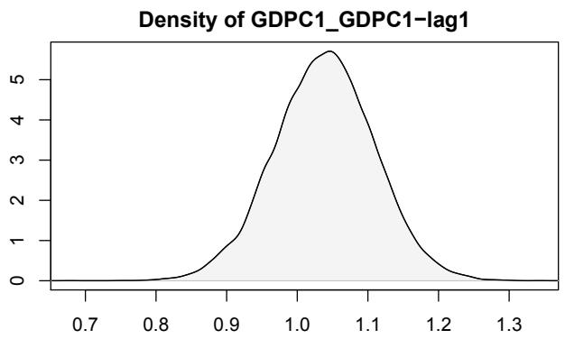
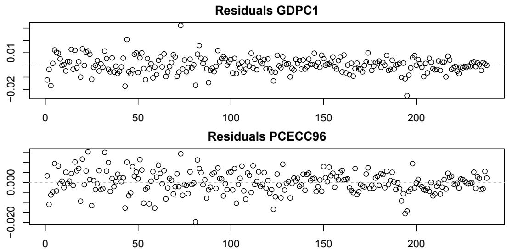
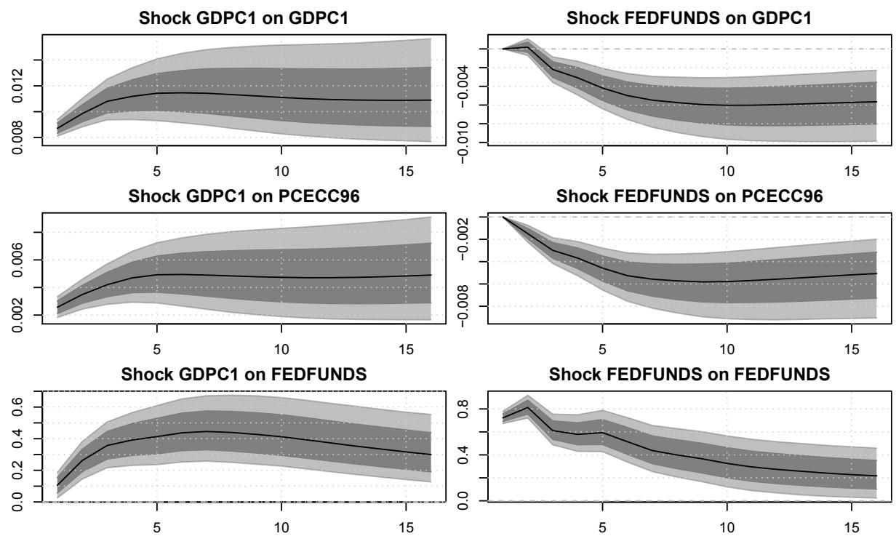
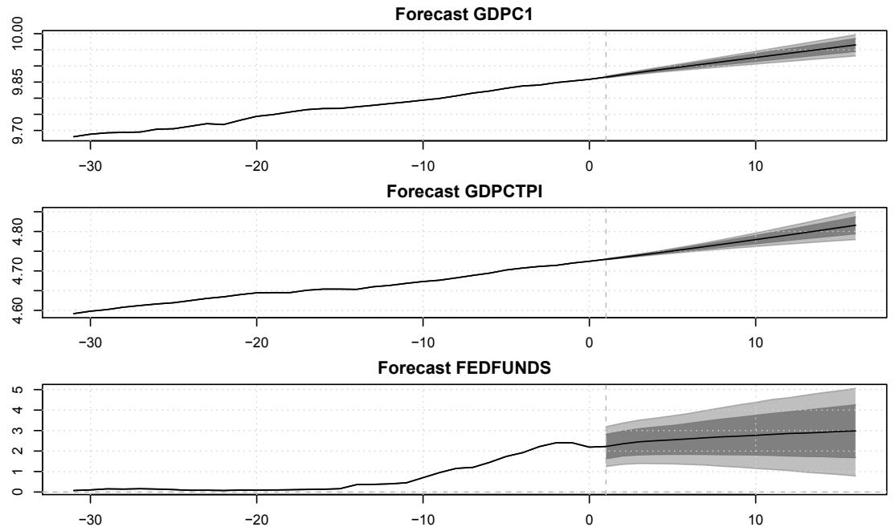

# BVAR: Bayesian Vector Autoregressions with Hierarchical Prior Selection in R

## Abstract

Vector autoregression (VAR) models are widely used for multivariate time series analysis in macroeconomics, finance, and related fields. Bayesian methods are often employed to deal with their dense parameterization, imposing structure on model coefficients via prior information. The optimal choice of the degree of informativeness implied by these priors is subject of much debate and can be approached via hierarchical modeling. This paper introduces BVAR, an R package dedicated to the estimation of Bayesian VAR models with hierarchical prior selection. It implements functionalities and options that permit addressing a wide range of research problems while retaining an easy-to-use and transparent interface. Features include structural analysis of impulse responses, forecasts, the most commonly used conjugate priors, as well as a framework for defining custom dummy-observation priors. BVAR makes Bayesian VAR models user-friendly and provides an accessible reference implementation.

Keywords: vector autoregression, VAR, multivariate, time series, macroeconomics, structural analysis, hierarchical model, forecast, impulse response, identification, Minnesota prior, FRED-MD, Bayesian econometrics.

## 1. Introduction

Vector autoregression (VAR) models, popularized by Sims (1980), have become a staple of empirical macroeconomic research (Kilian and Lütkepohl 2017). They are widely used for multivariate time series analysis and have been applied to evaluate macroeconomic models (Del Negro, Schorfheide, Smets, and Wouters 2007), investigate the effects of monetary policy (Bernanke, Boivin, and Eliasz 2005; Sims and Zha 2006), and conduct forecasting exercises (Litterman 1986; Koop 2013). Their large number of parameters and limited temporal availability of macroeconomic datasets often lead to over-parameterization problems (Koop and Korobilis 2010) that can be mitigated by introducing prior information within a Bayesian framework. Informative priors are used to impose additional structure on the model and push it towards proven benchmarks. The resulting models display reduced parameter uncertainty and significantly enhanced out-of-sample forecasting performance (Koop 2013). However, the specific choice and parameterization of these priors pose a challenge that remains at the heart of discussion and critique. A number of heuristics for prior selection have been proposed in the literature. [[Prior Selection For Bvar|Giannone, Lenza, and Primiceri (2015)]] tackle this problem by setting prior informativeness in a data-based fashion, in the spirit of hierarchical modeling. Their flexible approach alleviates the subjectivity of setting prior parameters and explicitly acknowledges uncertainty surrounding these choices. The conjugate setup allows for efficient estimation and has been shown to perform remarkably well in common analyses.

With the rise of Markov chain Monte Carlo (MCMC) methods, Bayesian statistical software has evolved rapidly. Established software provides flexible and extensible tools for Bayesian inference, which are available cross-platform. This includes BUGS (Lunn, Thomas, Best, and Spiegelhalter 2000; Lunn, Spiegelhalter, Thomas, and Best 2009) and JAGS (Plummer 2003), which build on the Gibbs sampler, Stan (Carpenter et al. 2017), which builds on the Hamiltonian Monte Carlo algorithm, as well as R-INLA (Lindgren and Rue 2015), for approximate inference. Domain-specific inference is facilitated by specialized packages, such as MCMCglmm (Hadfield 2010) and brms (Bürkner 2017, 2018) for the R language (R Core Team 2021). In the domain of multivariate time series analysis, the R package vars (Pfaff 2008) represents a cornerstone. It offers a comprehensive set of frequentist VAR-related functionalities, including the calculation and visualization of forecasts, impulse responses, and forecast error variance decompositions. Other related packages include MTS (Tsay and Wood 2021), BigVAR (Nicholson, Matteson, and Bien 2019), and tsDyn (Di Narzo, Aznarte, Stigler, and Tsung-Wu 2020), for a powerful and mature assortment of software.

Currently, there exists no equivalent to vars for Bayesian VAR models in R. Applied work is often performed via ad hoc scripts, compromising reproducibility. Some R packages provide specialized implementations of Bayesian VAR models but lack flexibility and accessibility. The bvarsv package (Krüger 2015) implements estimation of a model with time-varying parameters and stochastic volatility by Primiceri (2005). mfbvar, by Ankargren and Yang (2021), implements estimation of mixed-frequency VAR models and provides forecasting routines. Several common prior distributions as well as stochastic volatility methods are available, but functions for structural analysis and inference are lacking. Another approach is taken by the bvartools package (Mohr 2021), which provides functions to assist with Bayesian inference in VAR models but does not include routines for estimation. Despite the popularity of Bayesian VAR models, there is a considerable gap between specialized Bayesian and accessible, all-purpose implementations.

In this paper, we present BVAR (Kuschnig and Vashold 2021), a comprehensive and user-friendly R package for the estimation and analysis of Bayesian VAR models. It implements a hierarchical modeling approach to prior selection in the fashion of Giannone et al. (2015). Functionalities to facilitate most common analyses are provided. Standard methods and interfaces to existing frameworks ensure accessibility and extensibility. BVAR is free software, licensed under the GNU General Public License 3, openly available from the Comprehensive R Archive Network (CRAN) at https://CRAN.R-project.org/package=BVAR and developed online on GitHub at https://github.com/nk027/bvar.

The remainder of this paper is structured as follows. Section 2 describes the econometric framework used in the package. Section 3 provides an overview of BVAR and its functionalities, with their usage demonstrated by means of an example in Section 4. Section 5 concludes. Additional information is provided in the appendix.

## 2. Econometric framework

BVAR takes a Bayesian hierarchical modeling approach to VAR models. This section introduces the model, prior specification, and the hierarchical prior selection procedure proposed by Giannone et al. (2015). For further information on VAR models, the Bayesian approach to them, as well as Bayesian estimation and inference in general we refer the interested reader to Kilian and Lütkepohl (2017), Koop and Korobilis (2010), and Gelman, Carlin, Stern, Dunson, Vehtari, and Rubin (2013), respectively.

## 2.1. Model specification

VAR models are a generalization of univariate autoregressive (AR) models, based on the notion of interdependencies between lagged values of all variables in a given model. They are commonly resorted to as tools for investigating dynamic effects of shocks and perform very well in forecasting exercises. A VAR model of finite order \( p \), referred to as \( \operatorname{VAR}(p) \) model, can be expressed as:

$$
\boldsymbol{y}_{t} = \boldsymbol{a}_{0} + \boldsymbol{A}_{1} \boldsymbol{y}_{t-1} + \dots + \boldsymbol{A}_{p} \boldsymbol{y}_{t-p} + \boldsymbol{\epsilon}_{t}, \text{ with } \boldsymbol{\epsilon}_{t} \sim \mathcal{N}(0, \boldsymbol{\Sigma}), \tag{1}
$$

where \( \boldsymbol{y}_{t} \) is an \( M \times 1 \) vector of endogenous variables, \( \boldsymbol{\delta}_{\boldsymbol{\alpha}} \) is an \( M \times 1 \) intercept vector, \( A_{j} \) \( ( j = 1, \ldots, p ) \) are \( M \times M \) coefficient matrices, and \( \epsilon_{t} \) is an \( M \times 1 \) vector of exogenous Gaussian shocks with zero mean and variance-covariance \( ( \mathrm{VCOV} ) \) matrix \( \Sigma \). The number of coefficients to be estimated is \( M + M^{2} p \), rising quadratically with the number of included variables and linearly in the lag order. Such a dense parameterization often leads to inaccuracies with regard to out-of-sample forecasting and structural inference, especially for higher-dimensional models. This phenomenon is commonly referred to as the curse of dimensionality.

The Bayesian approach to estimating VAR models tackles this limitation by imposing additional structure on the model. Informative conjugate priors have been shown to be effective in mitigating the curse of dimensionality and allow for large models to be estimated (see Doan, Litterman, and Sims 1984; Bańbura, Giannone, and Reichlin 2010). They push the model parameters towards a parsimonious benchmark, reducing estimation error and improving out-of-sample prediction accuracy (Koop 2013). This type of shrinkage is related to frequentist regularization approaches (Hoerl and Kennard 1970; Tibshirani 1996), which are discussed in detail by De Mol, Giannone, and Reichlin (2008), among others. The flexibility of the Bayesian framework allows for the accommodation of a wide range of economic issues, naturally involves prior information, and can account for layers of uncertainty through hierarchical modeling (Gelman et al. 2013).

## 2.2. Prior selection and specification

Properly informing prior beliefs is critical and hence the subject of much research. In the multivariate context, flat priors, which attempt not to impose a certain belief, yield inadmissible estimators (Stein 1956) and poor inference (Sims 1980; Bańbura et al. 2010). Other uninformative or informative priors are necessary. Early contributions (Litterman 1980) set priors and their hyperparameters in a way that maximizes out-of-sample forecasting performance over a pre-sample. Del Negro and Schorfheide (2004) choose values that maximize the marginal likelihood. Bańbura et al. (2010) use the in-sample fit as decision criterion and control for overfitting. Economic theory is a preferred source of prior information, but is lacking in many settings – in particular for high-dimensional models. Acknowledging this, Villani (2009) reformulates the model and places priors on the steady state, on which economic theory often focuses and is hence better understood by economists.

Giannone et al. (2015) propose setting prior hyperparameters in a data-based fashion, i.e., by treating them as additional parameters to be estimated. In their hierarchical approach, prior hyperparameters are assigned their own hyperpriors. This can be expressed by invoking Bayes’ law as:

$$
p (\boldsymbol{\gamma} | \boldsymbol{y}) \propto p (\boldsymbol{y} | \boldsymbol{\theta}, \boldsymbol{\gamma}) p (\boldsymbol{\theta} | \boldsymbol{\gamma}) p (\boldsymbol{\gamma}), \tag{2}
$$

$$
p (\boldsymbol{y} | \boldsymbol{\gamma}) = \int p (\boldsymbol{y} | \boldsymbol{\theta}, \boldsymbol{\gamma}) p (\boldsymbol{\theta} | \boldsymbol{\gamma}) d \boldsymbol{\theta}, \tag{3}
$$

where \( \boldsymbol{y} = ( \boldsymbol{y}_{p + 1}, \dots, \boldsymbol{y}_{T} )^{\top} \), the autoregressive and variance parameters of the VAR model are denoted by \( \theta \), and the set of hyperparameters with \( \gamma \). The first part of Equation 2 is marginalized with respect to the parameters \( \theta \) in Equation 3. This yields a density of the data as a function of the hyperparameters \( p ( \boldsymbol{y} | \gamma ) \), also called marginal likelihood (ML). This quantity is marginal with respect to the parameters \( \theta \), but conditional on the hyperparameters \( \gamma \). The ML can be used as a decision criterion for the hyperparameter choice; maximization constitutes an empirical Bayes method, with a clear frequentist interpretation. In the Bayesian hierarchical approach, the ML is used to explore the full posterior hyperparameter space, acknowledging uncertainty surrounding them. This yields robust inference, is theoretically grounded, and can be implemented in an efficient manner (Giannone et al. 2015). The authors demonstrate the high accuracy of impulse response functions and forecasts, with the model performing competitively compared to factor models. Since then, their approach has been used extensively in applied research (see e.g., Baumeister and Kilian 2016; Altavilla, Boucinha, and Peydró 2018; Nelson, Pinter, and Theodoridis 2018; Altavilla, Pariès, and Nicoletti 2019; Miranda-Agrippino and Rey 2020).

The contribution of Giannone et al. (2015) focuses on conjugate prior distributions, specifically of the Normal-inverse-Wishart (NIW) family.<sup>1</sup> Conjugacy implies that the ML is available in closed form, enabling efficient computation. The NIW family includes many of the most commonly used priors (Koop and Korobilis 2010; Karlsson 2013), with some notable exceptions. These include, among others, the steady-state prior (Villani 2009), the Normal-Gamma prior (Griffin and Brown 2010; Huber and Feldkircher 2019), and the Dirichlet-Laplace prior (Bhattacharya, Pati, Pillai, and Dunson 2015). Many recent contributions focus on accounting for heteroskedastic error structures (Clark 2011; Kastner and Frühwirth-Schnatter 2014; Carriero, Clark, and Marcellino 2016). This may improve model performance but is not possible within the conjugate setup and would complicate inference. In the chosen NIW framework we approach the model in Equation 1 by letting \( \boldsymbol{A} = [ \boldsymbol{a}_{0}, \boldsymbol{A}_{1}, \ldots, \boldsymbol{A}_{p} ]^{\top} \) and \( \beta = \operatorname{vec}(A) \). Then the conjugate prior setup reads as:

$$
\beta | \boldsymbol{\Sigma} \sim \mathcal{N} (\boldsymbol{b}, \boldsymbol{\Sigma} \otimes \boldsymbol{\Omega}), \tag{4}
$$

$$
\boldsymbol{\Sigma} \sim \mathcal{IW} (\boldsymbol{\Psi}, \boldsymbol{d}),
$$

where \( b, \Omega, \Psi \), and \( d \) are functions of a lower-dimensional vector of hyperparameters \( \gamma \). In their paper, Giannone et al. (2015) consider three specific priors: the so-called Minnesota (Litterman) prior, which is used as a baseline, the sum-of-coefficients prior, and the single-unit-root prior (see also Sims and Zha 1998).

The Minnesota prior (Litterman 1980) imposes the hypothesis that individual variables all follow random walk processes. This parsimonious specification typically performs well in forecasts of macroeconomic time series (Kilian and Lütkepohl 2017) and is often used as a benchmark to evaluate accuracy. The prior is characterized by the following moments:

$$
\mathbb{E} [ (\boldsymbol{A}_{s})_{ij} | \boldsymbol{\Sigma} ] = \left\{ \begin{array}{ll} 1 & \text{if } i = j \text{ and } s = 1, \\ 0 & \text{otherwise.} \end{array} \right.
$$

$$
cov \left[ (\boldsymbol{A}_{s})_{ij}, (\boldsymbol{A}_{r})_{kl} | \boldsymbol{\Sigma} \right] = \left\{ \begin{array}{ll} \lambda^2 \frac{1}{s^{\alpha}} \frac{\boldsymbol{\Sigma}_{ik}}{\psi_{j} / (d - M - 1)} & \text{if } l = j \text{ and } r = s, \\ 0 & \text{otherwise.} \end{array} \right.
$$

The key hyperparameter \( \lambda \) controls the tightness of the prior, i.e., it weighs the relative importance of prior and data. For \( \lambda \to 0 \), the prior outweighs any information in the data; the posterior approaches the prior. As \( \lambda \to \infty \), the posterior distribution mirrors the sample information. Governing the variance decay with increasing lag order, \( \alpha \) controls the degree of shrinkage for more distant observations. Finally, \( \psi_{j} \), the \( j \)-th variable of \( \Psi \), controls the prior’s standard deviation on lags of variables other than the dependent.

Refinements of the Minnesota prior are often implemented as additional priors trying to “reduce the importance of the deterministic component implied by VAR models estimated conditioning on the initial observations” (Giannone et al. 2015, p. 440). This component is defined as the expectation of future observations, given initial conditions and estimated coefficients. The sum-of-coefficients prior (Doan et al. 1984) is one example of such an additional prior. It imposes the notion that a no-change forecast is optimal at the beginning of a time series. The prior can be implemented by adding artificial dummy-observations on top of the data matrix. They are constructed as follows:

$$
\mathbf{\boldsymbol{y}}_{M \times M}^{+} = diag \left(\frac{\bar{\boldsymbol{y}}}{\mu}\right),
$$

$$
\underset{M \times (1 + Mp)}{\boldsymbol{x}^{+}} = [ \boldsymbol{0}, \boldsymbol{y}^{+}, \dots , \boldsymbol{y}^{+} ],
$$

where \( \bar{\boldsymbol{y}} \) is a \( M \times 1 \) vector of averages over the first \( p \) – denoting the lag order – observations of each variable. The key hyperparameter \( \mu \) controls the variance and hence, the tightness of the prior. For \( \mu \to \infty \) the prior becomes uninformative, while for \( \mu \to 0 \) the model is pulled towards a form with as many unit roots as variables and no cointegration. The latter imposition motivates the single-unit-root prior (Sims 1993; Sims and Zha 1998), which allows for cointegration relationships in the data. The prior pushes the variables either towards their unconditional mean or towards the presence of at least one unit root. Its associated dummy observations are:

$$
\boldsymbol{y}_{1 \times M}^{++} = \frac{\bar{\boldsymbol{y}}^{\top}}{\delta},
$$

$$
\underset{1 \times (1 + Mp)}{\boldsymbol{x}^{++}} = \left[ \frac{1}{\delta}, \boldsymbol{y}^{++}, \dots , \boldsymbol{y}^{++} \right],
$$

where \( \bar{\boldsymbol{y}} \) is again defined as above. Similarly to before, \( \delta \) is the key hyperparameter and governs the tightness of the prior. The sum-of-coefficients and single-unit-root dummy-observation priors are commonly used in the estimation of VAR models in levels and fit the hierarchical approach to prior selection. Note however, that the approach is applicable to all priors from the NIW family in Equation 4, yielding a flexible and readily extensible framework.

## 3. The BVAR package

BVAR implements a hierarchical approach to prior selection (Giannone et al. 2015) into R and hands the user an easy-to-use and flexible tool for Bayesian VAR models. Its primary use cases are in the field of macroeconomic time series analysis and it is an ideal tool for exploring a range of economic phenomena. It may be consulted as a reference for similar models, with the hierarchical prior selection serving as a safeguard against unreasonable hyperparameter choices that are not supported by the data. The accessible and user-friendly implementation makes it a suitable tool for introductions to Bayesian multivariate time series modeling and for quick, versatile analysis.

The package is available cross-platform and on minimal installations, with no dependencies outside base R, and imports from mvtnorm (Genz et al. 2021). It is implemented in native R for transparency and in order to lower the bar for contributions and/or adaptations. A functional approach to the package structure facilitates optimization of computationally intensive steps, including ports to e.g., C++, and ensures extensibility. The complete documentation, helper functions to access the multitude of settings, and use of established methods for analysis make the package easy to operate, without sacrificing flexibility.

BVAR features extensive customization options with regard to the elicited priors, their hyperparameters, and hierarchical treatment of them. The Minnesota prior is used as baseline; all of its hyperparameters are adjustable and can be treated hierarchically. Users can easily include the sum-of-coefficients and single-unit-root priors of Sims and Zha (1998). The flexible implementation also allows users to construct custom dummy-observation priors. Further options are devoted to the MCMC method and the Metropolis-Hastings (MH) algorithm, which is used to explore the posterior hyperparameter space. The number of burned and saved draws are adjustable; thinning may be employed to reduce memory requirements and serial correlation. Proper exploration of the posterior is facilitated by options to manually scale individual proposals for the MH step, or to enable automatic scaling until a target acceptance rate is achieved. The customization options can be harnessed for flexible analysis with a number of established and specialized methods.

A major function and common application of VAR models are predictions. VAR-based forecasts have proven to be superior to many other methods (Bańbura et al. 2010; Koop 2013). They do not rely on inducing particular restrictions on model parameters, as is the case for structural models. BVAR can be used to conduct both classic unconditional as well as conditional forecasts. Unconditional forecasts are implemented to mirror base R for straightforward use. They rival those obtained from factor models in accuracy (Giannone et al. 2015) and can be used for a variety of analyses. Conditional forecasts allow for elaborate scenario analyses, where the future path of one or more variables is assumed to be known. They are a handy tool for analyzing possible realizations of policy-relevant variables. The algorithmic implementation of conditional forecasts follows Waggoner and Zha (1999) and is closely linked to structural analysis.

Impulse response functions (IRF) are a central tool for structural analysis. They provide insights into the behavior of economic systems and are another cornerstone of inference with VAR models. IRF serve as a representation of shocks hitting the economic system and are used to analyze the reactions of individual variables. The exact propagation of these shocks is of great interest, but meaningful interpretation relies on proper identification. BVAR features a framework for identification schemes, with some of the most popular schemes readily available – namely short-term zero restrictions, sign restrictions, as well as a combination of zero and sign restrictions. The first is also known as recursive identification and is achieved via Cholesky decomposition of the VCOV matrix \( \Sigma \) (see Kilian and Lütkepohl 2017, Chapter 8). This approach is computationally cheap and achieves exact identification without the need for detailed assumptions about variable behavior. Only the contemporaneous reactions of certain variables are limited, making the order of variables pivotal. Sign restrictions (see Kilian and Lütkepohl 2017, Chapter 13) are another popular means of identification that is implemented following the approach of Rubio-Ramirez, Waggoner, and Zha (2010). This scheme requires some presumptions about the behavior of variables following a certain shock. With increasing dimension of the model theoretically grounding such presumptions becomes increasingly challenging. An extension of this identification scheme, put forth by Arias, Rubio-Ramírez, and Waggoner (2018), allows for simultaneously imposing sign and zero restrictions, providing even more flexibility. Another related tool for structural analysis are forecast error variance decompositions (FEVD). They are used to investigate which variables drive the paths of others after a given shock. FEVD can easily be computed in BVAR and allow for a more detailed structural analysis of the processes determining the behavior of an economic system.

BVAR packages the popular FRED-MD and FRED-QD databases (McCracken and Ng 2016, 2020). They constitute two of the largest macroeconomic databases, featuring more than 200 macroeconomic indicators on a monthly and quarterly basis, respectively. The databases describe the US economy, starting from 1959 and are updated regularly. They are distributed in BVAR under a permissive modified Open Data Commons Attribution License (ODC-BY 1.0). Together with helper functions to aid with transformations, they allow users to start using the package hassle-free. FRED-MD and FRED-QD lend themselves to the study of a wide range of economic phenomena and are regularly used in benchmarking exercises for newly developed models and methods (see inter alia Carriero, Clark, and Marcellino 2018; Koop, Korobilis, and Pettenuzzo 2019; Huber, Koop, and Onorante 2021).

To sum up, BVAR makes estimation of and inference in Bayesian VAR models accessible and user-friendly. Extensive customization options are available, with sensible default settings allowing for a step-by-step adoption. This is further facilitated by lucid helper functions and comprehensive documentation. Analysis of estimated VAR models is readily accessible – functions for summarizing and plotting model parameters, forecasts, IRF, traces, densities, and residuals are available. Use of established procedures and standard methods, including `plot()`, `predict()`, `coef()`, and `summary()`, set a low entry barrier for R users. Final and intermediate outputs are provided in an idiomatic format and feature `print()` methods for quick access and a transparent research process. Existing frameworks may be used for further analysis – an interface to `coda` (Plummer, Best, Cowles, and Vines 2006) for checking outputs, analysis, and diagnostics is provided. The Bvarverse (Vashold and Kuschnig 2020) companion package allows integration into a workflow oriented towards the concept of tidy data (Wickham 2014) and facilitates flexible plotting with `ggplot2` (Wickham 2016). The available FRED-MD and FRED-QD datasets allow hassle-free exploration of macroeconomic research questions. These features make BVAR an ideal tool for macroeconomic analysis.

## 4. An applied example

In this section we demonstrate BVAR via an applied example. We use a subset of the included data and go through a typical workflow of (1) preparing the data, (2) configuring priors and other aspects of the model, (3) estimating the model, and finally (4) analyzing outputs, including IRF and forecasts. Further possible applications and examples are available in the appendix. We start by setting a seed for reproducibility and loading BVAR.

```r
R> set.seed(42)
R> library("BVAR")
```

## 4.1. Data preparation

The main function `bvar()` expects input data to be coercible to a rectangular numeric matrix without any missing values. For this example, we use six variables from the included FRED-QD dataset (McCracken and Ng 2020), akin to the medium VAR considered by Giannone et al. (2015). The variables are real gross domestic product (GDP), real personal consumption expenditures, real gross private domestic investment (all three in billions of 2012 dollars), as well as the number of total hours worked in the non-farm business sector, the GDP deflator index as a means to measure price inflation, and the effective federal funds rate in percent per year. The currently covered time period ranges from Q1 1959 to Q3 2019. We follow Giannone et al. (2015) in transforming all variables except the federal funds rate to log-levels, in order to also demonstrate aforementioned dummy priors. Transformation can be performed manually or with the helper function `fred_transform()`. The function supports transformations listed by McCracken and Ng (2016, 2020), which can be accessed via their transformation codes, and automatic transformation. See Appendix A for a demonstration of this and related functionalities. For our example, we specify a log-transformation for the corresponding variables with code 4 and no transformation for the federal funds rate with code 1. Figure 1 provides an overview of the transformed time series.

```r
R> x <- fred_qd[1:243, c("GDPC1", "PCECC96", "GPDIC1", "HOANBS", "GDPCTPI", "FEDFUNDS")]
R> x <- fred_transform(x, codes = c(4, 4, 4, 4, 4, 1))
```

## 4.2. Prior setup and further configuration

After preparing the data, we are ready to specify priors and configure our model. Functions related to estimation setup and configuration share the prefix `bv_`. They are grouped in this way to make them easily discernible and their documentations accessible, facilitating their use. This contrasts methods and functions for analysis, which stick closely to idiomatic R.

  
Figure 1: Transformed time series under consideration.

Priors are set up using `bv_priors()`, which holds arguments for the Minnesota and dummy-observation priors as well as the hierarchical treatment of their hyperparameters. We start by adjusting the Minnesota prior using `bv_minnesota()`. The prior hyperparameter \( \lambda \) has a Gamma hyperprior and is handed upper and lower bounds for its Gaussian proposal distribution in the MH step. For this example, we do not treat \( \alpha \) hierarchically, meaning it can be fixed via the mode argument. The prior variance on the constant term of the model (var) is dealt a large value, for a diffuse prior. We leave \( \Psi \) to be set automatically – i.e., to the square root of the innovations variance, after fitting AR(p) models to each of the variables.

```r
R> mn <- bv_minnesota(
+     lambda = bv_lambda(mode = 0.2, sd = 0.4, min = 0.0001, max = 5),  
+     alpha = bv_alpha(mode = 2), var = 1e07)
```

We also include the sum-of-coefficients and single-unit-root priors – two pre-constructed dummy-observation priors. The hyperpriors of their key hyperparameters are assigned Gamma distributions, with specification working in the same way as for \( \lambda \). Custom dummy-observation priors can be set up similarly via `bv_dummy()` and require an additional function to construct the observations (see Appendix B for a demonstration).

```r
R> soc <- bv_soc(mode = 1, sd = 1, min = 1e-04, max = 50)
R> sur <- bv_sur(mode = 1, sd = 1, min = 1e-04, max = 50)
```

Once the priors are defined, we provide them to `bv_priors()`. The dummy-observation priors are captured by the ellipsis argument (`...`) and need to be named. Via `hyper` we choose which hyperparameters should be treated hierarchically. Its default setting ("auto") includes \( \lambda \) and the key hyperparameters of all provided dummy-observation priors. In our case, this is equivalent to providing the character vector \( c("lambda", "soc", "sur") \). Hyperparameters that are not treated hierarchically, e.g., \( \alpha \), are treated as fixed and set equal to their mode.

```r
R> priors <- bv_priors(hyper = "auto", mn = mn, soc = soc, sur = sur)
```

As a final step before estimation, we adjust the MH algorithm via `bv_metropolis()`. The function allows fine-tuning the exploration of the posterior space – a vital prerequisite for proper inference. The primary argument is `scale_hess`, a scalar or vector. It allows scaling the inverse Hessian, which is used as VCOV matrix of the Gaussian proposal distribution for the hierarchically treated hyperparameters. This affords us the flexibility of individually tweaking the posterior exploration of hyperparameters. Scaling can be complemented by setting `adjust_acc = TRUE`, which enables automatic scale adjustment. This happens during an initial share of the burn-in period, adaptable via `adjust_burn`. Automatic adjustment is performed iteratively by `acc_change` percent, until an acceptance rate between `acc_lower` and `acc_upper` is reached.

```r
R> mh <- bv_metropolis(scale_hess = c(0.005, 0.00001, 0.00001), 
+     adjust_acc = TRUE, acc_lower = 0.025, acc_upper = 0.045)
```

After configuring the model’s priors and the MH step, we are ready for estimation. Further available configuration options for the MCMC method, IRF, FEVD, and forecasts are described in the following paragraphs. On the one hand, the available settings permit users to tailor models and specific components to their individual needs. This enables them to address an extensive set of research questions. On the other hand, much simpler and quicker utilization is possible – the default settings provide a suitable point of departure for many applications and the hierarchical approach brings additional parameter flexibility. This enables users to (1) focus on critical parts of their model and (2) use BVAR with ease, facilitating gradual adoption and fine-tuning of models.

## 4.3. Estimation of the model

Models are estimated using the core function `bvar()`. We need to provide our prepared data and a lag order \( p \) as arguments, as the bare minimum. Additionally, we pass on our customization objects from above to their respective arguments. We also define the total number of iterations with `n_draw`, the number of initial iterations to discard with `n_burn`, and a denominator for the fraction of draws to store via `n_thin`. We increase the number of total and burnt iterations, while retaining all draws. Note that arguments for computing IRF, FEVD, and forecasts are also available and work similarly to the ex-post calculation that is demonstrated below. When estimating the model, `verbose = TRUE` prompts printing of intermediate results and enables a progress bar during the MCMC step.

```r
R> run <- bvar(x, lags = 5, n_draw = 500000, n_burn = 250000, 
+     priors = priors, mh = mh, verbose = TRUE)
```

Optimisation concluded. Posterior marginal likelihood: 3637.405

Hyperparameters: lambda = 1.51378; soc = 0.12618; sur = 0.47674

======= ==========| 100%

Finished MCMC after 50.95 secs.

The return value is an object of class ‘bvar’ – a named list with several outputs. These include the parameters of interest, i.e., posterior draws of the VAR coefficients, the VCOV matrix, and hierarchically treated hyperparameters. Other content includes the values of the marginal likelihood for each draw, starting values of the prior hyperparameters obtained from `optim()`, prior settings provided, as well as ones set automatically, and the original call to the `bvar()` function. A variety of meta information is included as well – e.g., the number of accepted draws, variable names, and time spent calculating. In addition, there are slots for the outputs of IRF, FEVD, and forecasts. They are filled automatically if calculated, or can be appended ex-post via replacement functions. Outputs can be accessed manually or via a multitude of functions and methods for analysis.

## 4.4. Analyzing outputs

BVAR provides a range of standard methods for objects of type ‘bvar’ and derivatives, which facilitate cursory assessments and detailed analysis. These include `print()`, `plot()`, and `summary()` methods, as well as a `predict()` method and an `irf()` generic. The `print()` method provides some meta information, details on hierarchically treated prior hyperparameters and their starting values obtained from optimization via `optim()`. The `summary()` method mimics its counterpart in vars, including information on the VAR model’s log-likelihood, coefficients, and the VCOV matrix. These are also available via the methods `logLik()`, `coef()`, and `vcov()`, respectively. Other established methods, such as `fitted()`, `density()`, and `residuals()`, are also provided. They operate on all posterior draws and include clear and concise `print()` methods.

For our example, we access an overview of our estimation using `print()`. Then we use `plot()` to assess convergence of the MCMC algorithm, which is essential for its stability. By default, the method provides trace and density plots of the ML and the hierarchically treated hyperparameters (see Figure 2). Burnt draws are not included and parameter boundaries are plotted as dashed gray lines. The plot can be subset to specific hyperparameters or autoregressive coefficients via the `vars` argument (see Figure 3). The arguments `var_response` and `var_impulse` provide a concise alternative way of retrieving autoregressive coefficients. We can also use the `type` argument to choose a specific type of plot.

```r
R> print(run)  
```
```txt
Bayesian VAR consisting of 238 observations, 6 variables and 5 lags.
Time spent calculating: 50.95 secs
Hyperparameters: lambda, soc, sur
Hyperparameter values after optimisation: 1.51378, 0.12618, 0.47674
Iterations (burnt / thinning): 50000 (25000 / 1)
Accepted draws (rate): 9874 (0.395)
```
```r
R> plot(run)
R> plot(run, type = "dens",
+    vars_response = "GDPC1", vars_impulse = "GDPC1-lag1")
```



Figure 2: Trace and density plots of all hierarchically treated hyperparameters and the ML.  


<details>
<summary>violin</summary>

| X | Density |
| --- | --- |
| 0.7 | ~0 |
| 0.8 | ~0.1 |
| 0.9 | ~1.2 |
| 1.0 | ~4.8 |
| 1.1 | ~3.5 |
| 1.2 | ~0.5 |
| 1.3 | ~0 |
</details>

Figure 3: Density plot for the autoregressive coefficient corresponding to the first lag of GDP in the GDP equation.

  
Figure 4: Residual plots of GDP and private consumption expenditure.

Visual inspection of trace and density plots suggests convergence of the key hyperparameters. The chain appears to be exploring the posterior rather well; no glaring outliers are recognizable. However, as a supplement to this examination, one might want to employ additional convergence diagnostics. The coda package provides, among many other useful functionalities, several such statistics that can be accessed using BVAR’ `as.mcmc()` method. An illustration of the interface, the use of diagnostics, and parallel execution of `bvar()` is provided in Appendix C. Given proper convergence, we may be interested in fitted and residual values (see Figure 4). We set `type = "mean"` to use the mean of posterior draws. Alternatively, credible bands can be computed via the `conf_bands` argument.

```r
R> fitted(run, type = "mean")
```

Numeric array (dimensions 238, 6) with fitted values from BVAR.

Average values:

GDPC1: 8.1, 8.1, 8.1, [...], 9.85, 9.85, 9.86

PCECC96: 7.61, 7.62, 7.61, [...], 9.48, 9.49, 9.5

GPDIC1: 5.97, 5.89, 5.85, [...], 8.15, 8.15, 8.14

HOANBS: 3.97, 3.97, 3.96, [...], 4.72, 4.72, 4.72

GDPCTPI: 2.81, 2.81, 2.82, [...], 4.72, 4.72, 4.73

FEDFUNDS: 4.05, 3.64, 2.45, [...], 2.3, 2.32, 2.3

```r
R> plot(residuals(run, type = "mean"), vars = c("GDPC1", "PCECC96"))
```

Structural analysis with BVAR works in a straightforward fashion. Impulse response functions are handled in a specific object, with the associated generic function `irf()`. The function is used for computing, accessing, and storing IRF in the respective slot of a ‘bvar’ object as well as updating credible bands. Forecast error variance decompositions rely on IRF and are nested in the respective object. They can be accessed directly with the generic function `fevd()`. Configuration options for IRF and FEVD are available via the ellipsis argument of `irf()`, or the helper function `bv_irf()`. They include the horizon to be considered, whether or not FEVD should be computed, and further settings regarding identification. By default, the shocks under scrutiny are identified via short-term zero restrictions. Identification can also be achieved in other ways (see Appendix D for an example of imposing sign restrictions) or skipped entirely. IRF objects feature methods for plotting, printing, and summarizing. The plot() method has options to subset the plots to specific impulses and/or responses via name or position of the variable. Credible bands are visualized as lines or shaded areas with the area argument toggled. In the example below, we customize our IRF using `bv_irf()`, then compute and store them with `irf()`. We plot the IRF of certain shocks and variables by specifying them with `vars_impulse` and `vars_response` in Figure 5.

  
Figure 5: Impulse responses of GDP, private consumption expenditure, and the federal funds rate to an aggregate demand shock (left panels) and a monetary policy shock (right panels). 

```r
R> opt_irf <- bv_irf(horizon = 16, identification = TRUE)
R> irf(run) <- irf(run, opt_irf, conf_bands = c(0.05, 0.16))
R> plot(irf(run), area = TRUE,
+    vars_impulse = c("GDPC1", "FEDFUNDS"), vars_response = c(1:2, 6))
```

Forecasting with BVAR is facilitated by a `predict()` method and a specific object for forecasts. The method works similarly to `irf()`, with functionality to compute, access, and store outputs in the respective slot of a ‘bvar’ object and to update credible bands. Settings can also be accessed via the ellipsis argument or the helper function `bv_fcast()`. For unconditional forecasts only the forecasting horizon is required. In order to conduct scenario analyses based on conditional forecasts, further settings have to be passed on (see Appendix E for a demonstration). Forecast objects feature methods for plotting, printing, and summarizing. The `vars` argument of the plot() method can be used to subset plots to certain variables. The visualization can include a number of realized values before the forecast, which is set with the argument `t_back` (see Figure 6).

  
Figure 6: Unconditional forecasts for GDP, the GDP deflator, and the federal funds rate. Shaded areas refer to the 90% and the 68% credible sets.

```r
R> predict(run) <- predict(run, horizon = 16, conf_bands = c(0.05, 0.16))
```
```r
R> plot(predict(run), area = TRUE, t_back = 32,
+    vars = c("GDPC1", "GDPCTPI", "FEDFUNDS"))
```

This concludes the demonstration of setup, estimation, and analysis with BVAR. A comprehensive description of the package and available functionalities is provided in the package documentation. Some more advanced and specific features, including identification via sign restrictions, conditional forecasts, and the interface to `coda`, are demonstrated in the appendix.

## 5. Conclusion

This article introduced BVAR, an R package that implements Bayesian vector autoregressions with hierarchical prior selection. It offers a flexible, but structured and transparent tool for multivariate time series analysis and can be used to assess a wide range of research questions. By means of an applied example, we illustrated the usage of the package and explained its implementation and configuration. The hierarchical prior selection mitigates subjective choices, improving flexibility and counteracting a common critique of Bayesian methods.

Accessible helper functions for customization as well as comprehensive methods and generic functions for analysis top off an extensive set of features. The functional style and idiomatic implementation in R make the package easy to use, extensible, and transparent.

BVAR bridges a gap as an accessible all-purpose tool for Bayesian VAR models, but leaves plenty of potential for extensions and novel libraries. Smooth integration into existing workflows and software ecosystems offers considerable potential, as demonstrated by the interface to `coda`. The Bvarverse package pursues closer adherence to tidy workflows, facilitating the use of established tools for analysis and visualization. Future development could target a range of useful packages, such as tidybayes (Kay 2021), or aim at harmonizing VAR functionalities. A major area for future work is support for a broader spectrum of prior families. This would help enrich analysis and could incorporate e.g., heteroskedastic error structures in various forms. A powerful library implementing these features would be a valuable asset and complement BVAR and similar R packages.

## Related notes

- [[Prior Selection For Bvar]] — the Giannone-Lenza-Primiceri method this package implements
