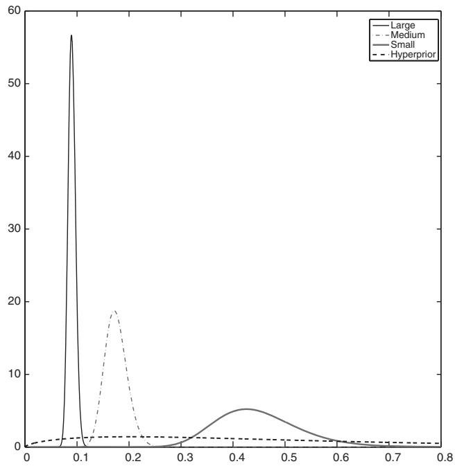
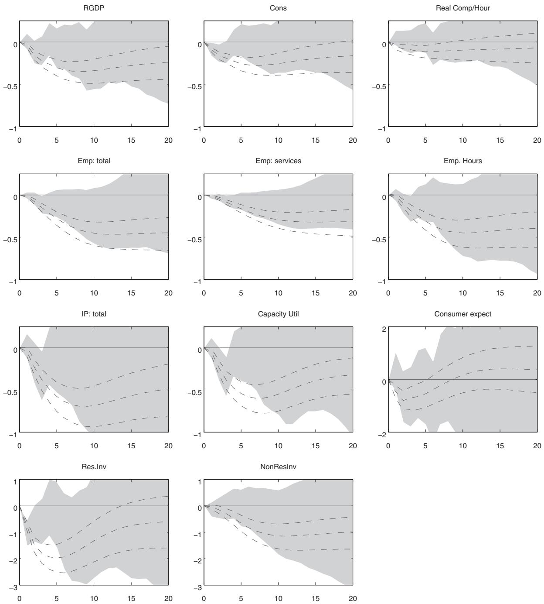
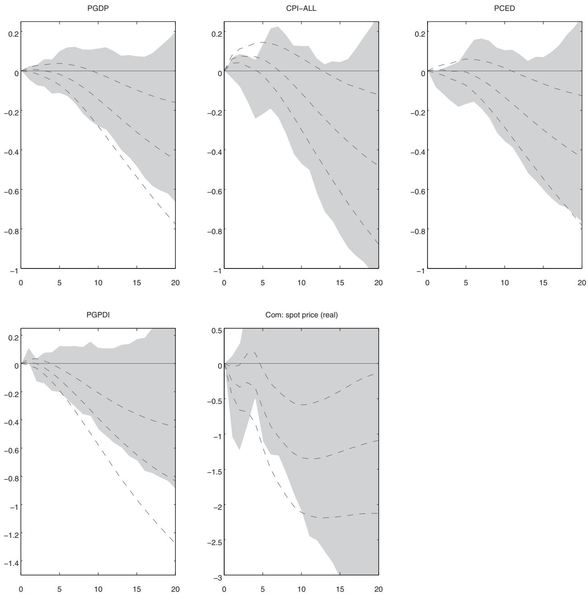
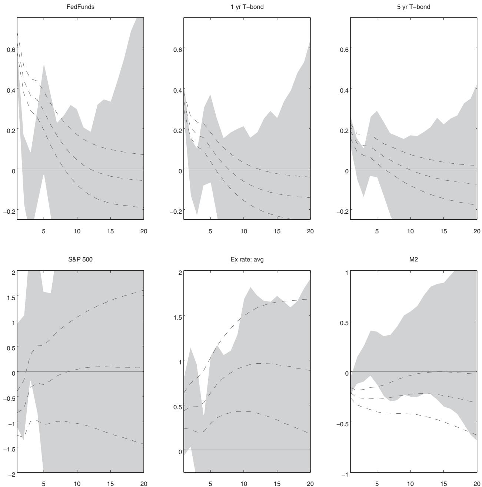
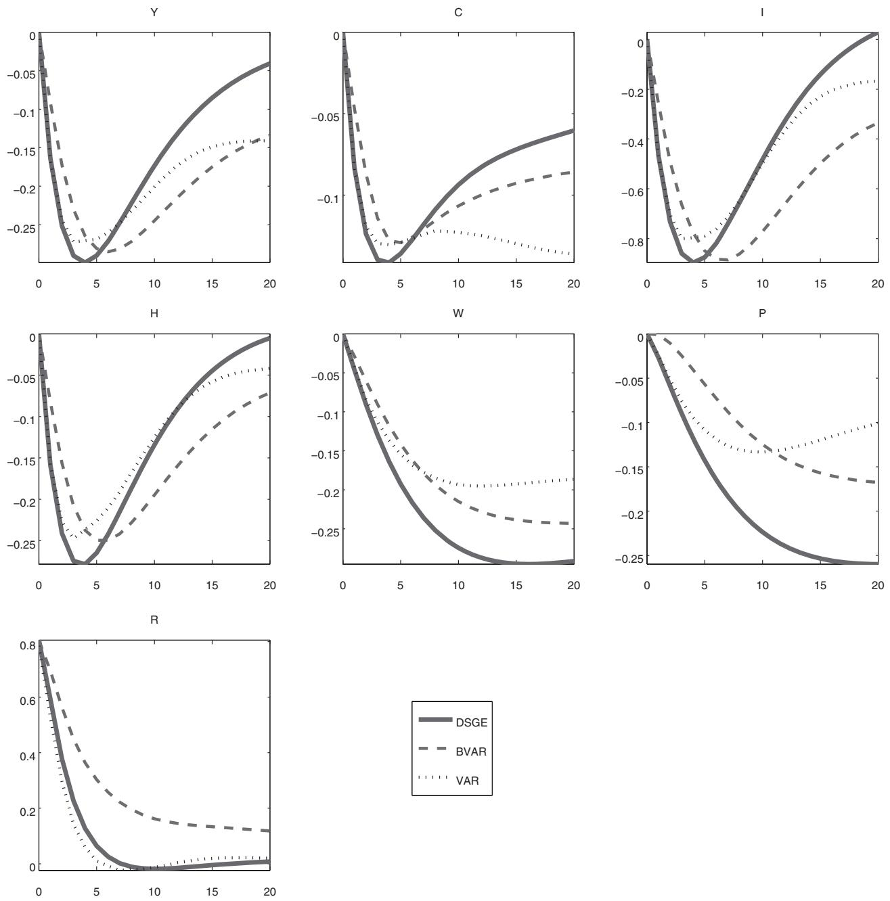
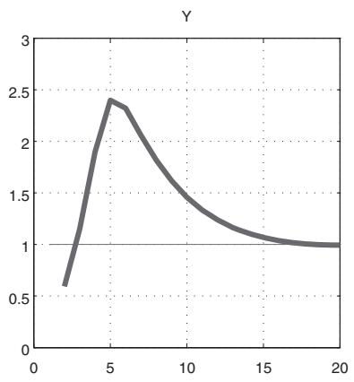

# PRIOR SELECTION FOR VECTOR AUTOREGRESSIONS

Abstract—Vector autoregressions (VARs) are flexible time series models that can capture complex dynamic interrelationships among macroeconomic variables. However, their dense parameterization leads to unstable inference and inaccurate out-of-sample forecasts, particularly for models with many variables. A solution to this problem is to use informative priors in order to shrink the richly parameterized unrestricted model toward a parsimonious naive benchmark, and thus reduce estimation uncertainty. This paper studies the optimal choice of the informativeness of these priors, which we treat as additional parameters, in the spirit of hierarchical modeling. This approach, theoretically grounded and easy to implement, greatly reduces the number and importance of subjective choices in the setting of the prior. Moreover, it performs very well in terms of both out-of-sample forecasting—as well as factor models—and accuracy in the estimation of impulse response functions.

## I. Introduction

In this paper, we study the choice of the informativeness of the prior distribution on the coefficients of the following VAR model:

$$
y_{t} = C + B_{1} y_{t - 1} + \dots + B_{p} y_{t - p} + \varepsilon_{t}, \tag{1}
$$

$$
\varepsilon_{t} \sim N \left(0, \Sigma\right),
$$

where $y_{t}$ is an $n \times 1$ vector of endogenous variables, $\mathbf{\boldsymbol{\varepsilon}}_{t}$ is an $n \times 1$ vector of exogenous shocks, and $C, B_{1}, \ldots, B_{p},$ and $\Sigma$ are matrices of suitable dimensions containing the model’s unknown parameters.

With flat priors and conditioning on the initial $p$ observations, the posterior distribution of $\beta \equiv vec([C, B_{1}, \dots, B_{p}]^{\prime})$ is centered at the ordinary least squares (OLS) estimate of the coefficients, and it is easy to compute. It is well known, however, that working with flat priors leads to inadmissible estimators (Stein, 1956) and yields poor inference, particularly in large-dimensional systems (see, e.g., Sims, 1980; Litterman, 1986). One typical symptom of this problem is the fact that these models generate inaccurate out-of-sample predictions due to the large estimation uncertainty of the parameters.

In order to improve the forecasting performance of VAR models, Litterman (1980) and Doan, Litterman, and Sims (1984) have proposed combining the likelihood function with some informative prior distributions. Using the frequentist terminology, these priors are successful because they effectively reduce the estimation error while generating only relatively small biases in the estimates of the parameters. For a more formal illustration of this point from a Bayesian perspective, we consider the following (conditional) prior distribution for the VAR coefficients,

$$
\beta | \Sigma \sim N \left(b, \Sigma \otimes \Omega \xi\right),
$$

where the vector $b$ and the matrix $\Omega$ are known and $\xi$ is a scalar parameter controlling the tightness of the prior information. The conditional posterior of $\beta$ can be obtained by multiplying this prior by the likelihood function. Taking the initial $p$ observations of the sample as given, a standard assumption that we maintain throughout the paper, without explicitly conditioning on these observations, the posterior takes the form

$$
\beta | \Sigma , y \sim N \left(\hat{\beta} \left(\xi\right), \hat{V} \left(\xi\right)\right),
$$

$$
\hat{\beta} \left(\xi\right) \equiv vec \left(\hat{B} \left(\xi\right)\right),
$$

$$
\hat{B} \left(\xi\right) \equiv \left(X^{\prime} X + (\Omega \xi)^{-1}\right)^{-1} \left(X^{\prime} Y + (\Omega \xi)^{-1} b\right),
$$

$$
\hat{V} (\xi) \equiv \Sigma \otimes \left(X^{\prime} X + (\Omega \xi)^{-1}\right)^{-1},
$$

where $Y \equiv \bigl [ y_{p + 1}, \ldots, y_{T} \bigr ]^{\prime}, X \equiv [ x_{p + 1}, \ldots, x_{T} ]^{\prime}, x_{t} \equiv [ 1 , y_{t - 1}^{\prime}, \ldots, y_{t - p}^{\prime} ]^{\prime}$, and $vec$ is a matrix obtained by reshaping the vector $b$ in such a way that each column corresponds to the prior mean of the coefficients of each equation (i.e., $b \equiv vec( b )$). Notice that if we choose a lower $\xi$, the prior becomes more informative, the posterior mean of $\beta$ moves toward the prior mean, and the posterior variance falls.

In this context, one natural way to assess the impact of different priors on the model’s ability to fit the data is to evaluate their effect on the model’s out-of-sample forecasting performance, summarized by the probability of observing low forecast errors. To this end, rewrite equation (1) as

$$
y_{t} = X_{t} \beta + \varepsilon_{t},
$$

where ${ \cal X }_{t} \equiv I_{n} \otimes { \cal x }_{t}^{\prime}$ and $I_{n}$ denotes an $n \times n$ identity matrix. At time $T$, the distribution of the one-step-ahead forecast is given by

$$
y_{T + 1} | \Sigma, y \sim N \left(X_{T + 1} \hat{\beta} (\xi), X_{T + 1} \hat{V}(\xi) X_{T + 1}^{\prime} + \Sigma\right),
$$

whose variance depends on both the posterior variance of the coefficients and the volatility of the innovations. It is then easy to see that neither very high nor very low values of $\xi$ are likely to be ideal. On the one hand, if $\xi$ is too low and the prior very dogmatic, density forecasts will be concentrated around $X_{T + 1} b$. This results in a low probability of observing small forecast errors unless the prior mean happens to be in a close neighborhood of the likelihood peak (and there is no reason to believe that this is the case in general). On the other hand, if $\xi$ is too high and the prior too uninformative, the model generates highly dispersed density forecasts, especially in high-dimensional VARs, because of high estimation uncertainty. This also lowers the probability of observing small forecast errors, despite the fact that the distance between $y_{T + 1}$ and $X_{T + 1} \hat{\beta}(\xi)$ might be small. In sum, neither flat nor dogmatic priors maximize the fit of the model, which makes the choice of the informativeness of the prior distribution a crucial issue.

The literature has proposed a number of heuristic methodologies to set the informativeness of the prior distribution on the VAR coefficients. For example, Litterman (1980) and Doan et al. (1984) set the tightness of the prior by maximizing the out-of-sample forecasting performance of the model over a presample. Banbura, Giannone, and Reichlin (2010) propose instead to control for overfitting by choosing the shrinkage parameters that yield a desired in-sample fit.1

From a purely Bayesian perspective, however, the choice of the informativeness of the prior distribution is conceptually identical to the inference on any other unknown parameter of the model. Suppose, for instance, that a model is described by a likelihood function $p(y | \theta)$ and a prior distribution $p_{\gamma}(\theta)$, where $\theta$ is the vector of the model’s parameters and $\gamma$ collects the hyperparameters, that is, those coefficients that parameterize the prior distribution but do not directly affect the likelihood.2 It is then natural to choose these hyperparameters by interpreting the model as a hierarchical model, replacing $p_{\checkmark}(\theta)$ with $p(\theta | \gamma)$, and evaluating their posterior (Berger, 1985; Koop, 2003). Such a posterior can be obtained by applying Bayes’ law, which yields

$$
p(\gamma | y) \propto p(y | \gamma) \cdot p(\gamma),
$$

where $p(\gamma)$ denotes the prior density on the hyperparameters, also known as the hyperprior, while $p(y | \gamma)$ is the so-called marginal likelihood (ML) and corresponds to

$$
p(y | \gamma) = \int p(y | \theta, \gamma) p(\theta | \gamma) d \theta. \tag{2}
$$

In other words, the ML is the density of the data as a function of the hyperparameters $\gamma$, obtained after integrating out the uncertainty about the model’s parameters $\theta$. Conveniently, in the case of VARs with conjugate priors, the ML is available in closed form.

Conducting formal inference on the hyperparameters is theoretically grounded and also has several appealing interpretations. For example, with a flat hyperprior, the shape of the posterior of the hyperparameters coincides with the ML, which is a measure of out-of-sample forecasting performance of a model (see Geweke, 2001; Geweke & Whiteman, 2006). More specifically, the ML corresponds to the probability density that the model generates zero forecast errors, which can be seen by rewriting the ML as a product of conditional densities:

$$
p(y | \gamma) = \prod_{t = p + 1}^{T} p(y_{t} | y^{t - 1}, \gamma).
$$

As a consequence, maximizing the posterior of the hyperparameters corresponds to maximizing the one-step-ahead out-of-sample forecasting ability of the model.

Moreover, the strategy of estimating hyperparameters by maximizing the ML (i.e., their posterior under a flat hyperprior) is an empirical Bayes method (Robbins, 1956), which has a clear frequentist interpretation. On the other hand, the full posterior evaluation of the hyperparameters (as advocated, for example, by Lopes, Moreira, & Schmidt, 1999, for VARs) can be thought of as conducting Bayesian inference on the population parameters of a random effects model or, more generally, of a hierarchical model (see, Gelman et al., 2004).

Finally, the hierarchical structure also implies that the unconditional prior for the parameters $\theta$ has a mixed distribution:

$$
p(\theta) = \int p(\theta | \gamma) p(\gamma) d \gamma.
$$

Mixed distributions have generally fatter tails than each of the component distributions $p(\theta | \gamma)$, a property that robustifies inference. In fact, when the prior has fatter tails than the likelihood, the posterior is less sensitive to extreme discrepancies between prior and likelihood (Berger, 1985; Berger & Berliner, 1986).

## A. Contribution

In this paper, we adopt the hierarchical modeling approach to make inference about the informativeness of the prior distribution of Bayesian vector autoregressions (BVARs) estimated on postwar U.S. macroeconomic data. We consider a combination of the conjugate priors most commonly used in the literature (the Minnesota, sum-of-coefficients, and dummy-initial-observation priors) and document that this estimation strategy generates accurate out-of-sample predictions in terms of both point and density forecasts. The key to success lies in the fact that this procedure automatically selects the appropriate amount of shrinkage: tighter priors when the model involves many unknown coefficients relative to the available data and looser priors in the opposite case. Indeed, we derive an expression for the ML showing that it takes duly into account the trade-off between in-sample fit and model complexity.

Because of this feature, the hierarchical BVAR improves over naive benchmarks and flat-prior VARs, even for small-scale models, for which the optimal shrinkage is low but not 0. In addition, the hierarchical BVAR outperforms the most popular ad hoc procedures to select hyperparameters (Litterman, 1980; Banbura et al., 2010). Finally, we find that the forecasting performance of the model typically improves as we include more variables, and it is comparable to that of factor models. This is remarkable because the latter are among the most successful forecasting methods in the literature.

Our second contribution is documenting that this hierarchical BVAR approach performs very well also in terms of accuracy of the estimation of impulse response functions in identified VARs. We conduct two experiments to make this point. First, we study the transmission of an exogenous increase in the federal funds rate in a large-scale model with 22 variables. The estimates of the impulse responses that we obtain are broadly in line with the usual narrative of the effects of an exogenous tightening in monetary policy. This finding, together with the result that the same large-scale model produces good forecasts, indicates that our approach is able to effectively deal with the curse of dimensionality. However, in this empirical exercise, there is no way of formally checking the accuracy of the estimated impulse response functions, since we do not have a directly observable counterpart of these objects in the data. Therefore, we conduct a second exercise, which is a controlled Monte Carlo experiment. We simulate data from a microfounded, medium-scale, dynamic stochastic general equilibrium model estimated on U.S. postwar data. We then use the simulated data to estimate our hierarchical BVAR and compare the implied impulse responses to monetary policy shocks to those of the true data-generating process. This experiment lends strong support to our model. The surprising finding is that the hierarchical Bayesian procedure generates very little bias while drastically increasing the efficiency of the impulse response estimates relative to standard flat-prior VARs.

## B. Related Literature

Hierarchical modeling (or empirical Bayes, that is, its frequentist version) has been successfully adopted in many fields (Berger, 1985; Gelman et al., 2004, for an overview). It has also been advocated by the first proponents of BVARs (Doan et al., 1984; Sims & Zha, 1998; and, more recently, Canova, 2007; Del Negro & Schorfheide, 2011), but seldom formally implemented in this context. Exceptions to this statement are Lopes et al. (1999), who use a hierarchical approach to estimate a small-scale VAR of the Brazilian economy with a Minnesota prior, and Ni and Sun (2003), who exploit an appealing but restrictive hierarchical structure where the hyperparameter controlling the variance of the prior can be integrated out analytically from the prior and the posterior of the VAR coefficients.

Del Negro and Schorfheide (2004) and Del Negro et al. (2007) also use the ML to choose the tightness of a prior for VARs derived from the posterior density of a dynamic stochastic general equilibrium model. In the context of time-varying VARs, the ML has been used by Primiceri (2005) and Belmonte, Koop, and Korobilis (2014) to choose the informativeness of the prior distribution for the time variation of coefficients and volatilities. Relative to these authors, our focus is on BVARs with standard conjugate priors, for which the posterior of the hyperparameters is available in closed form.

Closer to our framework, Phillips (1995) chooses the hyperparameters of the Minnesota prior for VARs using the asymptotic posterior odds criterion of Phillips and Ploberger (1994), which is also related to the ML. Del Negro and Schorfheide (2004; 2011), Carriero, Kapetanios, and Marcellino (2010) and Carriero, Clark, and Marcellino (2011) have used the ML to select the variance of a Minnesota prior from a grid of possible values. We generalize this approach to the optimal selection of a variety of commonly adopted prior distributions for BVARs. This includes the prior on the sum of coefficients proposed by Doan et al. (1984), which turns out to be crucial to enhance the forecasting performance of the model. Moreover, relative to these studies, we take an explicit hierarchical modeling approach that allows us to take the uncertainty about hyperparameters into account and evaluate the density forecasts of the model.

More importantly, we also complement the model’s forecasting evaluation with an assessment of the performance of hierarchical BVARs for impulse response estimation, which is new in the literature.

Finally, we document that our approach works well for models of very different scale, including three-variable VARs and much larger-scale ones. In this respect, our work relates to the growing literature on forecasting using factors extracted from large information sets (Forni et al., 2000; Stock & Watson, 2002b), large Bayesian VARs (Banbura et al., 2010; Koop, 2013), and empirical Bayes regressions with large sets of predictors (Knox, Stock, & Watson, 2000; Korobilis, 2013).

The rest of the paper is organized as follows. Sections II and III provide some additional details about the computation and interpretation of the ML and the priors and hyperpriors used in our investigation. Sections IV and V focus instead on the empirical application to macroeconomic forecasting and impulse response estimation. Section VI concludes.

## II. The Choice of Hyperparameters for BVARs

In the previous section, we argued that the most natural way of choosing the hyperparameters of a model is based on their posterior distribution. This posterior is proportional to the product of the hyperprior and the ML. The hyperprior is a level 2 prior on the hyperparameters, while the ML is the likelihood of the observed data as a function of the hyperparameters, which can be obtained by integrating out the model’s coefficients, as in equation (2).

Although this procedure can be applied very generally, in this paper we restrict our attention to prior distributions for VAR coefficients belonging to the following normal-inverse-Wishart family:

$$
\Sigma \sim IW (\Psi; d), \tag{3}
$$

$$
\beta | \Sigma \sim N(b, \Sigma \otimes \Omega), \tag{4}
$$

where the elements $\Psi, d, b,$ and $\Omega$ are typically functions of a lower-dimensional vector of hyperparameters $\gamma$. We focus on these priors for two reasons. First, this class includes the priors most commonly used by the literature on BVARs (see the surveys of Koop & Korobilis, 2010; Del Negro & Schorfheide, 2011).3 Second, the prior, equations (3 and 4), is conjugate and has the advantage that the ML of the BVAR can be computed in closed form as a function of $\gamma$.

In online appendix A, we prove that

$$
\begin{array}{l}
p(y | \gamma) \propto \underbrace {\left| \left(V_{\varepsilon}^{\text{posterior}}\right)^{-1} V_{\varepsilon}^{\text{prior}} \right|^{\frac{T - p + d}{2}}}_{\text{Fit}} \\
\cdot \underbrace {\prod_{t = p + 1}^{T} \left| V_{t | t - 1} \right|^{-\frac{1}{2}}} \quad , \tag{5}
\end{array}
$$

where $V_{\varepsilon}^{\text{posterior}}$ and $V_{\varepsilon}^{\text{prior}}$ are the posterior and prior means (or modes) of the residual variance and $V_{t | t - 1} \equiv E_{\Sigma}[\text{var}(y_{t} | y^{t - 1}, \Sigma)]$ is the variance (conditional on $\Sigma$) of the one-step-ahead forecast of $y$, averaged across all possible a priori realizations of $\Sigma$. While exact closed-form expressions for these objects are provided in the appendix, here we stress that the ML consists of two crucial terms. The first term depends on the in-sample fit of the model, and it increases when the posterior residual variance falls relative to the prior variance. Thus, everything else equal, the ML criterion favors hyperparameter values that generate smaller residuals. The second term in equation (5) is instead a penalty for model complexity. This term penalizes models with imprecise out-of-sample forecasts due to either large a priori residual variances or high uncertainty of the parameter estimates. These models have a higher a priori chance of capturing any possible behavior of the data while at the same time assigning very low probability to all possible outcomes. This feature is the essence of overfitting and is penalized by the ML criterion. Therefore, the ML captures the standard trade-off between model fit and complexity.

The fact that the ML is available in closed form simplifies inference substantially, because it makes it easy to either maximize or simulate the posterior of the hyperparameters. As we pointed out in section I, the advantage of the approach based on the maximization is that, under a flat hyperprior, it is an empirical Bayes procedure and has a classical interpretation. It also coincides with selecting hyperparameters that maximize the one-step-ahead out-of-sample forecasting performance of the model. The full posterior simulation allows us to account for the estimation uncertainty of the hyperparameters and has an interpretation of Bayesian hierarchical modeling. This approach can be implemented using a simple Markov chain Monte Carlo algorithm. In particular, we use a Metropolis step to draw the low-dimensional vector of hyperparameters. Conditional on a value of $\gamma$, the VAR coefficients $[\beta, \Sigma]$ can then be drawn from their posterior, which is normal-inverse-Wishart. Online appendix B presents the details of this procedure.

We now turn to the empirical application of our methodology.

## III. Priors and Hyperpriors

This section describes the specific priors that we employ in our empirical analysis. For the sake of comparability with previous studies, we choose the most popular prior densities adopted by the existing literature for the estimation of BVARs in levels. However, it is important to stress that our method is not confined to these priors but applies more generally to all priors belonging to the class defined by equations (3 and 4).

As in Kadiyala and Karlsson (1997), we set the degrees of freedom of the inverse-Wishart distribution to $d = n + 2$, the minimum value that guarantees the existence of the prior mean of $\Sigma$ (it is equal to $\Psi / ( d - n - 1 )$). In addition, we take $\Psi$ to be a diagonal matrix with an $n \times 1$ vector $\psi$ on the main diagonal. We treat $\psi$ as a hyperparameter, which differs from the existing literature that has been fixing this parameter using sample information. As for the conditional Gaussian prior for $\beta$, we combine three prior densities.

The baseline prior is a version of the so-called Minnesota prior, introduced in Litterman (1979, 1980). This prior is centered on the assumption that each variable follows a random walk process, possibly with drift, which is a parsimonious yet “reasonable approximation of the behavior of an economic variable” (Litterman, 1979, p. 20). More precisely, this prior is characterized by the following first and second moments,

$$
E\left[(B_{s})_{i j} | \Sigma\right] = \left\{ 
\begin{array}{l} 
1 \text{ if } i = j \text{ and } s = 1 \\ 
0 \text{ otherwise} 
\end{array} \right.
$$

$$
\operatorname{cov}\left((B_{s})_{i j}, (B_{r})_{h m} | \Sigma\right) = \left\{ 
\begin{array}{ll} 
\lambda^{2} \frac{1}{s^{2}} \frac{\Sigma_{i h}}{\psi_{j} / (d - n - 1)} & \text{if } m = j \text{ and } r = s \\ 
0 & \text{otherwise} 
\end{array} 
\right.,
$$

and can be easily cast into the form of equation (4). Notice that the variance of this prior is lower for the coefficients associated with more distant lags and that coefficients associated with the same variable and lag in different equations are allowed to be correlated. Finally, the key hyperparameter is $\lambda$, which controls the scale of all the variances and covariances and effectively determines the overall tightness of this prior.

The literature following Litterman’s work introduced refinements of the Minnesota prior to further “favor unit roots and cointegration, which fits the beliefs reflected in the practices of many applied macroeconomists” (Sims & Zha, 1998, p. 958). Loosely speaking, the objective of these additional priors is to reduce the importance of the deterministic component implied by the VARs estimated conditioning on the initial observations (Sims, 1992a). This deterministic component is defined as $\tau_{t} \equiv E_{p}(y_{t} | y_{1}, \ldots, . . , y_{p}, \hat{\beta})$, that is, the expectation of future $y_{s}$ given the initial conditions and the value of the estimated VAR coefficients. According to Sims (1992a), in unrestricted VARs, $\tau_{t}$ has a tendency to exhibit temporal heterogeneity, a markedly different behavior at the beginning and the end of the sample, and to explain an implausibly high share of the variation of the variables over the sample. As a consequence, priors limiting the explanatory power of this deterministic component have been shown to improve the forecasting performance of BVARs.

The first prior of this type is known as a sum-of-coefficients prior and was originally proposed by Doan et al. (1984). Following the literature, it is implemented using Theil mixed estimation, with a set of $n$ artificial observations—one for each variable—stating that a no-change forecast is a good forecast at the beginning of the sample. More precisely, we construct the following set of dummy observations:

$$
\begin{array}{l}
\underset{n \times n}{y^{+}} = \operatorname{diag} \left(\frac{\bar{y}_{0}}{\mu}\right) \\
x_{n \times (1 + n p)}^{+} = \left[ 0_{n \times 1}, y^{+}, \dots , y^{+} \right],
\end{array}
$$

where $\bar{y}_{0}$ is an $n \times 1$ vector containing the average of the first $p$ observations for each variable and the expression $\operatorname{diag}(v)$ denotes the diagonal matrix with the vector $v$ on the main diagonal. These artificial observations are added on top of the data matrices $y \equiv \left[ y_{p + 1}, \ldots, y_{T} \right]^{\prime}$ and $x \equiv [ x_{p + 1}, \ldots, x_{T} ]^{\prime}$, which are then used for inference. The prior implied by these dummy observations is centered at 1 for the sum of coefficients on own lags for each variable and at 0 for the sum of coefficients on other variables’ lags. It also introduces correlation among the coefficients on each variable in each equation. The hyperparameter $\mu$ controls the variance of these prior beliefs: as $\mu \to \infty$, the prior becomes uninformative, while $\mu \to 0$ implies the presence of a unit root in each equation and rules out cointegration.

The fact that, in the limit, the sum-of-coefficients prior is not consistent with cointegration motivates the use of an additional prior that was introduced by Sims (1993), known as the dummy-initial-observation prior. It is implemented using the following dummy observation,

$$
\begin{array}{l}
y_{1 \times n}^{++} = \frac{\bar{y}_{0}^{\prime}}{\delta} \\
x_{1 \times (1 + n p)}^{++} = \left[ \frac{1}{\delta}, y^{++}, \dots , y^{++} \right],
\end{array}
$$

which states that a no-change forecast for all variables is a good forecast at the beginning of the sample. The hyperparameter $\delta$ controls the tightness of the prior implied by this artificial observation. As $\delta \to \infty$, the prior becomes uninformative. And, as $\delta \to 0$, all the variables of the VAR are forced to be at their unconditional mean, or the system is characterized by the presence of an unspecified number of unit roots without drift. As such, the dummy-initial-observation prior is consistent with cointegration.

Summing up, the setting of these priors depends on the hyperparameters $\lambda, \mu, \delta,$ and $\psi$, which we treat as additional parameters. As hyperpriors for $\lambda, \mu,$ and $\delta$, we choose gamma densities with mode equal to 0.2, 1, and 1, the values recommended by Sims and Zha (1998), and standard deviations equal to $0.4, 1,$ and 1, respectively. Finally, the choice of the hyperprior for each element of the vector $\Psi / (d - n - 1)$, that is, the prior mean of the main diagonal of $\Sigma$, should be loosely related to the scale of the variables in the model. We pick an inverse-Gamma with scale and shape equal to $(0.02)^{2}$ because it seems appropriate for our data expressed in annualized log-terms (see table 1). This hyperprior peaks at approximately $(0.02)^{2}$, and it is proper but quite disperse since it does not have either a variance or a mean. We work with proper hyperpriors because they guarantee the properness of the posterior and, from a frequentist perspective, the admissibility of the estimator of the hyperparameters, a difficult property to check for the case of hierarchical models (Berger, Strawderman, & Dejung, 2005). Another appealing feature of non-flat hyperpriors is that they help stabilize inference when the ML happens to have little curvature with respect to some hyperparameters. For example, we have noticed that this can sometimes occur for the hyperparameters of the sum-of-coefficients or the dummy-initial-observation priors in larger-scale models. This being said, we stress that our hyperpriors are relatively diffuse and our empirical results are confirmed when using completely flat, improper hyperpriors.

## IV. Forecasting Evaluation of BVAR Models

The assessment of the forecasting performance of econometric models has become standard in macroeconomics, even when the main objective of the study is not to provide accurate out-of-sample predictions. This is because the forecasting evaluation can be thought of as a model validation procedure. In fact, if model complexity is introduced with a proliferation of parameters, instabilities due to estimation uncertainty might completely offset the gains obtained by limiting model misspecification. Out-of-sample forecasting reflects both parameter uncertainty and model misspecification and reveals whether the benefits due to flexibility are outweighed by the fact that the more general model also captures non-prominent features of the data.

Our out-of-sample evaluation is based on the U.S. data set constructed by Stock and Watson (2008). We work with three different VAR models, including progressively larger sets of variables:4

Table 1.—Description of the Database

| Variables | Mnemonic | Transformations BVAR | Transformations Factor Model | Small BVAR | Medium BVAR | Large BVAR |
| --- | --- | --- | --- | --- | --- | --- |
| Real GDP | RGDP | 4·logs | log-diff. | x | x | x |
| GDP deflator | PGDP | 4·logs | log-diff. | x | x | x |
| Federal funds rate | FedFunds | raw | diff. | x | x | x |
| Consumer price index | CPI-ALL | 4·logs | log-diff. |  |  | x |
| Commodity price | Com:spotprice(real) | 4·logs | log-diff. |  |  | x |
| Industrial production | IP:total | 4·logs | log-diff. |  |  | x |
| Employment | Emp:total | 4·logs | log-diff. |  |  | x |
| Employment in the services sector | Emp:services | 4·logs | log-diff. |  |  | x |
| Real consumption | Cons | 4·logs | log-diff. |  | x | x |
| Real investment | Inv | 4·logs | log-diff. |  | x |  |
| Real residential investment | Res.Inv | 4·logs | log-diff. |  |  | x |
| Nonresidential investment | NonResInv | 4·logs | log-diff. |  |  | x |
| Personal consumption Expenditures, price index | PCED | 4·logs | log-diff. |  |  | x |
| Gross private domestic investment, price index | PGPDI | 4·logs | log-diff. |  |  | x |
| Capacity utilization | CapacityUtil | raw | diff. |  |  | x |
| Consumer expectations | Consumerexpect | raw | diff. |  |  | x |
| Hours worked | Emp.Hours | 4·logs | log-diff. |  | x | x |
| Real compensation per hours | RealComp/Hour | 4·logs | log-diff. |  | x | x |
| One-year bond rate | 1yrT-bond | raw | diff. |  |  | x |
| Five-years bond rate | 5yrT-bond | raw | diff. |  |  | x |
| SP500 | S&P500 | 4·logs | log-diff. |  |  | x |
| Effective exchange rate | Exrate:avg | 4·logs | log-diff. |  |  | x |
| M2 | M2 | 4·logs | log-diff. |  |  | x |

1. A Small-scale model—the prototypical monetary VAR—with three variables, i.e., GDP, the GDP deflator, and the federal funds rate.  
2. A Medium-scale model, which includes the variables used for the estimation of the DSGE model of Smets and Wouters (2007) for the U.S. economy. In other words, we add consumption, investment, hours worked, and wages to the small model.  
3. A Large-scale model, with 22 variables, using a data set that nests the previous two specifications and also includes a number of important additional labor market, financial, and monetary variables.

Further details on the database are reported in table 1.

The variables enter the models in annualized log levels (i.e., we take logs and multiply by 4), except those already defined in terms of annualized rates, such as interest rates, which are taken in levels. The number of lags in all the VARs is set to five.

Using each of these three data sets, we produce the BVAR forecasts recursively for two horizons (one and four quarters), starting with the estimation sample that ranges from 1959Q1 to 1974Q4. More precisely, using data from 1959Q1 to 1974Q4, we generate draws from the posterior predictive density of the model for 1975Q1 (one quarter ahead) and 1975Q4 (one year ahead). We then iterate the same procedure updating the estimation sample, one quarter at a time, until the end of the sample, 2008Q4. At each iteration, we also re-estimate the posterior distribution of the hyperparameters. The outcome of this procedure is a time series of 137 density forecasts for each of the two forecast horizons.

We start by assessing the accuracy of our models in terms of point forecasts, defined as the median of the predictive density at each point in time. We then turn to the evaluation of the density forecasts to assess how accurately different models capture the uncertainty around the point forecasts.

For each variable, the target of our evaluation is defined in terms of the $h$-period annualized average growth rates, $z^{h}_{i,t h} = \frac{1}{h} [ y_{i,t+h} - y_{i,t}]$. For variables specified in log levels, $z_{i, t + h}^{h} = \frac{1}{h} [ y_{i, t + h} - \bar{y}_{i, t} ]$ this is approximately the average annualized growth rate over the next $h$ quarters, while for variables not transformed in logs, this is the average quarterly change over the next $h$ quarters.

We compare the forecasting performance of the BVAR to a VAR with flat prior, estimated by OLS (we refer to this model as VAR or flat-prior VAR)5 and a random walk with drift, which is the model implied by a dogmatic Minnesota prior (we refer to this model as RW). We also compare the point forecasts of the BVAR to those of a single equation model, augmented with factors extracted from a large data set using principal components.6 Factor models offer a parsimonious representation for macroeconomic variables while retaining the salient features of the data that notoriously strongly co-move. Hence, factor-augmented regressions are widely used in order to deal with the curse of dimensionality since a large set of potential predictors can be replaced in the regressions by a much smaller number of factors. Factor-based approaches are a benchmark in the literature and have been shown to produce accurate forecasts exploiting large cross-sections of data. Specifically, we focus on the factor-based forecasting approach of Stock and Watson (2002a, 2002b), whose implementation details are reported in online appendix C. Finally, later, we compare the forecasting performance of our hierarchical BVAR to more heuristic procedures for the choice of hyperparameters.

Table 2.—MSFE of Point Forecasts

| Horizons | Variables | Small (S) VAR | Small (S) BVAR | Medium (M) VAR | Medium (M) BVAR | Large (L) VAR | Large (L) BVAR | Factor M | RW |
| --- | --- | --- | --- | --- | --- | --- | --- | --- | --- |
| One quarter | Real GDP | 13.49 | 9.61 | 19.15 | 7.97 |  | 8.18 | 7.29 | 10.23 |
|  | GDP deflator | 1.53 | 1.32 | 2.26 | 1.35 |  | 1.10 | 1.14 | 5.19 |
|  | Federal funds rate | 1.61 | 1.04 | 1.82 | 1.03 |  | 1.00 | 1.25 | 1.06 |
| One year | Real GDP | 5.40 | 3.85 | 12.10 | 3.42 |  | 3.97 | 3.52 | 3.98 |
|  | GDP deflator | 1.61 | 1.45 | 2.25 | 1.58 |  | 0.96 | 1.01 | 4.65 |
|  | Federal funds rate | 0.58 | 0.32 | 0.56 | 0.31 |  | 0.36 | 0.32 | 0.31 |

The table reports the mean squared forecast errors of the BVARs and the competing models (VAR: flat-prior VAR, RW: random walk in levels with drift, Factor M: factor-augmented regression) for each variable and horizon. The evaluation sample is 1975Q1–2008Q4 for the one-quarter-ahead forecasts and 1975Q4–2008Q4 for the one-year-ahead forecasts.

## A. Point Forecasts

Table 2 analyzes the accuracy of point forecasts by reporting the mean squared forecast errors (MSFE) of real GDP, the GDP deflator, and the federal funds rate.

Comparing models of different sizes, notice that it is not possible to estimate the large-scale VAR with a flat prior. In addition, the VAR forecasts worsen substantially when moving from the small to the medium-scale model. This outcome indicates that the gains from exploiting larger information sets are completely offset by an increase in estimation error. On the contrary, the forecast accuracy of the BVARs does not deteriorate when increasing the scale of the model and sometimes even improves substantially (as is the case for inflation). In this sense, the use of priors seems to be able to turn the curse into a blessing of dimensionality. Moreover, BVAR forecasts are systematically more accurate than the flat-prior VAR forecasts for all the variables and horizons that we consider.

The comparison with the RW model is also favorable to the BVARs, with the possible exception of the forecasts of the federal funds rate at the one-year horizon. The improvement of BVARs over the RW, the prior model, indicates that our inference-based choice of the hyperparameters leads to the use of informative priors, but not excessively so, letting the data shape the posterior beliefs about the model’s coefficients. Finally, notice that the performance of the prior model is particularly poor for inflation. In fact, Atkeson and Ohanian (2001) show that a random walk for the growth rate of the GDP deflator is a more appropriate naive benchmark model. Specifically, they propose to forecast inflation over the subsequent year using the inflation rate over the past year. The MSFE of this alternative simple model for inflation at a four-quarter horizon is 1.24, which is smaller than that obtained with the random walk in levels or with the small and medium BVARs, but higher than the corresponding MSFE of the large-scale BVAR.

Table 2 also suggests that the BVAR predictions are competitive with those of the factor model. This outcome is in line with the findings of De Mol, Giannone, and Reichlin (2008) and indicates that factor-augmented and Bayesian regressions capture the same features of the data. In fact, De Mol et al. (2008) have shown that Bayesian shrinkage and regressions augmented with principal components are strictly connected.

## B. Density Forecasts

The point forecast evaluation of section IVA is a useful tool to discriminate among models but it disregards the uncertainty assigned by each model to its point prediction. For this reason, we now turn to the evaluation of the density forecasts. We measure the accuracy of a density forecast using the log-predictive score, which is simply the logarithm of the predictive density generated by a model, evaluated at the realized value of the time series. Therefore, if model A has a higher average log predictive score than model B, it means that values close to the actual realizations of a time series were a priori more likely according to model A relative to model B. We measure the log-predictive score using a Gaussian approximation of the predictive density for all models.

Table 3 reports the average difference between the log predictive scores of the BVARs and the competing models (the flat-prior VAR and RW models), for each variable and horizon. A positive number indicates that the density forecasts produced by our proposed procedure are more accurate than those of the alternative models. In addition, the HAC estimate of its standard deviation (in parentheses) gives a rough idea of the statistical significance and the volatility of this difference.7

Table 3 makes clear that the BVAR forecasts outperform those of the RW and flat-prior VAR also when evaluating the whole density.

## C. Inspecting the Mechanism

In this section, we provide some intuition about why the hierarchical procedure described previously generates accurate forecasts. As we discussed at length in section I, VAR models require the estimation of many free parameters, which, when using a flat prior, leads to high estimation uncertainty and overfitting. It is therefore beneficial to shrink the model parameters toward a parsimonious prior model. The key to the success of the hierarchical BVAR is that it automatically infers the appropriate amount of shrinkage by selecting the tightness of the prior distribution. For example, the procedure will select looser priors for models with fewer parameters and tighter priors for models with many parameters relative to the available data.

Table 3.—Average Difference of Log-Scores

| Horizons | Variables | Small (S) Versus VAR | Small (S) Versus RW | Medium (M) Versus VAR | Medium (M) Versus RW | Large (L) Versus VAR | Large (L) Versus RW |
| --- | --- | --- | --- | --- | --- | --- | --- |
| One quarter | Real GDP | 0.10 (0.04) | 0.06 (0.05) | 0.30 (0.05) | 0.16 (0.06) |  | 0.17 (0.06) |
|  | GDP deflator | 0.04 (0.03) | 0.74 (0.09) | 0.15 (0.06) | 0.73 (0.09) |  | 0.81 (0.09) |
|  | Federal funds rate | 0.08 (0.06) | 0.06 (0.08) | 0.11 (0.10) | 0.07 (0.08) |  | 0.09 (0.10) |
| One year | Real GDP | 0.10 (0.07) | 0.00 (0.09) | 0.40 (0.12) | 0.06 (0.09) |  | 0.03 (0.13) |
|  | GDP deflator | 0.05 (0.10) | 1.00 (0.33) | 0.01 (0.22) | 0.88 (0.36) |  | 1.18 (0.30) |
|  | Federal funds rate | 0.28 (0.08) | 0.07 (0.07) | 0.25 (0.10) | 0.05 (0.09) |  | -0.03 (0.12) |

The table reports the average difference between the log-predictive scores of the BVARs and the competing models (the flat-prior VAR and RW models) for each variable and horizon. The HAC estimate of the standard deviation of the difference between the log-predictive scores of the BVARs and the competing models is reported in parentheses. The evaluation sample is 1975Q1 to 2008Q4 for the one-quarter-ahead forecasts and 1975Q4 to 2008Q4 for the one-year-ahead forecasts.

To illustrate this point, consider a much simplified version of our model, that is, a BVAR with only a Minnesota prior, and the prior mean of the diagonal elements of $\Sigma$ set equal to the variance of the residuals of an AR(1) for each variable (as in Kadiyala & Karlsson, 1997). This model is convenient because it involves only one hyperparameter, the hyperparameter $\lambda$ governing the overall standard deviation of the Minnesota prior. For each data set—small, medium, and large—we estimate our hierarchical BVAR on the full sample and compute the posterior distribution of the hyperparameter $\lambda$. These posteriors are plotted in figure 1, along with the hyperprior. Notice that in line with intuition, the posterior mode (and variance) of $\lambda$ decreases with the size of the model. In other words, the larger the size of the BVAR, the more likely it is that we should shrink the model toward the parsimonious specification implied by the Minnesota prior.

## D. Comparison with Alternative Methods

Given the good forecasting performance of our inference-based methodology for choosing the hyperparameters (as good as that of factor models), a section discussing the relative performance of alternative methods seems warranted. However, formal alternatives to the marginal likelihood are absent in the literature. For instance, the Bayesian or the Akaike information criteria cannot be adopted because their penalization for model complexity involves only the number of parameters and does not depend on the value of the hyperparameters. As a consequence, both of these criteria would favor models with loose priors that maximize the model in-sample fit.

Figure 1.—Posterior Distribution of the Hyperparameter Governing the Standard Deviation of the Minnesota Prior  

An informal method to choose the hyperparameters is to maximize the model forecasting performance over a presample, as in Litterman (1980). An alternative possibility is to control for overfitting by targeting a desired in-sample fit, as in Banbura et al. (2010). These heuristic procedures can be interpreted as rough empirical Bayes estimators, and their ad hoc nature might partly explain why Bayesian VARs have encountered a number of opponents, especially among non-Bayesian researchers. These approaches obviously raise a number of questions: What is the right size of the presample and the forecasting horizon? Should we minimize the MSFE or control for the in-sample fit of all the variables or just those of interest? Moreover, these procedures make it hard to conduct inference incorporating hyperparameter uncertainty. Despite these limitations, these are the most popular approaches in the literature, and we have compared them to our methodology.

Table 4.—MSFE of Alternative Methods Relative to Hierarchical Model

| Horizons | Variables | Small (S) LIT | Small (S) BGR | Small (S) SZ | Medium (M) LIT | Medium (M) BGR | Medium (M) SZ | Large (L) LIT | Large (L) BGR | Large (L) SZ |
| --- | --- | --- | --- | --- | --- | --- | --- | --- | --- | --- |
| One quarter | Real GDP | 1.04 |  | 1.02 | 1.19 | 1.09 | 1.06 | 1.12 | 1.09 | 0.96 |
|  | GDP deflator | 1.87 |  | 1.09 | 1.67 | 1.44 | 1.11 | 1.46 | 1.97 | 0.97 |
|  | Federal funds rate | 1.32 |  | 1.01 | 1.01 | 0.99 | 0.99 | 1.19 | 1.02 | 0.98 |
| One year | Real GDP | 1.16 |  | 1.10 | 1.15 | 1.17 | 1.14 | 1.32 | 0.97 | 0.87 |
|  | GDP deflator | 1.61 |  | 1.23 | 1.57 | 1.62 | 1.21 | 1.55 | 2.73 | 1.04 |
|  | Federal funds rate | 1.13 |  | 0.97 | 1.13 | 1.03 | 1.00 | 1.03 | 0.83 | 0.92 |

The table reports the MSFE of three alternative methods to select the tightness of the prior distributions relative to the MSFE of the hierarchical model. Numbers larger than 1 indicate that the MSFE of the alternative method (LIT: method described in Litterman, 1980; BGR: method described in Banbura et al., 2010; SZ: fixed hyperparameters in Sims & Zha, 1998) is larger than the corresponding MSFE of the hierarchical model. The evaluation sample is 1975Q1 to 2008Q4 for the one-quarter-ahead forecasts and 1975Q4 to 2008Q4 for the one-year-ahead forecasts. By construction, the MSFE of the BGR method for the small-scale model (not reported here; see table 2) is identical to that of the flat-prior VAR.

Concerning the first method, we have repeated our forecasting experiment by choosing at each point in time the hyperparameters that maximize the past forecasting ability of the VAR. In particular, to follow Litterman (1980) as closely as possible, the measure of out-of-sample forecasting performance is the Theil-U statistic, computed over the previous five years and averaged across variables and forecasting horizons (1 to 4). As for the second method, we have replicated Banbura et al. (2010) by setting the hyperparameters in the medium and large BVARs to match the average in-sample fit of the small VAR with flat priors.8

Table 4 reports the MSFE of the Litterman (1980) (LIT) and Banbura et al. (2010) (BGR) methods relative to ours. A value over 1 indicates that our method outperforms the alternatives. The general finding is that the performance of these two approaches is similar and considerably worse than our methodology, particularly for forecasting inflation.

Finally, note that some authors do not even perform an informal search for the optimal hyperparameters, but simply use values from previous studies. For example, a common choice are the hyperparameters of Sims and Zha (1998), which are also the values around which we center our hyperpriors. We have experimented with these fixed hyperparameters and, quite interestingly, have found that they improve over the heuristic procedures of Litterman (1980) and Banbura et al. (2010), in our empirical application. In fact, as shown in table 4 (columns SZ), the MSFE is only up to 20 percent worse than our method for the small and medium BVAR, and comparable to our method, if not slightly better, for the large BVAR.

This result suggests that the overall tightness implied by the fixed hyperparameters of Sims and Zha (1998) is too low for the small- and medium-scale VARs, while it is approximately “correct” for the large VAR. In order to support this interpretation, we have also experimented with an “extralarge” VAR model with 35 variables, for which we would expect the priors of Sims and Zha (1998) to be too loose.9 In line with this intuition, the forecasting performance of the BVAR of Sims and Zha (1998) deteriorates relative to ours. In particular, it becomes marginally worse (between 2 and 4 percent across variables) at the one-quarter horizon and sensibly worse at the one-year horizon especially for the federal funds rate and the GDP deflator (with an 11 percent and a 29 percent higher MSFE, respectively).

In addition, it is worth noticing that the specific values of the hyperparameters that Sims and Zha (1998) used are not guaranteed to work well for other applications—possibly outside the range of U.S. macroeconomic time series—and cannot be applied to different priors. On the contrary, the main appeal of our methodology is that it can be used in a wide range of models and applications, requiring little human judgement in the search for reasonable ranges of hyperparameters. Consequently, there is also less need for extensive robustness checks that characterize empirical works using more ad hoc methodologies.

## V. Structural BVARs and Estimation of Impulse Response Functions

The forecast accuracy of the hierarchical modeling procedure proposed in this paper is quite remarkable and in line with the interpretation of the marginal likelihood as a measure of out-of-sample forecasting performance. However, VARs are used in the literature not only for forecasting but also as a tool to identify structural shocks and assess their transmission mechanism. Inspired by an important insight of statistical decision theory—the separation between loss functions and probability models—we now present evidence that the same hierarchical modeling strategy also delivers accurate estimates of the impulse response functions to structural shocks.

More specifically, in this section, we perform two exercises. First, we estimate the impulse responses to monetary policy shocks using our large-scale BVAR with 22 variables.

9 The extra-large model is constructed by adding the following thirteen variables to the large VAR: real durable consumption, total housing starts, purchasing managers index (PMI), new orders of consumer goods and materials, real exports, real imports, exports price index, imports price index, unemployment rate, Moody’s AAA corporate bond yields, Moody’s BAA corporate bond yields, business loans, and consumer credit outstanding.

Figure 2.—Impulse Responses of Real Variables  
  
The figure reports the 16th, 50th, and 84th percentiles (dashed lines) of the distribution of the impulse response functions of the large BVAR to a 1 standard deviation monetary policy shock. The gray area refers to the corresponding error bands for the flat-prior VAR.

estimated over the entire available sample. The analysis of the effects of monetary policy innovations is widespread in the literature because, among other things, it allows discriminating between competing theoretical models of the economy (Christiano, Eichenbaum, & Evans, 1999). The purpose of this first exercise is to demonstrate that our hierarchical procedure allows us to obtain plausible estimates of impulse response functions even when working with large-scale models, which is not the case for flat-prior VARs. However, we do not have an observable counterpart of these impulse responses in the data that can be used to directly check their accuracy. This motivates our second exercise, a controlled Monte Carlo experiment. In a nutshell, we simulate artificial data sets from a dynamic stochastic general equilibrium (DSGE) model and assess the gains in accuracy for the estimation of impulse responses to monetary policy shocks of our hierarchical procedure over flat-prior VARs.

Concerning our first exercise, the monetary policy shock is identified using a relatively standard recursive identification scheme, assuming that prices and real activity do not react contemporaneously to the monetary policy shock. The only variables that can react contemporaneously to monetary policy shocks are the financial variables (bond rates and stock prices), the exchange rate, and M2, while the policy rate does not react contemporaneously to financial variables (see Christiano et al., 1999). Figures 2, 3, and 4 report the median and the 16th and 84th percentiles of the posterior distribution of the impulse responses to a monetary policy shock estimated in the large-scale model using the full sample. The distribution of the impulse responses encompasses both uncertainty on the parameters and hyperparameters.

Figure 3.—Impulse Responses of Nominal Variables  
  
The figure reports the 16th, 50th, and 84th percentiles (dashed lines) of the distribution of the impulse response functions of the large BVAR to a 1 standard deviation monetary policy shock. The gray area refers to the corresponding error bands for the flat-prior VAR.

A 1-standard deviation (approximately 60 basis points) exogenous increase in the federal funds rate generates a substantial contraction in GDP, employment, and all other variables related to economic activity. Monetary aggregates also decrease on impact, indicating strong liquidity effects. Moreover, stock prices decline, the exchange rate appreciates, and the yield curve flattens. Prices decrease with a delay. Notice that with the exception of the CPI, the response of prices does not exhibit the so-called price puzzle, that is, a counterintuitive positive response to a monetary contraction, which is instead typical of VARs with small information sets (on this point, see Sims, 1992b; Bernanke, Boivin, & Eliasz, 2005; Banbura et al., 2010).´

Figure 4.—Impulse Responses of Financial Variables  
  
The figure reports the 16th, 50th, and 84th percentiles (dashed lines) of the distribution of the impulse response functions of the large BVAR to a 1 standard deviation monetary policy shock. The gray area refers to the corresponding error bands for the flat-prior VAR.

For comparison, figures 2, 3, and 4 also report the corresponding quantiles of the distribution of impulse responses of a VAR estimated with flat priors (gray shaded areas). It is evident that these error bands reflect a considerable amount of estimation uncertainty, and their width does not allow any meaningful conclusions about the effects of an exogenous monetary tightening. In addition, even when initially significant, these impulse responses tend to revert to 0 at a very fast pace, a symptom of a possibly severe small-sample bias toward stationarity. These results are all in line with intuition, and hence lend support to our hierarchical procedure. But there is no formal way to assess the accuracy of this estimation since there is no counterpart of these responses directly observable in the data. This is why we now turn to our second exercise.

In our controlled Monte Carlo experiment, we adopt a medium-scale DSGE model to simulate 500 artificial time series of length 200 quarters, for seven macro variables: output (Y), consumption (C), investment (I), hours worked (H), wages (W), prices (P), and the short-term interest rate (R). For each data set, we estimate the impulse responses to a monetary policy shock with our hierarchical BVAR model and a flat-prior VAR and compare these estimates to the true impulse responses of the theoretical model.

Figure 5.—Impulse Responses on Simulated Data  
  
The figure reports the impulse responses to a monetary policy shock in the DSGE model used to generate the data and the median across Monte Carlo replications of the BVAR and the VAR impulse responses.

The DSGE that we use to simulate the data is identical to Justiniano, Primiceri, and Tambalotti (2010), with the exception that the behavior of the private sector is predetermined with respect to the monetary policy shock, as in Christiano et al. (2005). This justifies the use of a recursive scheme for the identification of monetary policy shocks in the BVAR and the VAR. Finally, the DSGE is parameterized using the posterior mode of the unknown coefficients, estimated using U.S. data on output growth, consumption growth, investment growth, hours, wage inflation, price inflation, and the federal funds rate, as in Justiniano et al. (2010). This is a good laboratory to study the question at hand since it is well known that this class of medium-scale DSGE models fits the data quite well (Smets & Wouters, 2007).

Figure 6.—Ratio of MSE: VAR versus BVAR  

The figure reports the ratio of the MSE of the VAR over the MSE of the BVAR. Values larger than 1 indicate that the MSE of the VAR is larger than that of the BVAR.

However, the difference between the average median across replications and the theoretical impulse response, the bias, represents only one dimension of accuracy. In order to take into account the standard deviation of the errors across replications, we need to look at the average squared error across replications.

10 We have also computed the impulse responses to a monetary policy shock in the theoretical VAR(5) representation of the DSGE model. These responses are extremely similar to the DSGE responses.

For each replication, we compute the overall error as the difference between the theoretical response and the estimated median response across variables and horizons. Then, for each variable and horizon, we take the average of the squared errors across replications (MSE). Figure 6 reports the ratio between the MSE for the flat-prior VAR and the hierarchical BVAR.

Such a ratio is greater than 1 for most variables and horizons, indicating that the hierarchical BVAR yields substantial accuracy gains. For instance, depending on the horizon, the impulse responses of output, consumption, investment, hours, and wages based on the BVAR can be about twice as accurate. An important exception is the response of the federal funds rate, which is estimated to be too persistent and to decay too slowly when using informative priors (see figures 5 and 6). Further experimentation reveals that this excessively persistent behavior is due to the sum-of-coefficients prior. While this prior is very important to enhance the forecasting performance of the model, the outcomes in figures 5 and 6 suggest that more sophisticated priors might be needed to discipline the behavior of the model at low frequencies. It is also reasonable to expect that these more sophisticated priors should be based on insights coming from economic theory (on this point, see Del Negro & Schorfheide, 2004; Villani, 2009), since it is well known that the data are less informative about low-frequency trends.

## VI. Conclusion

In this paper, we have studied the problem of how to choose the informativeness of a variety of commonly used prior distributions for VAR models. Our approach consists of treating the coefficients of the prior as additional parameters, in the spirit of hierarchical modeling. We have shown that this approach is theoretically grounded, easy to implement, and performs very well in terms of out-of-sample forecasting and accuracy in the estimation of impulse response functions. Moreover, it greatly reduces the number and importance of subjective choices in the setting of the prior. In sum, this hierarchical modeling procedure is beneficial for both reduced-form and structural analysis with VARs. Moreover, this approach may prove particularly useful also for the increasingly large literature on DSGE models. It is in fact typical in this literature to validate a theoretical model by comparing its fit and impulse responses to those of VARs.

## Related notes

- [[Bvar With Hierarchical Priors]] — the R implementation of this method
