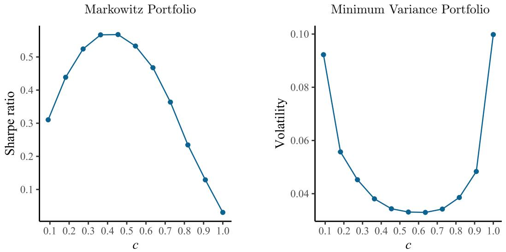
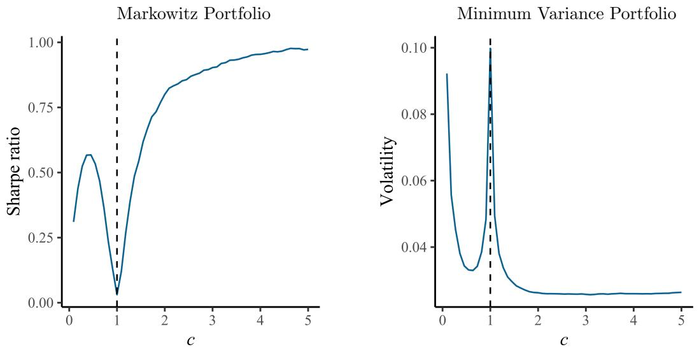
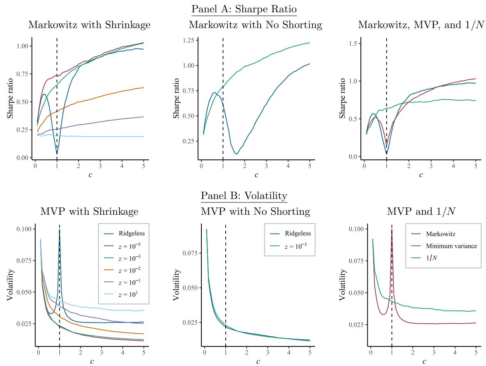
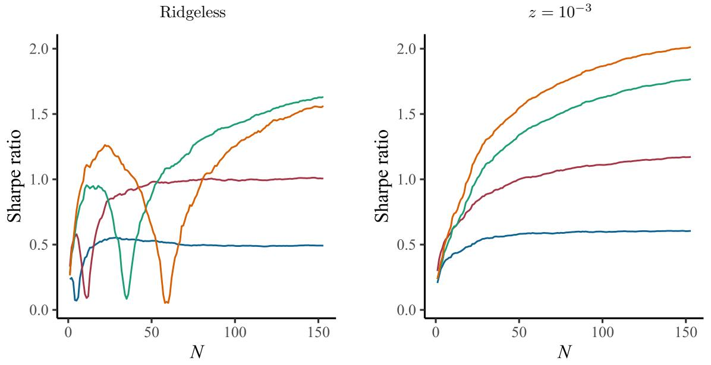
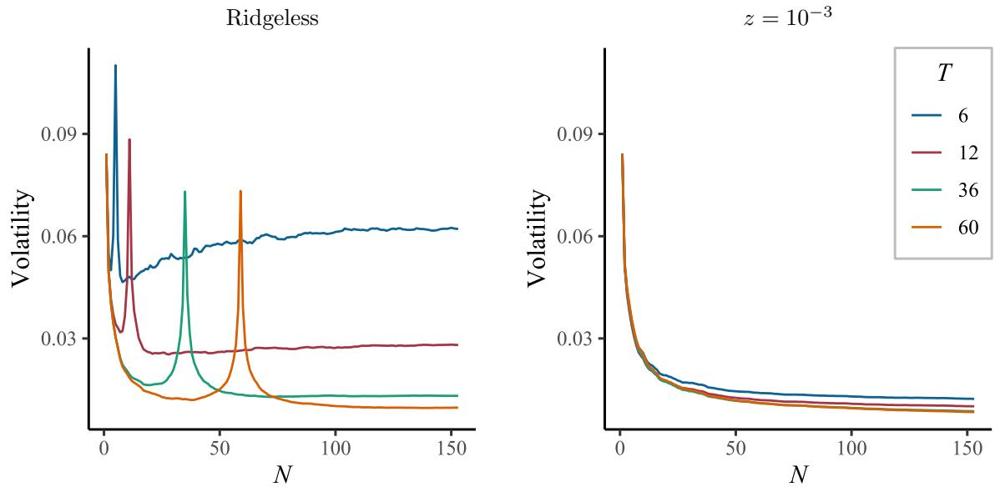
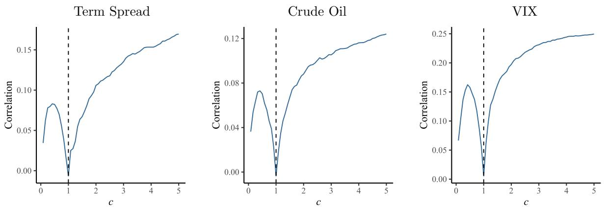
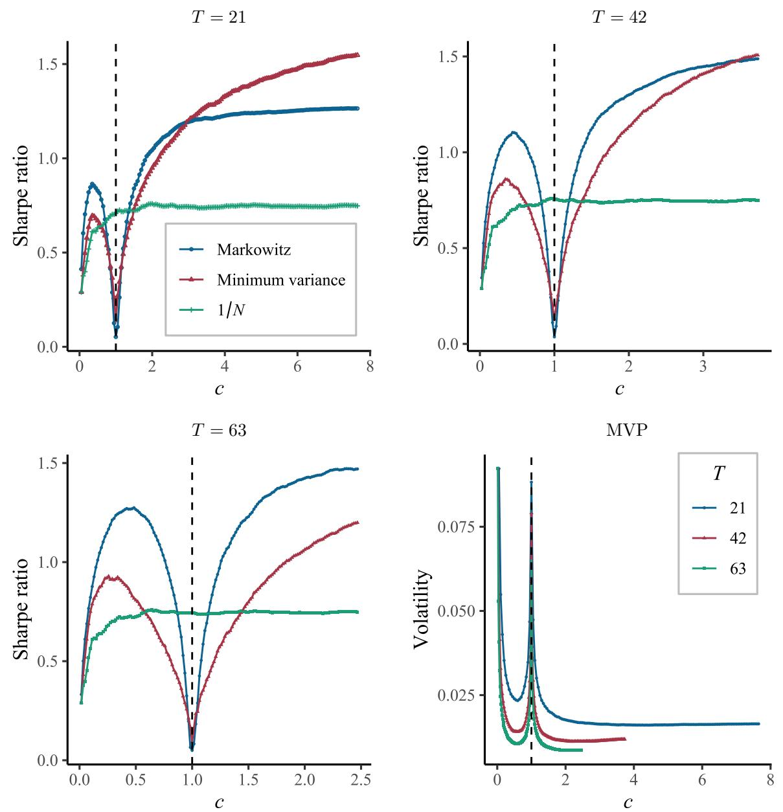
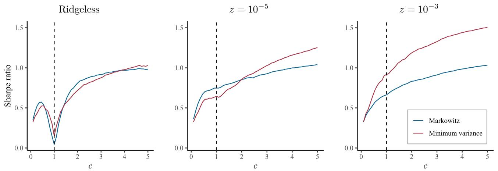
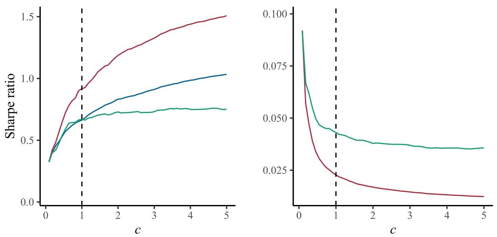
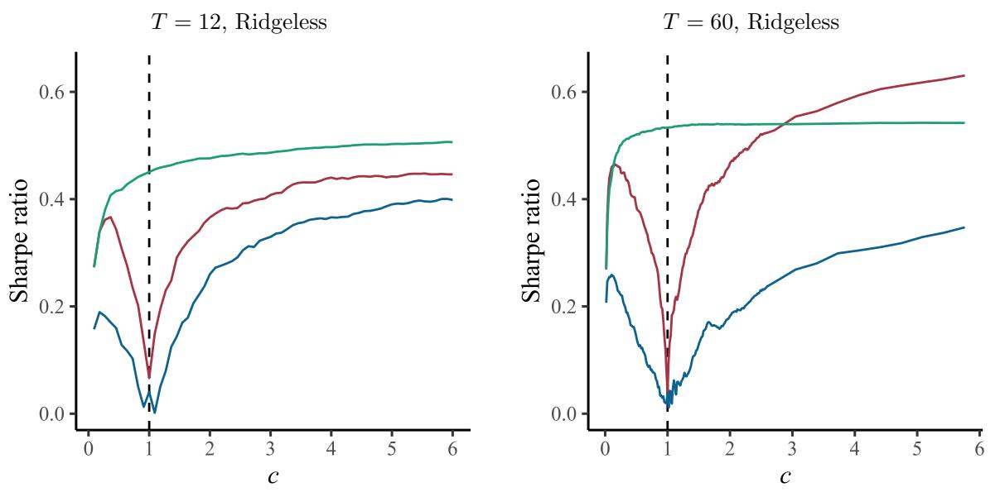

# Complex Modern Portfolio Theory

## Abstract

The literature has long wrestled with the practical usefulness of Modern Portfolio Theory (MPT), and extensive evidence shows its performance decreases rapidly with the number of assets (N). We present several new and counterintuitive facts about MPT. Most importantly, the performance of MPT in fact increases with N once the number of assets exceeds the number of training observations (T). This finding holds in a variety of settings: in conjunction with popular portfolio regularization methods, in a variety of asset universes, and when T is large or small.

## 1 Introduction

More than 70 years ago, [[Leverage Aversion And Risk Parity|Markowitz]] (1952) proposed his solution to selecting an optimal portfolio of risky assets. The environment is simple: There are N risky assets with mean returns $\mu = E [ R _ { t } ]$ and covariance matrix $\Sigma = C o v ( R _ { t } )$, and these are known by the investor. The investor’s objective is to select portfolio weights w to earn the highest possible return per unit of risk. The formalization of this problem is

$$
\max _ {w} w ^ {\prime} \mu - \frac {1}{2} w ^ {\prime} \Sigma w,
$$

and the “Markowitz” solution for the mean-variance efficient portfolio is

$$
w ^ {\mathrm{eff*}} = \Sigma^ {- 1} \mu.
$$

Likewise, Markowitz showed that an investor wishing to minimize the riskiness of their portfolio (but who must allocate a pre-specified proportion of their wealth to risky assets, e.g., fixing $w ^ { \prime } \iota = 1)$ achieves minimum variance with the portfolio

$$
w ^ {\mathrm{mvp*}} = \frac {\Sigma^ {- 1} \iota}{\iota^ {\prime} \Sigma^ {- 1} \iota}.
$$

These insights are the basis of what has come to be known as “Modern Portfolio Theory,” or MPT.

The literature has long cast doubt on the practical usefulness of $\mathrm{MPT}^{1}$. The crux of the problem is that means and covariances of returns are, of course, unknown to the investor and must be estimated. This is only a minor issue when N is just a few assets and T is large. In this case, “plug-in” portfolios that substitute sample moments for the unknown true moments converge to the true optimal portfolios thanks to the law of large numbers,

$$
\hat {w} ^ {\mathrm{eff}} = \hat {\Sigma} ^ {- 1} \hat {\mu} \underset {T \rightarrow \infty} {\rightarrow} w ^ {\mathrm{eff} *} \quad \text {and} \quad \hat {w} ^ {\mathrm{mvp}} = \frac {\hat {\Sigma} ^ {- 1} \iota}{\iota^ {\prime} \hat {\Sigma} ^ {- 1} \iota} \underset {T \rightarrow \infty} {\rightarrow} w ^ {\mathrm{mvp} *}. \tag {1}
$$

The critical condition for convergence in (1) is that the statistical “complexity” of the estimation problem, $c = N / T$, approaches zero. When N is large relative to $T \ ( \mathrm { i . e . , } \ c > 0 )$, the law of large numbers breaks down, and MPT portfolios can remain disastrously far from the true optimum. Even a small amount of complexity is problematic. Britten-Jones (1999) shows that when allocating across a mere N = 11 country-level equity indices in a sample of T = 120 months $\left( \textrm { so } c = 0 . 0 9 \right)$, the estimated optimal percentage of wealth to invest in the US equity index has a standard error of 47%!

Our empirical analysis shows that as the number of assets approaches T from below (c → 1), the performance of MPT portfolios collapses, consistent with prior literature highlighting large-N deficiencies of MPT. We then show the counterintuitive result that, by increasing the number of assets beyond T, MPT performance recovers. It continues to improve as the set of stocks N increases. In other words, in portfolio selection problems with high statistical complexity (c > 1), more assets are a blessing rather than a curse.

We organize our findings into a list of new MPT facts in data sets where N > T. First, we find that the out-of-sample Sharpe ratio of the Markowitz portfolio increases with N when $N > T$. Second, we find that the out-of-sample variance of the minimum variance portfolio (MVP) decreases with N. Third, we find that in most experiments, the MVP achieves a higher out-of-sample Sharpe ratio than the Markowitz portfolio when N is large. Fourth, we show that the Markowitz portfolio can eventually dominate the MVP when T is sufficiently large (while still requiring N > T).

A common approach to improve the empirical performance of MPT is to first regularize portfolio behavior using various forms of Bayesian shrinkage and portfolio constraints.2 Our fifth fact is that Markowitz and minimum variance portfolios continue to improve with N even when shrinkage and portfolio constraints are also applied.

In an influential paper, DeMiguel et al. (2009a) show that a naively diversified “1/N” portfolio achieves consistently higher out-of-sample Sharpe than a wide variety of practical MPT refinements, including shrinkage methods, portfolio constraints, and portfolio combinations. Indeed, our analysis shows that when c ≈ 1, the 1/N portfolio dominates the Markowitz and MVP both in terms of out-of-sample Sharpe ratio and variance. Our sixth fact, however, is that Markowitz and minimum variance portfolios both dominate the 1/N Sharpe ratio when N is sufficiently large, and that their performance relative to 1/N increases with N.

These empirical facts are robust. They hold in different asset universes: While we focus our analysis on a large set of anomaly factors from Jensen et al. (2023), the same patterns are found when building portfolios from individual stocks. The same patterns hold for various training sample sizes, even with as little as one year of monthly observations. We see that, holding complexity fixed, the benefits of complexity are larger when T is larger. And they apply at different data frequencies (daily and monthly).

Why does the MVP often achieve a higher Sharpe ratio than the Markowitz portfolio when N is large? The Markowitz portfolio suffers from estimation noise in both sample means and sample covariances. When $N > T$, however, the optimization problem becomes high-dimensional, and—as shown in Didisheim et al. (2024)—the Markowitz solution implicitly applies a form of ridge shrinkage to the covariance matrix. This unintended regularization partially mitigates covariance-estimation noise and can improve out-of-sample risk estimates. What it does not do is regularize the mean. In high dimensions, sample means are extremely noisy, and the Markowitz portfolio loads heavily on this noise. The MVP sidesteps this noise by replacing the sample mean vector with a constant vector, effectively imposing a dogmatic shrinkage of expected returns to a fixed value. When mean estimates are very noisy—as is typical in the $N \gg T$ regime—this mean-shrinkage benefit outweighs the loss of information, leading the MVP to outperform Markowitz in the Sharpe ratio. When T is sufficiently large, the Markowitz portfolio can overtake the MVP: once means are estimated with enough precision, the dogmatic shrinkage in MVP becomes unnecessary and even detrimental.

## 1.1 Literature Review

A large literature explores the challenges of MPT and creative methods for regularizing the sample covariance matrix in order to stabilize the out-of-sample performance of MPT. The prevailing view of practicality is aptly summarized by Michaud and Michaud (2007):

While theoretically important for modern finance, [mean-variance] optimization’s sensitivity to uncertainty in risk-return estimates typically results in an unstable asset management framework, ambiguous portfolio optimality, and poor out-of-sample performance...dominated by equal weighting and [has] essentially no practical investment value.

Ledoit and Wolf (2003) reach a similarly severe conclusion: “The central message of this paper is that nobody should be using the sample covariance matrix for the purpose of portfolio optimization.” The literature traces the failure of MPT to settings in which N is large relative to T. Brandt (2010) emphasizes that the quality of MPT portfolios “deteriorates drastically with the number of assets held in the portfolio. Intuitively, this is because, as the number of assets increases, the number of unique elements of the return covariance matrix increases at a quadratic rate.” DeMiguel et al. (2009a) argue that MPT can only be successful under the conditions that

(i) the estimation window is long; (ii) the ex ante (true) Sharpe ratio of the mean-variance efficient portfolio is substantially higher than that of the 1/N portfolio; and (iii) the number of assets is small. The first two conditions are intuitive. The reason for the last condition is that a smaller number of assets implies fewer parameters to be estimated and, therefore, less room for estimation error. Moreover, other things being equal, a smaller number of assets makes naive diversification less effective relative to optimal diversification.

The received wisdom for the failure of MPT—that it emerges when there are too many assets N relative to the number of time series observations T—is based on empirical analyses in which N approaches T from below. For example, DeMiguel et al. (2009a) use a simulation to demonstrate sample sizes in which MPT is likely to fail, but their analysis never considers values of c above about 0.4. Another such example is Kan and Zhou (2007) who show that MPT performance is decreasing in N, and again the largest c they consider is around 0.4. This focus on $c \leq 1$ is found throughout the MPT literature. While correct in its conclusions about the failure of MPT when $c \leq 1$, the prior literature illustrates only one component of a bigger picture. The central contribution of our paper is to demonstrate the surprisingly strong performance of MPT in complex samples, when N is much larger than T (c ≫ 1).

Much of the MPT literature shows that Bayesian (or other shrinkage) techniques and portfolio constraints are critical for improving the empirical performance of MPT. Leading examples include Jobson and Korkie (1980), Jorion (1986), Pastor and Stambaugh (2000), Jagannathan and Ma (2003), Garlappi et al. (2007), and Ledoit and Wolf (2017), among many others. A key contribution of our paper is demonstrating the great benefit of implicit regularization that arises in complex portfolio environments and how this resurrects the practical viability of MPT. We also show that further explicit regularization (of the kinds studied in the literature referenced above) is complementary to complexity’s implicit regularization and can further boost Markowitz portfolio performance.

Our paper also extends the literature on the virtue of complex statistical models for empirical asset pricing, including Kelly et al. (2024a) and Didisheim et al. (2024), among others. Those papers focus on the benefits of complexity arising from machine learning designs for predictive regressions and asset pricing models. In contrast, our paper is not about prediction or conditional models. Instead, we demonstrate the benefits of statistical complexity in the vanilla unconditional portfolio choice problem, absent any role of machine learning. In doing so, we leverage and extend our understanding of implicit shrinkage, limits to learning, and other complex phenomena documented in the prior literature.

## 2 New Facts in Modern Portfolio Theory

## 2.1 Data and Methods

In this section, we study how out-of-sample MPT performance depends on the number of assets under consideration, N. Our main analysis uses monthly returns for 153 US factor portfolios from Jensen et al. (2023) (JKP henceforth) from 1972 to 2023. The start date in 1972 ensures that we have non-missing returns for all factors. We use a rolling training window of $T = 12$ training observations to estimate the sample mean vector and variance-covariance matrix. We compute optimal portfolios using $N = 1, . . . , 153$, thus c ranges from approximately zero to 13. To ensure that our results are not driven by the ordering of the JKP factors, for each $N < 153$ we recompute optimal portfolios using 100 randomly permuted factor orderings. Our figures and tables report the average portfolio performance across all permutations.

In Sections 2.8 and 2.9, we extend our analysis to other asset cross-sections and longer training windows. For individual stocks, we use monthly equity returns from CRSP and sample from the largest 400 stocks 100 times each month. Similar to the other figures, we report the average portfolio performance across all samples. In Section 2.11, we perform our analysis using daily return data for the JKP factors.

## 2.2 MPT When $c \leq 1$

We first analyze the performance of MPT when the number of assets N is less than or equal to the number of observations T, reported in Panel A of Figure 1. The left plot shows the out-of-sample Sharpe ratio of the Markowitz portfolio, and the right plot shows the out-of-sample volatility of the MVP. When c is close to zero, the performance of both portfolios improves from increasing the number of assets in the cross-section. Increasing the number of assets allows the Markowitz portfolio to allocate more weight to assets with higher average returns, and it allows both Markowitz and MVP to reduce risk by finding more diversification opportunities. These gains max out when c is around 0.5. Beyond this, there are not enough observations to precisely estimate the increasing number of parameters. As a result, portfolio estimates are dominated by noise. When $c = 1$, the Sharpe ratio of the Markowitz portfolio

Panel A: c ≤ 1  

Panel B: c > 1  
  
Figure 1: Out-of-sample MPT Performance.

The figure shows the performance of the Markowitz and minimum variance portfolio based on a varying number of equity factors. Specifically, we randomly select N factors and, each month, create the portfolios based on their sample mean and variance-covariance matrix estimated over the past T = 12 months. For every N, we repeat the random selection process 100 times and average the performance statistics across permutations. The x-axis shows complexity defined as $c = N / ( T - 1)$. a The y-axis for figures on the left shows the annualized out-of-sample Sharpe ratio of the Markowitz portfolio. The y-axis on the right shows the annualized out-of-sample volatility of the minimum variance portfolio. Performance is calculated on data from 1972 to 2023.

falls close to zero because it fails to identify the relatively high return assets and because noisy weight estimates drive up the portfolio’s variance. The MVP is so severely corrupted by noise that its volatility exceeds the volatility of individual assets (the leftmost point in the figure corresponds to a single-asset portfolio).

In the absence of estimation noise, we would expect Markowitz and MVP performance to improve (weakly) with N as it has more diversification opportunities at its disposal. Thus, when viewing Figure 1, it is useful to keep in mind that the cratering performance of MPT is net of the diversification benefits from larger N.

These findings are neither new nor surprising. Instead, Panel A of Figure 1 establishes a baseline understanding of the challenges faced by MPT when using even moderate numbers of assets. The failure of MPT when N approaches T has motivated the decades-long search for portfolio optimization refinements (shrinkage, constraints, and so forth) as articulated in our literature review.

## 2.3 MPT When $c > 1$

Next, we analyze out-of-sample MPT performance when the number of assets is allowed to exceed the number of observations $( \mathrm { i . e . , } \ c \geq 1)$. In this case, the inverse of the sample covariance $\hat { \Sigma }$ in equation (1) is undefined, thus we instead compute the inverse covariance using the Moore-Penrose pseudo-inverse, $\hat { \Sigma } ^ { + }$.

Panel B of Figure 1 extends the portfolio analysis to allow the number of assets to exceed the number of training observations $( c > 1)$. In this case, the Sharpe ratio of the Markowitz portfolio is increasing in N, and does not flatten out until the ratio of assets to data points reaches approximately $c = 4$. Likewise, the volatility of the MVP is decreasing in N, flattening around $c = 2$. Evidently, the failures of $\mathrm{MPT}$ emphasized in prior literature are not about large $N$, but are instead about $N \approx T$. In fact, a higher N is a virtue when it comes to $\mathrm{MPT}$, as long as N is larger than the number of training observations.

## 2.4 The Role of Shrinkage

  
Figure 2: MPT Performance with Shrinkage.

Panel A reports MPT Sharpe ratios. The left panel shows the Markowitz portfolio with various degrees of ridge shrinkage, the center panel shows the Markowitz portfolio with a no-shorting constraint, and the right panel shows the (ridgeless) Markowitz portfolio, the (ridgeless) minimum variance portfolio, and the 1/N portfolio. Panel B shows portfolio volatility. The left panel shows the minimum variance portfolio with various degrees of ridge shrinkage, the center panel shows the minimum variance portfolio with a no-shorting constraint, and the right panel shows the (ridgeless) minimum variance portfolio and the 1/N portfolio.

A large body of literature proposes regularization methods to improve the empirical performance of MPT portfolios. One major strand of this literature advocates covariance shrinkage to improve out-of-sample portfolio performance. Thus, we investigate how covariance shrinkage alters the behavior of MPT in high complexity settings and affects our conclusions from Section 2.3. We focus our analysis on ridge shrinkage, which is among the oldest, most well-known, and most commonly employed covariance regularization methods.3

As a counterpart to the unregularized portfolios in (1), ridge regularized MPT portfolios with shrinkage parameter $z > 0$ are given by

$$
\hat {w} ^ {\mathrm{eff}} (z) = (z I + \hat {\Sigma}) ^ {- 1} \hat {\mu} \quad \mathrm{and} \quad \hat {w} ^ {\mathrm{mvp}} (z) = (z I + \hat {\Sigma}) ^ {- 1} \iota. \tag {2}
$$

Interestingly, ridge regularization has a close connection with the high complexity MPT portfolios in Section 2.3 because the pseudo-inverse has an equivalent interpretation as infinitesimal ridge regularization. In particular, we can rewrite the sample MPT portfolios as

$$
\hat {w} ^ {\mathrm{eff}} = \hat {\Sigma} ^ {+} \hat {\mu} = \lim _ {z \rightarrow 0 +} (z I + \hat {\Sigma}) ^ {- 1} \hat {\mu} \quad \text {and} \quad \hat {w} ^ {\mathrm{mvp}} = \hat {\Sigma} ^ {+} \iota = \lim _ {z \rightarrow 0 +} (z I + \hat {\Sigma}) ^ {- 1} \iota. \tag {3}
$$

When $c \leq 1$, the limit is exactly zero shrinkage and corresponds to the sample portfolio using the standard matrix inverse. When $c > 1$, the standard inverse does not exist, so the limit in (3) is discontinuous. In this case, the pseudo-inverse can be defined as a limit as ridge shrinkage approaches zero—i.e., it adds just enough identity matrix to the covariance so that their sum is invertible. Following Kelly et al. (2024a), we refer to MPT portfolios that use infinitesimal shrinkage as “ridgeless” portfolios, and we denote these by $\hat { w } ^ {\mathrm { eff } } ( 0 ^ { + } )$ and $\hat { w } ^ {\mathrm { mvp } } ( 0 ^ { + } )$. Thus, the ridge portfolios in (2) are simply an extension of the analysis in Figure 1 to incorporate non-trivial positive shrinkage.

Panel A of Figure 2 illustrates how the performance of ridge-regularized MPT portfolios changes with the number of assets. There are three key findings from this figure. First, when $c > 1$, the performance of MPT portfolios is increasing with N for any amount of shrinkage (including the ridgeless case with shrinkage approaching zero). Second, the primary benefit of non-trivial ridge shrinkage is that it robustifies portfolio performance in the neighborhood of $c = 1$. Third, non-trivial ridge shrinkage further amplifies the benefits of very large N. While we find that the out-of-sample performance of the ridgeless Markowitz portfolio flattens around $c = 4$ and the performance of the ridgeless MVP flattens around $c = 2$, heavier shrinkage $( \mathrm { e . g . } , z = 1 0 ^ { - 3 })$ extends the large N performance benefits even further and pushes the Sharpe ratio above 1.0 (and higher than the ridgeless case). Complexity gains from non-trivial shrinkage are even larger for MVP portfolios. For example, a ridge parameter of $z = 1 0 ^ { - 3 }$ reduces MVP volatility by about half at $c = 5$, and the volatility curve continues to improve beyond $c = 5$.

## 2.5 Minimum Variance Can Maximize Sharpe Ratio

Thus far, we have evaluated the Markowitz portfolio in terms of its out-of-sample Sharpe ratio and the MVP in terms of its out-of-sample volatility. We show that not only is the volatility of the MVP improving with N, but so is its Sharpe ratio (see Figure 6 of the Internet Appendix). So much, in fact, that the MVP Sharpe ratio dominates that of the Markowitz portfolio when c is large (left panel). Adding non-trivial ridge shrinkage (center and right panels) leads to even starker gains in MVP Sharpe ratio, both in absolute terms and relative to Markowitz.

Since Markowitz and MVP share the same inverse covariance, the difference in their Sharpe ratios traces to their treatment of mean returns. Markowitz uses sample means, while the MVP can be interpreted as a Markowitz portfolio that constrains all assets to have the same mean. The MVP can thus be viewed as a dogmatic form of mean shrinkage. In the training samples reported in Figure 6, the noisiness of sample means stifles the Markowitz performance so much that the extreme mean shrinkage of MVP is preferred. With larger training samples, the performance of Markowitz and MVP may reverse, as we show next. And, while outside the scope of this paper, our findings suggest that intermediate mean shrinkage between that of Markowitz (zero mean shrinkage) and MVP (100% shrinkage to a constant mean) can further improve portfolio performance (see e.g. Pedersen et al., 2021).

## 2.6 The Role of Constraints

Another literature proposes portfolio constraints as a means of improving the empirical performance of MPT. The leading example is Jagannathan and Ma (2003) who show that imposing a non-negativity constraint on the portfolio optimization problem improves its out-of-sample performance.4 To understand how complexity interacts with portfolio constraints, we modify our high-dimensional MPT problems, restricting weights to be nonnegative. Panel B of Figure 2 shows that even in the presence of a non-negativity constraint, MPT performance improves when the number of assets becomes large. This is true in the “ridgeless” and the non-trivial ridge cases. With $z = 1 0 ^ { - 3 }$, the constrained complex Markowitz Sharpe ratio rises by nearly 25% compared to the unconstrained complex model in Figure 2.

Interestingly, the collapse of the ridgeless Markowitz Sharpe ratio no longer occurs exactly at $c = 1$ but closer to $c = 1 . 5$. In the unconstrained model, the Markowitz portfolio achieves an infinite in-sample Sharpe ratio at $c = 1$; in other words, it “interpolates” the training returns when $N \geq T$ (see, e.g., Kelly and Malamud, 2025). But with a nonnegativity constraint, the Markowitz solution (typically) requires a larger number of assets to interpolate, which is why the performance dip occurs at a higher value of $c$.

## 2.7 Resilience of $1 / N$

DeMiguel et al. (2009a) masterfully demonstrate failures of applied MPT by showing that a naively diversified portfolio that equally weights assets, the “1/N” portfolio, dominates a wide variety of optimal portfolios, including those employing various forms of regularization. In the previous section, we interpreted the MVP as a Markowitz portfolio with dogmatic mean shrinkage. Likewise, the $1/N$ portfolio can be interpreted as a Markowitz portfolio with the same dogmatic mean shrinkage as MVP and with dogmatic variance shrinkage to the identity matrix. We now examine the role of this shrinkage design for large-N portfolios.

Panel C of Figure 2 compares the performance of the $1/N$ with MPT portfolios in terms of out-of-sample Sharpe ratio (top panels) and volatility (bottom panels). Indeed, the $1/N$ portfolio is extremely resilient as the number of assets grows, achieving an attractive Sharpe ratio and low volatility. When compared to ridgeless MPT (left panels), $1/N$ far exceeds the performance of the Markowitz portfolio and MVP around $c = 1$. Evidently, it is the breakdown of MPT when $N \approx T$ that drives the outperformance of $1/N$. When $c \ll 1$ or $c \gg 1$, MPT portfolios are superior to $1/N$ in terms of both Sharpe ratio and volatility. For non-trivial positive shrinkage of $z = 1 0 ^ { - 3}$, MPT outperforms $1/N$ by an substantially larger margin and is even superior to $1/N$ in the critical region $c \approx 1$ (shown in Internet Appendix Figure 7 due to space constraints).

## 2.8 The Role of T

Panel A: Markowitz Sharpe Ratio  
  
$z = 1 0 ^ { - 3 }$ z = 10−3

Panel B: MVP Volatility  
  
z = 10−3 $z = 1 0 ^ { - 3 }$

Figure 3: MPT Effects of Sample Size (T).

Panels A and B show the out-of-sample Sharpe ratio of the Markowitz portfolio and the volatility of minimum variance portfolio, respectively, as we vary the number of time periods T in the rolling training window. Each point is averaged across 25 random permutations.

In our analysis so far, we have fixed the sample size to a mere $T = 12$ monthly training observations. We now explore how our previous conclusions are affected by varying the number of training observations. We repeat the preceding analyses that evaluate portfolio performance as we gradually increase the number of assets in the cross-section.

Panel A of Figure 3 plots out-of-sample Sharpe ratios for $\mathrm{MPT}$ portfolios. Because our analysis now varies both N and T, we use N to delineate the x-axis and use different lines for each choice of $T = 6, 12, 36$, and 120 months. We report Sharpe ratios for both Markowitz and minimum variance portfolios (left and right columns, respectively) and for the ridgeless case (top row) and non-trivial ridge $( z = 1 0 ^ { - 3 }$, middle row).

Panel A illustrates four main findings. First, there are portfolio benefits to increasing cross-section size N for any sample size T. Second, the scale of the Sharpe ratio curves is increasing in T. In other words, larger sample sizes magnify the benefits of large N MPT portfolios. While this is reminiscent of traditional asymptotic theory (fixing N and increasing T), larger $T$ cannot avoid MPT collapse in the critical region $c \approx 1$. Third, with sufficiently large $T$, the performance of the high complexity Markowitz portfolio eventually exceeds that of the MVP, which occurs in Figure 3 for $T \geq 36$. Fourth, with non-trivial ridge shrinkage (bottom row of Figure 3), MPT performance strictly improves in both N and $T$. Finally, Panel B reports the effect of sample size T on volatility of the MVP. These results are consistent with the conclusions of Panel A: Out-of-sample MVP volatility improves as $T$ increases.

## 2.9 MPT and Individual Stocks

Our analysis to this point has focused on 153 factor portfolios as base assets. In this section, we examine the behavior of large-N MPT using individual stocks. Figure 8 in the Internet Appendix shows how the MPT portfolios perform as a function of complexity. As shown in DeMiguel et al. (2009a), the $1 / N$ portfolio performs well out-of-sample, achieving a higher Sharpe ratio than both the Markowitz portfolio and MVP when $T = 12$. However, when the estimation window is large enough—for example, at $T = 60$—the MVP outperforms $1 / N$ in the high-complexity setting $N \gg T$. The Markowitz portfolio still struggles even with this longer estimation window, in contrast to the results that used factor portfolios. This is consistent with individual stock returns being less stationary than factor returns—the historic average factor returns are informative about the expected factor returns, while the average stock returns are bad estimates of expected stock returns going forward. The MVP sidesteps this issue by dogmatically shrinking the means to a constant.

  
Figure 4: Correlations of Hedging Portfolios.

The figure shows correlations of different macro variables and their hedging portfolios. Specifically, we randomly select N JKP factors and, each month, create the portfolio with the highest correlation to the macro variable in question over the past $T = 12$ months. For every $N$, we repeat the random selection process 100 times, and the performance statistics are averaged across these permutations. The x-coordinate shows the complexity, defined as $c = N / T$. The correlations are calculated using data from 1977 to 2023.

## 2.10 Large N Risk Modeling

Our analysis so far has focused on the performance of optimized portfolios. The strong performance of MPT in high complexity settings traces in large part to the stable behavior of the sample covariance. In this section, we analyze another application of the high complexity covariance matrix—its ability to create hedging portfolios. In other words, the sample covariance plays a broader role as a risk model. We now ask whether high complexity is as beneficial for out-of-sample risk modeling as it is for portfolio performance.

We are interested in hedging specific risks that are not spanned by the JKP factors. In particular, we attempt to hedge changes in the 10y-1y term spread, crude oil returns, and VIX returns using the FRED-MD data. The hedging portfolio is estimated by the coefficients of the regression

$$
y _ {t} = w ^ {\prime} F _ {t} + \varepsilon_ {t}, \tag {4}
$$

where $y _ { t }$ is the risk of interest and $F _ { t }$ is the vector of factor returns. In vector form

$$
y = F w + \varepsilon. \tag {5}
$$

The hedging portfolio is then

$$
\hat {w} ^ {\text {hedge}} = \left(F ^ {\prime} F\right) ^ {+} y. \tag {6}
$$

We estimate the hedging portfolio using a 12-month rolling window.

Figure 4 shows the realized correlations between the hedging portfolios and their targets as a function of their statistical complexity, $c = N / T$. We again see the familiar virtue of complexity curve—performance is hump-shaped in the $c < 1$ region, collapsing at $c = 1$, and increasing in the $c > 1$ region.

These empirical results can be understood in light of Kelly et al. (2024b). The more included assets, the better they can capture complex time-series patterns of the risk of interest. This ability is more important than the higher statistical costs associated with more assets, leading to more assets increasing the out-of-sample correlation.

For hedging portfolio problems with high statistical complexity, more assets are once again a blessing rather than a curse.

## 2.11 Data Frequency

Our results and discussion thus far highlight that the gains from complexity come through improved behavior of the sample unconditional covariance matrix. A valuable direction for future research is to analyze the role of complexity in modeling high-dimensional conditional covariances (see e.g. Bauwens et al., 2006; Engle et al., 2019). For example, a large literature models dynamic “spot” covariance using high-frequency data (e.g. Barndorff-Nielsen and Shephard, 2004; Bollerslev et al., 2018; Andersen et al., 2006; Hautsch et al., 2012). These estimators typically take some form of a sample covariance estimated in a short window from even shorter-horizon returns (e.g., daily “realized” covariances estimated from 5-minute returns within the day). The benefits of complexity can be especially valuable in such problems where the number of training observations is forced to be small due to the focus on “integrated” covariance over a short interval.5

While a detailed analysis of complex MPT for higher frequency problems is beyond the scope of this paper, in this section we provide a brief demonstration of the beneficial effects of complexity in short calendar time windows with higher frequency of return observations. While our analysis up to now uses monthly observations to estimate portfolios, we now

  
Figure 5: MPT and Daily Data.

explore the effects of using daily data to construct MPT portfolios. With the exception of the data frequency, our analysis is otherwise unchanged $( \mathrm { i . e . }$ , we continue to rebalance portfolios monthly, maintain the same sample horizons and assets, and so on).

In Figure 5, we plot the performance of Markowitz, MVP, and $1/N$ portfolios for $T =$ 21, 42, or 63 days. Consistent with the findings in preceding sections, the performance of MPT portfolios are increasing both in N (when $c > 1)$ and in T. More importantly, Figure 5 demonstrates that complex MPT achieves attractive out-of-sample performance—well exceeding the $1/N$ benchmark—with as little as one month of daily data.

## 3 Theory

In this section we derive a statistical theory to better understand the behavior of complex MPT. It is an unconditional analogue of the “virtue of complexity” theory of conditional asset pricing models presented in Kelly et al. (2024b) and Didisheim et al. (2024). We show that the empirical behavior of complex MPT documented above is closely matched by our theory with a simple set of assumptions.

## 3.1 Main Result

We use $X \approx Y$ to denote that $X - Y  0$ in probability. The following theorem is derived from Assumption 1 in the appendix, which imposes technical conditions on the unconditional moments of returns that ensure random matrix theory limits are well behaved.

Theorem 1 Suppose we sample uniformly without repetition $N _ { 1 }$ assets from $\{ 1, \ldots, N \}$. In the limit as $N _ { 1 }, T \to \infty$ with $N _ { 1 } / T \to c > 0$ and $z \to 0 +$, the following is true:

1. “Classical Regime”: If $c < 1$, then

$$
\frac {E [ R _ {T + 1} ^ {\prime} \hat {w} ^ {\mathrm{eff}} ] ^ {2}}{\mathrm{Var} [ R _ {T + 1} ^ {\prime} \hat {w} ^ {\mathrm{eff}} ]} \approx c (1 - c) \mu^ {\prime} \Sigma^ {- 1} \mu \frac {1}{\frac {N}{T} + \frac {N ^ {2}}{T ^ {2}}}.
$$

In particular, the classical regime squared Sharpe ratio is maximized at $c = 1 / 2$. Moreover,

$$
N _ {1} \mathrm{Var} [ R _ {T + 1} ^ {\prime} \hat {w} ^ {\mathrm{mvp}} ] \approx \frac {1}{1 - c} \frac {1}{\iota^ {\prime} \Sigma (N _ {1}) ^ {- 1} \iota / N _ {1}}.
$$

2. “Complex Regime”: If $N _ { 1 } = N$ and $c = N / T$ is large, then

$$
\frac {E [ R _ {T + 1} ^ {\prime} \hat {w} ^ {\mathrm{eff}} ] ^ {2}}{\mathrm{Var} [ R _ {T + 1} ^ {\prime} \hat {w} ^ {\mathrm{eff}} ]} \approx \frac {\| \mu \| ^ {4}}{T ^ {- 1} \operatorname{tr} (\Sigma^ {2}) + \mu^ {\prime} \Sigma \mu} + O (c ^ {- 2}), \tag {7}
$$

and

$$
N \operatorname{Var} [ R _ {T + 1} ^ {\prime} \hat {w} ^ {\mathrm{mvp}} ] \approx \frac {\iota^ {\prime} \Sigma \iota}{N} + O (c ^ {- 1}). \tag {8}
$$

Thus, for N sufficiently large, the squared Sharpe ratio in the complex regime dominates that of the best portfolio in the classical regime (which is attained at $c = 1 / 2$).

## 3.2 Interpretation

Theorem 1 highlights a phase transition in portfolio behavior as model complexity increases. In particular, the Sharpe ratio of the Markowitz portfolio exhibits a “double ascent” pattern as the ratio $c = N _ { 1 } / T$ grows. In the classical regime $( N _ { 1 } < T)$, portfolio performance follows the familiar bias–variance tradeoff. As the number of assets increases, diversification initially improves performance, but estimation error eventually dominates. Consequently, the Markowitz Sharpe ratio is hump-shaped and symmetric around $c = 0.5$: it increases for $N _ { 1 } < 0.5 T$ and declines to zero as $N _ { 1 }$ approaches $T$. This aligns remarkably closely with the empirical patterns documented throughout our paper, and particularly in Figure 1.

An interesting prediction of the theory is that the highest achievable squared Sharpe ratio in the classical regime is roughly eight times smaller than the infeasible population benchmark $\mu ^ {\prime} \Sigma ^ { - 1} \boldsymbol { \mu }$. Finally, while we can also characterize the behavior of the minimum variance portfolio, its volatility in the classical regime is not necessarily minimized at $c = 0.5$.

Beyond the interpolation threshold $( c > 1)$, portfolio behavior changes fundamentally. Once the model becomes sufficiently over-parameterized, portfolio performance improves again. This phenomenon corresponds to the virtue of complexity documented in Kelly et al. (2024b) and Didisheim et al. (2024): the Sharpe ratio of the (ridgeless) Markowitz portfolio in the high-complexity regime exceeds the best level attainable in the classical regime. Likewise, the (ridgeless) minimum variance portfolio attains a lower volatility in the complex regime.

The mechanism behind Markowitz portfolio improvement in the complex regime is implicit regularization (Didisheim et al., 2024) that ensures estimation risk grows only linearly with $N$; whereas in the classical regime there is no implicit shrinkage and estimation risk grows quadratically.

The implicit regularization that emerges with complexity can in some cases reduce portfolio variance without increasing bias (i.e., without reducing the expected return, as discussed in Kelly and Malamud, 2025).

A similar pattern arises for the minimum-variance portfolio. In the classical regime, diversification (captured by $\iota ^ { \prime } \Sigma ( N _ { 1 } ) ^ { - 1 } \iota$) initially offsets the overfitting factor $1 / ( 1 - c)$, but overfitting eventually dominates, causing the variance to explode as $c \uparrow 1$. In contrast, in the high-complexity regime, implicit regularization prevents this explosion. Instead, for typical covariance configurations, the variance collapses toward zero as $N \to \infty$. Indeed, since $\| \boldsymbol { \iota } \| ^ { 2 } = N$,

$$
\frac {\iota^ {\prime} \Sigma \iota}{N ^ { 2}} \leq \frac {\| \Sigma \|}{N} \to 0.
$$

Taken together, these results suggest that the virtue of complexity is a structural feature of high-dimensional portfolio optimization rather than an artifact of a particular dataset.

## 4 Conclusion

We present an empirical resurrection of Modern Portfolio Theory (MPT) when the number of assets is large. We show in a variety of settings that the performance of MPT increases with the number of assets once enough assets are included. We analyze the role of complexity, shrinkage, constraints, and the length of the estimation window. We show that performance gains come through implicit bias in the covariance matrix and not mean estimates. These results are consistent with theory showing that the virtue of complexity exists in high dimensional portfolio optimization.

## References

Andersen, Torben G, Tim Bollerslev, Francis X Diebold, and Ginger Wu, “Realized Beta: Persistence and Predictability,” Advances in Econometrics, 2006, pp. 1–39.  
Andreou, Elena and Eric Ghysels, “Structural breaks in financial time series,” Handbook of financial time series, 2009, pp. 839–870.  
Bai, Zhidong and Wang Zhou, “Large sample covariance matrices without independence structures in columns,” Statistica Sinica, 2008, pp. 425–442.  
Barndorff-Nielsen, Ole E and Neil Shephard, “Econometric analysis of realized covariation: High frequency based covariance, regression, and correlation in financial economics,” Econometrica, 2004, 72 (3), 885–925.  
Bauwens, Luc, S´ebastien Laurent, and Jeroen VK Rombouts, “Multivariate GARCH models: a survey,” Journal of applied econometrics, 2006, 21 (1), 79–109.  
Bollerslev, Tim, Andrew J Patton, and Rogier Quaedvlieg, “Modeling and forecasting (un) reliable realized covariances for more reliable financial decisions,” Journal of Econometrics, 2018, 207 (1), 71–91.  
Brandt, Michael W, “Portfolio choice problems,” in “Handbook of financial econometrics: Tools and techniques,” Elsevier, 2010, pp. 269–336.  
Britten-Jones, Mark, “The Sampling Error in Estimates of Mean-Variance Efficient Portfolio Weights,” Journal of Finance, 1999, 54 (2), 655–670.  
Chen, Zhimin, Bryan Kelly, and Semyon Malamud, “Limits To (Machine) Learning,” arXiv preprint arXiv:2512.12735, 2025.  
Chernov, Mikhail, Bryan T Kelly, Semyon Malamud, and Johannes Schwab, “A test of the efficiency of a given portfolio in high dimensions,” Technical Report, National Bureau of Economic Research 2025.  
Chopra, Vijay K, Chris R Hensel, and Andrew L Turner, “Massaging mean-variance inputs: returns from alternative global investment strategies in the 1980s,” Management Science, 1993, 39 (7), 845–855.  
Cohen, Kalman J and Jerry A Pogue, “An empirical evaluation of alternative portfolio selection models,” The Journal of Business, 1967, 40 (2), 166–193.  
DeMiguel, Victor, Lorenzo Garlappi, and Raman Uppal, “Optimal versus naive diversification: How inefficient is the 1/N portfolio strategy?,” The review of Financial studies, 2009, 22 (5), 1915–1953.  
, , Francisco J Nogales, and Raman Uppal, “A generalized approach to portfolio optimization: Improving performance by constraining portfolio norms,” Management science, 2009, 55 (5), 798–812.  
Didisheim, Antoine, Shikun Barry Ke, Bryan T Kelly, and Semyon Malamud, “APT or AIPT: The Surprising Dominance of Large Factor Models,” Technical Report, National Bureau of Economic Research 2024.  
Elton, Edwin J and Martin J Gruber, “Estimating the dependence structure of share prices–implications for portfolio selection,” The Journal of Finance, 1973, 28 (5), 1203–1232.  
Engle, Robert F, Olivier Ledoit, and Michael Wolf, “Large dynamic covariance matrices,” Journal of Business & Economic Statistics, 2019, 37 (2), 363–375.  
Garlappi, Lorenzo, Raman Uppal, and Tan Wang, “Portfolio selection with parameter and model uncertainty: A multi-prior approach,” The Review of Financial Studies, 2007, 20 (1), 41–81.  
Hautsch, Nikolaus, Lada M Kyj, and Roel CA Oomen, “A blocking and regularization approach to high-dimensional realized covariance estimation,” Journal of Applied Econometrics, 2012, 27 (4), 625–645.  
Jagannathan, Ravi and Tongshu Ma, “Risk reduction in large portfolios: Why imposing the wrong constraints helps,” The journal of finance, 2003, 58 (4), 1651–1683.  
Jensen, Theis Ingerslev, Bryan Kelly, and Lasse Heje Pedersen, “Is there a replication crisis in finance?,” The Journal of Finance, 2023, 78 (5), 2465–2518.  
Jobson, J David and Bob Korkie, “Estimation for Markowitz efficient portfolios,” Journal of the American Statistical Association, 1980, 75 (371), 544–554.  
Jorion, Philippe, “Bayes-Stein estimation for portfolio analysis,” Journal of Financial and Quantitative analysis, 1986, 21 (3), 279–292.  
, “Portfolio optimization with tracking-error constraints,” Financial Analysts Journal, 2003, 59 (5), 70–82.  
Kan, Raymond and Guofu Zhou, “Optimal portfolio choice with parameter uncertainty,” Journal of Financial and Quantitative Analysis, 2007, 42 (3), 621–656.  
Kelly, Bryan, Semyon Malamud, and Kangying Zhou, “The virtue of complexity in return prediction,” The Journal of Finance, 2024, 79 (1), 459–503.  
, , and , “The virtue of complexity in return prediction,” The Journal of Finance, 2024, 79 (1), 459–503.  
Kelly, Bryan T and Semyon Malamud, “Understanding The Virtue of Complexity,” Available at SSRN 5346842, 2025.  
Knowles, Antti and Jun Yin, “Anisotropic local laws for random matrices,” Probability Theory and Related Fields, 2017, 169 (1), 257–352.  
Ledoit, O and M Wolf, “Honey, I shrunk the sample covariance matrix,” 2004, J. Portf. Management, 31, 110.  
Ledoit, Olivier and Michael Wolf, “Honey, I shrunk the sample covariance matrix,” UPF economics and business working paper, 2003, (691).  
and , “A well-conditioned estimator for large-dimensional covariance matrices,” Journal of multivariate analysis, 2004, 88 (2), 365–411.  
and , “Nonlinear shrinkage of the covariance matrix for portfolio selection: Markowitz meets Goldilocks,” The Review of Financial Studies, 2017, 30 (12), 4349–4388.  
Markowitz, Harry, “Portfolio Selection,” The Journal of Finance, 1952, 7 (1), 77–91.  
Michaud, Richard O, “The Markowitz optimization enigma: Is ‘optimized’ optimal?,” Financial analysts journal, 1989, 45 (1), 31–42.  
and Robert Michaud, “Estimation error and portfolio optimization: a resampling solution,” Available at SSRN 2658657, 2007.  
P´astor, L’uboˇs, “Portfolio selection and asset pricing models,” The Journal of Finance, 2000, 55 (1), 179–223.  
and Robert F Stambaugh, “Comparing asset pricing models: an investment perspective,” Journal of Financial Economics, 2000, 56 (3), 335–381.  
Pedersen, Lasse Heje, Abhilash Babu, and Ari Levine, “Enhanced portfolio optimization,” Financial Analysts Journal, 2021, 77 (2), 124–151.  
St˘aric˘a, C˘at˘alin and Clive Granger, “Nonstationarities in stock returns,” Review of economics and statistics, 2005, 87 (3), 503–522.

## Internet Appendix

## A Additional Results

  
Figure 6: Sharpe Ratio Comparison of Markowitz and Minimum Variance Portfolios.

The figure shows the Sharpe ratio of Markowitz and minimum variance as a function of shrinkage and complexity.

  
Figure 7: Complex MPT and 1/N With Ridge Shrinkage.

The figure shows the performance of Markowitz, MVP, and 1/N for MPT with ridge shrinkage of $z = 1 0 ^ { - 3}$.

  
Figure 8: MPT and Individual Stocks.

The figure shows the performance of Markowitz and MVP based on a varying number of individual stocks. Specifically, we randomly select N stocks and, each month, create the portfolios based on their sample mean and variance-covariance matrix estimated over the past T = 12 or T = 60 months. For every N, we repeat the random selection process 100 times, and the performance statistics are averaged across these permutations. The x-coordinate shows the complexity, defined as $c = N / ( T - 1)$ . The y-coordinate in the left panel shows the annualized Sharpe ratio of the Markowitz portfolio, and the y-coordinate in the right panel shows the annualized volatility of the minimum variance portfolio. The performance statistics are based on data from 1977 to 2023.

## B Proofs

For the reader’s convenience, we restate the main assumption and theorem. Throughout, we write

$$
X \approx Y
$$

to mean that $X - Y  0$ in probability.

Assumption 1 Suppose returns satisfy

$$
R _ {t} = \mu + \Sigma^ {1 / 2} \varepsilon_ {t},
$$

where $\boldsymbol { \varepsilon } _ { t } = ( \varepsilon _ { i , t } ) _ { i = 1 } ^ { N }$ has i.i.d. coordinates with

$$
E [ \varepsilon_ {i, t} ] = 0, \qquad E [ \varepsilon_ {i, t} ^ {2} ] = 1, \qquad E [ | \varepsilon_ {i, t} | ^ {4 + \delta} ] < \infty
$$

for some $\delta > 0$. Assume that $\Sigma = \Sigma ( N )$ is uniformly bounded in operator norm, and that its empirical eigenvalue distribution

$$
H _ {N} := \frac {1}{N} \sum_ {i = 1} ^ {N} \delta_ {\lambda_ {i} (\Sigma)}
$$

converges weakly to a non-degenerate probability measure H on $\mathbb { R } _ {+}$ as $N \to \infty$.

For each $N _ { 1 } \leq N$, let $\mu ( N _ { 1 })$ and $\Sigma ( N _ { 1 })$ denote the mean vector and covariance matrix of the first $N _ { 1 }$ assets. Assume that, whenever N, $N _ { 1 } \to \infty$ with $N _ { 1 } / N \to q \in ( 0 , 1 ]$, the empirical eigenvalue distribution of $\Sigma ( N _ { 1 })$ converges to the same limit H.

Write the eigendecomposition

$$
\Sigma (N _ {1}) = U (N _ {1}) D (N _ {1}) U (N _ {1}) ^ {\prime}.
$$

Assume there exists a finite nonnegative measure V on $\mathbb { R } _ { +}$, absolutely continuous with respect to H, such that for every sequence $N _ { 1 } / N \to q \in ( 0 , 1 ]$,

$$
\sum_ {i = 1} ^ {N _ {1}} \big (u _ {i} (N _ {1}) ^ {\prime} \mu (N _ { 1}) \big) ^ {2} \delta_ {d _ {i} (N _ { 1 })} \Longrightarrow q V
$$

weakly, where $d _ { i } ( N _ { 1 })$ are the eigenvalues of $\Sigma ( N _ { 1 })$ and $u _ { i } ( N _ { 1 })$ the corresponding eigenvectors. Equivalently, if $V ( d x ) = v ( x ) H ( d x)$, then the weighted spectral measure of $\mu ( N _ { 1 })$ converges to $q v ( x ) H ( d x)$.

In particular,

$$
\lim _ {N, N _ { 1 } \to \infty, N _ { 1 } / N \to q} \| \mu (N _ { 1 }) \| ^ {2} = q V (\mathbb {R} _ {+}).
$$

Theorem 2 (Ridgeless limit) Suppose we sample uniformly without repetition $N _ { 1 }$ assets from $\{ 1, \ldots, N \}$. In the limit as $N _ { 1 }, T \to \infty$ with $N _ { 1 } / T \to c > 0$ and $z \to 0 +$, the following statements hold.

1. If $c < 1$, then

$$
\frac {E [ R _ {T + 1} ^ {\prime} \hat {w} ^ {\mathrm{eff}} ] ^ {2}}{\mathrm{Var} [ R _ {T + 1} ^ {\prime} \hat {w} ^ {\mathrm{eff}} ]} \approx c (1 - c) \mu^ {\prime} \Sigma^ {- 1} \mu \frac {1}{\frac {N}{T} + \frac {N ^ {2}}{T ^ {2}}}.
$$

In particular, the classical-regime squared Sharpe ratio is maximized at $c = 1 / 2$.

Moreover,

$$
N _ {1} \mathrm{Var} [ R _ {T + 1} ^ {\prime} \hat {w} ^ {\mathrm{mvp}} ] \approx \frac {1}{1 - c} \frac {1}{\iota^ {\prime} \Sigma (N _ {1}) ^ {- 1} \iota / N _ {1}}.
$$

2. If $N _ { 1 } = N$ and $c = N / T$ is large, then

$$
\frac {E [ R _ {T + 1} ^ {\prime} \hat {w} ^ {\mathrm{eff}} ] ^ {2}}{\mathrm{Var} [ R _ {T + 1} ^ {\prime} \hat {w} ^ {\mathrm{eff}} ]} \approx \frac {\| \mu \| ^ {4}}{T ^ {- 1} \mathrm{tr} (\Sigma^ {2}) + \mu^ {\prime} \Sigma \mu} + O (c ^ {- 2}), \tag {9}
$$

and

$$
N \operatorname{Var} [ R _ {T + 1} ^ {\prime} \hat {w} ^ {\mathrm{mvp}} ] \approx \frac {\iota^ {\prime} \Sigma \iota}{N} + O (c ^ {- 1}). \tag {10}
$$

Thus, for N sufficiently large, the large-c squared Sharpe ratio dominates that of the best portfolio in the classical regime, attained at $c = 1 / 2$.

The general asymptotic theory we use is developed in Didisheim et al. (2024) in a more elaborate setting where the traded assets are themselves managed portfolios built from a large panel of signals. Under Assumption 1, their results apply directly here. We summarize the required objects and consequences for completeness.

Define

$$
\mathcal {E} _ {*} (z) := \int \frac {V (d x)}{z + x}, \qquad \mathcal {V} _ {*} (z) := \int \frac {x V (d x)}{(z + x) ^ {2}}, \qquad m (- z) := \int \frac {H (d x)}{z + x}.
$$

Then for every sequence $N _ { 1 } / N \to q \in ( 0 , 1]$,

$$
\lim _ {N, N _ { 1 } \to \infty, N _ { 1 } / N \to q} \mu (N _ { 1 }) ^ {\prime} (z I + \Sigma (N _ { 1 })) ^ {- 1} \mu (N _ { 1 }) = q \mathcal {E} _ {*} (z) =: \mathcal {E} (z; q),
$$

$$
\lim _ {N, N _ { 1 } \to \infty, N _ { 1 } / N \to q} \mu (N _ { 1 }) ^ {\prime} \Sigma (N _ { 1 }) (z I + \Sigma (N _ { 1 }) ^ {- 2} \mu (N _ { 1 }) = q \mathcal {V} _ {*} (z) =: \mathcal {V} (z; q),
$$

and

$$
m (- z) = \lim _ {N _ { 1 } \to \infty} \frac {1}{N _ { 1}} \mathrm{tr} \bigl ((z I + \Sigma (N _ { 1 })) ^ {- 1} \bigr).
$$

## Related notes

- [[Leverage Aversion And Risk Parity]] — Markowitz, mean-variance and the Sharpe ratio
- [[Why Not 100% Equity]] — the efficient frontier and diversification
- [[Why You Shouldn'T Pick Individual Stocks]] — diversification over concentration
- [[The Self Driving Portfolio Agentic Architecture For Institutional Am]] — automated portfolio construction