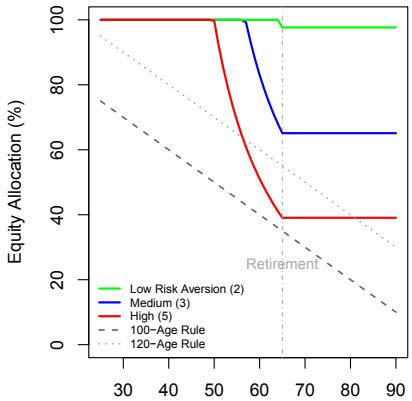
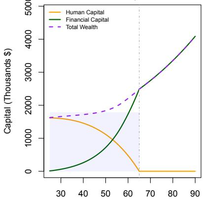

# Optimal Bond-Equity Allocation Over a Lifetime Mathematical Framework for Lifecycle Investing

## Outline

What is Lifecycle Investing?

Mathematical Framework

Human Capital Modeling

Optimal Allocation Derivation

Analytical Solution: Special Case

Extensions and Considerations

Applications and Takeaways

## What is Lifecycle Investing?

Lifecycle Investing is the theory of optimal asset allocation over an individual’s lifetime:

▶ Core Principle: Risk capacity changes with age, human capital, and time horizon  
▶ Key Insight: Younger investors have more Human Capital (HC) (future earnings potential) which acts like a bond  
▶ Practical Application: Age-based allocation rules and target date funds

The fundamental trade-off:

▶ Equities: Higher expected returns but higher volatility  
▶ Bonds: Lower returns but more stable, preservation of capital  
▶ Human Capital: Bond-like asset that depletes over time

Classical heuristic: “100 minus age” rule suggests equity allocation = 100 − age

## Mathematical Framework

Consider an investor with utility function U maximizing lifetime utility:

$$
\max _ {\{\alpha_ {t} \}} \mathbb {E} \left[ \sum_ {t = 0} ^ {T} \beta^ {t} U (C _ {t}) \right] \tag {1}
$$

where:

▶ $\alpha _ { t }$ = equity allocation at time t (bond allocation = 1 − αt)  
▶ $C _ { t }$ = consumption at time t  
▶ β = time discount factor  
▶ T = life expectancy (terminal age)  
▶ R = retirement age (where R < T)

## Wealth Dynamics

Total wealth consists of financial and human capital:

$$
W _ {t} = F _ {t} + H _ {t} \tag {2}
$$

where $F _ { t }$ is financial capital and $H _ { t }$ is human capital (present value of future earnings)

## Human Capital Modeling

Human capital represents the present value of future labor income:

$$
H _ {t} = \sum_ {s = t + 1} ^ {R} \frac {\mathbb {E} [ Y _ {s} ]}{(1 + r _ {f}) ^ {s - t}} \tag {3}
$$

where:

▶ Y = labor income at time s  
▶ R = retirement age  
▶ r = risk-free rate

## Properties of Human Capital

▶ Decreases with age (fewer working years remaining)  
▶ Acts as an implicit bond holding (stable, regular cash flows)  
▶ Cannot be traded but affects optimal portfolio allocation  
▶ Risk characteristics depend on occupation (stable vs volatile income)

## Optimal Allocation Derivation - Part 1

Assume Constant Relative Risk Aversion (CRRA) utility: $\begin{array} { r } { U ( C ) = \frac { C ^ { 1 - \gamma } } { 1 - \gamma } } \end{array}$ where $\gamma$ is risk aversion.

## Portfolio Return Dynamics:

$$
R _ {p} = \alpha_ {t} R _ {e} + (1 - \alpha_ {t}) R _ {b} \tag {4}
$$

## Wealth Evolution:

$$
F _ {t + 1} = (F _ {t} - C _ {t}) (1 + R _ {p}) + Y _ {t + 1} \tag {5}
$$

First Order Condition (Merton’s Solution): For log-normal returns and CRRA utility, the optimal equity share is:

$$
\alpha_ {t} ^ {*} = \frac {\mu_ {e} - r _ {f}}{\gamma \sigma_ {e} ^ {2}} \cdot \frac {W _ {t}}{F _ {t}} \tag {6}
$$

where $\mu _ { e } - r _ { f }$ is the equity risk premium and $\sigma _ { e } ^ { 2 }$ is equity variance

## Optimal Allocation Derivation - Part 2

Key Insight: The ratio $\begin{array} { r } { \frac { W _ { t } } { F _ { t } } \ : = \ : 1 + \ : \frac { H _ { t } } { F _ { t } } } \end{array}$ amplifies equity allocation when human capital is large.

Simplified Age-Based Formula: Assuming exponentially declining human capital and growing financial capital:

$$
\alpha_ {t} ^ {*} = \frac {\mu_ {e} - r _ {f}}{\gamma \sigma_ {e} ^ {2}} \left(1 + \frac {H _ {0} e ^ {- \lambda t}}{F _ {0} e ^ {g t}}\right) \tag {7}
$$

where:

▶ λ = human capital decay rate  
▶ g = financial capital growth rate  
▶ $H _ { 0 } , F _ { 0 }$ = initial human and financial capital

## Result

Optimal equity allocation decreases with age as $\frac { H _ { t } } { F _ { t } } 0$ t → 0, creating a natural “glide path”

## Analytical Solution: Special Case

For tractability, consider the case with:

▶ Log utility $( \gamma = 1 )$  
▶ No intermediate consumption  
▶ Deterministic human capital

The optimal allocation becomes:

$$
\alpha_ {t} ^ {*} = \frac {\mu_ {e} - r _ {f}}{\sigma _ {e} ^ {2}} \cdot \frac {W _ {t}}{F _ {t}} = \frac {\mu_ {e} - r _ {f}}{\sigma _ {e} ^ {2}} \left(1 + \frac {H _ {t}}{F _ {t}}\right) \tag {8}
$$

## Boundary Conditions:

▶ At t = 0 (young): Large $H _ { 0 } / F _ { 0 } \Rightarrow$ high $\alpha _ { 0 } ^ { * }$ (potentially > 100%)  
▶ At t = R (retirement): $\begin{array} { r } { { \cal H } _ { R } = 0 \Rightarrow \alpha _ { R } ^ { * } = \frac { \mu _ { e } - r _ { f } } { \sigma _ { e } ^ { 2 } } } \end{array}$ (constant)  
Allocation decreases monotonically with age

## Visualization of Lifecycle Allocation

Optimal Equity Allocation by Risk Aversion  

line

| X | Low Risk Aversion (2) (%) | Medium (3) (%) | High (5) (%) |
| --- | --- | --- | --- |
| 30 | 100 | 100 | 100 |
| 50 | 100 | 100 | 100 |
| 60 | 100 | ~85 | ~55 |
| 65 | 100 | 65 | 40 |
| 90 | 100 | 65 | 40 |

Age

Human vs Financial Capital Over Lifetime  

area

| X | Human Capital (Thousands $) | Financial Capital (Thousands $) | Total Wealth (Thousands $) |
| --- | --- | --- | --- |
| 30 | ~1600 | ~50 | ~1650 |
| 40 | ~1400 | ~300 | ~1700 |
| 50 | ~1000 | ~800 | ~1800 |
| 60 | ~500 | ~1800 | ~2200 |
| 65 | 0 | 2500 | 2500 |
| 70 | 0 | ~2800 | ~2800 |
| 80 | 0 | ~3500 | ~3500 |
| 90 | 0 | ~4100 | ~4100 |

Age

Left: Optimal allocation decreases with age as human capital depletes  
Right: Human capital dominates when young, financial capital dominates when old  
▶ Model suggests higher equity allocation than simple heuristics for young investors

## Extensions and Considerations

## Model Extensions:

▶ Stochastic Income: Labor income volatility affects human capital risk  
▶ Housing: Real estate as additional asset class with consumption value  
▶ Correlation: Human capital may correlate with equity returns (industry-specific)  
▶ Flexibility: Option value of delaying retirement

## Practical Constraints:

▶ Leverage Constraints: Cannot borrow against human capital  
▶ Liquidity Needs: Emergency funds require bond allocation  
▶ Behavioral Factors: Risk tolerance may differ from optimal risk capacity  
▶ Tax Considerations: Asset location across taxable/tax-deferred accounts

## Implementation

Target-date funds and robo-advisors implement simplified versions of lifecycle models

## Applications and Takeaways

## Key Applications

▶ Retirement Planning: Design of target-date funds and 401(k) defaults  
▶ Robo-Advisors: Automated age-based rebalancing strategies  
▶ Financial Advice: Framework for personalized asset allocation  
▶ Policy Design: Optimal default options for pension systems

## Takeaways

▶ Human capital acts as an implicit bond holding, justifying higher equity allocation when young  
▶ Optimal allocation follows: $\begin{array} { r } { \alpha _ { t } ^ { * } = \frac { \mu _ { e } - r _ { f } } { \gamma \sigma _ { e } ^ { 2 } } \left( 1 + \frac { H _ { t } } { F _ { t } } \right) } \end{array}$  
▶ Traditional rules like “100 - age” may be too conservative for young investors  
▶ Risk capacity $\neq$ risk tolerance: psychological factors matter  
▶ Lifecycle investing provides a rigorous framework beyond simple heuristics

## Related notes

- [[Why Not 100% Equity]] — equity vs. bond allocation
- [[Popular Personal Financial Advice Vs. The Professors]] — lifecycle saving and asset allocation
- [[La Regola Del 2X Duration   Dedalo Invest]] — bond duration and time horizon