# The Big Market Delusion: Valuation and Investment Implications

## Abstract

There is nothing more exciting for a nascent business than the perceived presence of a big market for its products and services, and the allure is easy to understand. In the minds of entrepreneurs in these markets, big markets offer the promise of easily scalable revenues, which if coupled with profitability, can translate into large profits and high valuations. This paper examines how the “big market promise” affects business formation and financing and focuses on the role that overconfidence on the part of entrepreneurs and their financiers (venture capitalists and public equity) plays in creating a collective overpricing of companies in alleged big markets. We argue that initial overpricing is a common feature of these markets, but results in an inevitable correction that brings the pricing back to earth. Three case studies are developed to illustrate the thesis, one where the process has almost fully played out (dot com retail from the 1990s), one where it has been unfolding for a while, online advertising, and a third, the cannabis market, where it is just beginning. Based on these case studies, we suggest several lessons for investors, regulators, and businesses.

## Introduction

Soon after its introduction as a private company, the market value of Uber began to explode. One big reason was the potential size of the market. Uber was billed not only as a potential global ride-sharing company but also as a logistics company. If Uber could capture a meaningful fraction of this gigantic market, it could easily be worth tens of billions of dollars.

The story of Uber is not unique. It applies to many companies, particularly in the technology space, that enter what are seen as “big markets.” The peril of a big market, though, especially in its early stages, is that the entrepreneurs it attracts and the investors who provide funding are often so enthused about their prospects for dramatic growth that they become overconfident, leading to the businesses that will serve the new market being overpriced, at least collectively. The divergence between price and value, reflecting a more realistic assessment of the earnings that the big market can deliver, eventually leads to a correction. Here we explain why we believe the big markets delusion continues to drive prices of early-stage startups and why it cannot be easily exploited by potential arbitrageurs.

## The Big Market Delusion

Increasing the potential market for products and services, holding all else constant, is good for the value of the business producing them, but for that value to be realized, a whole host of other pieces have to fall into place. First, the company must be able to capture a reasonable share of that big market, a task that can be made difficult if the market is splintered, localized, or intensely competitive. Second, the company has to be able to generate profits in that big market and create value from that growth, also a function of the firm's competitive advantages and market pricing constraints. Third, once profitable, the company has to be able to keep new entrants out, easier in some sectors than in others. It is therefore dangerous to base an argument for investing in a company and assigning it high value based on enthusiasm for the size of the market that it serves, but that danger does not seem to stop analysts and investors from doing so.

## Individual Rationality and Collective Irrationality

To see how (almost) rational and (mostly) smart individuals can be fooled by big market potential into being collectively irrational, consider a hypothetical entrepreneur who has developed a product that he sees as having a large potential market and that, based on that assessment, was able to convince venture capitalists to fund the business. In Figure 1, we depict this process.

Figure 1: Entrepreneur sees Big Market  
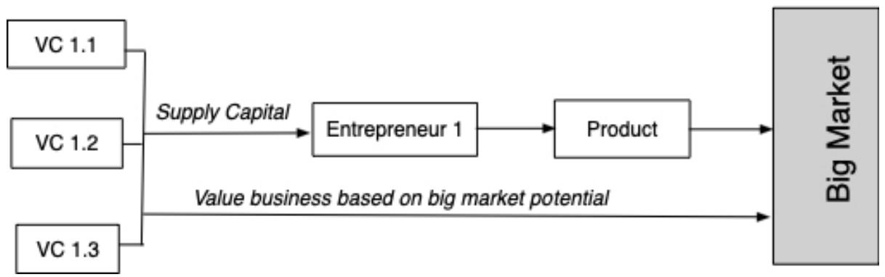

flowchart

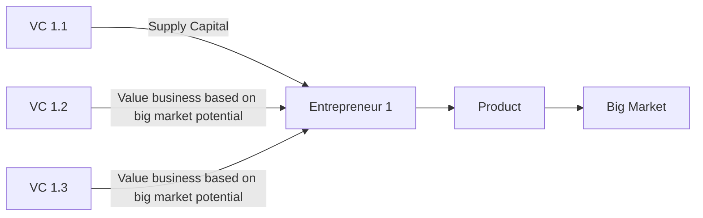

Note that everyone in this picture is behaving sensibly. The entrepreneur has created a product that he sees as fulfilling a large market need and the venture capitalists (VCs) backing the entrepreneur see the potential for profit from the product by pricing the company.

Now assume that six other entrepreneurs see the same big market potential at about the same time and create their own products to fulfill that market need, and that each finds venture capitalists to back his or her product and vision.

Figure 2: Many Entrepreneurs see Big Market  
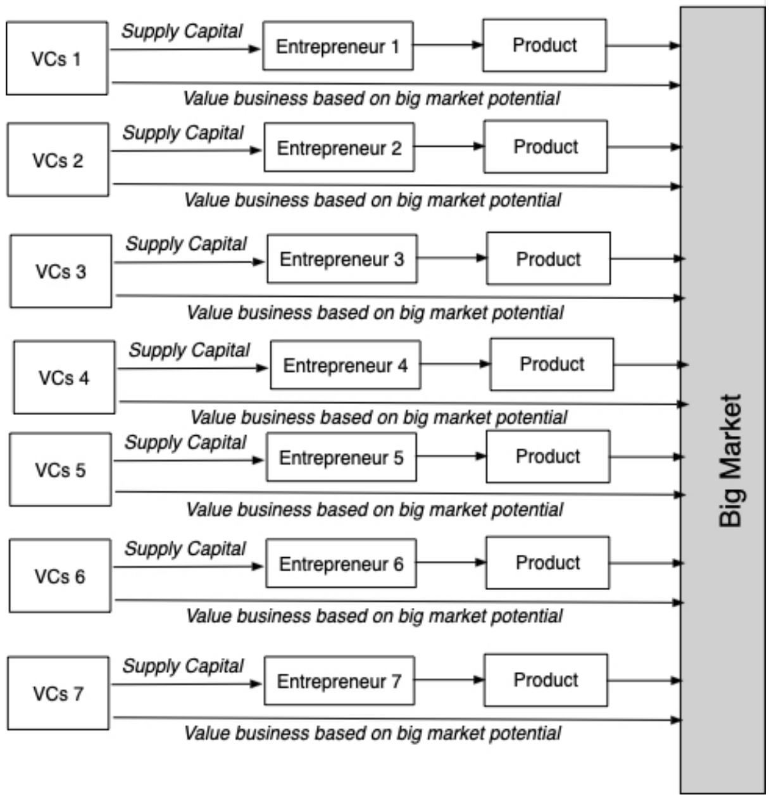

flowchart

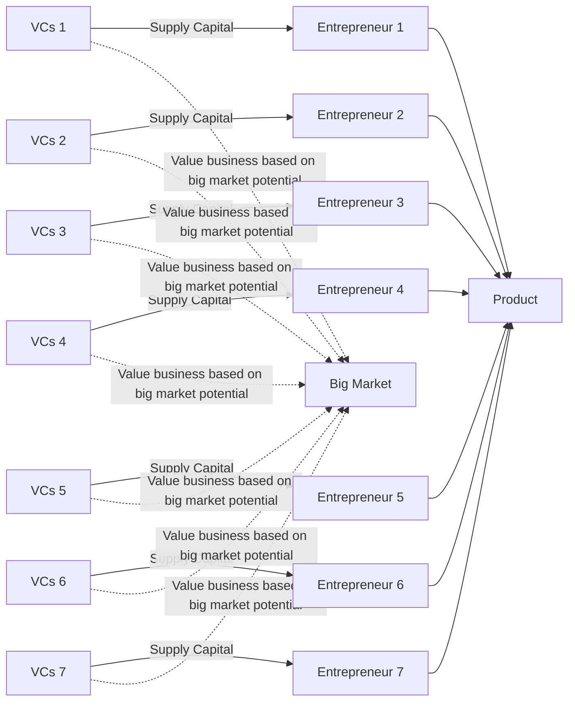

Assume that each of these entrepreneurs has detailed knowledge regarding his or her products, and that the VCs are also smart and investment-savvy. If this were a rational market, each entrepreneur and his/her VC backers should be valuing his/her business based on assessments of market potential and success, and the existence of current and future competitors.

Now add the twist that causes the deviation from rationality and make both the entrepreneurs and VCs overconfident, the former in the superiority of their products over the competition, and the latter in their capacity to pick winners. This is neither an original assumption, nor a particularly radical one, as there are a number of well-known papers such as Daniel, Hirshleifer, and Subrahmanyam (2002) that posit investor overconfidence. The twist, which we will elaborate in the next section, is that both groups, entrepreneurs and venture capitalists, are self-selected to attract overconfident individuals. The game now changes because each business cluster (the entrepreneur and the venture capitalists that back his or her business) will overestimate its capacity and its probability of success, resulting in the following. First, the businesses that are targeting the big market will be collectively overpriced, since each cluster is convinced that it will be the winner. Second, the market will become more crowded and competitive over time with new entrants being drawn in because of the perceived growth potential associated with the big market. Thus, while revenue growth in the aggregate may confirm that the market is big, the revenue growth at firms collectively will fall below expectations and operating margins will be lower than expected because each of the individual firms overestimated its own prospects. Third, there will be a period of reckoning, where some or many of the participants will recognize the gap between reality and expectations. When they do, the aggregate pricing of the sector will eventually decline with some of the entrants folding. Despite the shortfall in the aggregate, there will be a few big winners, and these big winners will fuel the cycle of enthusiasm for the next big market.

## Determinants of Overpricing

The collective overpricing of the companies in a big market will bear resemblance to a bubble, and the correction will lead to the usual handwringing about bubbles and market excesses, but the culprit is overconfidence, a characteristic that is essentially a prerequisite for successful entrepreneurship and venture capital investing. That said, the extent of the overpricing will vary across different markets, depending upon the following:

1. The Degree of Overconfidence: The greater the overconfidence exhibited by entrepreneurs and investors in their own products and investment abilities, the greater will be the overpricing. While both groups are predisposed to overconfidence, that overconfidence tends to increase with success in the market. Therefore, the longer a market boom lasts in a business space, the larger the overpricing will tend to become.

This suggests, somewhat surprisingly, that the extent of overpricing will be greater in markets where there are more serial entrepreneurs with records of past success and experienced venture capitalists.

2. The Size of the Market: As the target market gets bigger, it is more likely that it will attract added entrants and the collective overpricing will increase. This tendency will be worsened if the size of the target market itself is unclear, leading more optimistic entrepreneurs and venture capitalists to inflate their assessments of market size.

3. Uncertainty: The more uncertainty there is about business models and the ability to convert them into revenues, the more overconfidence will skew the numbers, leading to greater overpricing in the market. For example, there should be more overpricing in artificial intelligence, a big market where there is greater uncertainty about not only what technologies will end up as winners, but also in the uses to which that technology can be put, than in online food delivery, a more established market with fewer technological twists. It also follows that overpricing should be greater, earlier in a market’s evolution, and should decrease over time, as evidence accumulates as to actual market size and business successes and failures.

4. Winner-take-all markets: The overpricing will be greater in markets, where there are global networking benefits (i.e., growth feeds on itself) and winners can walk away with dominant market shares. Because the payoffs to success are greater in these markets, misestimating the probability of success will have a much larger impact on value.

In short, not only will collective overpricing be a feature of big markets, but that overpricing will vary across markets and over time. One high-profile example of how this process plays out was observed at WeWork, a young company in the real estate leasing business, that saw its equity value rise from close to nothing in 2010 to $47 billion in 2019, mostly on the basis of the size of the real estate leasing market.1

## The Correction

In the last section, we repeatedly used the word “pricing” to describe how overconfidence on the part of companies and investors translates into numbers, rather than the word “value.” In this section, we explain why by drawing a contrast between price and value, especially in the context of young businesses, and then analyze why and how the gap between the two numbers closes.

## Price and Value

While the words price and value are often used as if they are interchangeable, they represent different processes, are determined by different variables, and can yield different numbers:

Figure 3: Value versus Price  
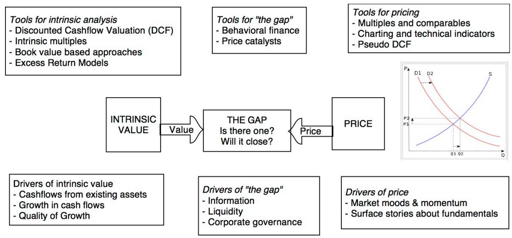

flowchart

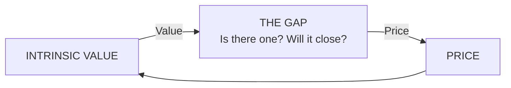

The determinants of value are simple, though not always easy to estimate. Whether valuing start-up businesses, emerging market firms, or commodity companies, the values are driven by expected cash flows which incorporate growth and the risk that these cash flows will not materialize. While a discounted cash flow (DCF) valuation is often the tool that is used to give form to these fundamentals, it is not the only pathway to intrinsic value. As with any other tool, this one can be overtaken by hubris, as overconfidence can lead to inflated cash flows, unrealistically high growth rates, and an underestimation of risk, leading to estimates of value that are too high.

The determinants of price are demand and supply, and while fundamentals affect both, mood and momentum can also affect pricing. These “animal spirits,” as behavioral economists may tag them, cannot only cause price to diverge from value but also require different tools to be used to assess the proper pricing for an asset. With many assets and businesses, pricing an asset typically involves using a standardized metric (a multiple), derived from comparable assets that are already priced in the marketplace and controlling for differences.

The viewpoint that markets make mistakes, but that these mistakes are random and unrelated to any observable variables, implies that the value and pricing processes yield the same result, on average and that markets are efficient. If the value and the pricing processes diverge in a predictable fashion, it is evidence of inefficiency. In the last section, we argued that the allure of big markets skews the pricing process, with overconfidence on the part of entrepreneurs and investors pushing the prices of companies above their values.

## The Gap

The potential gap between price and value is at the core of almost all investment philosophies. Value investors, for instance, believe that over time, markets will see the gap and that the price will converge towards value. Traders, on the other hand, have little faith in convergence, arguing that value is too nebulous and subjective, and believe that the key to market success is playing the pricing game well.

We believe that there is some truth in both camps, but that which view prevails depends partly upon where a company falls in the corporate life cycle. Early in the life cycle, it is the traders who dominate, and the game is primarily a pricing game, with value investors often left frustrated. As companies age, and their financial realities start to take form, value begins to become more tangible and more visible, making it more likely that the gap, if it exists, will be noticed. Figure 4 provides a corporate life cycle view of price and value.

Figure 4: Price versus Value - A Corporate Life Cycle Perspective  
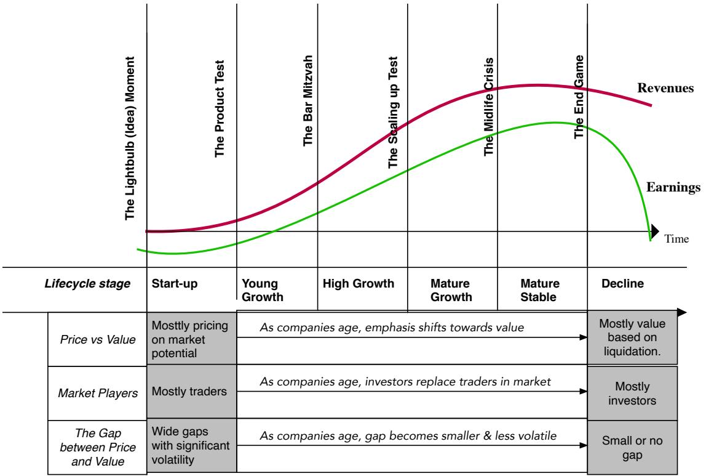

line

| Lifecycle Stage | Revenues | Earnings |
| --- | --- | --- |
| Start-up | ~Low | ~Low |
| Young Growth | ~Medium | ~Medium |
| High Growth | ~High | ~High |
| Mature Growth | ~High | ~High |
| Mature Stable | ~High | ~High |
| Decline | ~High | ~High |

One implication of the life cycle view is that while overconfidence may be a problem at every level of business, its consequences for pricing and the gap with value are likely to be greatest for young firms. Early in a company's life, it is the pricing game that dominates, and it is often futile to use fundamentals to try to explain a stock price or day-to-day changes in pricing.

For a young company, making the transition from start-up to young growth, it is all pricing all the time (priced stocks), with stories about market size driving the pricing. That leads to two conclusions. The first is that venture capitalists, the primary players in the start-up space, play a pricing game, focusing on whatever metric they believe will lead to a higher pricing down the road, often at the expense of building business models around fundamentals. In fact, the widely used VC valuation approach is really VC pricing, with a metric (revenues or earnings) forecast into a future year and an exit multiple assumed, based on what others are paying for similar companies. Second, even if that start-up is able to list itself on public markets, investors, at least in the early years, continue to play the pricing game, with mood and momentum driving price movements on a day-to-day basis. In fact, public markets often take their cues from private market investors, not only by basing their initial assessments of price on the most recent venture capital rounds but by using the same metrics that venture capitalists use to justify pricing, whether they be revenues or users. Following up on these implications, even if these companies do go public, and you are able to sell short on the stock, you may find that pathway hazardous given the momentum in the pricing process and the low float and light liquidity that characterizes many of these listings.

## Overconfidence: The Hidden Ingredient

In this section, we provide evidence, especially as it relates to the players in young businesses, from entrepreneurs to venture capitalists, that overconfidence is more the norm than the exception.

## Overconfidence in Behavioral Finance

As defined by behavioral economists, overconfidence is the tendency of individuals to overestimate the quality of information they receive, their ability to analyze that information, and their capability of using that information to influence future outcomes.2 While behavioral economists have come up with a laundry list of behavioral biases and quirks, there are reasons that [[Legacy Of Daniel Kahneman|Daniel Kahneman]] called overconfidence “the most significant of the cognitive biases.”3 First, it is ubiquitous since it seems to be present in an overwhelming proportion of human beings. Second, it can be argued that overconfidence gives teeth to, and augments, all other biases such as anchoring and framing. Finally, there is reason to believe that overconfidence is rooted in evolutionary biology.4

Overconfidence manifests itself in multiple ways in decision-making and pricing.

1. Over Ranking: It remains an enduring truth that most people believe that they are better than average, a mathematical impossibility, but also a reflection of over-ranking, where we assess our performance and abilities to be higher than they truly are. Alicke et al. (1995) examine this phenomenon (called the Better than Average or BTA) and note that it is more pronounced when individuals compared themselves with amorphous groups than with specific targets and that it is reduced by coming into contact with the peer group.

2. Illusion of Control: Individuals often believe that they have far more control over outcomes and situations than they actually do. This illusion of control leads them to make bad decisions and take poor risks, as businesspeople, or to misprice these businesses, as investors.5

3. Timing Optimism: With timing optimism, agents underestimate how much time it takes to accomplish a specific task or objective. This plays out in business in decision-making regarding estimates of how quickly a product can be brought to market or get regulatory approval.6 It plays out in investing concerning estimates of time required to break even on an investment.

4. Desirability Effect: This effect posits that agents overestimate the chance of something happening simply because they want it to happen.7 In business and investing, this can occur when agents are emotionally invested in an outcome and then convince themselves that the odds have tilted in its favor simply because they wish it to be so.

## Overconfidence in Young Companies

Because the literature on overconfidence is voluminous and the debates about its effects on prices and business decisions are still ongoing, we narrow the focus to look at how overconfidence plays out in the two groups that are integral to our story: entrepreneurs and venture capitalists.

## Entrepreneurial Overconfidence

If overconfidence is a widespread human trait, there is evidence that entrepreneurs are among the most overconfident amongst us. Cooper, Woo, and Dunkelberg (1988) looked at a sample of 2994 entrepreneurs and documented what they perceived to be their odds of success. Of the group, 81% believed that their chance of success was at least 70% and a third of the sample felt that success was guaranteed, even though the reality is that 75% of new businesses fail within five years of their inception. In a comparative study, Busenitz and Barney (1997) compared overconfidence in managers with the same characteristic in entrepreneurs and concluded that while both groups were overconfident, entrepreneurs were more so.

There is also a selection bias at play. Douglas and Shepherd (2002) and Fitzsimmons and Douglas (2005) argue that risk-taking and independent individuals are more likely to become self-employed and start their own businesses. Friedman (2007) notes that overconfidence on the part of an entrepreneur not only increases the likelihood of a start-up but also the chance that the start-up will become an operating business. Forbes (2005) argues that overconfidence in one’s own abilities can vary across entrepreneurs, and that entrepreneurs who have been successful in the past tend to be more overconfident than first-time entrepreneurs.

As a consequence of their overconfidence, entrepreneurs often follow their intuition, underweighting public information and ignoring the absence of information in their decision-making. That does not necessarily translate into reckless risk-taking. In fact, a study by Wu and Knott (2006) concluded that entrepreneurs are cautious about taking risks and are often more risk-averse than the average, but that this does not discourage them from starting new ventures. Put simply, the research suggests that entrepreneurs dislike risk as much anyone but believe that they have the ability to avoid bad outcomes.

## Venture Capital Overconfidence

The same combination of selection bias and personal characteristics that leads to entrepreneurial overconfidence also plays out among the venture capitalists who invest in these start-ups. Zacharias and Shepherd (2001) looked at 53 venture capitalists from Denver and Silicon Valley and concluded that not only were venture capitalists overconfident, but also that the overconfidence increased with more information and unfamiliar framing of that information. Graves and Ringuest (2018) take the assessment of overconfidence in venture capitalists one step further, using a metric called Bell’s disappointment, a measure of the difference between anticipated and actual payoff to conclude that venture capitalists are not only likely to be more overconfident than other investors, but will also face more disappointment as a consequence. Cannice and Goldberg (2009) use surveys of venture capitalist confidence to document that VC confidence ebbs and flows over time, and that investments follow confidence.

The consequences of venture capital overconfidence are predictable. Overconfident venture capitalists not only overestimate the success rates of the firms they invest in, but often turn away investments in superior firms in which they should be investing. The overconfidence also leads them to believe that they have more control over outcomes than they do. Zacharias and Shepherd, in their study of venture capital overconfidence, note that not only does overconfidence lead to bad decisions, it can inhibit learning from new information which increases the probability of making future bad decisions.

The selection bias ties in with the focus on “big markets.” People who are confident that they can identify and exploit opportunities are naturally drawn to big markets because these markets offer the potential for huge valuations. Don Valentine, the storied founder of Sequoia, one of the world’s leading venture capital firms, always stressed the importance of big markets saying, “Our objective is always to build big companies — if you don't attack a big market, you're highly unlikely to build a big company.”

## From Private to Public Markets

While it is initially the overconfidence of entrepreneurs and venture capitalists that converts perceptions of big markets into pricing delusions, it would be a mistake to think that the process is restricted to private markets. In fact, the most successful of these private companies often go public, and when they list, public market investors are drawn into the pricing game in two ways:

1. Pricing base: The starting price that gets set for the company in its initial offering is typically built up from the most recent venture capital round, a private company pricing. For example, Uber’s offering price was based upon the $62 billion that it had been priced at by the Saudi investment fund, and the same can be said for Lyft, Slack, and Peloton.

2. Pricing metric: In an even stronger link between private and public market pricing, the metric on which companies get priced in public markets is often set by the practices of private company investors. When social media companies like Facebook, Twitter, and Snap were hitting the public market in the last decade, their initial pricing and in the months after were based not upon profits or even revenues, but users.

That said, it is also true that the correction when it inevitably occurs, is more likely to happen in the public market first for two reasons. The first is that the larger size of public markets makes it more difficult to keep herd thinking going when data that is not consistent with the story starts to accumulate. For social media companies, it was the quarter after quarter of losses reported by everyone other than Facebook that led finally to a reexamination of the basic theses that growth would be easy because the market was big, and that the pathway to profitability would be smooth. As public markets correct, the adjustments start to quickly flow into private markets, leading to a reassessment of prices and a rethinking of capital commitments.

This link between private and public markets is useful for us because the case studies that we present below will use pricing and fundamental data from public companies in young (and big markets) to assess how the big market delusion plays out in markets. In each case, though, the origins of these pricing errors were in the private market space and much of what we can learn about public market investing in these companies applies even more strongly to the private markets that created them.

## Case Studies

Turning to the data, we use three case studies to illustrate the issues. The first one is the internet retail sector in the 1990s, which is particularly instructive because the entire cycle has been played out, with winners and losers chosen along the way. The second is the online advertising space in 2015, a few years into the phenomenal surge of Facebook and Google’s expansion and a couple of years after the entry of new players seeking a share of the business. The third is the cannabis market in 2019, a few months after a surge in stock prices of cannabis companies, following the legalization of cannabis in Canada and in many U.S. states.

## 1. eCommerce in the 1990s

The dot-com boom and bust is now part of investing lore, with books, articles, and movies documenting its history. That rich history gives us a chance to use data from the sector, to observe both how the big market delusion played out in inflated market valuations at the peak of the boom in late 1999 as well as how the correction played out in the subsequent years.

## The Big Market Promise

The history of eCommerce is closely tied to the history of the internet since online shopping became feasible only when the internet was opened to the public in 1991. One of the very first online consumer shopping experiences was created by Book Stacks Unlimited, an online bookstore started by Charles Stack. Amazon was launched in 1994 as an online bookstore and after adding innovations like customer reviews to its online site, it expanded its online offerings. eBay was started in 1995 as an online auction house, allowing individuals to sell their belongings and product offerings on the web. Along the way, the architecture for online commerce was strengthened by the introduction of Netscape Navigator, the first widely used online browser, in 1994, and the appearance of PayPal to facilitate online payments in 1998.

As more people were able to access the internet, online retailing continued to grow, and the growth potential attracted new companies into the fold. The revenues from online retailing climbed from close to nothing in the early 1990s to about 5% of all retailing revenues in 1999. Along the way, new businesses were started to take advantage of this growing market with the entrepreneurs using the promise of big market potential to raise money from venture capitalists, who then attached sky-high prices to these companies. By the end of 1999, not only was venture capital flowing in record amounts to young ventures, but 39% of all venture capital was going into internet companies.

## The Pricing Delusion

The enthusiasm that entrepreneurs and venture capitalists were bringing to online retail companies seeped into public markets, and as public market interest climbed, many young companies found that they could bypass the traditional venture capital route to success and jump directly to public listings. Many of the online retail companies that were listed on public markets in the late 1990s had the characteristics of nascent businesses, with small revenues, unformed business models, and large losses, but all of these shortcomings were overwhelmed by the perception of the size of the eCommerce market. In 1999 alone, there were 295 initial public offerings of internet stocks, representing more than 60% of all initial public offerings that year.

One measure of the success of these dot-com stocks is that data services created indices to track them. The Bloomberg Internet index was initiated on December 31, 1998, with a hundred young internet companies in it, and it rose 250% in the following year, reaching a peak market capitalization of $2.9 trillion in early 2000. Because the collective revenues of these companies were a fraction of that value, and most of them were losing money, the only way you could justify these market capitalizations was with a combination of very high anticipated revenue growth accompanied by healthy profit margins in steady state, both of which were premised on the successful entry into a big market.

## The Follow Up

The rise of internet stocks was dizzying, in terms of the speed of ascent, but its descent was even more precipitous. The date the bubble burst can be debated, but the NASDAQ, dominated in 2000 by young internet companies, peaked on March 10, 2000, and in the months after, the pricing unraveled as shown in Figure 5.

Figure 5: The Bloomberg Internet Index – Rise and Fall  
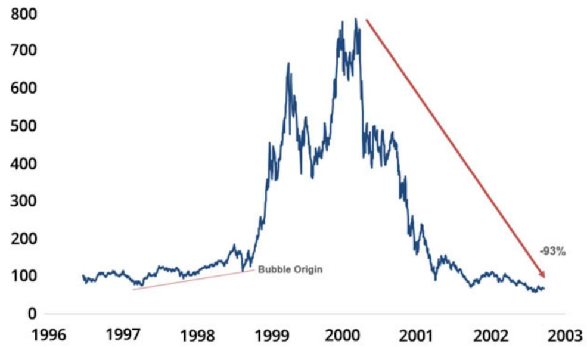

line

| Year | Value |
| --- | --- |
| 1996 | ~100 |
| 1997 | ~100 |
| 1998 | ~120 |
| 1999 | ~400 |
| 2000 | ~750 |
| 2001 | ~200 |
| 2002 | ~100 |
| 2003 | ~70 |

The Bloomberg Internet index dropped to $1.2 trillion by November 2000, a loss of about 70% of its value, and continued to decline, albeit at a slower pace. By 2003, the index had lost 93% of its value, and in a sign of the times, Bloomberg stopped computing the index. Of the dozens of publicly traded retail companies in existence in March 2000, more than two-thirds failed, as they ran out of cash (and capital access) and their business models imploded. Even those that survived, like Amazon, faced carnage, losing 90% of their value, and flirting with the possibility of shutting down. The venture capital spigots that had been open and running at full force just a few months prior were turned off as venture capital collectively went into hibernation, taking nascent and private online retail companies down with them. Not surprisingly, the initial public offering market, which had been white-hot in 1998 and 1999, cooled down in 2000 and essentially froze in 2001.

The dot-com bubble had officially burst, and the entire episode gave rise to a new cottage industry, including everything from “told you so” books from old-time value investors to data-laden research manuscripts from economists, to movies about irrational exuberance and its consequences. There were many lessons in the dot-com boom and bust, but we focus on those that are relevant to the narrative in this paper.

1. All about growth: When enthusiasm about growth is at its peak, companies focus on growth, often putting business models aside or even ignoring them completely. That was true across internet stocks in the 1990s, with some often boasting about how much money they were losing to signal to markets that they were aspiring for more growth.

2. Investor Overconfidence: Before we point fingers at internet company managers for not paying enough attention to pathways to profitability, it is worth noting that investors (both venture capital and public) not only rewarded the growth with higher pricing for companies but actively encouraged companies to focus more on growth.

3. Disconnect from fundamentals: If you combine a focus on growth in how companies get priced with an absence of concern about these companies' business models, you get pricing that is disconnected from the fundamentals. In many of the young companies of this period, not only was there little attention paid to creating pathways to profitability, but there were also some who were arguing that making money was an overrated business idea.

4. Big Market stories: In almost every one of the companies, investors justified their pricing by pointing to macro potential (i.e., that the retail market was a huge one), in justifying their high expected growth rates, not taking into account the fact that there were not only hundreds of other companies all aspiring to be in the same market, but that there would be more companies entering the market in the future.

5. The Correction: Eventually, the implausibility of unrealistic growth caught up with investors, causing a correction, but the question of why it happened in March 2000 and what triggered the reassessment remains mysterious. Some argued that it was an egregious overreach, an over-the-top pricing that even the optimists could not stomach that caused the crash and others point to macro variables, with the Federal Reserve being a convenient target.

After the dot-com bust, investors were chastened, and portfolio managers promised to never again fall for the siren song of growth and bid prices up madly, repeating a refrain heard after every prior boom and bust, from tulip bulbs and investments in the South Sea companies, centuries ago, to the nifty fifty stocks in the early 1970s.

## 2. Online Advertising

The second and most detailed case study involves the online advertising business first in October 2015, at a time online advertising was disrupting the conventional advertising market and young companies were targeting the market with varying degrees of success, and again in November 2019, at a later stage of disruption.

## The Big Market Promise

Businesses have always advertised, but the growth of media in the second half of the twentieth century gave it a jolt, allowing for the creation of companies that generated value from the business. These companies ranged from those providing support services for advertising to those that benefited from being vehicles for delivering advertising, from billboard operators to newspapers to television networks. The same internet that gave birth to the dot-com boom in the nineties also opened the door to digital advertising and while it was slow to find its footing, the arrival of search engines like Yahoo! and Google fueled its growth.

The advent of social media altered the game even more, as businesses realized that not only were they more likely to reach customers on social media sites, but that social media companies also brought in data about their users that would allow for more focused and effective advertising. The net result of all these innovations was that digital advertising not only increased its market share but also contributed to an increase in overall advertising revenues as companies that had hitherto never spent money on advertising were drawn into social media advertising. Figure 6 describes the growth of digital advertising over the decade from 2005 to 2015, both in absolute numbers and as a percent of total advertising:

Figure 6: The Growth of Online Advertising through 2015  
Annual Revenue 2005-2015 (\$ billions)  
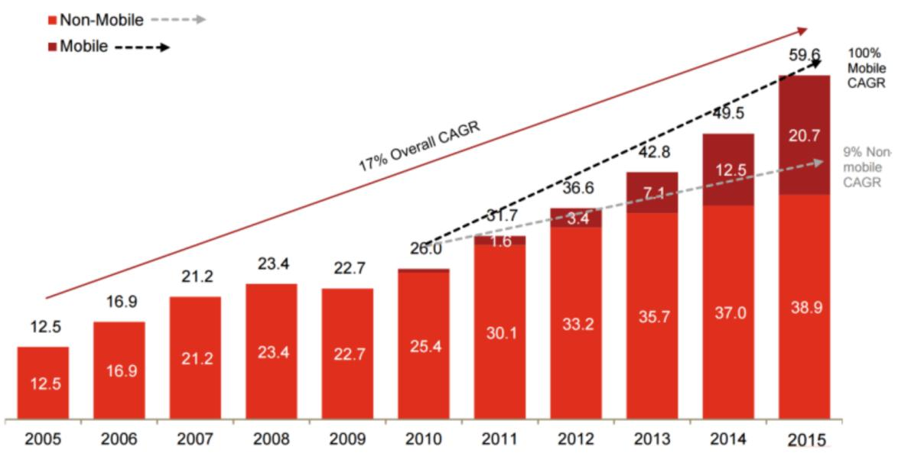

bar_stacked

| Year | Non-Mobile | Mobile | Total |
| --- | --- | --- | --- |
| 2005 | 12.5 | — | 12.5 |
| 2006 | 16.9 | — | 16.9 |
| 2007 | 21.2 | — | 21.2 |
| 2008 | 23.4 | — | 23.4 |
| 2009 | 22.7 | — | 22.7 |
| 2010 | 25.4 | — | 26.0 |
| 2011 | 30.1 | 1.6 | 31.7 |
| 2012 | 33.2 | 3.4 | 36.6 |
| 2013 | 35.7 | 7.1 | 42.8 |
| 2014 | 37.0 | 12.5 | 49.5 |
| 2015 | 38.9 | 20.7 | 59.6 |

Source: IAB/PwC Internet Ad Revenue Report, FY 2015

## The Pricing Delusion

To examine how the perception of a big online advertising market affected business formation and pricing, we looked at online advertising companies in 2015. Rather than just point to the obvious, which is how much the market capitalization of these companies had risen over time, we ran an experiment with each one. We started with the market capitalization of each company in the online advertising space as of 2015 and calculated the expected revenues ten years in the future (2025) required to justify the market price. To do this, we had to make assumptions about the rest of the variables required to conduct a DCF valuation (the cost of capital, target operating margin, and sales to capital ratio) and held them fixed while we varied the revenue growth rate until we arrived at the current market capitalization. The figure below illustrates this process using Facebook with the enterprise value of $245,662 million on August 25, 2015, base revenues of $14,640 million (trailing 12 months), and a cost of capital of 9%. Holding the existing margins unchanged at 32.42%, the details of the calculation of the imputed revenue in year 10 are presented in Figure 7.

Figure 7: Facebook Breakeven Revenues  
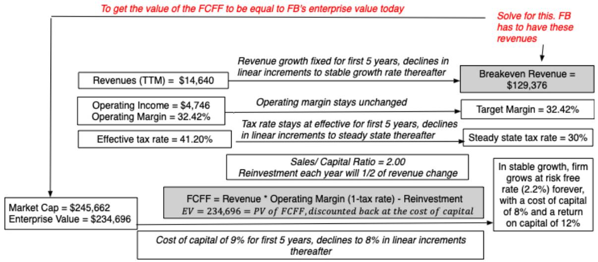

flowchart

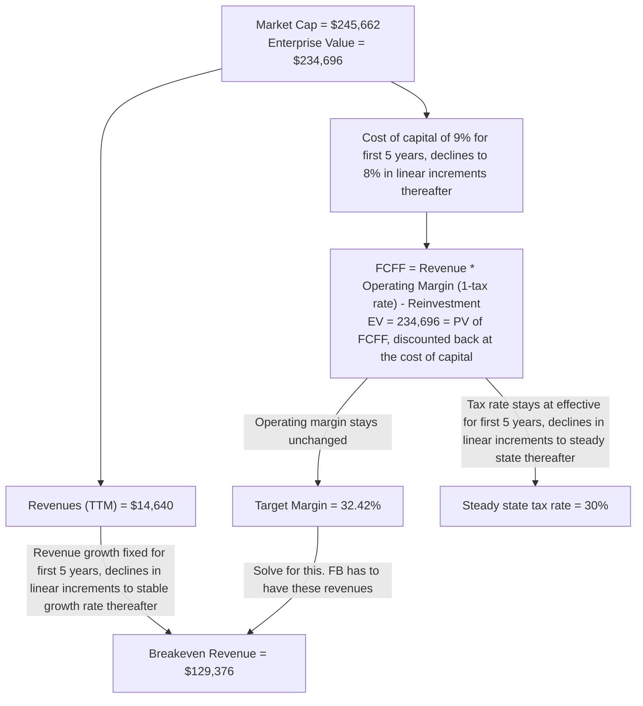

In performing the calculation, we assumed that Facebook's proportion of revenues from advertising (91%) in 2015 would remain unchanged over the next decade, yielding imputed revenues from advertising for Facebook of $117,731 million in 2025.

We repeat this process for all the other publicly traded companies with significant online advertising revenues, assuming a target pre-tax operating margin of either the current margin or 20%, whichever is higher, and a fixed cost of capital of 9% for every firm. Note that both assumptions are aggressive (the cost of capital may have been set too low and the operating margin is probably too high, given increasing competition) and both will push imputed revenues in year 10 down. In table 1, we present estimates of the imputed revenues in 2025 for each publicly traded online advertising company as of August 2015. We interpret these to be the expected revenues impounded in market prices.

Table 1: Imputed Revenues in 2025 from Online Advertising

<table><tr><td>Company</td><td>Market Cap</td><td>Enterprise Value</td><td>Current Revenues</td><td>Breakeven Revenues (2025)</td><td>% from Online Advertising</td><td>Imputed Online Ad Revenue (2025)</td></tr><tr><td>Google</td><td>$441,572.00</td><td>$386,954.00</td><td>$69,611.00</td><td>$224,923.20</td><td>89.50%</td><td>$201,306.26</td></tr><tr><td>Facebook</td><td>$245,662.00</td><td>$234,696.00</td><td>$14,640.00</td><td>$129,375.54</td><td>92.20%</td><td>$119,284.25</td></tr><tr><td>Yahoo!</td><td>$30,614.00</td><td>$23,836.10</td><td>$4,871.00</td><td>$25,413.13</td><td>100.00%</td><td>$25,413.13</td></tr><tr><td>LinkedIn</td><td>$23,265.00</td><td>$20,904.00</td><td>$2,561.00</td><td>$22,371.44</td><td>80.30%</td><td>$17,964.26</td></tr><tr><td>Twitter</td><td>$16,927.90</td><td>$14,912.90</td><td>$1,779.00</td><td>$23,128.68</td><td>89.50%</td><td>$20,700.17</td></tr><tr><td>Pandora</td><td>$3,643.00</td><td>$3,271.00</td><td>$1,024.00</td><td>$2,915.67</td><td>79.50%</td><td>$2,317.96</td></tr><tr><td>Yelp</td><td>$1,765.00</td><td>$0.00</td><td>$465.00</td><td>$1,144.26</td><td>93.60%</td><td>$1,071.02</td></tr><tr><td>Zillow</td><td>$4,496.00</td><td>$4,101.00</td><td>$480.00</td><td>$4,156.21</td><td>18.00%</td><td>$748.12</td></tr><tr><td>Zynga</td><td>$2,241.00</td><td>$1,142.00</td><td>$752.00</td><td>$757.86</td><td>22.10%</td><td>$167.49</td></tr><tr><td>Total US</td><td>$770,185.90</td><td>$689,817.00</td><td>$96,183.00</td><td>$434,185.98</td><td></td><td>$388,972.66</td></tr><tr><td>Alibaba</td><td>$184,362.00</td><td>$173,871.00</td><td>$12,598.00</td><td>$111,414.06</td><td>60.00%</td><td>$66,848.43</td></tr><tr><td>Tencent</td><td>$154,366.00</td><td>$151,554.00</td><td>$13,969.00</td><td>$63,730.36</td><td>10.50%</td><td>$6,691.69</td></tr><tr><td>Baidu</td><td>$49,991.00</td><td>$44,864.00</td><td>$9,172.00</td><td>$30,999.49</td><td>98.90%</td><td>$30,658.50</td></tr><tr><td>Sohu.com</td><td>$18,240.00</td><td>$17,411.00</td><td>$1,857.00</td><td>$16,973.01</td><td>53.70%</td><td>$9,114.51</td></tr><tr><td>Naver</td><td>$13,699.00</td><td>$12,686.00</td><td>$2,755.00</td><td>$12,139.34</td><td>76.60%</td><td>$9,298.74</td></tr><tr><td>Yandex</td><td>$3,454.00</td><td>$3,449.00</td><td>$972.00</td><td>$2,082.52</td><td>98.80%</td><td>$2,057.52</td></tr><tr><td>Yahoo! Japan</td><td>$23,188.00</td><td>$18,988.00</td><td>$3,591.00</td><td>$5,707.61</td><td>69.40%</td><td>$3,961.08</td></tr><tr><td>Sina</td><td>$2,113.00</td><td>$746.00</td><td>$808.00</td><td>$505.09</td><td>48.90%</td><td>$246.99</td></tr><tr><td>Netease</td><td>$14,566.00</td><td>$11,257.00</td><td>$2,388.00</td><td>$840.00</td><td>11.90%</td><td>$3,013.71</td></tr><tr><td>Mail.ru</td><td>$3,492.00</td><td>$3,768.00</td><td>$636.00</td><td>$1,676.47</td><td>35.00%</td><td>$586.76</td></tr><tr><td>Mixi</td><td>$3,095.00</td><td>$2,661.00</td><td>$1,229.00</td><td>$777.02</td><td>96.00%</td><td>$745.94</td></tr><tr><td>Kakaku</td><td>$3,565.00</td><td>$3,358.00</td><td>$404.00</td><td>$1,650.49</td><td>11.60%</td><td>$191.46</td></tr><tr><td>Total non-US</td><td>$474,131.00</td><td>$444,613.00</td><td>$50,379.00</td><td>$248,495.46</td><td></td><td>$133,415.32</td></tr><tr><td>Global Total</td><td>$1,244,316.90</td><td>$1,134,430.00</td><td>$146,562.00</td><td>$682,681.44</td><td></td><td>$522,387.98</td></tr></table>

Numbers & Valuations in US dollars for all companies (Folder with valuations)

The total future revenues for all the companies on the list total $523 billion. Note that this list is not comprehensive because it excludes some smaller companies that also generate revenues from online advertising and the not-inconsiderable secondary revenues from online advertising generated by firms in other businesses (such as Apple). It also does not include the online advertising revenues being impounded into the valuations of private businesses like Snapchat that were waiting in the wings in 2015. Consequently, we are understating the imputed online advertising revenue that was being priced into the market at that time. To gauge whether these imputed revenues are viable, we looked at both the total advertising market globally and the online advertising portion. In 2014, the total advertising market globally was about $545 billion, with $138 billion from digital (online) advertising. Total advertising will presumably grow at a rate comparable to the overall economy, but online advertising as a proportion of total advertising is expected to rise.

In the table below, we allow for different growth rates in the overall advertising market over the 2015-2025 time period and varying proportions of the total market moving to digital advertising to arrive at these estimates of digital/online advertising revenues in 2025 in table 2:

Table 2: Online Advertising Market Revenues in 2025

<table><tr><td></td><td colspan="6">Annual CAGR in Total Ad Spending</td></tr><tr><td rowspan="6">Online as % of Total Market</td><td></td><td>1.00%</td><td>2.00%</td><td>3.00%</td><td>4.00%</td><td>5.00%</td></tr><tr><td>30%</td><td>$182.49</td><td>$203.38</td><td>$226.42</td><td>$251.81</td><td>$279.76</td></tr><tr><td>35%</td><td>$212.90</td><td>$237.27</td><td>$264.15</td><td>$293.77</td><td>$326.38</td></tr><tr><td>40%</td><td>$243.32</td><td>$271.17</td><td>$301.89</td><td>$335.74</td><td>$373.01</td></tr><tr><td>45%</td><td>$273.73</td><td>$305.07</td><td>$339.63</td><td>$377.71</td><td>$419.64</td></tr><tr><td>50%</td><td>$304.15</td><td>$338.96</td><td>$377.36</td><td>$419.68</td><td>$466.26</td></tr></table>

Even with optimistic assumptions about the growth in total advertising and the online advertising portion of it climbing to 50% of revenues, the total online advertising market in 2025 comes to $466 billion. The imputed revenues from the publicly traded companies in Table 1 alone exceed that number. This implies that the companies in Table 1 were being overpriced relative to the market (online advertising) from which their revenues were derived. As more companies line up to enter this space, the gap between the aggregate market value of companies in the space and the size of the advertising market from which they are expected to derive revenues must continue to grow. Nonetheless, investors were still anxious to finance new companies, such as Snapchat, that planned to enter this space. After all, the nature of overconfidence is that founders and investors are convinced that the overpricing is not a problem for their firm, but for the rest of the market.

To be fair, it is possible that the approach that we are using to estimate imputed revenues is overreaching on several fronts. First, the assumptions that we are making about operating margins and costs of capital may be wrong. Specifically, if the target margins turn out to be greater than our estimate of 20% for the sector the imputed revenues are being overestimated. Similarly, if the cost of capital is lower than our estimate of 9%, the imputed revenues are being overestimated. It is also possible that the market cap incorporates expectations of new businesses that online advertising companies may enter in the future. This is especially true for the two biggest players in the game, Google and Facebook. If investors are pricing in expectations that one or both companies will be able to use their huge user base platforms to enter into new businesses (such as entertainment, retailing, etc.), we are overestimating the imputed revenues from advertising by holding its percentage of revenues unchanged over time.

## The Follow Up

Earlier in this paper, we argued that as big markets evolve and businesses and investors learn more about them, the delusion will start to fade and the divergence between price and value should lessen. By 2019, not only had investors learned more about the publicly traded companies in the online advertising business, but online advertising matured. Using the same process that we used in 2015, we imputed revenues for 2029 using data up through November 2019. Those calculations are presented in Table 3.

Table 3: Imputed Revenues in 2029 from Online Advertising

<table><tr><td>Company</td><td>Market Cap</td><td>Enterprise Value</td><td>Current Revenues</td><td>Breakeven Revenues (2029)</td><td>% from Online Advertising</td><td>Imputed Online Ad Revenue (2029)</td></tr><tr><td>Microsoft</td><td>$1,099,005.00</td><td>$1,047,966.00</td><td>$125,843.00</td><td>$412,359.00</td><td>6.35%</td><td>$26,192.79</td></tr><tr><td>Amazon</td><td>$880,874.00</td><td>$897,003.00</td><td>$265,469.00</td><td>$674,870.00</td><td>1.98%</td><td>$13,330.08</td></tr><tr><td>Google</td><td>$873,718.00</td><td>$766,888.00</td><td>$148,299.00</td><td>$342,549.00</td><td>85.02%</td><td>$291,226.36</td></tr><tr><td>Facebook</td><td>$531,733.00</td><td>$488,596.00</td><td>$62,604.00</td><td>$116,243.00</td><td>98.51%</td><td>$114,515.18</td></tr><tr><td>Tencent</td><td>$405,443.00</td><td>$409,315.00</td><td>$48,549.00</td><td>$235,997.00</td><td>18.57%</td><td>$43,835.80</td></tr><tr><td>Verizon</td><td>$246,685.00</td><td>$375,535.00</td><td>$131,374.00</td><td>$174,835.00</td><td>2.38%</td><td>$4,159.55</td></tr><tr><td>Baidu</td><td>$37,419.00</td><td>$28,906.00</td><td>$14,791.00</td><td>$17,114.00</td><td>76.00%</td><td>$13,006.64</td></tr><tr><td>Spotify</td><td>$26,615.00</td><td>$25,723.00</td><td>$6,983.00</td><td>$19,614.00</td><td>9.00%</td><td>$1,765.62</td></tr><tr><td>Twitter</td><td>$23,715.00</td><td>$20,444.00</td><td>$3,361.00</td><td>$16,890.00</td><td>86.13%</td><td>$14,546.94</td></tr><tr><td>Snap</td><td>$18,928.00</td><td>$17,882.00</td><td>$1,545.00</td><td>$35,820.00</td><td>89.66%</td><td>$32,116.58</td></tr><tr><td>Yandex</td><td>$11,234.00</td><td>$12,492.00</td><td>$2,504.00</td><td>$8,954.00</td><td>84.00%</td><td>$7,521.75</td></tr><tr><td>Zillow</td><td>$6,902.00</td><td>$7,027.00</td><td>$1,235.00</td><td>$7,039.00</td><td>77.44%</td><td>$5,450.74</td></tr><tr><td>Zynga</td><td>$5,801.00</td><td>$5,133.00</td><td>$1,054.00</td><<td>$5,424.00</td><td>28.67%</td><td>$1,554.84</td></tr><tr><td>Sina</td><td>$2,907.00</td><td>$3,949.00</td><td>$2,138.00</td><td>$2,767.00</td><td>13.76%</td><td>$380.66</td></tr><tr><td>Yelp</td><td>$2,380.00</td><td>$2,241.00</td><td>$968.00</td><td>$1,715.00</td><td>96.18%</td><td>$1,649.53</td></tr><tr><td>Pandora</td><td>$2,274.00</td><td>$2,141.00</td><td>$1,517.00</td><td>$2,309.00</td><td>73.28%</td><td>$1,692.01</td></tr><tr><td>Sohu.com</td><td>$455.00</td><td>$410.00</td><td>$1,886.00</td><td>$0.00</td><td>10.00%</td><td>$0.00</td></tr><tr><td>Global Total</td><td>$4,176,088.00</td><td>$4,111,651.00</td><td>$820,120.00</td><td>$2,074,499.00</td><td></td><td>$572,945.06</td></tr></table>

There are signs that the market has moderated since 2015. First, the number of companies shrank, as some were acquired, some failed, and a few consolidated. Second, the market capitalizations had been recalibrated and starting revenues in 2019 are much greater than they were in 2015. As a result, the breakeven revenue in 2029 is $573 billion, only slightly higher than the imputed revenues from the 2015 calculation, despite being four years further into the future. This suggests that the market is starting to take account of the limits imposed by the size of the underlying market. Third, more of the companies on the list have had moments of reckoning with the market, where they have been asked to show pathways to profitability and not just growth numbers. Two examples are Snap and Twitter. For both companies, the market capitalizations have languished because of the perception that their pathways to profitability are rocky.

The sobering of market expectations is a healthy development because a gradual adjustment of market pricing to reality may help avoid the crash that occurred with the internet stocks in 2000. One possible explanation for the change is that the tools for betting against overpricing have become more easily accessible and cheaper. For instance, at the peak of the dot-com boom, selling short on dot-com stocks, given their low liquidity and float, was short-term, and there were no listed long-term put options on these specific stocks.8 By 2015, not only did some of the high-profile stocks on the list have long-term options (LEAPs) available, but the architecture for short selling had improved enough to allow investors to bet long-term against what they feel are overpriced stocks.

## 3. The Cannabis Market in 2018

Until recently, cannabis, in any of its forms, was illegal in every state in the United States and in most of the world, but that is changing rapidly. By October 2018, smoking marijuana recreationally and medical marijuana were both legal in nine states, and medical marijuana alone in another 20 states. Outside the United States, much of Europe has always taken a more sanguine view of cannabis, and on October 17, 2018, Canada became the second country (after Uruguay) to legalize the recreational use of the product. In conjunction with this development, new companies were entering the market, hoping to take advantage of what they saw as a “big” market, and excited investors were rewarding them with large market capitalizations.

## The Big Market Promise

The widespread view as of October 2018 was that the cannabis market would be a big one, in terms of users and revenues. To get a sense of the potential growth in this business, consider some statistics from the legalized Canadian recreational market:

1. Lots of people use cannabis: According to the Canadian national census, 42.5% of Canadians had tried marijuana and about 16% had used it in the recent past (last 3 months). Furthermore, the percentages are higher among younger Canadians with one in three being recent users.  
2. And spend money to do so: The total revenue from recreational marijuana sales in Canada alone is expected to be $7-8 billion in 2020 and grow at a healthy rate after that. Some of this will represent a shifting from the illegal market (estimated at close to $5 billion in 2017) and some of it will represent new users drawn in by its legal status.

There is also information that can be gleaned about the future of this business from the states in the United States that have legalized marijuana.

In California, where legalization occurred at the start of 2018, revenues from cannabis are expected to be about $3.4 billion in 2018, but that is not a huge jump from the $3 billion in revenues in the illegal market in 2017. One reason, at least in California, is that legal marijuana, with testing, regulation, and taxes, is much more expensive than that obtained in the illegal markets that existed pre-legalization.  
In Colorado, where recreational marijuana use has been legal since 2014, the revenues from selling marijuana have increased from $996 million in 2015 to $1.25 billion in 2016 to $1.47 billion in 2017, representing solid, but not spectacular, growth. Marijuana-related businesses in Colorado have benefited from the revenue growth but have, for the most part, been unable to convert that growth into meaningful profits, partly because of the regulatory and tax overlay that they have to navigate.

Based on the limited data that we have from both Canada and the US states that have legalized marijuana, we draw the following conclusions.

1. The illegal marijuana market will persist after legalization: The illegal weed business will continue, even after legalization, for many reasons. One is that legalization brings costs, regulations, and taxes, which make the cost of legal weed higher than its illegal counterpart. The other is cultural, where a segment of longtime weed smokers will be reluctant to give up their traditional ways of acquiring and using weed. From a business standpoint, this will mean that the legal weed businesses will have to share the market with unregulated and untaxed competitors, reducing both revenues and profitability.  
2. There will be growth in recreational marijuana sales, but it will not be dramatic: For those who are expecting a sudden surge of new users as a result of legalization, the results from the parts of the world that have legalized marijuana should be sobering. In most of these locales, to the extent that society and law enforcement had already turned a blind eye to enforcing marijuana laws before legalization, there was no sea change in legal consequences from weed smoking.  
3. The medical marijuana market growth will be driven more by research indicating its value in health care than by popularity contests. The bad news is that this will require navigating the time-consuming and cash-burning FDA regulatory approval process, but the good news is that once approved, there is less likely to be pushback, cultural or legal, against its use. It is a safe prediction that medical marijuana will be legal throughout the United States far sooner than recreational marijuana.  
4. Federal laws matter: Companies in the weed business in any of the nine states that have legalized recreational marijuana still face a quandary. While operations may be legal in the state in which the company operates, there is a risk any time operations require crossing state lines. Because most financial service firms operate across state borders and are regulated by Federal entities, even legally created marijuana businesses have had trouble raising funding or borrowing money from banks.

In spite of these caveats, there remained optimism about growth in this market, with the more conservative forecasters predicting that global revenues from marijuana sales will increase to $70 billion in 2024, triple the estimated sales in 2018, and the more daring ones predicting close to $150 billion in sales.

## The Pricing Delusion

In October 2018, the cannabis market was young and evolving, with Canadian legalization drawing more firms into the business. While many of these firms were small, with little revenue and big operating losses, and most were privately owned, a few of these companies had public listings, primarily on the Canadian market. Table 4 lists the top ten cannabis companies as of October 14, 2018, with the market capitalizations of each one, in conjunction with each company’s operating numbers (revenues and operating income/losses).

Table 4: Largest Publicly Traded Cannabis Companies in October 2018

<table><tr><td>Company</td><td>Country</td><td>Market Cap</td><td>Price/ Book</td><td>EV/Sales</td><td>EV</td><td>Revenues</td><td>EBITDA</td><td>EBIT</td><td>Book Equity</td></tr><tr><td>Tilray</td><td>Canada</td><td>$13,813</td><td>392.08</td><td>494.36</td><td>$13,842</td><td>$28</td><td>-$18</td><td>-$20</td><td>$35</td></tr><tr><td>Canopy Growth</td><td>Canada</td><td>$11,516</td><td>13.13</td><td>170.19</td><td>$11,556</td><td>$68</td><td>-$64</td><td>-$80</td><td>$877</td></tr><tr><td>Aurora Cannabis</td><td>Canada</td><td>$10,161</td><td>8.45</td><td>239.77</td><td>$10,207</td><td>$43</td><td>-$52</td><td>-$62</td><td>$1,202</td></tr><tr><td>Aphria</td><td>Canada</td><td>$3,677</td><td>4.10</td><td>127.40</td><td>$3,627</td><td>$28</td><td>-$1</td><td>-$6</td><td>$898</td></tr><tr><td>Cronos Group</td><td>Canada</td><td>$1,754</td><td>10.01</td><td>236.22</td><td>$1,689</td><td>$7</td><td>$0</td><td>-$1</td><td>$175</td></tr><tr><td>MedMen Enterprises</td><td>United States</td><td>$2,520</td><td>33.53</td><td>87.64</td><td>$2,574</td><td>$29</td><td>-$35</td><td>-$39</td><td>$75</td></tr><tr><td>The Green Organic</td><td>Canada</td><td>$1,445</td><td>4.74</td><td>NA</td><td>$1,183</td><td>$0</td><td>-$24</td><td>-$25</td><td>$305</td></tr><tr><td>HEXO Corp</td><td>Canada</td><td>$1,351</td><td>6.00</td><td>342.90</td><td>$1,159</td><td>$3</td><td>-$5</td><td>-$5</td><td>$225</td></tr><tr><td>CannTrust Holdings</td><td>Canada</td><td>$1,195</td><td>8.40</td><td>48.64</td><td>$1,126</td><td>$23</td><td>$19</td><td>$18</td><td>$142</td></tr><tr><td>Auxly Cannabis</td><td>Canada</td><td>$654</td><td>2.40</td><td>281.46</td><td>$501</td><td>$2</td><td>-$24</td><td>-$24</td><td>$273</td></tr><tr><td>Aggregate</td><td></td><td>$48,086</td><td>11.43</td><td>204.79</td><td>$47,464</td><td>$232</td><td>-$203</td><td>-$244</td><td>$4,208</td></tr></table>

Note that the most valuable company on the list was Tilray with a market cap of over $13 billion. Tilray had gone public a few months prior, with revenues that barely registered ($28 million) and nearly equal operating losses, but had made the news right after its IPO, with its stock price increasing tenfold in the following weeks, before subsequently losing almost half of its value in the following weeks. Canopy Growth, the largest and most established company on the list, had the highest revenues at $68 million. More generally, all of them trade at astronomical multiples of book value, with a collective market cap in excess of $48 billion. As new companies flock into the market, the list of publicly traded companies is only going to get longer, and at least for the foreseeable future, most of them will continue to lose money. Adding to the chaos, existing companies that have logical reasons to enter this business but have held back will enter, as the stigma of being in the business fades, and with it the federal handicaps imposed for being in the business.

For each company, the high market capitalization relative to any measure of fundamental value was justified using the same rationale, namely that the cannabis market was big, allowing for huge potential growth. While that argument has some basis, the fundamental valuation question is whether the collective market, at least as it existed in October 2018, was large enough to sustain the collective market capitalization of all the existing companies and expected entrants.

## The Follow Up

In the case of the cannabis market, the overreach on the part of both businesses and their investors caught up with them. By October 2019, the assumptions regarding growth and profitability were being universally scaled back, business models were being questioned, and investors were reassessing the pricing of these companies. The best way to see the adjustment is to look at the performance of the major cannabis exchange-traded fund, ETFMG, over the period depicted in Figure 8.

Figure 8: ETFMG Alternative Harvest ETF (MJ): Prices from 11/21/16 - 11/21/19  
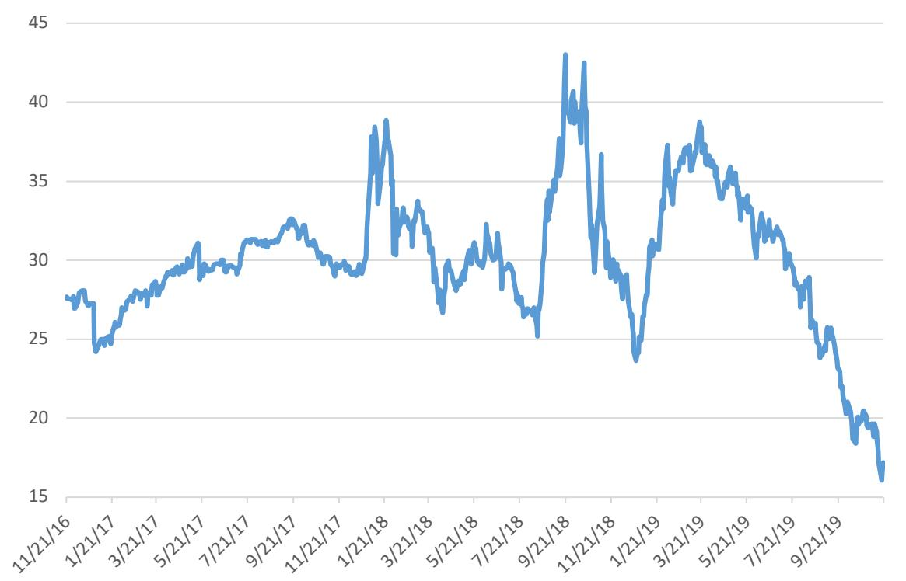

line

| Date | Value |
| --- | --- |
| 11/21/16 | ~27.5 |
| 1/21/17 | ~24.5 |
| 3/21/17 | ~28.5 |
| 5/21/17 | ~30.5 |
| 7/21/17 | ~31.5 |
| 9/21/17 | ~32.5 |
| 11/21/17 | ~29.5 |
| 1/21/18 | ~38.5 |
| 3/21/18 | ~32.5 |
| 5/21/18 | ~28.5 |
| 7/21/18 | ~27.5 |
| 9/21/18 | ~43.0 |
| 11/21/18 | ~29.5 |
| 1/21/19 | ~24.0 |
| 3/21/19 | ~37.5 |
| 5/21/19 | ~35.5 |
| 7/21/19 | ~28.5 |
| 9/21/19 | ~16.0 |

Note that within a period of approximately one year, cannabis stocks lost more than 50% of their aggregate value. The damage cut across the board. Tilray and Canopy Growth, the two largest market capitalization companies in October 2019 saw their market capitalizations decline by 80.7% and 38.6% respectively. Given that there was no significant shift in fundamentals, the apparent explanation is that investors came to realize that the “big market” was not going to deliver the previously expected growth rates or the profitability for the expanding group of individual companies.

As with the dot-com bubble, it is difficult to determine exactly what caused this reassessment. There were disappointments, such as the continued unwillingness of banks in the United States to fund any part of the business, notwithstanding the passage of the SAFE banking act in the US. The bigger issue was the fact that most all the companies struggled in delivering growth while continuing to lose money at a record pace, as competition pushed down cannabis prices and the pace of legalization of cannabis among US states continued to lag. However, all of these factors were in existence in 2018 when cannabis stocks zoomed. This makes it hard to understand why opinions suddenly changed and values collapsed. It brings to mind the observation by Stephen Ross (2005) that “It is one thing not to be able to predict what asset returns will be since they will depend on news, and news, by definition, is information that has yet to be revealed. It is another, though, to observe the movement of prices and not know why they moved after the fact. I am particularly troubled that contemporaneous news seems

## Related notes

- [[Why You Shouldn'T Pick Individual Stocks]] — overpricing and individual-stock risk
- [[Legacy Of Daniel Kahneman]] — overconfidence and behavioral biases