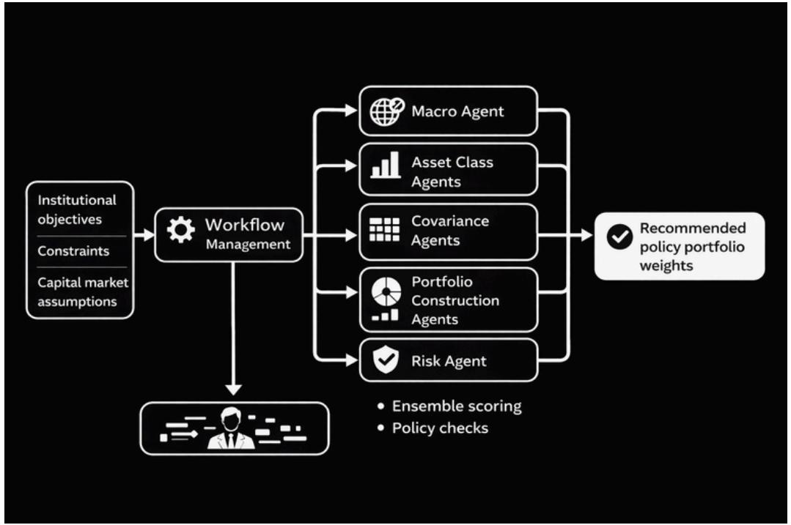
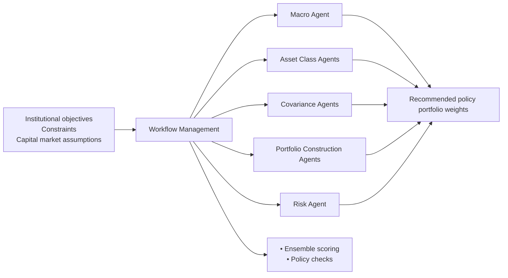
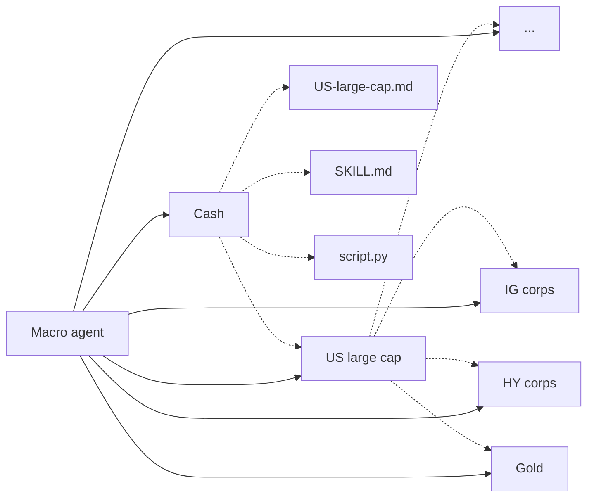
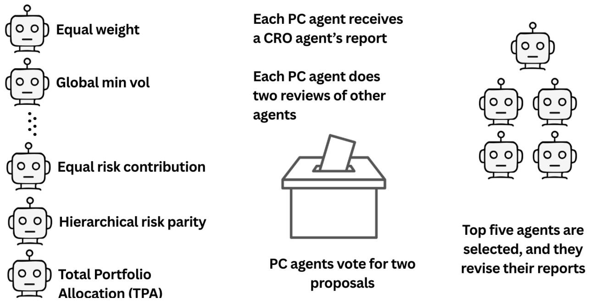
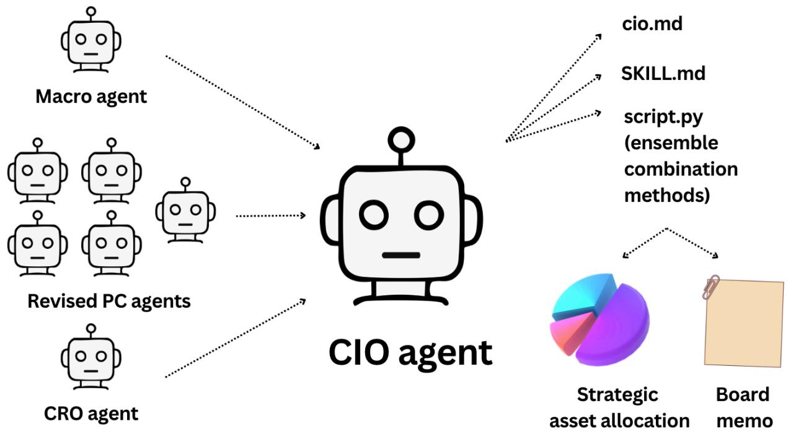
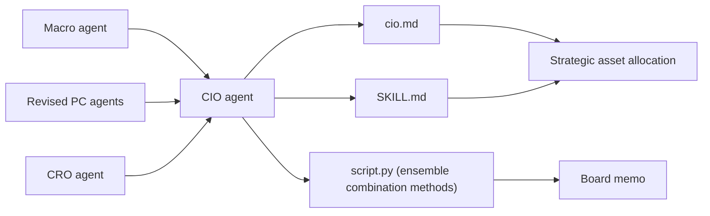

# The Self-Driving Portfolio:

# Agentic Architecture for Institutional Asset Management

Agentic AI shifts the investor's role from analytical execution to oversight. We present an agentic strategic asset allocation pipeline in which approximately 50 specialized agents produce capital market assumptions, construct portfolios using over 20 competing methods, and critique and vote on each other's output. A researcher agent proposes new portfolio construction methods not yet represented, and a meta-agent compares past forecasts against realized returns and rewrites agent code and prompts to improve future performance. The entire pipeline is governed by the Investment Policy Statement—the same document that guides human portfolio managers can now constrain and direct autonomous agents.

Keywords: Strategic asset allocation (SAA), portfolio construction, capital market assumptions (CMAs), agentic AI, large language models (LLMs), LLM-as-judge, autonomous agents, multi-agent systems, investment policy statement, institutional investing, portfolio optimization, ensemble methods

JEL Codes: C45, C63, D81, G11, G17, G23, O33.

## Introduction

The most binding constraint in institutional asset management is not data availability or model sophistication, but the finite bandwidth of human decision-makers.<sup>1</sup> A CIO can meaningfully oversee perhaps 10 to 15 investment departments, often organized along the lines of the major asset classes. A fundamental analyst can deeply cover 10 to 20 stocks. An investment committee meets monthly or quarterly, deliberates for a few hours, and ratifies decisions that must hold until the next meeting. These constraints reflect organizational constraints rather than analytical or competence shortcomings. The consequence is a potential mismatch between the attention and time that human-led investment processes can supply and the complexity and speed that modern multi-asset markets demand.

Large language model (LLM) based autonomous agents relax this constraint. An agent in this context is not simply a model that responds to a prompt; it is a goal-oriented software entity that uses tools (or runs scripts), executes multi-step reasoning, and produces structured outputs (Wang et al. 2024; Masterman et al. 2024). A single agent can execute a complete set of Capital Market Assumptions (CMAs)—for multiple asset classes in minutes using historical macro and price data, and textual and web data. Multiple agents can operate in parallel: one agent per asset class, one agent per stock, one agent per a particular portfolio construction technique. The result is an investment process that can be broader, deeper, and faster than what a human team can achieve alone.

Five capabilities distinguish agentic architectures from traditional human-based investment processes. First, scale: agents can run dozens, and potentially hundreds, of parallel asset-class analyses and portfolio construction methods simultaneously. Second, structured deliberation: agents can debate, peer review, and vote on each other’s proposals, embedding the productive conflict of an investment committee into a reproducible protocol (Du et al. 2023; Chen et al. 2025). Third, natural-language audit trails: every agent recommendation or decision is accompanied with written justifications that can be used for ex post review and satisfy fiduciary requirements for explainability. Fourth, composable expertise: adding a specialist agent—a forensic accounting module, or a new portfolio construction agent—can increase the system’s capability without redesigning the pipeline. Fifth, governable delegation: authority can be encoded as explicit objectives, constraints, or escalation triggers, allowing institutions to increase automation while preserving human accountability over final decisions.

In this paper, we describe an agentic strategic asset allocation (SAA) pipeline that coordinates approximately 50 specialized agents through each stage: macro regime classification, asset-class analysis, covariance estimation, portfolio construction, multi-agent peer review and voting, risk assessment, and CIO-level ensemble combination. The design embeds structured deliberation—randomized peer review, Borda-count voting, and an adversarial diversifier—into the portfolio construction process. The agentic architecture also allows agents to acquire new skills.

The use of agentic AI will transform the role of human decision-making in investments. Johnson et al. (2017) identify five levels of human control in automated systems: direct control, augmented control, parametric control, goal-oriented control, and mission-capable control.<sup>2</sup> At each successive level, the human operates at a higher level of abstraction. In our investment case, the human moves from selecting a multiple vs building block model to set CMAs (direct control) to selecting which portfolio construction methods to run and their parameter bounds (parametric control) to writing the Investment Policy Statement (IPS) that governs an entire multi-agent pipeline (goal-oriented control). The human’s role is not diminished; it is elevated, and the human becomes the architect of designing and overseeing an investment workflow. Our architecture compresses workflows that traditionally require teams of specialists working over days or weeks into automated runs completed in minutes while incorporating an agent that continuously and autonomously discovers and proposes new portfolio construction techniques.

## 2. Related Literature

Our work is related to an exploding literature on agentic AI that combines a language model with persistent memory, tool access, and goal-directed planning to autonomously execute multi-step tasks. The ReAct framework (Yao et al. 2023) demonstrates that incorporating reasoning traces with calls to tools improves execution quality relative to prompting alone. Subsequent work expands the agent toolkit to include structured planning (Huang et al. 2024a), code execution, web retrieval, API calls and other tools—all giving rise to a growing taxonomy of agent architectures (Wang et al. 2024; Masterman et al. 2024; Guo et al. 2025; Li et al. 2025). What distinguishes an agent from a conventional LLM query is persistence: the agent maintains state across steps, adapts its strategy based on intermediate results, and produces structured outputs that downstream processes can consume.

When multiple agents interact, new capabilities emerge. Du et al. (2023) show that multi-agent debate—where agents critique and revise each other’s responses—improves both factual accuracy and reasoning quality beyond what any single agent achieves. Chen et al. (2025) compare debate and voting as aggregation mechanisms and find that voting is more robust when agents hold diverse priors, while debate excels at error correction within a shared framework. Chuang et al. (2024) demonstrate that ensembles of LLM agents can match or exceed human crowd accuracy in prediction tasks, a finding consistent with the classical econometrics literature that consensus forecasts can dominate individual model forecasts (Bates and Granger 1969; Clemen 1989). Huang et al. (2024b) study how LLM agents behave under voting rules, finding that aggregation methods can affect outcome quality. These results motivate the structured deliberation protocol in our SAA pipeline, which combines peer review, Borda-count voting, and regime-dependent scoring to aggregate the judgments of our portfolio construction agents. On the infrastructure side, frameworks such as AutoGen (Wu et al. 2023), CAMEL (Li et al. 2023), MetaGPT (Hong et al. 2023), and OpenClaw (Steinberger et al. 2026) provide the orchestration layer—agent-to-agent messaging, role assignment, and workflow management—that makes such multi-agent pipelines implementable as production systems rather than research prototypes.

A growing body of work applies LLM agents to financial tasks. Zhao et al. (2025) deploy three specialist agents (fundamental, sentiment, and valuation) that collaborate and debate to produce equity research reports in less than a minute. Xiao, Soltanolkotabi, and Jia (2024) build a multi-agent trading system with distinct analyst, researcher, and trader roles. Yu, Yang, and Wang (2024) introduce conceptual verbal reinforcement to improve financial decision-making in a multi-agent setting, and Zhang, Li, and Zhong (2024) demonstrate a multimodal agent capable of processing charts, tables, and text for trading decisions. Xing et al. (2024) present FinRobot, an orchestrator agent that delegates equity research tasks—data retrieval, financial analysis, report generation—to specialist sub-agents. These architectures are not intended for SAA, do not incorporate formal voting or peer-review protocols among agents or autonomous discovery of new portfolio construction methods, and do not center governance on an IPS—features that are central to our agentic SAA pipeline.

## 3. Agentic Strategic Asset Allocation

The typical SAA workflow at an institutional investor starts with the Investment Policy Statement (IPS), which encodes the institution's objectives, risk tolerance, time horizon, and permissible asset classes. In the next layer, investment staff or consultants then produce Capital Market Assumptions (CMAs)—expected returns, volatilities, and correlations for each asset class—drawing on macroeconomic forecasts, valuation models, and historical data. The CMAs then feed into a portfolio construction step that produces target weights, most commonly through some variant of mean-variance optimization (Markowitz 1952), with various considerations in the IPS treated as constraints. The weights are then implemented through trading, and the portfolio is monitored and periodically rebalanced.

CMAs are typically produced by a research team, or are outsourced to consultants or asset management firms, covering an asset-class universe that spans equities, fixed income, real assets, and alternatives across multiple geographies. The process to set CMAs involves loading market data, computing historical statistics, assessing the macro environment, searching for current valuations and flows, forming a forward-looking view, and writing a recommendation—a process that takes hours per asset class. The same team often runs a single portfolio construction method because running and comparing many methods is too time-consuming. The investment committee reviews one recommended portfolio, typically with a sensitivity analysis. The entire cycle runs quarterly or semi-annually. The breadth of analysis is constrained by staffing, there is limited diversity of portfolio construction approaches, and the frequency of review is constrained by committee calendars. There is little room for structured debate among competing methodologies, systematic peer review of assumptions, or rapid adaptation to regime changes.

## 3.1 Agentic Pipeline

The agentic architecture changes the traditional workflow into tasks assigned to one or more specialized agents, coordinated by a workflow manager. Exhibit 1 illustrates the pipeline. The IPS remains the governing document—written by humans, encoding objectives and constraints—but every subsequent stage is executed by agents operating within IPS bounds.

The pipeline proceeds in six steps:

1. A macro agent classifies the current economic regime (expansion, late-cycle, recession, or recovery) based on macro and market indicators, providing a regime signal that conditions all downstream analysis.
2. Asset class agents run in parallel, each producing CMAs—an expected return, a volatility estimate, and a confidence level—along with a written investment-case memo for its assigned asset class.
3. A covariance agent estimates the asset class covariance matrix using historical data and macro forecasts.
4. Portfolio construction (PC) agents take the CMAs from step (2) and the covariance matrix from step (3) to independently construct a proposed portfolio, using methods ranging from equal-weight and inverse-volatility heuristics to [[Complex Modern Portfolio Theory|mean-variance optimization]], [[Leverage Aversion And Risk Parity|risk parity]], hierarchical risk parity, and Total Portfolio Allocation methods.
5. A multi-agent strategy review subjects all PC proposals to peer review, risk assessment, and voting.
6. A CIO agent scores, combines, and selects from the surviving proposals using an ensemble of seven combination methods. The CIO agent produces a board memo summarizing the recommendation, the reasoning, and the dissenting views.



<details>
<summary>flowchart</summary>


</details>

Exhibit 1: Agentic Strategic Asset Allocation Architecture

What distinguishes the agentic SAA workflow from a conventional quantitative SAA workflow is not just parallelism—running two dozen optimizers simultaneously is trivial—but the fact that each agent reasons in natural language, produces a written justification for its output, and can read and respond to the outputs of other agents. The strategy review, described in Section 3.4, is a structured deliberation in which agents critique, vote on, and revise each other's proposals. No traditional optimizer framework does this.

## 3.2 Anatomy of SAA Agents

In our agentic architecture, each step of the traditional SAA process is assigned to one or more specialized agents. An agent in this system is defined by four components: a description, a set of scripts, a collection of skills, and a structured output contract.

The description is a markdown document that defines the agent's role, its position in the pipeline, and its step-by-step workflow. It specifies what inputs the agent consumes, what analyses it performs, and what outputs it produces. This description is read by the LLM at runtime—it is effectively the agent's job description, written in natural language rather than code.

The scripts are Python programs that handle computation. An agent does not perform arithmetic or optimization in the language model itself; it calls scripts that fetch data from APIs, compute historical statistics, build expected-return models, or run portfolio optimizers. The separation is deliberate: the LLM handles judgment, interpretation, and narrative; the scripts handle computation. This division ensures numerical precision while preserving the agent's ability to reason about results.

The skills are reusable knowledge modules—each is a folder containing methodology documentation and associated scripts—that multiple agents can share. For example, a macro-regime skill contains the regime classification framework (four regimes: expansion, late-cycle, recession, recovery, defined by growth, inflation, monetary policy, and financial conditions scores), the scoring methodology, and the data-fetching script. An historical analysis skill provides functions for loading returns, computing statistics, and generating signals. Skills are the mechanism through which institutional knowledge—valuation frameworks, risk metrics, regime definitions—is encoded and made available to agents.

The output contract specifies the structured files the agent must produce: JSON files conforming to defined schemas (for machine consumption by downstream agents) and markdown reports (for human review). Every agent produces both quantitative outputs and natural-language analysis, ensuring that the pipeline generates audit trails at every step.

To illustrate, consider the macro agent, which runs first in the pipeline. Its description instructs it to first fetch macro and market data via a Python script that calls a data API. The agent also searches the web for real-time readings of both numeric and textual information. With the data, it scores four dimensions—growth, inflation, monetary policy, and financial conditions—using a weighted scoring framework to classify the current regime with a confidence level into one of four regimes: expansion, late-cycle, recession, or recovery. Finally, the agent writes a JSON file with the macro regimes and a narrative report. The JSON output is consumed by all downstream asset-class agents.


<details>
<summary>flowchart</summary>


</details>

Exhibit 2: Asset Class (AC) Agents

## 3.3 Asset Class Agents

Each asset-class agent takes the macro view produced by the macro agent and then develops asset class-specific views. Exhibit 2 illustrates the architecture. A feature of the asset class (AC) agents is that they evaluate CMAs using several different methods and select one or combine the methods to produce the final set of expected returns.

Consider the US Large Cap (US LC) agent, which analyzes the S&P 500. Exhibit 3 shows a condensed version of the US LC agent configuration illustrating five components: the role description, the required skills, the workflow with script calls including a CMA judge step (see below), asset class-specific guidance, and the structured output contract.

Asset Class Analysis Agent — US Large Cap (S&P 500)  
Role: Produces 13-section investment case and capital market assumptions for US Large Cap equities (S&P 500)  
Slug: us-large-cap | BBG: SPTR Index | Category: US Equity | History: Jan 1990-present  
Macro sensitivity: Growth (+), Rates (-), Inflation (-), Dollar (+)  
Required skills: asset-class-report, historical-analysis, signal-generation, equity-analysis, cma-judge, apex-data-financial (fmp, finviz)  
Workflow:
- Load macro view (macro-view.json → regime, growth/inflation/policy scores)
- Historical analysis (returns, vol, drawdowns, correlations vs 12 other asset classes)
- Valuation & fundamentals (CAPE, P/E, earnings yield, ERP, market breadth)
- Technical signals (momentum, trend, mean reversion, relative momentum)
- Sentiment and external data via web search (fund flows, positioning)
- Build CMA: run 6 methods + auto-blend via cma_methods.py
- CMA Judge: LLM evaluates 7 candidates, selects final CMA with rationale
- Scenario analysis (bull/bear from method range) + 13-section report

Key considerations (asset-class-specific guidance read at runtime):
- S&P 500 is the benchmark—most investors compare everything against it
- Concentration risk: top 10 stocks may represent 30%+ of index weight
- AI/tech exposure: sector composition heavily tilted toward technology and growth
- Buyback yield: significant CMA component (~1-3% annually)
- Dollar strength impacts multinational earnings (negative for strong dollar on earnings)

Output: cma_methods.json, cma.json, signals.json, historical_stats.json, scenarios.json, correlation_row.json, analysis.md

## Exhibit 3: US Large Cap Agent Configuration (condensed from agent description file)

Each agent has its own description file with appropriate asset class-specific instructions. For US Small Cap, for example, the key considerations include taking into account comparisons relative to large cap equities and corporate debt. For investment grade corporates, a different agent template uses a fixed-income CMA builder and emphasizes credit-spread duration and sector concentration.

CMA Judge Skill (cma-judge/SKILL.md)  
```txt
Evaluates multiple CMA methods for an equity asset class and selects the final expected return estimate.
```  
Inputs:

```shell
cma_methods.json - all method estimates with confidence scores
signals.json - asset-level macro, technical, valuation signals
macro-view.json - current regime, growth, inflation, policy
historical_stats.json - trailing returns, volatility, drawdowns
```  
7 Candidate Methods:

```txt
Historical ERP + Rf - long-run realized equity premium
Regime-Adjusted - conditional premium for current macro regime
BL Equilibrium - market-implied return from cap weights
Inverse Gordon - yield + growth from current valuation
Implied ERP - earnings yield as return proxy (CAPE-based)
Survey/Analyst - expert consensus or macro agent view
Auto-Blend - confidence-weighted average of methods 1-6
```
Step 1: Assess method dispersion (tight <3pp / moderate 3-6pp / wide >6pp)  
Step 2: Apply regime logic (late-cycle → tilt valuation + regime-adj; expansion → auto-blend; recession → regime-adj + BL)  
Step 3: Check valuation context (PE >30x → tilt valuation methods; PE <12x → tilt historical + BL; normal → flag if they disagree)  
Step 4: Check signal alignment (confirm or hedge against method spread)  
Step 5: Select - pick one method, define custom weights, or accept blend  

```txt
Constraint: final estimate MUST be within [min_method, max_method].
```

## Exhibit 4: CMA Judge Skill (condensed from cma-judge/SKILL.md)

The methods used by the US LC agent to compute the expected return are: (1) the historical equity risk premium added to the current risk-free rate; (2) a regime-adjusted historical equity risk premium that conditions on the current macro cycle; (3) implied expected returns consistent with Black–Litterman (1992) equilibrium weights; (4) an inverse Gordon (1959) building-block model following Grinold and Kroner (2002) that sums dividend yield, earnings growth, and valuation change; (5) the implied equity risk premium from the Campbell and Shiller (1998) CAPE; and (6) consensus survey forecasts. Each method returns a point estimate, a confidence score between 0 and 1, a component breakdown, and a one-line rationale. The agent also computes a confidence-weighted blend, which is method 7. All seven candidates are written to a cma_methods.json file by a Python script; no LLM judgment is involved up to this point.

The judgment step follows. The US LC agent applies a structured LLM-as-judge framework (Zheng et al. 2023) to select or combine the final estimate. The agent reads all seven candidate estimates alongside the macro regime, asset-level signals, and historical statistics, then evaluates which methods' assumptions best fit the current environment. It favors valuation-based methods when valuations are stretched, tilts toward regime-conditional estimates in late-cycle or recessionary periods, and defaults to the auto-blend when methods broadly agree—subject to the hard constraint that the final estimate must lie within the range of the candidate methods.

Exhibit 4 summarizes the CMA judge skill—the shared instruction set read by every equity asset class agent at the judgment step. The skill defines seven candidate methods, a decision framework conditioned on macro regime and valuation context, and the hard constraint that the final estimate must lie within the method range.

## 3.4 Portfolio Construction (PC) Agents

The CMAs and covariance matrix feed into 20 portfolio construction (PC) agents, each implementing a distinct optimization objective. The first 19 PC agents run in parallel; only the adversarial diversifier, which maximizes tracking variance relative to the ensemble centroid of the other agents, executes after the initial 19 have finished. The agents are organized into four categories summarized in Exhibit 5.

The first category is heuristic methods, which avoid optimization-driven estimation error and dominate when expected returns are poorly measured (DeMiguel, Garlappi, and Uppal 2009). The second category is return-optimized methods which explicitly use return forecasts from the asset class agents. The risk-structured methods optimize risk metrics without explicit return forecasts, on the premise that the covariance matrix is more reliably estimated than expected returns (Merton 1980). Non-traditional methods address limitations of variance-based frameworks by optimizing expected shortfall, drawdown profiles, or multi-factor risk budgets. Among the methods in this category that is gaining popularity among institutional investors is Total Portfolio Allocation, which is not bound by traditional asset classes (see Ang, Brandt, and Denison 2014; Gilmore and Simonian 2025).

<table>
<tr><td>Category</td><td>Method</td><td>Sample Reference</td></tr>
<tr><td rowspan="5">A. Heuristic</td><td>Equal weight (1/N)</td><td>DeMiguel, Garlappi, and Uppal (2009)</td></tr>
<tr><td>Market-cap weight</td><td>Sharpe (1964)</td></tr>
<tr><td>Inverse volatility</td><td>Kirby and Ostdiek (2012)</td></tr>
<tr><td>Inverse variance</td><td>Kirby and Ostdiek (2012)</td></tr>
<tr><td>Volatility targeting</td><td>Moreira and Muir (2017)</td></tr>
<tr><td rowspan="5">B. Return-optimized</td><td>Maximum Sharpe ratio</td><td>Markowitz (1952)</td></tr>
<tr><td>Black-Litterman</td><td>Black and Litterman (1992)</td></tr>
<tr><td>Robust mean-variance</td><td>Goldfarb and Iyengar (2003)</td></tr>
<tr><td>Resampled efficient frontier</td><td>Michaud (1998)</td></tr>
<tr><td>Mean-downside risk</td><td>Sortino and van der Meer (1991)</td></tr>
<tr><td rowspan="5">C. Risk-structured</td><td>Global minimum variance</td><td>Clarke, de Silva, and Thorley (2006)</td></tr>
<tr><td>Risk parity (Equal risk contribution)</td><td>Maillard, Roncalli, and Teiletche (2010)</td></tr>
<tr><td>Hierarchical risk parity</td><td>López de Prado (2016)</td></tr>
<tr><td>Maximum diversification</td><td>Choueifaty and Coignard (2008)</td></tr>
<tr><td>Minimum correlation</td><td>Varadi et al. (2012)</td></tr>
<tr><td rowspan="6">D. Non-traditional</td><td>CVaR optimization</td><td>Rockafellar and Uryasev (2000)</td></tr>
<tr><td>Max drawdown-constrained</td><td>Chekhlov, Uryasev, and Zabarankin (2005)</td></tr>
<tr><td>Tail-risk parity</td><td>Spinu (2013)</td></tr>
<tr><td>Total Portfolio Allocation (TPA) two-factor (equity and bonds)</td><td>Ang, Brandt, and Denison (2014)</td></tr>
<tr><td>Adversarial diversifier</td><td>—</td></tr>
<tr><td>Researcher</td><td>—</td></tr>
</table>

Exhibit 5: Portfolio Construction (PC) Agents

The non-traditional category also contains a Researcher agent and an Adversarial Diversifier agent. Rather than implementing a fixed optimization objective, the PC-researcher agent explores the literature on portfolio construction methods, identifies objectives not yet represented in the pipeline, and proposes a novel method not spanned by the current registry of PC methods. In the March 2026 run, the PC-researcher proposes a maximum entropy portfolio (Bera and Park 2008) that maximizes the Shannon entropy of portfolio weights subject to a minimum Sharpe ratio floor. It is expected that successful new PC methods will be added to the registry of PC agents, and a portfolio review process can also cull unsuccessful PC methods.

The PC-adversarial diversifier agent operates as follows. It maximizes tracking variance relative to the ensemble centroid (the mean of all other PC weights), subject to a Sharpe ratio floor of 75% of the maximum Sharpe portfolio. Thus, it constructs the most orthogonal portfolio to the first 20 PC agents (including the PC-researcher agent) subject to the Sharpe ratio floor. The adversarial diversifier is not intended as a standalone recommendation; it surfaces allocation ideas that are overlooked by conventional methods and can reduce pairwise weight overlaps when incorporated into the meta-portfolio.

## 3.5 Portfolio Construction (PC) Strategy Review

The PC strategy review is a process in which the 21 portfolio construction agents critique and rank each other’s work, similar to the multi-agent debate and voting mechanisms of Du et al. (2023), Chen et al. (2025), and Chuang et al. (2024) but in a setting where the agents hold diverse priors encoded by their PC category (see Exhibit 5).

The review proceeds in stages, summarized in Exhibit 6. First, a Chief Risk Officer (CRO) agent produces a standardized risk report for each candidate portfolio, which covers standard risk metrics like ex-ante and back-test volatility, value-at-risk, maximum drawdown, concentration metrics, factor tilts, and IPS compliance. The CRO agent is a neutral assessor: it scores risk and produces commentary, but does not vote.

  
Exhibit 6: Portfolio Construction (PC) Strategy Review

Each PC agent reviews exactly two peers—one from its own category (intra-category review, which is more likely to identify technical errors within a shared framework) and one from a different category (inter-category review, which can challenge foundational assumptions from a contrasting worldview). Assignments are randomized with a recorded seed, producing 42 reviews across the 21 candidates. All reviews are released simultaneously so that every agent can read every review before voting.

Voting follows a modified Borda count. Each agent submits a top-five ranking (awarding 5, 4, 3, 2, and 1 points) and a bottom flag (−2 points), excluding itself. This structure surfaces both consensus and dissent simultaneously: a method that receives near-unanimous top-five placement reflects broad agreement, while a method flagged bottom one by a majority signals a clear rejection. The vote totals are then blended with a quantitative metric score (a weighted composite of backtest Sharpe, IPS compliance, diversification, regime fit, estimation risk, and CMA utilization) using a regime-dependent weight. This blending ensures that the final ranking reflects both collective peer judgment and objective performance metrics. A diversity constraint requires the top-five shortlist to include representation from at least three of the four families, preventing a single philosophical school from monopolizing the recommendation set.

Finally, the top five ranking PC agents then revise their proposals, taking into account the peer reviews and the CRO report. The revisions mostly take into account the two specific reviews, but since the agents have full information, they can revise their structured output to incorporate comments from any PC agent.

## 3.6 CIO Agent

The CIO agent receives the strategy review output—the 21 candidate portfolios, their peer reviews, CRO risk reports, vote tallies, and metric scores—and constructs the final recommended allocation operating as a LLM-as-judge. In addition to being able to choose a given portfolio method, it has access to several ensemble techniques: simple average, inverse tracking-error weighting, backtest-Sharpe weighting, meta-optimization that treats PC portfolios as “assets” in a second-level optimization, regime-conditional weighting (which varies method weights by macro regime), composite-score weighting, and a trimmed mean that excludes statistical outliers. The CIO agent evaluates each ensemble on the same diagnostic suite used for individual portfolios—performance statistics and checking IPS compliance (which is non-negotiable)—and selects the ensemble method best suited to the current regime with a written rationale.



<details>
<summary>flowchart</summary>


</details>

Exhibit 7: CIO Agent

A crucial role of the CIO agent is not just to produce weights—the CIO agent explains why the portfolio was chosen, what assumptions drive it, and what would cause the portfolio to no longer be valid. The CIO agent also produces a board memo, which summarizes the recommendation in a governance document written for non-technical stakeholders. The memo covers the recommended allocation and its expected performance relative to a 60/40 equity-bond benchmark, the macro rationale, the largest positions, changes since the last review, key risks to monitor together with a quarterly rebalancing plan with off-cycle drift triggers, and an IPS compliance statement. The board memo thus closes the loop between the autonomous agentic pipeline and institutional oversight: the agents execute every analytical step, but the output is a document that a board of trustees or investment committee can read, challenge, and approve—preserving the governance framework that Johnson et al. (2017) identify as essential at every level of control abstraction.

## Empirical Results

The most important part of the agentic SAA framework is the Investment Policy Statement (IPS). In our example, the IPS has three layers. The first layer specifies the investment universe of 18 liquid asset classes, each investable through exchange-traded funds. The six equity classes are US Large Cap, US Small Cap, US Value, US Growth, International Developed, and Emerging Markets. The eight fixed-income classes are Short-Term Treasuries, Intermediate Treasuries, Long-Term Treasuries, Investment-Grade Corporates, High-Yield Corporates, International Sovereign Bonds, International Corporates, and USD Emerging Market Debt. The four remaining classes are REITs, Gold, Commodities, and Cash. The second layer specifies the objective: a target real return of CPI +3.0–4.0%, an expected volatility band of 8–12%, and a maximum drawdown limit of −25% peak-to-trough. The third layer is the active risk budget: the portfolio's ex-ante tracking error relative to the 60/40 equity-bond benchmark must not exceed 6%.

We illustrate the agentic SAA pipeline using a run in March 2026.

## 4.1 Macro Regime

The macro agent classifies the current environment as late-cycle with stagflationary risk at medium-high confidence. US real GDP growth has decelerated in the most recent revision, while nonfarm payrolls turn negative in February. Inflation is moderating toward target (CPI 2.4%, core 2.5%) but is expected to re-accelerate toward 3% following an oil supply shock from Iranian conflict that is pushing up the price of Brent crude. The macro agent estimates a baseline recession probability of 25–35%, consistent with estimates from major forecasters. This regime classification propagates to all downstream agents.

<table>
<tr><td>Asset Class</td><td>Hist. ERP</td><td>Regime Adj.</td><td>BL Equil.</td><td>Inv. Gordon</td><td>Impl. ERP</td><td>Auto-Blend</td><td>Judge</td><td>Δ Judge vs. Auto Blend</td></tr>
<tr><td>US Large Cap</td><td>12.5</td><td>9.8</td><td>9.3</td><td>4.3</td><td>4.0</td><td>7.9</td><td>6.8</td><td>-1.1</td></tr>
<tr><td>US Growth</td><td>13.3</td><td>10.0</td><td>9.7</td><td>3.5</td><td>3.2</td><td>8.2</td><td>6.2</td><td>-2.0</td></tr>
<tr><td>US Value</td><td>11.7</td><td>9.5</td><td>9.0</td><td>4.8</td><td>4.9</td><td>8.0</td><td>7.5</td><td>-0.5</td></tr>
<tr><td>US Small Cap</td><td>12.1</td><td>9.8</td><td>10.2</td><td>4.1</td><td>5.6</td><td>8.2</td><td>8.2</td><td>0.0</td></tr>
<tr><td>Intl Developed</td><td>7.7</td><td>6.2</td><td>9.3</td><td>6.6</td><td>5.7</td><td>7.0</td><td>6.7</td><td>-0.3</td></tr>
<tr><td>Emg. Markets</td><td>10.9</td><td>9.2</td><td>10.4</td><td>5.3</td><td>6.9</td><td>8.4</td><td>8.2</td><td>-0.2</td></tr>
<tr><td>REITs</td><td>12.1</td><td>11.2</td><td>8.7</td><td>7.1</td><td>3.4</td><td>8.5</td><td>8.3</td><td>-0.2</td></tr>
</table>

Exhibit 8: CMA Method Estimates and Judge Selections for Equity Asset Classes (%, nominal, 3-year horizon)

## 4.2 Asset Class (AC) Agents

We concentrate on the equity AC agents to illustrate the effect of LLM-as-judge. Exhibit 8 reports the method-level CMA estimates, the confidence-weighted auto-blend, and the CMA judge’s final selection for the seven equity asset classes. Each agent defines six expected return methods producing candidate estimates that span a wide range. The judge reads all candidates alongside the macro regime, asset-level signals, and historical statistics, and constructs a custom blend with explicit weights and a written rationale.

A striking feature in Exhibit 8 is the cross-sectional pattern of the LLM-as-judge’s adjustments. All the judges chose custom blends rather than a single method, but the magnitude of adjustment varies systematically with valuation. US Growth—the most expensive asset class (CAPE ≈ 31, earnings yield 3.2% versus a 3.7% risk-free rate)—receives the largest markdown of −2.0% to the auto-blend, as the judge assigns 60% weight to valuation-based methods and only 5% to the historical equity risk premium (ERP). US Large Cap (CAPE ≈ 25) is marked down by −1.1%. At the other end, Emerging Markets (CAPE ≈ 13) and REITs receive adjustments of only −0.2%, while US Small Cap is essentially unchanged. The judges are not uniformly bearish; but they are skeptical of backward-looking return estimates for asset classes where current valuations are most stretched.

<table>
<tr><td>Rank</td><td>Method</td><td>Category</td><td>Vote</td><td>Metric</td><td>Composite</td></tr>
<tr><td>1</td><td>Maximum Diversification</td><td>C: Risk-Structured</td><td>96</td><td>0.553</td><td>1.000</td></tr>
<tr><td>2</td><td>Black-Litterman</td><td>B: Return-Optimized</td><td>76</td><td>0.551</td><td>0.936</td></tr>
<tr><td>3</td><td>Risk Parity</td><td>C: Risk-Structured</td><td>42</td><td>0.503</td><td>0.750</td></tr>
<tr><td>4</td><td>Hierarchical Risk Parity</td><td>C: Risk-Structured</td><td>41</td><td>0.497</td><td>0.737</td></tr>
<tr><td>5</td><td>Tail Risk Parity</td><td>D: Non-Traditional</td><td>22</td><td>0.510</td><td>0.702</td></tr>
<tr><td>6</td><td>Total Portfolio Allocation</td><td>D: Non-Traditional</td><td>22</td><td>0.479</td><td>0.648</td></tr>
<tr><td>7</td><td>Resampled Efficient Frontier</td><td>B: Return-Optimized</td><td>5</td><td>0.468</td><td>0.578</td></tr>
<tr><td>8</td><td>Equal Weight</td><td>A: Heuristic</td><td>3</td><td>0.468</td><td>0.572</td></tr>
<tr><td>9</td><td>Mean-Downside Risk (Sortino)</td><td>B: Return-Optimized</td><td>1</td><td>0.459</td><td>0.549</td></tr>
<tr><td>10</td><td>Maximum Sharpe Ratio</td><td>B: Return-Optimized</td><td>4</td><td>0.438</td><td>0.522</td></tr>
<tr><td>11</td><td>Maximum Entropy</td><td>E: PC-Researcher</td><td>3</td><td>0.406</td><td>0.464</td></tr>
<tr><td>12</td><td>Inverse Volatility</td><td>A: Heuristic</td><td>0</td><td>0.407</td><td>0.457</td></tr>
<tr><td>13</td><td>Robust Mean-Variance</td><td>B: Return-Optimized</td><td>0</td><td>0.406</td><td>0.456</td></tr>
<tr><td>14</td><td>Inverse Variance</td><td>A: Heuristic</td><td>0</td><td>0.365</td><td>0.386</td></tr>
<tr><td>15</td><td>Max Drawdown Constrained</td><td>D: Non-Traditional</td><td>0</td><td>0.362</td><td>0.380</td></tr>
<tr><td>16</td><td>Global Minimum Variance</td><td>C: Risk-Structured</td><td>0</td><td>0.359</td><td>0.375</td></tr>
<tr><td>17</td><td>Minimum Correlation</td><td>C: Risk-Structured</td><td>0</td><td>0.355</td><td>0.368</td></tr>
<tr><td>18</td><td>Volatility Targeting</td><td>A: Heuristic</td><td>0</td><td>0.304</td><td>0.280</td></tr>
<tr><td>19</td><td>Market-Cap Weight</td><td>A: Heuristic</td><td>0</td><td>0.253</td><td>0.191</td></tr>
<tr><td>20</td><td>CVaR Minimization</td><td>D: Non-Traditional</td><td>-6</td><td>0.239</td><td>0.150</td></tr>
<tr><td>21</td><td>Adversarial Diversifier</td><td>D: Non-Traditional</td><td>-36</td><td>0.205</td><td>0.000</td></tr>
</table>

Exhibit 9: Agent Voting on PC Methods

## 4.3 Portfolio Construction (PC) Strategy Review

The 21 PC agents—the 20 canonical methods listed in Exhibit 5 plus the max-entropy method proposed by the PC-researcher—each referee two other agents’ proposals and vote. The voting results are summarized in Exhibit 9.

The Borda-count vote produces a clear hierarchy: maximum diversification ranks first, followed by Black–Litterman and risk parity. The top five are completed by risk parity strategies: regular risk parity and hierarchical risk parity. At the bottom are the CVaR optimization and the adversarial diversifier, which trigger dissent reports. These results are consistent with a late-cycle regime with relatively large uncertainty on the expected returns; not surprisingly methods that rely primarily on the covariance structure and not the CMAs (Categories B and C) are preferred by the agents.

As described in Section 3.4, the PC-researcher agent identifies a new PC technique not currently spanned by the candidate PC agents—maximum entropy. The maximum entropy portfolio delivers an expected return and volatility (Sharpe ratio of 0.41)—squarely between the return optimized and risk structured categories. In the strategy review vote, the max-entropy finishes 11<sup>th</sup>, a middling rank that reflects its novelty rather than poor quality. Only the adversarial diversifier votes it into a top-5, while most other agents rank it lower because they lack prior experience of the method. Based on the agents’ voting, a production pipeline would likely add this method to the roster of PC agents in subsequent runs.

The adversarial diversifier is expected to be rejected by its peers because it is, by construction, orthogonal—and that rejection is a feature, not a flaw. In the strategy review, 18 agents voted it at the bottom. But the adversarial diversifier is valuable at the CIO ensemble stage, to which we now turn.

## 4.4 CIO Agent

The CIO is an LLM-as-judge agent which scores each of the 21 PC methods on six dimensions—backtest Sharpe (25%), IPS compliance (15%), diversification (15%), regime fit (20%), estimation robustness (15%), and CMA utilization (10%)—and constructs the final portfolio using several ensemble combination techniques. In the March 2026 run, the CIO selects the inverse-tracking-error-weighted ensemble, which assigns higher weight to methods whose portfolios are closer to the ensemble centroid. The resulting portfolio has an expected return of 6.87%, volatility of 7.54%, a Sharpe ratio of 0.43, and an effective number of assets, N, (Meucci 2009) of 11.2. The ex-ante tracking error versus a 60/40 benchmark is 2.41%.

The top ensemble weights are reported in Exhibit 10 and are the market-cap weight (11.1%), volatility targeting (6.7%), equal weight (6.0%), inverse variance (6.0%), and maximum entropy (5.6%). It is notable that the max entropy method is “discovered” by the PC-researcher agent. The CIO assigns a non-zero weight to the adversarial diversifier even though its standalone metrics (effective N of 2.4, maximum drawdown -46.3%) would disqualify it under any single-method selection rule, because the scoring gives the CIO agent latitude to value ensemble diversification alongside standalone quality.

<table>
<tr><td>Method</td><td>Category</td><td>Ensemble Weight</td><td>Vote Rank</td><td>Composite</td></tr>
<tr><td>Market-Cap Weight</td><td>Heuristic</td><td>11.1%</td><td>19</td><td>0.191</td></tr>
<tr><td>Volatility Targeting</td><td>Heuristic</td><td>6.7%</td><td>18</td><td>0.280</td></tr>
<tr><td>Equal Weight</td><td>Heuristic</td><td>6.0%</td><td>8</td><td>0.572</td></tr>
<tr><td>Inverse Variance</td><td>Heuristic</td><td>6.0%</td><td>14</td><td>0.386</td></tr>
<tr><td>Maximum Entropy</td><td>PC-Researcher</td><td>5.6%</td><td>11</td><td>0.464</td></tr>
<tr><td>Inverse Volatility</td><td>Heuristic</td><td>5.6%</td><td>12</td><td>0.457</td></tr>
<tr><td>Hierarchical Risk Parity</td><td>Risk-Structured</td><td>5.3%</td><td>4</td><td>0.737</td></tr>
<tr><td>Tail Risk Parity</td><td>Non-Traditional</td><td>5.3%</td><td>5</td><td>0.702</td></tr>
<tr><td>Risk Parity</td><td>Risk-Structured</td><td>5.1%</td><td>3</td><td>0.750</td></tr>
<tr><td>CVaR Minimization</td><td>Non-Traditional</td><td>4.2%</td><td>20</td><td>0.150</td></tr>
<tr><td>Robust Mean-Variance</td><td>Return-Optimized</td><td>4.1%</td><td>13</td><td>0.456</td></tr>
<tr><td>Resampled Efficient Frontier</td><td>Return-Optimized</td><td>4.1%</td><td>7</td><td>0.578</td></tr>
<tr><td>Global Minimum Variance</td><td>Risk-Structured</td><td>4.0%</td><td>16</td><td>0.375</td></tr>
<tr><td>Maximum Sharpe Ratio</td><td>Return-Optimized</td><td>4.0%</td><td>10</td><td>0.522</td></tr>
<tr><td>Mean-Downside Risk (Sortino)</td><td>Return-Optimized</td><td>4.0%</td><td>9</td><td>0.549</td></tr>
<tr><td>Max Drawdown Constrained</td><td>Non-Traditional</td><td>3.6%</td><td>15</td><td>0.380</td></tr>
<tr><td>Minimum Correlation</td><td>Risk-Structured</td><td>3.5%</td><td>17</td><td>0.368</td></tr>
<tr><td>Black-Litterman</td><td>Return-Optimized</td><td>3.3%</td><td>2</td><td>0.936</td></tr>
<tr><td>Maximum Diversification</td><td>Risk-Structured</td><td>3.1%</td><td>1</td><td>1.000</td></tr>
<tr><td>Adversarial Diversifier</td><td>Non-Traditional</td><td>2.7%</td><td>21</td><td>0.000</td></tr>
<tr><td>Total Portfolio Allocation</td><td>Non-Traditional</td><td>2.7%</td><td>6</td><td>0.648</td></tr>
</table>

Exhibit 10: Ensemble Weights Across Portfolio Construction Methods

The adversarial diversifier contributes allocations that are, by construction, orthogonal to consensus. This reduces pairwise weight overlaps across the ensemble inputs, expanding the effective spanning set of portfolios available to the CIO. The mechanism is analogous to boosting in machine learning (Schapire 1990): each weak learner is individually suboptimal, but the ensemble benefits precisely from learners that make forecasting errors in uncorrelated dimensions. Thus, the adversarial diversifier provides the CIO with exposure to regions of the allocation space that no PC agent peer-approved method would have discovered.

<table>
<tr><td>Asset Class</td><td>Category</td><td>Weight</td><td>Risk Contrib.</td></tr>
<tr><td>Intl Developed</td><td>Equity</td><td>15.9%</td><td>29.8%</td></tr>
<tr><td>Intermediate Treasuries</td><td>Fixed Income</td><td>14.7%</td><td>2.9%</td></tr>
<tr><td>US Large Cap</td><td>Equity</td><td>8.9%</td><td>15.3%</td></tr>
<tr><td>Long-Term Treasuries</td><td>Fixed Income</td><td>8.4%</td><td>2.9%</td></tr>
<tr><td>Cash</td><td>Cash</td><td>8.1%</td><td>0.1%</td></tr>
<tr><td>Short-Term Treasuries</td><td>Fixed Income</td><td>7.3%</td><td>0.2%</td></tr>
<tr><td>US Value</td><td>Equity</td><td>7.2%</td><td>11.9%</td></tr>
<tr><td>Emerging Markets</td><td>Equity</td><td>4.9%</td><td>10.9%</td></tr>
<tr><td>Intl Sovereigns</td><td>Fixed Income</td><td>4.8%</td><td>0.7%</td></tr>
<tr><td>US Growth</td><td>Equity</td><td>4.4%</td><td>8.2%</td></tr>
<tr><td>US Small Cap</td><td>Equity</td><td>3.6%</td><td>7.2%</td></tr>
<tr><td>IG Corporates</td><td>Fixed Income</td><td>2.4%</td><td>1.2%</td></tr>
<tr><td>Gold</td><td>Real Assets</td><td>2.1%</td><td>1.1%</td></tr>
<tr><td>HY Corporates</td><td>Fixed Income</td><td>1.6%</td><td>1.3%</td></tr>
<tr><td>Commodities</td><td>Real Assets</td><td>1.6%</td><td>1.3%</td></tr>
<tr><td>REITs</td><td>Real Assets</td><td>1.4%</td><td>2.3%</td></tr>
<tr><td>Intl Corporates</td><td>Fixed Income</td><td>1.3%</td><td>1.3%</td></tr>
<tr><td>USD EM Debt</td><td>Fixed Income</td><td>1.2%</td><td>1.2%</td></tr>
</table>

Exhibit 11: Final Portfolio Weights

The final allocation is reported in Exhibit 11. Relative to a 60/40 benchmark, the target portfolio is modestly underweight equity (44.9% versus 60%), roughly in line on fixed income (41.7% versus 40%), and carries an 8.1% cash position alongside a 5.1% real-assets sleeve. Within equity, the allocation exhibits an international tilt and within fixed income, the portfolio concentrates in duration with Intermediate and Long-Term Treasuries together accounting for 23.1% of total weight. Credit-spread sectors (High Yield, IG Corporates, EM Debt, and International Corporates) are held in modest satellite positions totaling 6.5%. The portfolio backtests with a Sharpe ratio of 0.39 over 1996-2026, compared with 0.41 for a 60/40 benchmark, but with a substantially smaller maximum drawdown (-25.6% versus -34.3%).

## 5. Discussion

## 5.1 Risks

There are several risks in our agentic SAA framework.

A cornerstone of quantitative investments is backtests—using LLMs, unfortunately, introduces information leakage, or lookahead bias. Yin et al. (2024) document that LLMs trained on internet-scale corpora inevitably encode historical financial data, making clean out-of-sample backtests impossible. The only correct solution is to use LLMs that have been trained only up to a point in time (Yan et al., 2026), but this approach is extremely computationally onerous. Absent having point-in-time LLMs, lookahead bias is unavoidable. This critique, however, does not apply to agent models in live production environments.

LLM monoculture is perhaps a more subtle risk. If all 21 PC agents and the CIO share the same base language model, their errors may be correlated in unanticipated ways. The peer-review protocol partially mitigates this because the agents have different optimization objectives with full information but our example used the same LLM. An alternative approach is to use multiple foundation models or mix LLM agents with purely deterministic optimizers.

A new risk compared to traditional human-centered SAA workflows is automation surprise—a phenomenon described by Parasuraman, Sheridan, and Wickens (2000) in which operators lose situational awareness when monitoring an automated system. An investment committee that rubber-stamps the board memo without scrutinizing the CIO’s reasoning risks the same mode failures that occur in aviation and industrial automation. The board memo is designed to be readable and to flag key assumptions, but institutional processes must ensure genuine human engagement rather than perfunctory oversight. Further, the CIO agent’s reasoning, the CRO agent’s risk report, and the documented natural language audit trail produced by all agents can satisfy fiduciary documentation requirements.

There are further risks in the agent interaction protocols. Although the agentic SAA pipeline runs on an internal system (unlike OpenClaw, Steinberger et al. 2026), any architecture where agents can invoke tools and modify files—especially for the self-learning meta-agent—introduces structural security risk. Techniques like sandboxing, privilege separation for the agents, and other agents acting as auditors can mitigate these risks (Ying et al. 2026; Li, Li, and Li 2026).

## 5.2 Moving Up the Abstraction Ladder

What is the role of the human in the agentic SAA process?

In the Johnson et al. (2017) framework of increasing human abstraction, a purely agentic SAA process would have the human writing the IPS (or at least the human is responsible for the IPS)—specifying the asset universe, risk budget, category bounds, and escalation triggers, and the agents execute every subsequent step. Every agent in the pipeline reads the IPS and is constrained by it; the CRO agent explicitly checks IPS compliance for every candidate portfolio; the CIO agent is instructed to comply with the IPS. The IPS is already a legal and regulatory requirement for institutional investors, and repurposing it as the governing document for an agentic pipeline requires no new governance infrastructure; the same document that constrains human portfolio managers can also constrain autonomous agents.

A key feature is that the same agentic SAA workflow can operate at different autonomy levels (Azimbayev et al. 2025) by adjusting the IPS. Tightening the tracking-error bound or adding hard asset class floors moves the system toward supervisory control; relaxing bounds or removing floors moves it toward full goal-oriented autonomy. The abstraction level is a policy choice, not an architectural constraint.

## 5.3 Autonomous Self-Learning Agents

Our SAA agents already possess the ability to propose new portfolio construction methods (the PC-researcher agent), and assess and vote on each other’s work (in the PC Strategy Review, see Section 3.5). The agents interact with each other and revise their proposals from other agent’s referee reports and the CRO’s report. The agents also interpret information on their own (LLM-as-judge). It is possible to extend this further so that agents themselves learn.

The SAA process is not static—the portfolio must be rebalanced regularly, the assumptions underpinning the current target portfolio evaluated (summarized in the last CIO agent’s board memo), and the agents’ forecasts evaluated. The last includes both the CMAs of the AC agents and the portfolio methodologies of the PC agents.

As part of the ongoing portfolio review and implementation process, we introduce a meta-agent that executes a self-improvement cycle after each rebalancing period. First, it computes feedback by comparing the macro agent’s and all AC agents’ past estimates, signal directions, and regime classifications against realized returns over a rolling three-year window—measuring regime accuracy, cross-sectional rank correlation of expected returns, signal hit rates, and per-method prediction error by asset class and regime. The meta-agent analyzes these feedback records to identify systematic weaknesses and researches potential improvements through backtesting and statistical analysis. Then, it decides which improvements to implement and auto-modifies the relevant files: skill and agent prompt descriptions and Python code. All changes are logged in a structured record that preserves the evidence base, the reasoning, and the exact modifications.

This loop is qualitatively different from conventional parameter re-estimation. The meta-agent reads its own past performance, reasons about why predictions failed, and modifies both computational code and natural-language instructions. For example, a regime-adjusted ERP method that systematically overestimates in late-cycle environments might have its confidence scoring down-weighted, while the CMA judge skill might be updated to apply a larger valuation tilt when CAPE exceeds a threshold—changes that involve both quantitative recalibration and qualitative judgment. The human's role shifts from manually tuning parameters to reviewing the meta-agent's change log and setting the constraints that govern the self-improvement process—in the Johnson et al. (2017) framework, supervisory control of the learning process itself.

Of course, because of the long horizons required for SAA evaluations, it will take some time before we can evaluate whether the meta-agent's modifications genuinely improve out-of-sample performance.

## 5.4 More Agents

Our agentic SAA pipeline assigns one agent to a functional role—a single macro agent, a single CRO, one agent per asset class—but it is possible to also introduce multiple agents. This is already done by the CIO agent that aggregates and makes decisions over the output of multiple PC agents. Any node in the pipeline can be decomposed into a team of sub-agents coordinated by a supervisor. For example, the macro agent could be replaced by a Chief Economist agent that delegates to specialists—a Fed watcher agent, a fiscal policy agent, a global macro agent, domestic politics agent, geopolitical risk agent, dedicated FX and commodities agents, etc.—and then the Chief Economist agent can aggregate its views through similar deliberation protocols used in the PC strategy review. Similarly, the CRO agent currently produces a single risk report per candidate portfolio; it could instead orchestrate sub-agents for liquidity risk, implementation risk, short-horizon versus long-horizon volatility (each using different covariance estimators produced by yet further agents), coordinate expected shortfall and CVaR decomposition agents, and multiple factor-based stress testing agents, etc.

The guiding principle for when to decompose a single agent into a team is the same one that governs organizational design in human institutions: decompose when the task requires genuinely distinct expertise that benefits from independent reasoning before aggregation. A single macro agent can synthesize a regime call when the relevant signals are few and their interactions are well understood; but when the fiscal outlook, monetary stance, and geopolitical environment point in conflicting directions—as they do in a late-cycle regime with simultaneous monetary easing and fiscal expansion—independent specialist agents are more likely to surface the tension than a single agent asked to weigh everything at once (Du et al. 2023). Multiple agents are especially valuable where informed disagreement is productive, not where the computation burden is merely large.

## Conclusion

We describe an agentic architecture for strategic asset allocation (SAA) that coordinates approximately 50 specialized agents through macro analysis, capital market assumptions, portfolio construction, interactions of agents, and CIO analysis. The architecture embeds multi-agent deliberation—peer review, voting, and an adversarial diversifier—into the portfolio construction process and introduces a meta-agent that closes the feedback loop between prediction and forecasts so that agents can learn. The Investment Policy Statement (IPS) serves as the operational boundary, analogous to the operational design domain in autonomous driving, ensuring that agents operate within institutionally defined constraints.

There are many open questions. Whether agentic SAA results in better performance than traditional human-centered SAA can only be answered by live performance. How will regulatory frameworks adapt to investment processes in which the analytical workload is executed by autonomous agents governed by an IPS rather than by human analysts governed by organizational and regulatory hierarchy? What is clear is that agents shift the bottleneck in institutional investing from human bandwidth to human judgment—a shift that elevates rather than diminishes the role of the investment professional.

## Related notes

- [[Complex Modern Portfolio Theory]] — the portfolio-construction theory it automates
- [[Leverage Aversion And Risk Parity]] — risk parity as one construction method
- [[Why Not 100% Equity]] — strategic asset-allocation choices