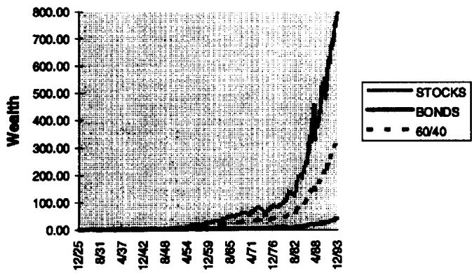
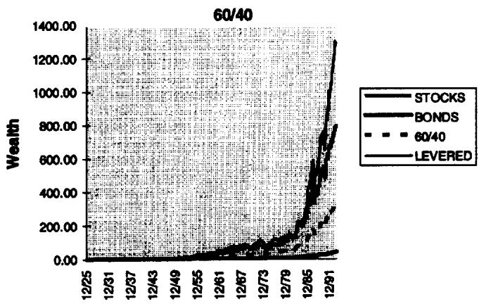

# Why Not 100% Equity

A diversified portfolio provides more expected return per unit of risk.

Thaler and Williamson (T&W) ask a provocative question in “College and University Endowment Funds: Why Not 100% Equities?” [1994]. Although they talk about endowments, their question is really more general. T&W present strong evidence documenting the historical superiority of investing in 100% equities compared to a more common investment policy of 60% equities and 40% bonds (60/40).

Documenting the historical superiority of 100% equities versus 60/40 does not completely answer T&W's original question. A recommendation that endowments invest in 100% equities instead of a 60/40 blend actually mixes two distinctly different recommendations: 1) a recommendation that endowments should take more risk than 60/40, and 2) a recommendation about how to implement this riskier strategy (i.e., 100% equities).

Whether a long-term investor should take more risk is a fascinating and sometimes contentious subject that I do not address. The question of whether one should invest 100% in equities is the subject of my article. Recommending 100% equities ignores the benefits of diversification, and even a long-term investor who agrees with recommendation (1), and therefore wishes to take more risk, should generally not own 100% equities.

I argue that an investor willing to bear the risk of 100% equities can do even better with a diversified portfolio. A diversified portfolio historically delivers more return, while not increasing risk (measuring risk along several different dimensions). This is shown most clearly when an investor is willing to lever, although even without leverage, 100% equities would rarely be optimal.

EXHIBIT 1  
STOCKS VERSUS BONDS VERSUS 60/40  

line

| Date   | STOCKS | BONDS | 60/40 |
|--------|--------|-------|-------|
| 12/25  | ~0     | ~0    | ~0    |
| 8/31   | ~0     | ~0    | ~0    |
| 4/37   | ~0     | ~0    | ~0    |
| 12/42  | ~0     | ~0    | ~0    |
| 8/48   | ~0     | ~0    | ~0    |
| 4/54   | ~0     | ~0    | ~0    |
| 12/59  | ~0     | ~0    | ~0    |
| 8/65   | ~0     | ~0    | ~0    |
| 4/71   | ~0     | ~0    | ~0    |
| 12/76  | ~0     | ~0    | ~0    |
| 8/82   | ~0     | ~0    | ~0    |
| 4/88   | ~0     | ~0    | ~0    |
| 12/93  | ~0     | ~0    | ~0    |

Furthermore, regardless of which portfolio is ultimately chosen, this article argues that choosing how much risk to bear, and constructing a set of portfolios with the most expected return for a given amount of risk, are separate tasks. Choosing a portfolio of 100% equities based on their historical realized return misses this separation.

## THE CASE FOR EQUITIES

Exhibit 1 follows T&W and displays the value of a dollar under three different investment strategies as it grows from January 1, 1926, to December 31, 1993. The top strategy is to invest only in the S&P 500. The bottom strategy is to invest only in a portfolio of long-term corporate bonds. The middle strategy is to invest in a portfolio consisting of 60% the S&P 500 and 40% long-term corporate bonds (rebalanced monthly to 60/40). $^{1}$

Evidence like that presented in Exhibit 1 is commonly used to argue for the superiority of equities, and T&W's empirical evidence is very much in this spirit. Over this period (1926–1993), a dollar invested in equities grew to \$800, a dollar invested in the 60/40 portfolio grew to \$330, and a dollar invested in corporate bonds grew to a paltry \$40. Why would a rational investor ever invest in bonds?

Other arguments for 100% equities involve looking at the probability of outperformance over a given interval of time, and as the length of the interval goes to infinity. Over only a few ten-year intervals do equities underperform 60/40, and over even fewer twenty-year intervals do they underperform. Mathematically, if equity returns are drawn from a sample of past equity returns, then as the investment horizon grows infinite, equities' probability of outperforming goes to one. Again, the superiority of equities seems assured.

## MODERN FINANCE

Perhaps the most important lesson of modern finance is that under certain assumptions, the choices of 1) which risky assets to hold, and 2) how much risk to bear are independent choices. Under some simple assumptions, an investor chooses a portfolio of risky assets (in this case stocks and bonds) to maximize the portfolio's [[Leverage Aversion And Risk Parity|Sharpe ratio]]. $^{2}$ This ratio is the portfolio's expected return less the risk-free rate, divided by the portfolio's standard deviation.

Given this maximal Sharpe ratio portfolio P, the investor then chooses the proper mixture of P and riskless cash. This mix will vary from investor to investor because of differing tolerances for risk, but the relative weights among risky assets will stay constant. Feasible portfolios that maximize expected return for a given amount of risk are said to be efficient.

Exhibit 2 presents some summary statistics for portfolios consisting of stocks and bonds from 1926-1993. The compound returns in Exhibit 2 restate the results of Exhibit 1 — equities dramatically outperform bonds, and also clearly outperform the 60/40 portfolio. This is not an apples-to-apples comparison, however.

EXHIBIT 2  
Portfolio Statistics 1926-1993 (%)

<table>
<tr><td>Portfolio</td><td>Compound Return</td><td>Standard Deviation</td></tr>
<tr><td>100% Stocks</td><td>10.3</td><td>20.0</td></tr>
<tr><td>100% Bonds</td><td>5.6</td><td>6.8</td></tr>
<tr><td>60% Stocks, 40% Bonds</td><td>8.9</td><td>12.9</td></tr>
</table>

Stocks are represented by the S&P 500. Bonds are represented by the Ibbotson total return series for long-term corporates. The 60/40 portfolio is a combination of 60% the S&P 500 and 40% long-term corporates, rebalanced back to 60/40 every month. The compound return is the annualized total return from each strategy, assuming monthly returns are reinvested in the strategy. The standard deviation is the annualized standard deviation of monthly returns over the 1926-1993 period.

EXHIBIT 3  
Effect of Leverage (%)

<table>
<tr><td>Portfolio</td><td>Compound Return</td><td>Standard Deviation</td></tr>
<tr><td>100% Stocks</td><td>10.3</td><td>20.0</td></tr>
<tr><td>100% Bonds</td><td>5.6</td><td>6.8</td></tr>
<tr><td>60% Stocks, 40% Bonds</td><td>8.9</td><td>12.9</td></tr>
<tr><td>Levered 60/40</td><td>11.1</td><td>20.0</td></tr>
</table>

Stocks are represented by the S&P 500. Bonds are represented by the Ibbotson total return series for long-term corporates. The 60/40 portfolio is a combination of 60% the S&P 500 and 40% long-term corporates, rebalanced back to 60/40 every month. The levered 60/40 portfolio invests 155% each month in the 60/40 portfolio, and -55% each month in the one-month T-bill.

EXHIBIT 4  
STOCKS VERSUS BONDS VERSUS 60/40 VERSUS LEVERED 60/40  

line

| Date   | STOCKS | BONDS | 60/40 | LEVERED |
|--------|--------|-------|-------|---------|
| 12/25  | ~20    | ~20   | ~20   | ~20     |
| 12/31  | ~20    | ~20   | ~20   | ~20     |
| 12/37  | ~20    | ~20   | ~20   | ~20     |
| 12/43  | ~20    | ~20   | ~20   | ~20     |
| 12/49  | ~20    | ~20   | ~20   | ~20     |
| 12/55  | ~20    | ~20   | ~20   | ~20     |
| 12/61  | ~20    | ~20   | ~20   | ~20     |
| 12/67  | ~20    | ~20   | ~20   | ~20     |
| 12/73  | ~20    | ~20   | ~20   | ~20     |
| 12/79  | ~20    | ~20   | ~20   | ~20     |
| 12/85  | ~20    | ~20   | ~20   | ~20     |
| 12/91  | ~20    | ~800  | ~300  | ~50     |

Stocks have been more volatile than bonds over this period, and more volatile than the 60/40 portfolio.

Constructing a new portfolio makes this comparison more fair. Imagine an investor has already determined that 1) the 60/40 portfolio is the optimal portfolio of risky assets, and 2) the desired amount of risk is the same as a 100% stock portfolio (where risk means standard deviation). For a \$1 investment, a new portfolio can be constructed by purchasing 20.0/12.9 = 1.55 dollars of the 60/40 portfolio, and financing this with 55 cents of borrowing. $^{3}$

Exhibit 3 repeats Exhibit 2, including this portfolio called “levered 60/40.” Exhibit 4 repeats Exhibit 1 including the levered 60/40.

An equivalent-risk portfolio of stocks and bonds outperforms a 100% stock portfolio over the 1926-1993 period. While a 100% stock portfolio grows to \$800, the levered 60/40 portfolio grows to \$1,291. Even though a 100% bond portfolio grows to only \$40, using bonds in conjunction with stocks and leveraging leads to an investment that grows to \$1,291, while the investor who owns 100% stocks must bear the same risk and receive only \$800. So much for bonds being inappropriate for long-term investors. $^{4}$

## ARE THE RISKS REALLY COMPARABLE?

Perhaps standard deviation is not the proper measure of risk for a long-term investor. We can compare 100% stocks to levered 60/40 using some other possible risk measures.

## Worst Cases

Leverage is often thought of as imprudent or "inviting disaster," so in evaluating a levered strategy, looking at worst cases might be particularly appropriate.

Exhibit 5 presents the worst month and worst year for 100% stocks and for the levered 60/40 portfolio over both the entire period (1926-1993) and the post-war period (1946-1993). For each comparison, except the worst post-war year, the levered 60/40 portfolio actually outperforms the 100% stock portfolio. In the worst post-war year, the levered 60/40 portfolio underperforms the 100% stock portfolio by 5.3 percentage points, while in the worst post-war month it outperforms by 4.3 percentage points. It is clear that looking at worst cases is not going to rescue 100% stocks.

## Probability of Outperformance

Much of the long-term argument for 100% equities rests on their probability of outperforming over a long period. Exhibit 6 looks at the percent of rolling ten-year, twenty-year, and thirty-year periods that 

EXHIBIT 5  
Worst Cases

<table>
<tr><td>Period</td><td>Portfolio</td><td>Worst Month</td><td>Worst Year</td></tr>
<tr><td>1926-1993</td><td>100% Stocks</td><td>9/31 (-29.7%)</td><td>7/31-6/32 (-67.6%)</td></tr>
<tr><td>1926-1993</td><td>Levered 60/40</td><td>9/31 (-27.8%)</td><td>7/31-6/32 (-66.6%)</td></tr>
<tr><td>1946-1993</td><td>100% Stocks</td><td>10/87 (-21.5%)</td><td>10/73-9/72 (-38.9%)</td></tr>
<tr><td>1946-1993</td><td>Levered 60/40</td><td>10/87 (-17.2%)</td><td>10/73-9/72 (-44.2%)</td></tr>
</table>

EXHIBIT 6  
Percent of Outperformance

<table>
<tr><td rowspan="2"></td><td>% of 10-Year Periods</td><td>% of 20-Year Periods</td><td>% of 30-Year Periods</td></tr>
<tr><td>Outperforming Unlevered</td><td>Outperforming Unlevered</td><td>Outperforming Unlevered</td></tr>
<tr><td>Portfolio</td><td>60/40</td><td>60/40</td><td>60/40</td></tr>
<tr><td>100% Stocks</td><td>76.9</td><td>89.8</td><td>100.0</td></tr>
<tr><td>Levered 60/40</td><td>76.4</td><td>88.5</td><td>100.0</td></tr>
</table>

100% stocks outperforms the original unlevered 60/40, and the percent of times the levered 60/40 portfolio outperforms unlevered 60/40.

The results for levered 60/40 are entirely comparable with the results for 100% stocks. Thus, the levered 60/40 portfolio also achieves the much ballyhooed long-term consistency of 100% equities.

I have already shown that the levered 60/40 portfolio has higher total returns, comparable standard deviation, and comparable “worst cases” to 100% equity. It is comforting to know that one doesn’t give up long-term consistency to achieve these virtues.

## WHAT IF YOU CAN'T OR WON'T LEVER?

Modern finance says first construct the optimal portfolio of risky assets, and then choose how much to either lend or borrow of the riskless asset. A levered portfolio of 60% stocks and 40% bonds outperformed a 100% stock portfolio from 1926-1993, but it could be argued that this is unrealistic because many investors either can't or won't lever.

If investors can't risklessly lever, each investor will no longer choose to own the same portfolio of risky stocks. The investment process, however, can still be thought of as having two steps: 1) constructing a set of efficient portfolios (portfolios with the most expected return for a given amount of risk), and 2) choosing which of these efficient portfolios to hold.

EXHIBIT 7  
Returns Including Small Stocks

<table>
<tr><td>Portfolio</td><td>Compound Return</td><td>Standard Deviation</td></tr>
<tr><td>100% Stocks</td><td>10.3</td><td>20.0</td></tr>
<tr><td>100% Bonds</td><td>5.6</td><td>6.8</td></tr>
<tr><td>100% Small Stocks</td><td>12.4</td><td>30.7</td></tr>
<tr><td>60% Small Stocks, 40% Bonds</td><td>10.7</td><td>19.1</td></tr>
</table>

Exhibit 7 adds small stocks to the assets we have already analyzed. We see that a 60/40 portfolio of small stocks and bonds outperforms 100% stocks with less risk and no leverage. Bringing small firms into the picture is somewhat arbitrary and certainly introduces the possibility of data-mining, but the superiority of small firms is not the point of Exhibit 7.

Although the 100% stock portfolio has outperformed the 60/40 portfolio, it is not necessarily the portfolio that does so with the least risk. Even if investors can't lever, they should still choose a portfolio with the least risk given an expected return. Perhaps it is small firms, or perhaps some other portfolio is optimal, but the point is the same.

Finally, if investors believe in diversification and wish to take more risk than that of the assumed optimal 60/40 portfolio, but can't or won't lever, they can look to T&W for a solution. T&W describe what to do with an investor who wishes to try to time the market. They point out that these investors should have more than 100% equity exposure when they particularly like the market. T&W do not recommend explicit leverage to achieve more than 100% equity exposure; rather they suggest implicit leverage through stock index options. If investors want to avoid explicit leverage but still take advantage of the results of this article, they could follow a similar options-based strategy.

## WHAT IF YOU HAVE A LONG TIME HORIZON?

You might want to argue about the use of annualized monthly standard deviation as a measure of risk. There are cases where this point has merit.

If stock and bond returns are independent from period to period, and investors are risk-averse with constant relative risk aversion, then a longer time horizon changes nothing. The relative weight of stocks and bonds would be constant across otherwise similar investors with different horizons. The solution changes only if the volatility of stocks increases more slowly with time than does the volatility of bonds.

There is some evidence that stock returns do in fact exhibit negative long-run autocorrelation, and thus volatility does go up more slowly than if returns were independent (see Fama and French [1988]). Many have challenged the existence of this negative autocorrelation, but if it does exist, it could lead to stocks being a larger part of optimal longer-horizon portfolios (see Samuelson [1992] or Kritzman [1994]).

Siegel [1994] presents an argument along these lines. He shows [[Complex Modern Portfolio Theory|efficient frontiers]] obtained from combining a portfolio of stocks with a portfolio of bonds (he assumes that there is no riskless asset). He constructs these portfolios (using data from 1802 to 1992) assuming a variety of different time horizons, and assuming that equity returns are not independent through time.

Siegel shows that as time horizons grow longer, under his assumptions, a risk-averse investor would put a larger and larger fraction of wealth in equities. In fact, for his moderately risk-averse investor, a levered position in stocks is called for if the investor's horizon is thirty years.

Siegel recognizes that bonds and stocks are both part of an efficient portfolio. He simply argues that the frontier of efficient portfolios changes as horizon lengthens. In fact, for any case Siegel examines, a position in bonds exists in almost every portfolio. $^{5}$

Under Siegel's assumptions, for some investors with certain time horizons this position in bonds could be a short position. That's all right — the main goal of this article is not to sell bonds (my title notwithstanding), but rather to defend the separation of portfolio construction (i.e., defining the efficient set) from the choice of how much risk to bear.

## ONE REALIZATION VERSUS EQUILIBRIUM

One last interesting thing to consider is the combined effects of 1) observing only one realization of historical returns, and 2) survivorship bias, on the arguments at hand. I have shown that historically a diversified portfolio of stocks and bonds is optimal, but it is still an open question as to why equities have done as well as they have. This is known as the equity premium puzzle (see Mehra and Prescott [1985]).

If the historical results had shown that 100% equities dominate any combination of equities and bonds, including optimally levered combinations, would we all then agree to avoid bonds going forward? Realized returns are always a combination of expected returns and unexpected returns. Furthermore, all we get to observe is one long history of these returns. It is quite possible that equities' observed stellar performance is the result of observing one good realization and the presence of long-term market survivorship bias.

For estimating expected future returns, one alternative to history is equilibrium. In equilibrium, expected returns are set so that the market clears. Bonds represent part of the total portfolio of invested wealth, and thus their expected returns should be set so that they are held in the market portfolio. In other words, in equilibrium one holds a diversified portfolio of stocks and bonds (and everything else). $^{6}$ Thus, looking at no data, we (ex ante) expect an investor to own bonds.

Say history had been different, and the levered 60/40 portfolio was beaten by 100% equities. A believer in equilibrium might still be unconvinced. The combination of observing only one realization, survivorship bias, and a prior belief in equilibrium raises the hurdle for abandoning bonds. The fact that historically bonds have in fact added value to a diversified portfolio only strengthens the case against 100% equity.

## CONCLUSIONS

Given the ability to lend or lever, the decision on the optimal mix of risky assets and the decision on the amount of risk to take are separable. Furthermore, this optimal mix of risky assets is the same for each investor. $^{7}$ Given no ability to lever, the optimal mix of risky assets can be different for different investors, although the construction of the set of efficient portfolios and the choice of which efficient portfolio to hold can still be separated. Under either set of assumptions, it is only under very special circumstances that 100% stocks is the optimal portfolio.

The argument that endowments, or other long-term investors, don't take enough risk is neither damaged nor supported by my analysis. I challenge only the recommended implementation of $100\%$ equities, and only when it is based on realized return superiority and not on an analysis of return versus risk.

Clearly, an investor could believe both 1) in the benefits of diversification, and 2) that long-term investors should take more risk. This investor would then want to act accordingly: i.e., own a high-expected return, optimally diversified portfolio. The issue then becomes how to capture the benefits of diversification in a practical manner, while retaining high expected returns.

While I address many practical concerns, additional research is called for on implementing this diversified high risk/return portfolio. Issues involving leverage, taxes, and bankruptcy risk are all interesting and deserve further work. Ways to avoid explicit leverage such as buying bonds along with riskier-than-normal equities, and employing option strategies are all promising avenues. Furthermore, the best implementation will in all probability be different for different types of institutional and individual investors.

In an answer to Thaler and Williamson's question, "Why Not 100% Equities?", I argue that the two steps necessary in creating a portfolio must be examined separately. Step one is constructing the feasible set of efficient portfolios (portfolios that are investable and have the most expected return per unit of risk). Step two is choosing which of these portfolios to own (i.e., what risk/return trade-off maximizes utility).

A long-term investment in 60/40 may, or may not, get step two wrong (i.e., not take enough risk). An investment in 100% equities almost certainly gets step one wrong (it is not an efficient portfolio).

## ENDNOTES

The author thanks Fischer Black, Kent Clark, Tom Dunn, Ken French, Brian Hurst, Bob Jones, Larry Kohn, Bob Krail, John Liew, Paul Samuelson, Jeremy Siegel, Larry Siegel, Ross Stevens, Steve Strongin, and Richard Thaler.  
$^{1}$ All data in this paper come from Ibbotson Associates. We follow Thaler and Williamson and focus on the 60/40 portfolio as an alternative to 100% equities. Of course, 60/40 is itself not necessarily optimal.  
$^{2}$ See Sharpe [1994] for an explanation of Sharpe ratios.  
$^{3}$ I assume borrowing is done at the one-month T-bill rate. The 55 cents of borrowing is determined in-sample as the amount of leverage that creates a 60/40 portfolio with the same standard deviation as 100% stocks. Alternatively, if the analysis is started in 1931, and always uses the last five years' standard deviation to form the levered 60/40 portfolio (i.e., out-of-sample), the forthcoming inferences do not change.  
$^{4}$ My example is not countered by more conservative borrowing assumptions. For instance, if I assume borrowing at the T-bill rate + 50 basis points, the levered 60/40 portfolio falls to a 10.81% compound return, still an advantage of 49 basis points over 100% stocks.  
This analysis follows Thaler and Williamson by using the Ibbotson long-term corporate bond series. In principle, a market index bond return, not a long-term bond return, would be preferred. It is comforting that my conclusions are considerably strengthened if the long-term corporate series is replaced with an intermediate-term bond series.  
$^{5}$ One point on the continuum of efficient portfolios would indeed be 100% equities.  
$^{6}$ In particular, this is implied by the capital asset pricing model. Other equilibrium models do not necessarily imply that investors all hold the same portfolio. In all equilibrium models, however, the market clears and every “net long” asset gets held by someone.  
$^{7}$ Certain assumptions (multivariate normality, for instance) are necessary to obtain the result that investors choose mean-variance efficient portfolios.

## REFERENCES

Fama, E.F., and K. French. "Permanent and Temporary Components of Stock Prices." Journal of Political Economics, 96, No. 2 (1988), pp. 246-273.  
Kritzman, Mark. "About Time Diversification." Financial Analysts Journal, January-February 1994, pp. 14-18.  
Mehra, Rajnish, and Edward C. Prescott. "The Equity Premium: A Puzzle." Journal of Monetary Economics, 15 (1985), pp. 145-161.  
Samuelson, Paul A. "At Last, A Rational Case for Long-Horizon Risk Tolerance and for Asset-Allocation Timing?" In Frank Fabozzi and Robert Arnott, eds., Active Asset Allocation. 1992, Ch. 19.  
Sharpe, William F. "The Sharpe Ratio." Journal of Portfolio Management, Fall 1994, pp. 49-58.  
Siegel, Jeremy J. Stocks for the Long Run. Burr Ridge, IL: Irwin Professional Publishing, 1994.  
Thaler and Williamson. "College and University Endowment Funds: Why Not 100% Equities?" Journal of Portfolio Management, Fall 1994, pp. 27-37.

## Related notes

- [[Leverage Aversion And Risk Parity]] — Asness on leverage and the Sharpe ratio
- [[Alternative Thinking Why Do Most Investors Choose Concentration Over Leverage]] — concentration vs. leverage
- [[Return Stacking  Strategies For Overcoming A Low Return Environment]] — the levered 60/40 in practice
- [[Complex Modern Portfolio Theory]] — the efficient frontier
- [[Optimal Bond Allocation Lifetime]] — the equity/bond mix over a lifetime