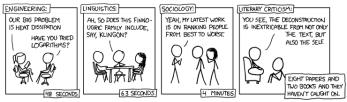

## Why You Shouldn’T Pick Individual Stocks

I stopped picking individual stocks years ago and I recommend that you do the same. But, today I am not going to give you the argument as to why you shouldn’t pick stocks, but a new one. The traditional argument, which you’ve probably heard many times before, goes as follows: since most people (even the professionals) can’t beat the index, you shouldn’t bother trying.

The data backing this argument is undeniable. You can look through the SPIVA report for every equity market on Earth and you will see (more or less) the same thing—over a five-year period 75% of funds don’t beat their benchmark. And remember, this 75% consists of money managers working full-time with teams of analysts. If they can’t outperform with all of these resources, what chance do you have? But, I want to put that argument aside for now.

Instead, I am going to argue that you shouldn’t pick stocks because of the difficulty of doing so. The existential dilemma is simple—how do you determine if you are good at picking individual stocks? In most domains, the amount of time it takes to judge whether someone has skill in that domain is relatively short.

For example, any competent basketball coach could tell you whether someone was skilled at shooting within the course of 10 minutes. Yes, it’s possible to get lucky and make a bunch of shots early on, but eventually they will trend toward their actual shooting percentage. The same is true in a technical field like computer programming. Within a short period of time, a good programmer would be able to tell if someone doesn’t know what they are talking about.

It’s just like this XKCD comic:

## M. Hobby:

## SITTING DOWN WITH GRAD STUDENTS AND TIMING HOW LONG IT TAKES THEM TO FIGURE OUT THAT

text_image

ENGINEERING  
OUR BIG PROBLEM  
IS HEAT DESCRIPTION  
HAVE YOU TRIED  
LOGRITHM?  
18 SECONDS  
LUNARISTIC  
AN, SO DOES THIS FAMILY INCLUDE,  
SAY, CLONK?  
6.3 SECONDS  
SOCIOLOGY  
YOUNG, MY LATEST WORK  
IS ON RANKING PEOPLE  
FROM BEST TO WORST?  
4.1 PARAMETERS  
LITERARY CRITICISM  
YOU SEE, THE DECONSTRUCTION  
IS INEXTRICABLE FROM NOT ONLY  
THE TEXT BUT  
ALSO FROM THE SEIZ?  
TIGHT PAPERS AND  
TWO BROSKS AND THEY  
WENTY CAPSIC ALL  

But, what about stock picking? How long would it take to determine if someone is a good stock picker?

An hour? A week? A year?

Try multiple years, and you still may not know for sure. The issue is that causality is harder to determine with stock picking than with other domains. When you shoot a basketball or write a computer program, the result comes immediately after the action. The ball goes in the hoop or it doesn’t. The program runs correctly or it doesn’t. But, with stock picking, you make a decision now and have to wait for it to pay off. The feedback loop can take years.

And the payoff you do eventually get has to be compared to the payoff of buying an [[Complex Modern Portfolio Theory|index fund like the S&P 500]]. So, even if you make money in absolute terms, you can still lose money in relative terms.

More importantly though, the result that you get from that decision may have nothing to do with why you made it in the first place. For example, imagine you bought GameStop in late 2020 because you believed that the price would increase as a result of the company improving its operations. Well, 2021 comes along and the price of GameStop surges due to the wallstreetbets inspired short squeeze. You received a positive result that had nothing to do with your original thesis.

Now imagine how often this happens to stock pickers where the linkage between the decision and the result is far less obvious. Did the stock go up because of some change you anticipated or was it another change altogether? What about when market sentiment shifts against you? Do you double down and buy more, or do you reconsider?

These are just a few of the questions you have to ask yourself with every investment decision you make as a stock picker. It can be a never-ending state of existential dread. You may convince yourself that you know what’s going on, but do you know?

For some people, the answer is clearly, “Yes.” For example, in research, researchers found that “the large, positive alphas of the top ten percent of funds, net of costs, are extremely unlikely to be a result of sampling variability (luck).” This suggests that 10% of people who pick stocks professionally do actually have skill that persists over time. However, it also suggests that 90% probably don’t.

For argument’s sake, let’s assume that the top 10% of stock pickers and the bottom 10% of stock pickers can easily identify their skill (or lack thereof). This means that, if we choose a stock picker at random, there is a 20% chance we could identify their skill level and an 80% chance that we couldn’t! This implies that 4 out of 5 stock pickers would find it difficult to prove that they are good at stock picking.

This is the existential crisis that I am talking about. Why would you want to play a game (or make a career) out of something that you can’t prove that you are good at? If you are doing it for fun, that’s fine. Take a small portion of your money and have at it. But, for those that aren’t doing it for fun, why spend so much time on something where your skill is so hard to measure?

And even if you are someone who can demonstrate their stock picking prowess (i.e. the top 10%), your issues don’t stop there. For example, what happens when you inevitably experience a period of underperformance? After all, underperformance isn’t a matter of if, but when. As a Baird study noted, “at some point in their careers, virtually all top-performing money managers underperform their benchmark and their peers, particularly over time periods of three years or less.”

Just imagine how nerve-racking this must be when it finally happens. Yes, you had skill before, but what about now? Is your underperformance a normal lull that even the best investors experience, or have you lost your touch? Of course, losing your touch in any endeavor isn’t easy, but it’s so much harder when you don’t know if you have lost it.

I’m not the only one who has argued against stock picking either. Consider what Bill Bernstein, the famed investment writer, recently said about the hidden dangers of buying individual stocks:

the empirical literature. But if you can't do that, then, sure, what your annualized return, and then ask yourself, "Could I have

It’s these kinds of risks that stock pickers may be overlooking without realizing it.

And, for the record, I have nothing against stock pickers, but I do have something against stock picking. The difference is crucial. Skilled stock pickers provide a valuable service to markets by keeping prices reasonably efficient. However, stock picking is an investment philosophy that has gotten far too many retail investors burned in the process. I have seen it happen to friends. I have seen it happen to family. I just hope it doesn’t happen to you too.

I know I won’t convince every stock picker to change their ways, and that’s a good thing. We need people to keep analyzing companies and deploying their capital accordingly. However, if you are on the fence about it, this is your wake-up call. Don’t keep playing a game with so much luck involved. Life already has enough luck as it is.

Lastly, I do want to mention one selfish reason why I don’t buy individual stocks—doing so would go against the investment philosophy I preach on this blog. As I have written before, the problem with [[Popular Personal Financial Advice Vs. The Professors|most financial advice]] is that the experts don’t always practice what they preach. They tell you to do X with their money while they personally do Y. It’s rich as I say, not as I do.

Well, I don’t want to be one of these people. This is why I currently have 94% of my investments in a diverse set of income-producing assets and I hold very little cash outside of my emergency fund. I am not waiting to buy dips. I am not trying to get lucky with a ten-bagger. But I am aggressively diversified.

More importantly though, I am not rich now, but I expect to be rich in the future. And I am going to do it by following the advice I write about on this blog. That’s it.

Yes, my advice will never sound as alluring as the high-flying world of stock picking. But do you want to know why? As Warren Buffett once told Jeff Bezos, “Because nobody wants to get rich slow.”

Happy investing and thank you for reading!

## Related notes

- [[Popular Personal Financial Advice Vs. The Professors]] — popular vs. academic investing advice
- [[The Big Market Delusion  Valuation And Investment Implications]] — why individual stocks get overpriced
- [[Complex Modern Portfolio Theory]] — diversification and portfolio theory